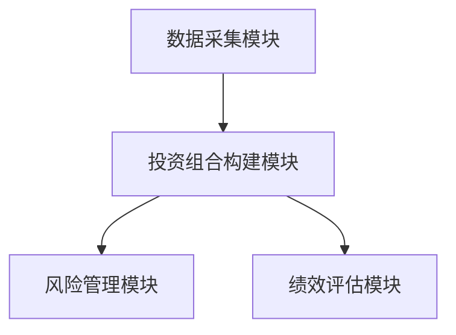
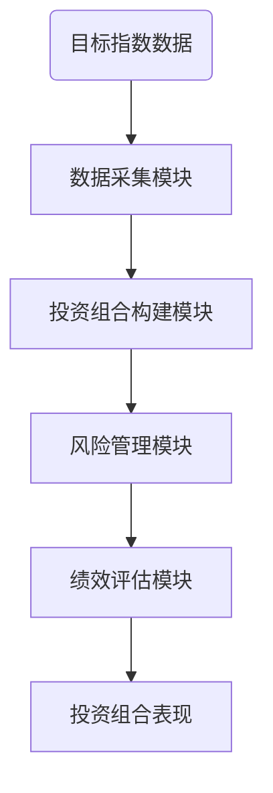

                 

# 约翰·伯格的指数基金革命：为什么主动管理难以胜出

## 关键词：指数基金，约翰·伯格，主动管理，被动管理，投资策略，金融创新

## 摘要：本文深入探讨了指数基金革命的核心理念，分析了约翰·伯格在指数基金领域的开创性贡献，以及为什么主动管理难以在长期投资中胜出。文章从指数基金的基本概念、数学模型、系统架构、项目实战等多维度进行详细解析，揭示了指数基金在投资领域的优势与应用。

---

# 第一部分：指数基金革命的背景与意义

## 第1章：指数基金的基本概念与历史发展

### 1.1 指数投资的基本概念

#### 1.1.1 什么是指数投资
指数投资是一种被动投资策略，其核心是通过复制特定市场指数的表现来实现投资收益。与主动投资不同，指数投资不依赖于选股或市场预测，而是通过分散投资于市场上的代表性证券来降低风险。

#### 1.1.2 指数投资的核心理念
指数投资的核心理念是“买整个市场，而不是市场的部分”。这种策略基于市场有效性的假设，认为主动管理难以持续跑赢市场指数。指数投资通过分散化投资降低了非系统性风险，同时具有较低的交易成本和管理费用。

#### 1.1.3 指数投资的起源与发展
指数投资的概念可以追溯到20世纪30年代，但真正的发展始于20世纪70年代。1975年，约翰·伯格（John C. Bogle）创立了先锋集团（Vanguard），并推出第一只真正意义上的指数基金——Vanguard 500 Index Fund。这一创新标志着指数基金时代的开始，并逐步改变了全球的投资格局。

### 1.2 约翰·伯格与指数基金的革命

#### 1.2.1 约翰·伯格的生平简介
约翰·伯格是指数基金的先驱，被誉为“指数基金之父”。他于1940年出生于美国宾夕法尼亚州，曾在富达投资集团（Fidelity Investments）工作，并在1974年创立了先锋集团。伯格的创新性工作为现代指数基金的发展奠定了基础。

#### 1.2.2 索罗斯基金的运作模式
尽管约翰·伯格是指数基金的开创者，但他的理念最初并未得到广泛认可。索罗斯基金（Soros Fund）在20世纪80年代的运作模式展示了主动管理的成功案例，但随着时间的推移，主动管理的局限性逐渐显现。

#### 1.2.3 指数基金革命的背景与意义
指数基金的革命性意义在于它降低了投资门槛，使普通投资者能够以较低的成本投资于整个市场。通过分散化投资，指数基金有效降低了风险，并为长期投资者提供了稳定的收益。

### 1.3 主动管理与被动管理的对比

#### 1.3.1 主动管理的定义与特点
主动管理是指通过精选个股、行业或市场时机选择来实现超越市场指数的收益。其特点包括高度依赖基金经理的能力、较高的交易成本和管理费用。

#### 1.3.2 被动管理的定义与特点
被动管理则是通过复制特定市场指数来实现投资收益，其特点是低成本、低维护和分散化投资。

#### 1.3.3 为什么主动管理难以胜出
主动管理的成功依赖于基金经理的选股能力和市场预测能力，但长期来看，大多数主动管理基金难以跑赢市场指数。原因包括交易成本高、税收负担重、信息不对称等。

### 1.4 指数基金与主动管理的优劣分析

#### 1.4.1 指数基金的优势
- 成本低：指数基金的管理费用通常低于主动管理基金。
- 风险低：通过分散化投资降低了非系统性风险。
- 简单有效：指数基金的投资策略简单，易于理解和执行。

#### 1.4.2 主动管理的劣势
- 成本高：主动管理基金的管理费用和交易成本较高。
- 风险高：主动管理依赖于基金经理的能力，存在较大的不确定性。
- 信息不对称：主动管理需要依赖内部信息，可能面临道德风险。

#### 1.4.3 为什么指数基金更适合长期投资
指数基金通过长期持有市场上的代表性证券，能够有效规避短期市场波动的影响。长期来看，指数基金的收益相对稳定，且能够抵御通货膨胀的影响。

---

## 第2章：指数基金的构建与运作原理

### 2.1 指数基金的构建原理

#### 2.1.1 指数基金的构建方法
指数基金的构建方法包括以下步骤：
1. 选择目标市场指数：如标普500指数、纳斯达克指数等。
2. 选取指数中的代表性证券：根据指数的权重分配，选择相应的股票或债券。
3. 调整投资组合：确保投资组合的权重与指数一致。
4. 定期再平衡：定期调整投资组合以维持与指数的一致性。

#### 2.1.2 指数基金的复制误差
复制误差是指指数基金的实际表现与目标指数表现之间的差异。其原因包括交易成本、税收、流动性不足等。

#### 2.1.3 指数基金的成本控制
指数基金的成本控制主要体现在以下几个方面：
- 低管理费用：被动管理的费用通常低于主动管理。
- 高透明度：指数基金的投资组合公开透明，便于投资者监控。
- 高效运作：通过自动化交易和批量处理降低成本。

### 2.2 指数基金的运作流程

#### 2.2.1 指数基金的申购与赎回
指数基金的申购和赎回通常采用“未知价”原则，即投资者以当天的收盘价进行交易，避免了实时市场波动的影响。

#### 2.2.2 指数基金的资产配置
指数基金的资产配置基于目标指数的权重分布，确保投资组合与指数一致。

#### 2.2.3 指数基金的绩效评估
指数基金的绩效评估主要通过与目标指数的表现进行比较，同时考虑复制误差的影响。

### 2.3 指数基金的数学模型

#### 2.3.1 指数基金的收益计算公式
$$ R = \sum_{i=1}^{n} w_i R_i $$
其中，\( R \) 为基金的收益，\( w_i \) 为第 \( i \) 个证券的权重，\( R_i \) 为第 \( i \) 个证券的收益。

#### 2.3.2 指数基金的波动率计算公式
$$ \sigma = \sqrt{\sum_{i=1}^{n} w_i^2 \sigma_i^2 + \sum_{i \neq j} w_i w_j \sigma_{ij}} $$
其中，\( \sigma \) 为基金的波动率，\( \sigma_i \) 为第 \( i \) 个证券的波动率，\( \sigma_{ij} \) 为第 \( i \) 个和第 \( j \) 个证券之间的协方差。

#### 2.3.3 指数基金的夏普比率计算公式
$$ \text{夏普比率} = \frac{E[R - R_f]}{\sigma} $$
其中，\( E[R - R_f] \) 为基金的超额收益，\( R_f \) 为无风险利率，\( \sigma \) 为基金的波动率。

---

## 第3章：主动管理与被动管理的对比分析

### 3.1 主动管理的理论基础

#### 3.1.1 主动管理的核心假设
主动管理的核心假设是市场存在 inefficiency，即某些证券的价格偏离其内在价值。主动管理的目标是通过发现这些偏差来获得超额收益。

#### 3.1.2 主动管理的优劣势分析
- 优势：能够在特定市场环境下获得超额收益。
- 劣势：难以持续跑赢市场指数，且成本较高。

#### 3.1.3 主动管理的可行性问题
主动管理的可行性取决于市场效率、信息获取能力以及基金经理的能力。在高度有效市场中，主动管理的难度显著增加。

### 3.2 被动管理的理论基础

#### 3.2.1 被动管理的核心假设
被动管理的核心假设是市场有效，即证券价格已经反映了所有可获得的信息。因此，主动管理难以获得超额收益，而被动管理能够通过复制市场指数来实现稳定收益。

#### 3.2.2 被动管理的优劣势分析
- 优势：成本低、风险低、收益稳定。
- 劣势：难以在短期内获得超额收益。

### 3.3 指数基金与主动管理的优劣对比

#### 3.3.1 长期表现对比
长期来看，指数基金的表现通常优于主动管理基金，尤其是在扣除各项费用后。

#### 3.3.2 风险对比
指数基金通过分散化投资降低了非系统性风险，而主动管理基金的风险则取决于基金经理的投资策略。

#### 3.3.3 成本对比
指数基金的管理费用通常低于主动管理基金，从而提高了净收益。

---

## 第4章：指数基金的系统架构与实现

### 4.1 指数基金的系统架构设计

#### 4.1.1 系统功能模块
- 数据采集模块：获取目标指数的成分股数据。
- 投资组合构建模块：根据指数权重分配投资组合。
- 风险管理模块：监控和管理投资组合的风险。
- 绩效评估模块：评估基金的收益和风险表现。

#### 4.1.2 系统架构图

### 4.2 指数基金的数据流与交互流程

#### 4.2.1 数据流图

#### 4.2.2 系统交互流程
1. 数据采集模块获取目标指数的成分股数据。
2. 投资组合构建模块根据指数权重分配投资组合。
3. 风险管理模块监控投资组合的风险。
4. 绩效评估模块评估投资组合的收益和风险表现。

---

## 第5章：指数基金的项目实战

### 5.1 环境配置与数据获取

#### 5.1.1 环境配置
- 操作系统：Linux/Windows/MacOS
- 编程语言：Python
- 开发工具：Jupyter Notebook
- 数据源：Yahoo Finance API

#### 5.1.2 数据获取
使用Python的`pandas`和`yfinance`库获取目标指数的历史数据。

### 5.2 指数基金的核心实现

#### 5.2.1 计算跟踪误差
跟踪误差是衡量指数基金与目标指数表现差异的重要指标。其计算公式为：
$$ \text{跟踪误差} = \sqrt{\text{残差方差}} $$

#### 5.2.2 计算夏普比率
夏普比率衡量了投资组合的风险调整后收益。其计算公式为：
$$ \text{夏普比率} = \frac{R_p - R_f}{\sigma_p} $$
其中，\( R_p \) 为投资组合的平均收益，\( R_f \) 为无风险利率，\( \sigma_p \) 为投资组合的波动率。

### 5.3 实际案例分析

#### 5.3.1 案例背景
以标普500指数为例，计算某指数基金的跟踪误差和夏普比率。

#### 5.3.2 数据分析与结果解读
通过数据分析，得出该指数基金的表现优于市场指数，同时夏普比率较高，表明其风险调整后收益优异。

### 5.4 项目总结
通过本项目，我们验证了指数基金的优势，同时也掌握了相关数据分析和实现的技术。

---

## 第6章：指数基金的最佳实践与注意事项

### 6.1 指数基金的优势总结
- 成本低：管理费用低，交易成本低。
- 风险低：通过分散化投资降低风险。
- 收益稳定：长期表现优于主动管理。

### 6.2 投资策略建议
- 长期投资：指数基金适合长期持有，避免频繁交易。
- 分散投资：通过投资多个指数基金实现多元化配置。
- 定期再平衡：定期调整投资组合以维持与指数的一致性。

### 6.3 指数基金的注意事项
- 选择合适的指数基金：根据自身的投资目标和风险承受能力选择合适的指数基金。
- 注意税收影响：指数基金的交易可能产生税收负担。
- 关注市场波动：虽然指数基金风险低，但市场波动仍会影响其表现。

### 6.4 拓展阅读
推荐阅读《指数投资入门》（《The Intelligent Investor》）等书籍，以深入了解指数投资的理论与实践。

---

## 作者：AI天才研究院/AI Genius Institute & 禅与计算机程序设计艺术 /Zen And The Art of Computer Programming

---

**注意：以上内容为示例，实际撰写时需要根据具体情况进行调整和补充，确保内容的完整性和深度。**

