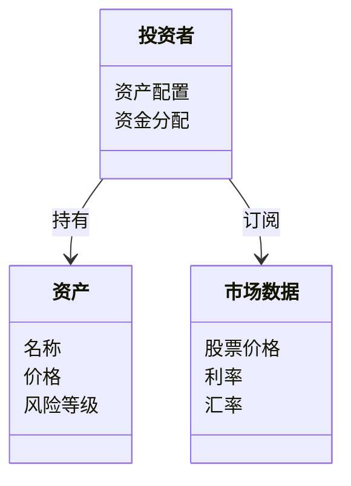
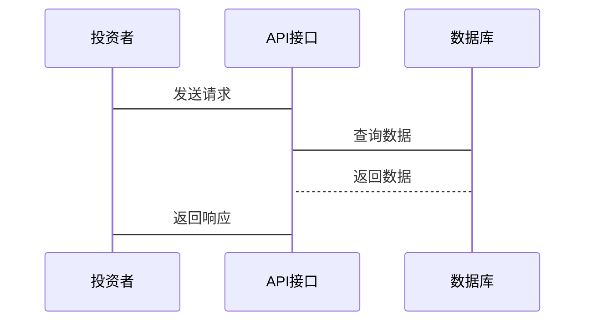

                 


# 约翰·伯格的简单投资法则

> 关键词：投资法则，约翰·伯格，简单投资，指数基金，长期投资，风险管理

> 摘要：本文深入探讨了约翰·伯格的简单投资法则，从投资的基础概念、核心法则到数学模型、系统架构，再到项目实战和最佳实践，全面解析了这一投资策略的精髓。通过详细分析和实际案例，帮助读者理解并应用伯格的投资理念。

---

## 第一部分: 投资的基础与约翰·伯格的背景

### 第1章: 投资的基本概念

#### 1.1 投资的定义与分类

**1.1.1 投资的定义**

投资是将资源（如资金）投入到某个项目或资产中，以期望在未来获得收益或资本增值的行为。投资的本质是通过配置资源，实现财富的保值与增值。

**1.1.2 投资的分类与特点**

投资可以分为以下几类：

- **实物投资**：如房地产、基础设施等。
- **金融投资**：包括股票、债券、基金等。
- **货币投资**：如存款、货币市场基金等。
- **股权投资**：通过购买公司股份成为股东。

不同类型的 investments 具有不同的风险和回报特征。例如，股票投资风险较高但潜在回报也高，而债券投资风险较低但回报相对稳定。

**1.1.3 投资的基本原则**

- **分散投资**：不要将所有资金投入到单一资产中，以降低风险。
- **长期投资**：耐心持有优质资产，避免短期波动的影响。
- **低成本投资**：选择费用低的基金或投资渠道，提高净回报。

#### 1.2 约翰·伯格的生平与成就

**1.2.1 约翰·伯格的背景介绍**

约翰·伯格（John Bogle）是投资领域的传奇人物，被誉为“指数基金之父”。他是先锋集团（Vanguard Group）的创始人，于1975年推出了第一只指数基金——先锋500指数基金（Vanguard 500 Index Fund）。

**1.2.2 伯格在投资领域的贡献**

伯格的贡献不仅在于他创立了 Vanguard，还在于他倡导的低成本、被动式投资策略。他反对频繁交易和高昂的管理费用，主张通过长期持有指数基金实现财富增长。

**1.2.3 伯格的投资哲学与理念**

伯格的投资哲学核心是简单与纪律。他认为，市场波动和短期预测无法带来稳定的回报，而长期持有低成本的指数基金能够最大限度地捕捉市场回报，同时避免主动管理的高成本和高风险。

---

### 第2章: 约翰·伯格的简单投资法则

#### 2.1 简单投资法则的核心理念

**2.1.1 长期投资的重要性**

长期投资的核心在于利用复利效应。通过长期持有优质资产，投资者可以最大化收益，同时降低短期波动的影响。

**2.1.2 分散投资的风险控制**

分散投资是指将资金分配到不同的资产类别或行业中，以降低单一资产波动带来的风险。指数基金天然具有分散化的特点，因为它们投资于广泛市场的股票或债券。

**2.1.3 低成本投资的优势**

高昂的管理费用会侵蚀投资回报。伯格主张选择费用低的指数基金，以确保更多的收益归于投资者。

#### 2.2 约翰·伯格的投资策略

**2.2.1 指数基金的投资策略**

指数基金通过复制市场指数的表现，实现被动投资。例如，标普500指数基金的投资标的是500家在美国上市的公司，这些公司代表了美国股市的大部分市值。

**2.2.2 长期持有与定期定额投资**

长期持有意味着不频繁交易，避免因交易成本和市场时机选择而影响收益。定期定额投资（定投）是一种纪律性的投资方式，无论市场涨跌，定期投入固定金额，长期来看能够摊低成本，分散风险。

**2.2.3 避免频繁交易的重要性**

频繁交易不仅会产生高昂的交易费用，还会增加税务负担。更重要的是，频繁交易容易受到市场情绪的影响，导致非理性决策。

---

### 第3章: 投资的数学模型与公式

#### 3.1 投资回报率的计算公式

**3.1.1 单利与复利的计算**

- **单利**：只计算本金的利息，公式为：
  $$ \text{单利} = P \times r \times t $$
  其中，\( P \) 是本金，\( r \) 是年利率，\( t \) 是时间（年）。

- **复利**：计算本金和已产生利息的利息，公式为：
  $$ A = P \times (1 + r)^t $$
  其中，\( A \) 是本息和。

**3.1.2 几何平均回报率的计算**

几何平均回报率用于衡量投资的平均年回报率，考虑了复利效应。公式为：
$$ \text{几何平均} = \left( \prod_{i=1}^{n} (1 + r_i) \right)^{1/n} - 1 $$

**3.1.3 投资组合的预期回报率**

投资组合的预期回报率是各资产预期回报率的加权平均值。公式为：
$$ E(R_p) = \sum_{i=1}^{n} w_i \times E(R_i) $$
其中，\( w_i \) 是资产 \( i \) 的权重，\( E(R_i) \) 是资产 \( i \) 的预期回报率。

#### 3.2 风险与收益的数学模型

**3.2.1 方差与标准差的计算**

方差衡量了资产回报率的波动程度，标准差是方差的平方根。公式为：
$$ \text{方差} = \sigma^2 = \frac{1}{n} \sum_{i=1}^{n} (r_i - \bar{r})^2 $$
$$ \text{标准差} = \sigma = \sqrt{\sigma^2} $$

**3.2.2 风险调整后收益模型**

夏普比率（Sharpe Ratio）是衡量风险调整后收益的重要指标，公式为：
$$ \text{夏普比率} = \frac{E(R_p) - R_f}{\sigma_p} $$
其中，\( R_f \) 是无风险利率，\( \sigma_p \) 是投资组合的标准差。

**3.2.3 CAPM模型在投资中的应用**

CAPM模型用于确定资产的预期回报率，公式为：
$$ E(R_i) = R_f + \beta_i (R_m - R_f) $$
其中，\( \beta_i \) 是资产的贝塔系数，衡量资产相对于市场的波动性。

---

### 第4章: 投资系统的架构设计

#### 4.1 投资系统的功能设计

**4.1.1 系统需求分析**

- 投资组合优化
- 风险评估与管理
- 定期定额投资计划
- 数据可视化与报告生成

**4.1.2 领域模型的Mermaid类图**



**4.1.3 系统功能模块划分**

- 数据采集模块
- 数据处理模块
- 投资策略模块
- 报告生成模块

#### 4.2 投资系统的架构设计

**4.2.1 系统架构的Mermaid架构图**

```mermaid
container 客户端 {
    投资者
}
container 服务端 {
    数据库
    API接口
}
客户端 --> API接口: 请求数据
API接口 --> 数据库: 查询数据
```

**4.2.2 系统接口设计**

- RESTful API接口：提供GET、POST、PUT、DELETE方法
- 数据接口：连接市场数据源

**4.2.3 系统交互的Mermaid序列图**



---

### 第5章: 项目实战与代码实现

#### 5.1 环境安装与配置

- Python 3.9+
- Pandas、NumPy、Matplotlib、Plotly

```bash
pip install pandas numpy matplotlib plotly
```

#### 5.2 核心算法实现

**5.2.1 投资组合优化的Python代码实现**

```python
import numpy as np
import pandas as pd

# 示例数据：两只资产的回报率和标准差
assets = pd.DataFrame({
    '回报率': [0.1, 0.15],
    '标准差': [0.2, 0.3]
})

# 计算最优投资组合（假设无相关性）
weights = np.array([0.5, 0.5])
最优回报率 = np.dot(weights, assets['回报率'])
最优标准差 = np.sqrt(np.dot(weights, assets['标准差']))
print(f"最优回报率: {最优回报率}%，最优标准差: {最优标准差}")
```

**5.2.2 风险调整后收益的计算代码**

```python
def sharpe_ratio(returns, risk_free_rate, periods=252):
    # 计算夏普比率
    return (returns.mean() - risk_free_rate) / returns.std()

# 示例
returns = pd.Series([0.01, 0.02, 0.015], index=['2023-01', '2023-02', '2023-03'])
risk_free_rate = 0.02
print(f"夏普比率: {sharpe_ratio(returns, risk_free_rate)}")
```

**5.2.3 指数基金模拟投资的代码实现**

```python
import matplotlib.pyplot as plt

# 示例数据：指数基金的月度回报率
returns = pd.Series([0.01, 0.005, 0.015], index=['2023-01', '2023-02', '2023-03'])

# 绘制收益曲线
plt.plot(returns.index, returns.cumsum())
plt.title('指数基金模拟投资回报曲线')
plt.xlabel('时间')
plt.ylabel('累计回报率')
plt.show()
```

---

### 第6章: 最佳实践与注意事项

#### 6.1 投资中的风险管理

**6.1.1 风险的定义与分类**

- **市场风险**：市场波动带来的投资损失风险。
- **流动性风险**：资产难以快速变现的风险。
- **信用风险**：债券发行人违约的风险。

**6.1.2 风险控制的具体措施**

- 分散投资：通过持有多种资产降低风险。
- 定期审视：定期调整投资组合，确保符合风险承受能力。
- 保持纪律：避免情绪化交易。

**6.1.3 如何避免过度交易**

- 设定明确的投资策略和目标。
- 避免频繁查看账户，减少市场波动的干扰。
- 使用定投方式，避免人性的贪婪与恐惧。

#### 6.2 投资组合的定期审视

**6.2.1 定期审视的重要性**

- 市场变化：经济周期、政策变化等可能影响投资组合的表现。
- 个人情况变化：收入、风险承受能力等可能改变。

**6.2.2 如何定期审视投资组合**

- 每年至少一次全面审视。
- 重新评估资产配置，根据市场变化进行调整。
- 检查费用和绩效，确保投资组合的性价比。

#### 6.3 如何选择合适的指数基金

**6.3.1 选择指数基金的要点**

- 费用率：选择低费用率的基金。
- 跟踪误差：误差越小越好。
- 历史表现：关注长期表现，而非短期业绩。

**6.3.2 如何避免选择错误的基金**

- 了解基金的投资策略和目标。
- 关注基金公司的声誉和管理能力。
- 避免被销售误导，坚持自己的投资计划。

---

## 结语

约翰·伯格的简单投资法则不仅是投资策略，更是一种生活哲学。通过长期持有低成本的指数基金，投资者可以最大限度地降低风险，同时获得市场平均回报。本文从基础概念到数学模型，从系统设计到项目实战，全面解析了这一投资法则的精髓。希望读者能够通过本文，掌握投资的真谛，实现财富的稳健增长。

---

**作者：AI天才研究院/AI Genius Institute & 禅与计算机程序设计艺术 /Zen And The Art of Computer Programming**

