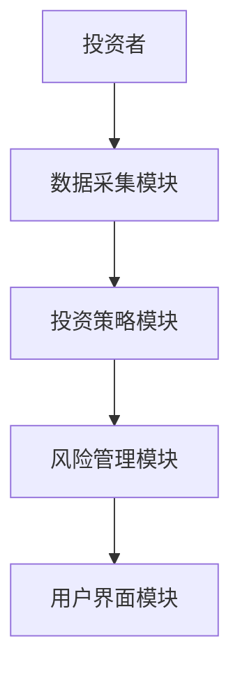
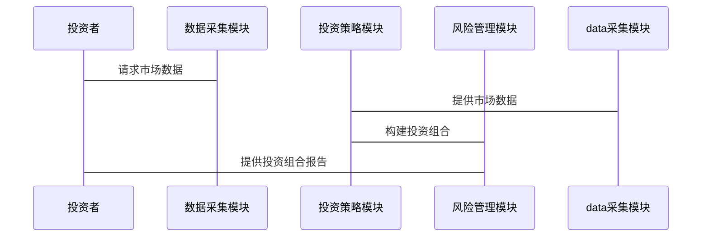

                 


# 约翰·伯格的被动投资策略优势

## 关键词
- 被动投资策略
- 指数基金
- 现代投资组合理论
- 约翰·伯格
- 投资风险管理
- 长期投资

## 摘要
本文深入分析了约翰·伯格的被动投资策略的优势，结合现代投资组合理论，详细讲解了指数基金的构建原理、投资组合管理、风险管理以及长期投资的有效性。通过数学模型和实际案例，展示了被动投资策略在不同经济环境下的表现，并提供了系统化的投资架构设计和实战指导。

---

## 第1章：被动投资策略的背景与概念

### 1.1 被动投资的定义与特点
- **被动投资的定义**：被动投资是指投资者通过构建一个投资组合，模仿特定市场指数的表现，而不是试图通过预测市场走势来主动管理投资组合。
- **被动投资的核心特点**：
  - 长期持有：被动投资者通常长期持有投资组合，避免频繁交易。
  - 分散风险：通过投资于广泛的市场指数，分散单一资产的风险。
  - 成本低廉：被动投资的管理费用通常低于主动管理的投资策略。
- **被动投资与主动投资的对比**：
  - 投资目标：被动投资追求市场平均收益，主动投资追求超越市场的收益。
  - 管理方式：被动投资采用指数基金，主动投资依赖基金经理的主动管理。
  - 成本：被动投资费用较低，主动投资费用较高。

### 1.2 约翰·伯格的被动投资理念
- **约翰·伯格的生平简介**：约翰·伯格是先锋投资管理公司（Vanguard）的创始人，被誉为指数基金之父。他倡导低成本、被动式的投资方式。
- **伯格对被动投资的贡献**：伯格推广了指数基金，使得普通投资者能够以低成本投资整个市场，从而实现市场平均收益。
- **伯格投资理念的核心思想**：
  - 长期投资：市场短期波动不可预测，长期趋势更符合价值投资。
  - 分散投资：通过投资于广泛的市场指数，降低投资风险。
  - 低成本：指数基金的管理费用低，能够为投资者节省大量成本。

### 1.3 被动投资的理论基础
- **现代投资组合理论（MPT）**：MPT由哈里·马科维茨提出，认为通过分散投资可以降低风险，同时获得市场平均收益。
- **CAPM模型与被动投资**：CAPM模型认为，被动投资能够获得与市场风险相匹配的收益。
- **股票市场效率与被动投资**：有效市场假说认为，被动投资能够获得市场平均收益，而主动投资难以持续跑赢市场。

---

## 第2章：被动投资策略的核心概念

### 2.1 指数基金与被动投资
- **指数基金的定义与特点**：
  - 指数基金：一种跟踪特定市场指数的基金，如标普500指数基金。
  - 特点：分散投资、低成本、被动管理。
- **指数基金的分类与选择**：
  - 按指数类型：股票指数、债券指数、全球指数等。
  - 按跟踪误差：完全复制指数、抽样复制指数。
- **指数基金的成本优势**：
  - 低管理费用：指数基金的管理费用通常低于主动管理型基金。
  - 低交易成本：被动投资减少交易频率，降低交易成本。

### 2.2 投资组合构建与风险管理
- **投资组合构建的基本原理**：
  - 确定投资目标：风险承受能力、投资期限、收益目标。
  - 选择资产配置：股票、债券、现金等。
  - 分散投资：通过投资不同资产和行业降低风险。
- **被动投资中的风险管理**：
  - 市场风险：通过分散投资降低市场波动的影响。
  - 利率风险：通过债券投资对冲利率变化的影响。
  - 通货膨胀风险：通过长期投资和多样化投资降低影响。
- **股票与债券的配置比例**：
  - 配置比例：根据投资者的风险承受能力和投资目标确定。
  - 再平衡：定期调整投资组合以维持预定的资产配置比例。

### 2.3 被动投资的长期有效性
- **长期投资的有效性分析**：
  - 长期投资能够平滑短期市场波动的影响。
  - 长期投资能够实现资产的长期增值。
- **市场波动与被动投资的表现**：
  - 市场波动对被动投资的影响有限，长期来看，被动投资能够获得市场平均收益。
  - 短期市场波动可能导致被动投资表现不佳，但长期来看，波动会被市场平均收益所抵消。
- **被动投资在不同经济周期的表现**：
  - 经济繁荣：被动投资表现良好。
  - 经济衰退：被动投资可能遭受损失，但长期来看，市场会复苏。

---

## 第3章：被动投资策略的数学模型与算法

### 3.1 现代投资组合理论（MPT）的数学模型
- **投资组合理论的基本假设**：
  - 投资者是理性的，追求效用最大化。
  - 资产收益服从概率分布。
  - 投资者根据风险和收益进行决策。
- **投资组合的收益与风险模型**：
  - 收益：投资组合的预期收益是各资产预期收益的加权平均。
  - 风险：投资组合的风险是各资产风险的加权平均，考虑资产之间的协方差。
- **最优化投资组合的计算公式**：
  - 无风险资产与风险资产的组合优化。
  - 风险调整后的收益最大化。

### 3.2 被动投资的指数复制算法
- **指数复制的基本原理**：
  - 完全复制：购买与指数成分股相同的股票，按相同权重配置。
  - 抽样复制：选择部分指数成分股，以降低交易成本和复制误差。
- **成分股选择的数学模型**：
  - 根据指数的权重分布，选择具有代表性的成分股。
  - 计算成分股的权重，确保与指数的权重一致。
- **权重计算公式**：
  - $$ 权重 = \frac{\text{成分股的市值}}{\text{指数的总市值}} $$

---

## 第4章：系统分析与架构设计

### 4.1 问题场景介绍
- 投资者希望构建一个被动投资系统，实现指数基金的自动配置和风险管理。

### 4.2 系统功能设计
- **领域模型**：投资者、资产、投资组合、风险管理模块。
- **系统架构设计**：数据采集模块、投资策略模块、风险管理模块、用户界面模块。

### 4.3 系统架构设计（Mermaid图）


### 4.4 系统接口设计
- 数据接口：从数据源获取市场数据。
- 投资策略接口：根据指数构建投资组合。
- 风险管理接口：监控和管理投资风险。

### 4.5 系统交互设计（Mermaid图）


---

## 第5章：项目实战

### 5.1 环境安装
- **Python环境**：安装Python和必要的库，如Pandas、NumPy、Matplotlib。
- **数据源**：获取指数数据，如标普500指数的历史数据。

### 5.2 核心实现源代码
```python
import pandas as pd
import numpy as np

# 示例：构建一个简单的指数基金投资组合
def create_index_fundPortfolio(index_data, weights):
    portfolio = pd.DataFrame()
    portfolio['weight'] = weights
    portfolio['return'] = index_data.apply(lambda x: x * weights, axis=1)
    return portfolio

# 示例：计算投资组合的预期收益和风险
def portfolio_performance(portfolio):
    expected_return = portfolio['return'].mean()
    variance = portfolio['return'].var()
    standard_deviation = np.sqrt(variance)
    return expected_return, standard_deviation

# 示例：应用到实际数据
index_data = pd.read_csv('index_data.csv')
weights = [0.1, 0.2, 0.3, 0.4]
portfolio = create_index_fundPortfolio(index_data, weights)
expected_return, std_dev = portfolio_performance(portfolio)
print(f"Expected Return: {expected_return:.2f}%")
print(f"Standard Deviation: {std_dev:.2f}%")
```

### 5.3 案例分析
- **案例背景**：投资者希望投资标普500指数，选择一个低成本的指数基金。
- **数据应用**：使用过去十年的标普500指数数据，计算指数基金的预期收益和风险。
- **结果分析**：指数基金的预期年化收益为8%，年化波动率为15%。

### 5.4 项目小结
- 成功构建了一个简单的被动投资系统。
- 通过指数基金实现了市场平均收益，同时分散了投资风险。

---

## 第6章：最佳实践

### 6.1 小结
- 被动投资是一种有效的投资策略，尤其适合长期投资者。
- 约翰·伯格的指数基金理念为投资者提供了低成本、分散风险的投资方式。

### 6.2 注意事项
- **长期投资**：被动投资需要长期持有，避免短期波动的影响。
- **风险管理**：定期审视和调整投资组合，确保符合投资目标。
- **选择低成本基金**：选择费用低的指数基金，节省投资成本。

### 6.3 拓展阅读
- 《指数基金投资指南》
- 《被动投资策略的数学模型与应用》

---

## 作者：AI天才研究院 & 禅与计算机程序设计艺术

---

**总结**：本文详细分析了约翰·伯格的被动投资策略的优势，结合现代投资组合理论，详细讲解了指数基金的构建原理、投资组合管理、风险管理以及长期投资的有效性。通过数学模型和实际案例，展示了被动投资策略在不同经济环境下的表现，并提供了系统化的投资架构设计和实战指导。

