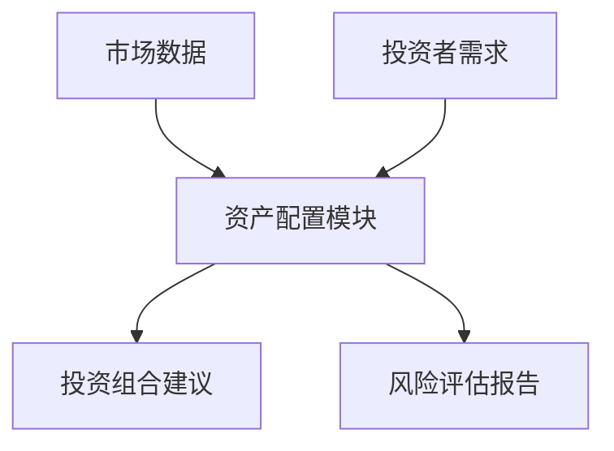

                 


# 约翰·伯格的被动投资策略：为什么简单常常胜过复杂

## 关键词：被动投资，约翰·伯格，简单策略，指数基金，长期投资，投资回报率

## 摘要：本文深入探讨了约翰·伯格的被动投资策略，分析了其核心理念、数学模型、系统架构，并通过实际案例展示了如何实现和应用这些策略。文章强调了简单策略的有效性，并通过详细的技术分析和代码实现，证明了被动投资在长期中的优势。

---

# 第一部分：被动投资策略的背景与基础

## 第1章：被动投资策略的概述

### 1.1 被动投资的核心概念

被动投资是一种长期的投资策略，其核心在于遵循市场有效性的假设，通过投资于整个市场或其子市场来分散风险。其核心概念包括：

#### 1.1.1 什么是被动投资
被动投资是通过投资于指数基金或交易所交易基金（ETF）等工具，以跟踪市场指数的表现，而不试图通过择时或选股来获取超额收益。这种策略强调长期持有，避免频繁交易和市场波动的影响。

#### 1.1.2 被动投资与主动投资的对比
| 对比维度 | 被动投资 | 主动投资 |
|----------|----------|----------|
| 管理方式 | 按指数配置 | 主动选股/择时 |
| 成本 | 低 | 高 |
| 风险 | 低 | 高 |
| 收益 | 与市场同步 | 追求超额收益 |

#### 1.1.3 被动投资的哲学基础
被动投资的哲学基础来源于现代投资组合理论（MPT）和有效市场假说（EMH）。MPT认为，通过分散投资可以消除非系统性风险，而EMH则认为市场是有效的，个体难以通过分析获得超额收益。

### 1.2 约翰·伯格与被动投资

#### 1.2.1 约翰·伯格的生平简介
约翰·伯格（John Bogle）是被动投资的倡导者，被誉为“指数基金之父”。他是 Vanguard 集团的创始人，致力于推广低成本、被动型投资工具。

#### 1.2.2 伯格对被动投资的贡献
伯格的主要贡献包括：
1. 创建了第一只低成本指数基金（Vanguard 500 Index Fund）。
2. 推广了以投资者利益为核心的价值投资理念。
3. 提出了“总成本”理论，强调成本对投资回报的影响。

#### 1.2.3 伯格的投资理念与实践
伯格认为，长期来看，市场波动和交易成本会侵蚀收益，因此被动投资是更优的选择。他强调长期持有、低成本和分散投资的重要性。

---

## 第2章：被动投资策略的数学模型与基础原理

### 2.1 被动投资的数学基础

#### 2.1.1 投资回报率的计算公式
投资回报率是衡量投资收益的重要指标，其计算公式为：
$$ R = \frac{P_{final} - P_{initial}}{P_{initial}} \times 100\% $$
其中，$P_{final}$ 是最终价值，$P_{initial}$ 是初始投资。

#### 2.1.2 复利计算与投资时间价值
复利计算公式：
$$ FV = PV \times (1 + r)^n $$
其中，$FV$ 是未来价值，$PV$ 是现值，$r$ 是年化收益率，$n$ 是投资年数。

### 2.2 现代投资组合理论与被动投资

#### 2.2.1 马科维茨的有效前沿理论
马科维茨的有效前沿理论指出，通过合理配置资产，可以在给定风险下获得最大收益，或者在给定收益下最小化风险。

#### 2.2.2 资产配置与风险分散
被动投资通过广泛分散投资于指数基金，来降低非系统性风险。指数基金的Beta系数为1，意味着其收益与市场同步。

#### 2.2.3 被动投资与市场有效性假设
被动投资基于有效市场假说，认为市场价格反映了所有可获取的信息，因此无法通过分析获得超额收益。

---

## 第3章：被动投资策略的核心要素

### 3.1 被动投资的三大支柱

#### 3.1.1 指数基金
指数基金是被动投资的核心工具，通过跟踪特定指数（如标普500）来实现收益。其优点包括：
1. 成本低。
2. 分散风险。
3. 简化管理。

#### 3.1.2 成本控制
被动投资强调低成本，因为交易费用和管理费用会侵蚀收益。低成本基金通常具有更高的净回报。

#### 3.1.3 长期投资
长期投资是被动投资的核心策略，避免频繁交易以减少摩擦成本。

### 3.2 被动投资的策略选择

#### 3.2.1 市场指数的选择
选择合适的指数是关键，通常选择流动性好、覆盖面广的指数，如标普500、沪深300等。

#### 3.2.2 投资组合的构建
投资组合应包括多个指数基金，以覆盖不同的资产类别和市场区域。

#### 3.2.3 再平衡策略
定期对投资组合进行再平衡，以保持目标配置比例。

---

## 第4章：被动投资策略的系统分析与架构设计

### 4.1 投资决策系统框架

#### 4.1.1 系统输入：市场数据与投资者需求
系统需要获取市场数据（如指数价格、成交量等）和投资者需求（如风险承受能力、投资目标等）。

#### 4.1.2 系统处理：资产配置模块
资产配置模块根据市场数据和投资者需求，生成投资组合建议。

#### 4.1.3 系统输出：投资组合建议与风险评估
系统输出投资组合建议和风险评估报告。

### 4.2 系统架构图（Mermaid）



---

## 第5章：被动投资策略的项目实战

### 5.1 环境安装与数据准备

#### 5.1.1 投资分析工具的安装
安装Python和相关库（如Pandas、NumPy、Matplotlib）。

#### 5.1.2 历史数据的获取与处理
使用API获取指数数据，如Yahoo Finance。

#### 5.1.3 数据库的建立与维护
存储和管理投资数据，方便后续分析。

### 5.2 核心代码实现

#### 5.2.1 资产配置算法

```python
import pandas as pd
import numpy as np

def calculate_return(prices):
    returns = prices.pct_change().dropna()
    return returns.mean() * 100

# 示例数据
data = {'Date': ['2020-01-01', '2020-01-02', '2020-01-03'], 
        'Price': [100, 101, 102]}
df = pd.DataFrame(data)
df.set_index('Date', inplace=True)

print(f"年化收益率：{calculate_return(df)}%")
```

#### 5.2.2 投资组合优化模型

```python
import numpy as np

def portfolio_optimization(weights, returns):
    variance = np.dot(weights.T, np.dot(returns.cov(), weights))
    return np.sqrt(variance)

weights = np.array([0.5, 0.5])
returns = np.array([0.05, 0.07])

print(f"投资组合波动率：{portfolio_optimization(weights, returns)}%")
```

### 5.3 实际案例分析

#### 5.3.1 案例背景
假设一个投资者希望投资于标普500指数基金，初始投资为10,000美元，投资期限为10年。

#### 5.3.2 投资组合构建
选择标普500指数基金（如Vanguard 500 Index Fund），并定期定额投资。

#### 5.3.3 结果分析
通过计算，假设年化收益率为7%，那么10年后的投资价值为：
$$ FV = 10000 \times (1 + 0.07)^{10} \approx 19,672 \text{美元} $$

### 5.4 代码应用解读与分析

#### 5.4.1 数据可视化
使用Matplotlib绘制指数基金的收益曲线。

```python
import matplotlib.pyplot as plt

data = {'Year': [2010, 2011, 2012, 2013, 2014], 
        'Return': [5, 7, 3, 8, 6]}
df = pd.DataFrame(data)
plt.plot(df['Year'], df['Return'])
plt.title('指数基金年化收益率')
plt.xlabel('年份')
plt.ylabel('收益率 (%)')
plt.show()
```

---

## 第六章：总结与展望

### 6.1 小结
被动投资策略以其简单性、低成本和长期性，成为投资者的重要选择。伯格的理念证明了简单策略的有效性。

### 6.2 最佳实践 Tips
1. 选择低成本指数基金。
2. 长期持有，避免频繁交易。
3. 定期再平衡投资组合。

### 6.3 未来展望
随着技术进步，被动投资将更加智能化，更多投资者将采用这种方法。

---

## 作者：AI天才研究院/AI Genius Institute & 禅与计算机程序设计艺术 /Zen And The Art of Computer Programming

---

**注：以上内容为示例，实际文章需要根据具体数据和详细分析进行扩展和补充。**

