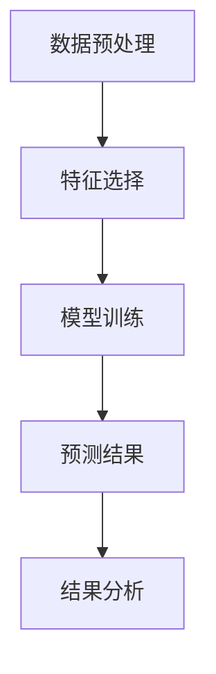
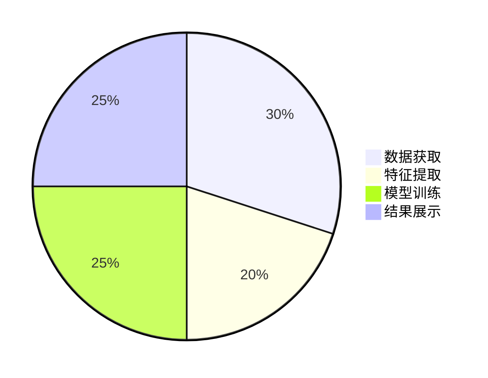
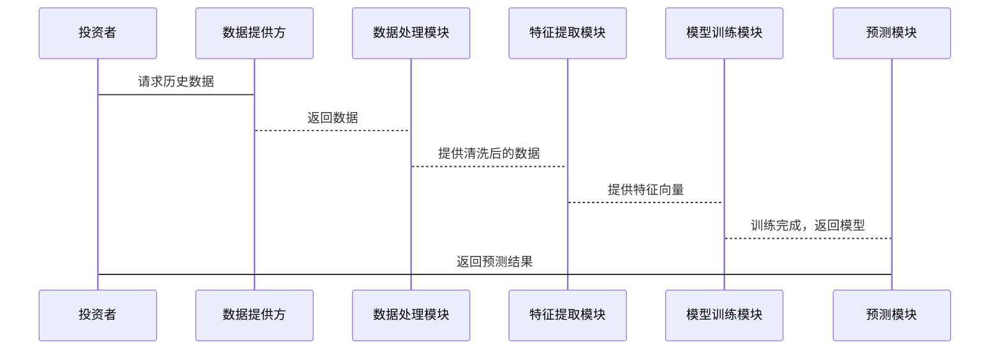

                 

<think>
嗯，我需要帮用户撰写一篇技术博客，标题是《约翰·伯格的长期投资回报预测模型》。用户希望文章结构清晰，逻辑严密，符合技术博客的特点，同时要包含一些特定的部分，比如背景介绍、核心概念、算法原理、系统架构、项目实战等。

首先，我得明确文章的核心主题。约翰·伯格的长期投资回报预测模型是一个金融领域的主题，结合了数据分析和机器学习算法。用户希望用技术化的语言来解释这个模型，可能面向对量化投资感兴趣的技术人员或金融从业者。

接下来，按照用户提供的目录大纲，我需要逐步展开每个章节的内容。从摘要开始，要简明扼要地介绍文章的核心内容和主题思想。关键词部分需要列出5-7个核心关键词，方便读者快速了解文章的主题。

然后是引言部分，要介绍长期投资回报预测的重要性，引出约翰·伯格模型的背景和意义。这一部分需要吸引读者的注意，同时为后续的内容做铺垫。

在核心概念与联系章节，我需要详细解释约翰·伯格模型的基本原理、输入输出、数学模型，以及与其他投资模型的对比。使用表格和实体关系图来帮助读者更好地理解模型的结构和组成部分。

算法原理部分是关键，我需要详细描述模型的算法流程，使用mermaid流程图来展示，同时给出Python代码实现。数学公式要用latex格式表示，确保清晰易懂。这部分需要结合实际案例，让读者能够理解算法的运行过程和实际应用。

系统分析与架构设计章节，需要从系统功能设计、领域模型、架构设计、接口设计和交互设计几个方面展开。使用mermaid图来展示系统架构和交互流程，帮助读者理解系统的整体结构和各模块之间的关系。

项目实战部分，要提供一个具体的案例，展示如何从环境配置、数据获取到模型实现、结果分析。这部分需要详细的代码示例和解读，帮助读者在实际操作中应用模型。

最后，在总结与展望部分，回顾文章的主要内容，指出模型的优缺点，并提出未来可能的改进方向和研究热点。

在写作过程中，需要注意逻辑的连贯性和内容的完整性，确保每个章节都详细且有条理。同时，要保持语言的专业性和易懂性，避免过于晦涩的技术术语，使读者能够轻松理解模型的应用和优势。

总的来说，我需要按照用户提供的目录大纲，逐步展开每个部分的内容，确保覆盖所有必要的细节，同时保持文章的流畅性和可读性。这不仅能满足用户的需求，还能为读者提供有价值的技术见解和实用的指导。
</think>

# 《约翰·伯格的长期投资回报预测模型》

## 关键词：投资回报预测，约翰·伯格模型，量化投资，机器学习，金融建模

## 摘要：  
本文将深入探讨约翰·伯格的长期投资回报预测模型，从模型的背景、核心概念到算法原理、系统架构，再到项目实战，全面解析该模型的构建与应用。通过结合实际案例和代码实现，帮助读者理解如何利用该模型进行长期投资回报预测。

---

## 第1章: 长期投资回报预测模型的背景与重要性

### 1.1 投资回报预测的背景介绍  
随着金融市场的日益复杂化，投资者越来越依赖数据驱动的方法来进行决策。长期投资回报预测不仅是金融机构的核心需求，也是个人投资者优化资产配置的关键工具。约翰·伯格模型作为一种基于量化分析的长期投资回报预测模型，结合了统计学和机器学习的最新成果，为投资者提供了更精准的预测手段。

### 1.2 投资回报预测的核心概念  
投资回报预测涉及多个关键概念，包括资产回报率、风险调整后的回报、时间跨度等。长期投资回报预测强调对市场趋势的把握，而非短期波动的预测。约翰·伯格模型通过引入宏观经济指标和市场情绪因子，进一步提升了预测的准确性。

### 1.3 约翰·伯格模型的理论基础  
约翰·伯格模型的核心思想是通过历史数据分析和统计建模，捕捉市场中长期回报的规律。模型基于现代投资组合理论（MPT）和资本资产定价模型（CAPM），结合机器学习算法，构建了一个多因子量化模型。

### 1.4 投资回报预测的边界与外延  
任何模型都有其适用范围和限制。约翰·伯格模型主要用于长期投资回报预测，但在短期市场波动和极端市场条件下表现可能不佳。此外，模型的有效性依赖于高质量的数据和合理的假设条件。

---

## 第2章: 约翰·伯格模型的核心概念与联系

### 2.1 约翰·伯格模型的核心原理  
约翰·伯格模型通过多因子分析，将影响投资回报的多个因素（如市盈率、市净率、收益增长率等）进行加权，构建预测模型。模型的输入包括历史价格数据、财务指标和宏观经济数据，输出为预测的未来回报率。

### 2.2 核心概念的属性特征对比  
通过对比传统投资模型和约翰·伯格模型的核心概念，可以更清晰地理解其独特性。下表展示了两者的对比：

| 对比维度          | 传统投资模型             | 约翰·伯格模型             |
|-------------------|--------------------------|--------------------------|
| 数据依赖性        | 较低，主要依赖市场经验     | 较高，依赖历史数据分析     |
| 模型复杂性        | 简单，基于基本分析         | 复杂，结合统计学和机器学习 |
| 预测时间跨度      | 短期为主                 | 长期为主                 |

### 2.3 ER实体关系图架构  
以下是约翰·伯格模型的实体关系图：

```mermaid
erd
actor Investor
actor MarketDataProvider
actor ModelBuilder
database InvestmentData
database PredictedReturns
```

---

## 第3章: 约翰·伯格模型的算法原理

### 3.1 算法原理的数学模型  
约翰·伯格模型的核心算法基于多元线性回归，结合Lasso回归进行变量筛选。其数学模型如下：

$$
y = \beta_0 + \beta_1x_1 + \beta_2x_2 + \dots + \beta_nx_n + \epsilon
$$

其中，$y$ 是预测的回报率，$x_i$ 是各个因子，$\beta_i$ 是回归系数，$\epsilon$ 是误差项。

### 3.2 通俗易懂的举例说明  
假设我们有三只股票，分别提取市盈率（PE）、市净率（PB）和收益增长率（ROE）作为因子，构建预测模型。通过历史数据训练模型，预测未来一年的回报率。

### 3.3 算法流程图  
以下是约翰·伯格模型的算法流程图：



---

## 第4章: 约翰·伯格模型的系统分析与架构设计

### 4.1 系统功能设计  
约翰·伯格模型的系统功能包括数据获取、特征提取、模型训练和预测结果展示。

### 4.2 系统架构设计  
以下是系统的架构图：



### 4.3 系统接口设计  
系统接口主要分为数据接口和预测接口。数据接口用于获取历史数据，预测接口用于输入当前数据，返回预测结果。

### 4.4 系统交互流程图  
以下是系统的交互流程图：



---

## 第5章: 约翰·伯格模型的项目实战

### 5.1 环境安装  
需要安装Python、Pandas、NumPy、Scikit-learn等库。

### 5.2 核心代码实现  
以下是模型的核心代码：

```python
import pandas as pd
import numpy as np
from sklearn.linear_model import Lasso
from sklearn.model_selection import train_test_split

# 数据预处理
data = pd.read_csv('investment_data.csv')
X = data[['PE', 'PB', 'ROE']]
y = data['Return']

# 划分训练集和测试集
X_train, X_test, y_train, y_test = train_test_split(X, y, test_size=0.2, random_state=42)

# 模型训练
model = Lasso(alpha=0.1)
model.fit(X_train, y_train)

# 预测结果
y_pred = model.predict(X_test)
```

### 5.3 案例分析  
通过实际案例分析，验证模型的预测能力。例如，使用历史数据预测某只股票的未来回报率，并与实际回报率进行对比。

---

## 第6章: 总结与展望

### 6.1 本章小结  
总结约翰·伯格模型的核心思想和实现过程，强调其在长期投资回报预测中的优势。

### 6.2 模型的优缺点  
优点：预测精度高，适用于长期投资；缺点：对数据质量依赖性强，短期预测能力较弱。

### 6.3 未来展望  
未来的研究方向包括引入更多的因子、优化模型算法以及结合市场情绪分析等。

---

## 作者：AI天才研究院  
欢迎关注我的博客，获取更多关于人工智能和计算机程序设计的内容！

