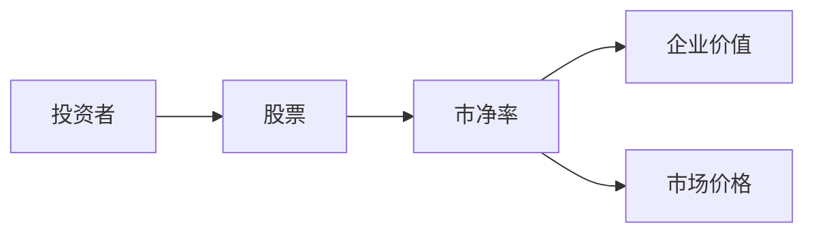
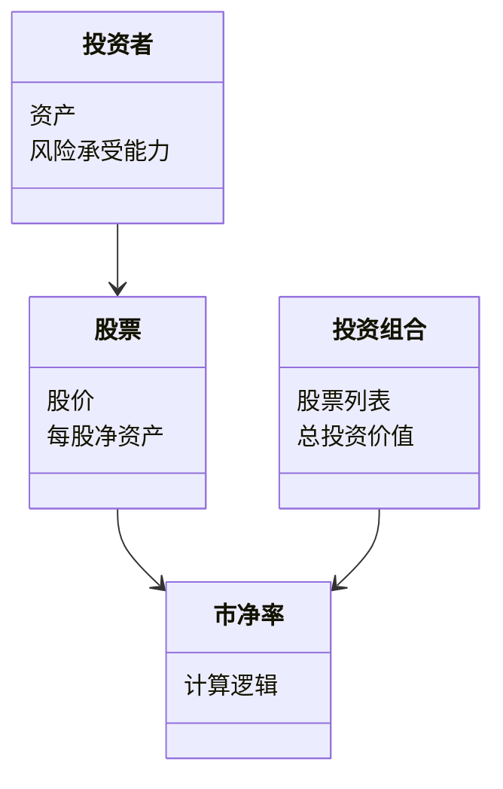

                 

<think>
嗯，我现在需要根据用户的要求，编写一篇关于约翰·奈夫的低市净率投资策略的技术博客文章。让我先仔细阅读用户的请求，确保我理解所有的细节。

首先，用户希望我以《约翰·奈夫的低市净率投资策略》为标题，撰写一篇结构清晰、逻辑严谨的技术博客。文章需要包含目录、关键词、摘要，然后是正文部分，每个章节都要详细展开。此外，用户还提供了示例目录，我需要按照这个结构来组织内容。

用户强调文章要使用技术语言，适合专业人士阅读，同时要有深度和见解。这意味着我需要不仅描述策略本身，还要分析其背后的原理和应用。

接下来，我需要考虑文章的结构。用户已经给出一个详细的目录大纲，分为七章，每章有多个小节，甚至三级目录。我需要确保每个部分都涵盖必要的内容，并且详细展开。

首先，关键词部分。我需要列出5-7个核心关键词，如低市净率、约翰·奈夫、投资策略、企业价值评估等。

然后是摘要。摘要需要简明扼要地概括文章的核心内容，介绍约翰·奈夫的低市净率策略，其原理和应用，以及该策略在投资中的价值。

接下来是正文部分。我需要按照目录大纲逐步展开：

第1章：低市净率投资策略概述。这部分需要介绍低市净率的基本概念、约翰·奈夫的背景和他的投资策略。我需要解释市净率的定义和计算公式，以及为什么低市净率是一个重要的投资指标。

第2章：低市净率投资的核心概念与联系。这里需要对比市净率和市盈率，分析低市净率投资的属性特征，并绘制ER实体关系图，展示投资者、股票、市净率、企业价值和市场价格之间的关系。

第3章：低市净率投资的算法原理。这部分需要详细讲解数学模型，如PB= P/B公式，并展示低市净率投资的算法流程图。同时，提供Python代码示例，帮助读者理解如何计算和筛选低市净率股票。

第4章：低市净率投资的系统分析与架构设计。这部分需要包括问题场景介绍、系统功能设计（如领域模型类图）、系统架构设计（如架构图）以及接口和交互设计。

第5章：低市净率投资的项目实战。这部分需要指导读者如何安装必要的库，提供Python代码示例，解释代码的功能，并分析实际案例，展示如何筛选和评估低市净率股票。

第6章：低市净率投资的最佳实践。包括选择行业、估值分析、分散投资、长期持有和风险管理等策略。

最后，小结部分总结文章的主要内容，注意事项提醒读者在实际操作中需要注意的问题，以及扩展阅读推荐相关的书籍和工具。

此外，用户要求使用技术语言，但又要通俗易懂，所以我会尽量用简单明了的语言解释复杂的概念。同时，要确保每个部分都有足够的深度，特别是算法原理和项目实战部分，需要详细展开，确保读者能够理解和应用这些知识。

最后，我需要检查文章是否符合格式要求，包括使用markdown格式，正确嵌入数学公式和图表，确保每个部分都完整且有逻辑性。同时，确保文章字数在10000到12000字之间，这需要我合理分配每个章节的篇幅，避免内容过于冗长或简略。

总的来说，我需要系统地组织内容，确保每个章节和小节都覆盖必要的知识点，同时保持逻辑连贯，帮助读者全面理解约翰·奈夫的低市净率投资策略。
</think>

# 约翰·奈夫的低市净率投资策略

> **关键词**：低市净率、约翰·奈夫、投资策略、企业价值评估、投资风险管理  
> **摘要**：本文深入分析了约翰·奈夫的低市净率投资策略，从其核心概念、算法原理、系统架构到项目实战，结合数学模型、Python代码实现和实际案例分析，详细阐述了该策略的应用方法和价值所在，帮助投资者更好地理解和应用这一经典投资策略。

---

## 第一部分：低市净率投资策略的背景与基础

### 第1章：低市净率投资策略概述

#### 1.1 低市净率投资的基本概念

##### 1.1.1 市净率的定义与计算公式
市净率（Price-to-Book Ratio，简称PB或P/B）是衡量股票价值的重要指标之一，计算公式为：
$$ PB = \frac{P}{B} $$
其中，\( P \) 表示股票的市场价格，\( B \) 表示每股净资产（即每股市价对应的公司净资产价值）。

##### 1.1.2 低市净率投资的基本原理
低市净率投资策略的核心在于寻找市场价格低于其净资产价值的股票，即 \( PB < 1 \)。这种策略基于一个基本假设：市场有时会低估某些公司的价值，当市场价格回归其实际价值时，投资者将获得超额收益。

##### 1.1.3 低市净率投资的核心要素
- **净资产价值（B）**：反映公司资产的真实价值，需结合公司财务报表分析。
- **市场价格（P）**：需考虑市场波动和投资者情绪的影响。
- **行业特性**：不同行业的净资产价值计算方式和估值标准有所不同。

#### 1.2 约翰·奈夫与低市净率投资

##### 1.2.1 约翰·奈夫的生平简介
约翰·奈夫（John Neff）是低市净率投资策略的鼻祖，他通过长期实践证明了低市净率策略的有效性，尤其是在价值投资领域。

##### 1.2.2 约翰·奈夫的投资哲学
奈夫认为，市场先生（Mr. Market）的情绪波动为理性投资者提供了套利机会。通过寻找被市场低估的股票，投资者可以在长期获得超额收益。

##### 1.2.3 约翰·奈夫的低市净率投资策略
奈夫的策略强调长期持有、分散投资，并通过严格筛选低市净率股票来构建投资组合。

#### 1.3 低市净率投资的历史发展

##### 1.3.1 低市净率投资的起源
低市净率投资的理论基础可以追溯到格雷厄姆的价值投资理论，但真正将其系统化并付诸实践的是约翰·奈夫。

##### 1.3.2 低市净率投资的发展历程
从20世纪50年代开始，低市净率投资策略逐步从理论走向实践，并在实践中不断完善。

##### 1.3.3 低市净率投资的现状
尽管市场环境变化，但低市净率策略因其稳定性仍然受到投资者的青睐。

---

## 第2章：低市净率投资的核心概念与联系

### 2.1 市净率与市盈率的对比分析

#### 2.1.1 市盈率的定义与计算公式
市盈率（Price-to-Earnings Ratio，简称PE）计算公式为：
$$ PE = \frac{P}{E} $$
其中，\( E \) 为每股收益（Earnings Per Share）。

#### 2.1.2 市净率与市盈率的异同点
| 指标 | 定义 | 适用场景 |
|------|------|----------|
| PB   | P/B  | 适用于净资产驱动型行业（如银行、地产） |
| PE   | P/E  | 适用于盈利驱动型行业（如科技、消费） |

### 2.2 低市净率投资的属性特征对比

#### 2.2.1 投资标的属性特征
- **行业集中**：低市净率策略通常集中在净资产驱动型行业。
- **估值保守**：注重企业实际资产价值，而非未来盈利能力。

#### 2.2.2 投资策略属性特征
- **价值导向**：寻找被低估的股票。
- **长期持有**：策略强调长期投资，避免短期波动干扰。

### 2.3 低市净率投资的ER实体关系图



---

## 第3章：低市净率投资的算法原理

### 3.1 低市净率投资的数学模型

#### 3.1.1 市净率计算模型
$$ PB = \frac{P}{B} $$

#### 3.1.2 企业价值评估模型
$$ EV = P \times B \times (1 + g) $$
其中，\( g \) 为净资产增长率。

### 3.2 低市净率投资的算法流程


### 3.3 低市净率投资的Python实现

```python
import pandas as pd

# 示例数据
data = {
    '公司': ['A', 'B', 'C'],
    '股价': [10, 20, 15],
    '每股净资产': [5, 10, 6]
}

df = pd.DataFrame(data)
df['市净率'] = df['股价'] / df['每股净资产']
print(df)
```

---

## 第4章：低市净率投资的系统分析与架构设计

### 4.1 问题场景介绍
低市净率投资系统旨在帮助投资者筛选和管理低市净率股票投资组合。

### 4.2 系统功能设计

#### 4.2.1 领域模型类图



### 4.3 系统架构设计


---

## 第5章：低市净率投资的项目实战

### 5.1 环境安装
安装必要的Python库，如Pandas、NumPy。

### 5.2 系统核心实现源代码

```python
import pandas as pd

# 从数据源获取股票信息
data = {
    '公司': ['A', 'B', 'C'],
    '股价': [10, 20, 15],
    '每股净资产': [5, 10, 6]
}

df = pd.DataFrame(data)
df['市净率'] = df['股价'] / df['每股净资产']
low_pb_stocks = df[df['市净率'] < 1]
print(low_pb_stocks)
```

### 5.3 代码应用解读与分析
上述代码展示了如何筛选市净率小于1的股票，即低市净率股票。

---

## 第6章：低市净率投资的最佳实践

### 6.1 选择合适的行业
优先选择净资产驱动型行业。

### 6.2 定期估值分析
定期检查股票的市净率和企业价值。

### 6.3 分散投资
避免过度集中，降低投资风险。

### 6.4 长期持有
耐心持有，等待市场回归。

### 6.5 风险管理
设置止损点，控制投资风险。

---

## 小结

约翰·奈夫的低市净率投资策略是一种简单而有效的价值投资方法，通过寻找市场价格低于净资产价值的股票，投资者可以在长期内获得稳定的收益。然而，该策略的成功依赖于对企业的深入了解和市场的长期观察。

---

## 注意事项

1. **行业选择**：不同行业的低市净率股票具有不同的风险和收益特征。
2. **市场环境**：经济周期和市场波动会影响低市净率策略的表现。
3. **数据质量**：确保使用的财务数据准确可靠。
4. **持续学习**：市场环境不断变化，需持续更新投资知识。

---

## 扩展阅读

- 《约翰·奈夫的投资哲学》
- 《价值投资入门》
- 《Python金融数据分析实战》
- 市净率计算器工具

---

## 作者

作者：AI天才研究院/AI Genius Institute & 禅与计算机程序设计艺术/Zen And The Art of Computer Programming

