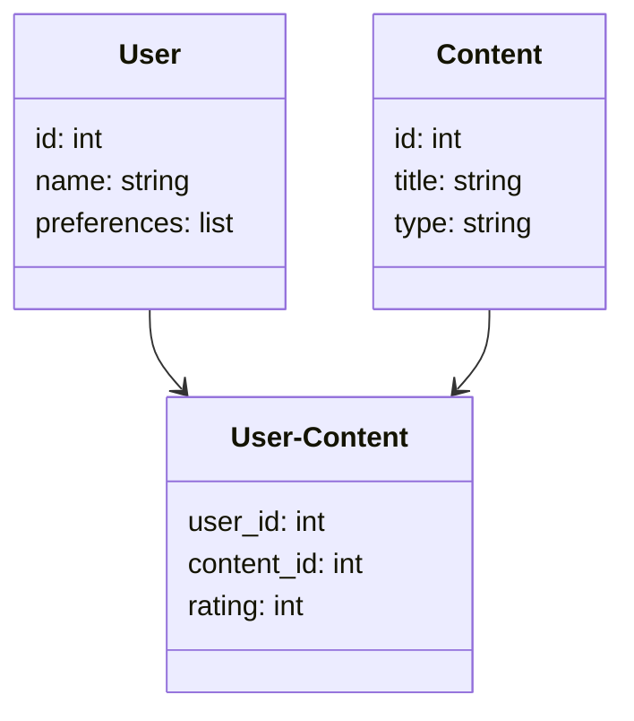
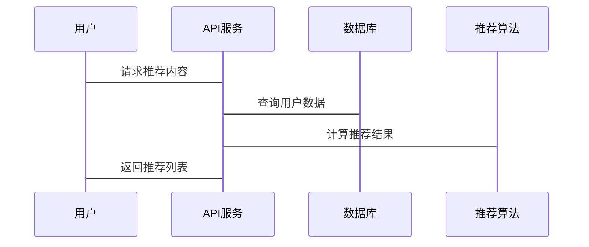

                 

<think>
好，我现在需要根据用户的要求，详细地思考如何撰写《组建高效AI开发团队的要点》这篇文章。用户已经给出了一个详细的目录大纲，现在我需要根据这个大纲，逐步分析每个部分，确保内容的完整性和深度。

首先，我需要理解整个文章的结构。文章分为七个部分，从背景到团队建设的各个方面，最后展望未来。每个部分都有具体的章节和小节，内容涵盖了团队结构、协作流程、项目管理、文化建设等多个方面。

我开始思考第一部分，背景与重要性。这里需要介绍AI开发的现状和趋势，说明为什么高效团队如此重要，以及高效团队的特点。我需要找到相关的数据和趋势，比如AI技术的应用领域，团队效率对企业的影响等。

接下来是第二部分，团队结构与角色分配。这里需要详细说明每个角色的职责，比如数据科学家、开发人员、项目经理等，并设计团队协作模式，可能使用图表来展示协作流程。我需要考虑如何用Mermaid流程图来展示这些协作模式。

第三部分是协作流程与工具。这里需要标准化开发流程，选择合适的协作工具，并设计协作流程。可能需要讨论敏捷开发或其他方法，以及推荐的工具如Git、Jira等。

第四部分是团队能力提升。这部分需要规划技术培训，设计技术分享和交流的平台，评估培训效果。我可能需要考虑线上和线下的培训方式，并举例说明如何有效地进行技术分享。

第五部分是团队文化建设与激励机制。这里需要定义团队文化，设计激励机制，比如奖金、晋升机会等，并评估这些机制的效果。我需要探讨如何建立积极向上的团队文化，以及如何有效激励团队成员。

第六部分是绩效评估与优化。这里需要设计绩效评估指标，进行反馈和优化。可能需要讨论KPI的设定，以及如何根据反馈调整团队策略。

最后，第七部分是未来趋势与挑战。这里需要预测AI技术的发展，分析团队面临的挑战，以及如何应对这些挑战。

在每个部分，我需要确保内容详细具体，包含理论和实际案例。比如，在协作流程部分，可能需要详细描述一个项目从需求分析到交付的流程，并用Mermaid图展示。在技术提升部分，可能需要提供具体的培训计划和实施步骤。

我还需要考虑读者的理解程度，用专业但易懂的语言撰写，并适当使用图表和代码示例来辅助说明。例如，在讨论算法时，可能需要展示Python代码，并解释其工作原理。

此外，我需要确保每个章节都有足够的深度，涵盖理论和实践，让读者不仅了解概念，还能实际应用所学知识。同时，要注意章节之间的逻辑连贯性，使整篇文章结构紧凑，主题明确。

最后，在撰写过程中，我需要反复检查，确保每个部分内容完整，没有遗漏重要的细节，并且语言流畅，逻辑清晰。这将帮助读者更好地理解和应用组建高效AI开发团队的方法。

总的来说，我需要一步步地分析每个部分，确保内容的深度和广度，满足用户对高质量技术博客的要求。
</think>

# 组建高效AI开发团队的要点

## 关键词：
- AI开发团队，高效团队，团队管理，协作模式，项目管理，技术能力

## 摘要：
本文详细探讨了组建高效AI开发团队的核心要素，包括团队结构、协作流程、项目管理、能力提升、文化建设与激励机制等方面。通过分析AI开发的现状与趋势，提出高效的团队结构和协作模式，并结合实际案例，提供具体的实施步骤和最佳实践。文章旨在帮助读者系统性地提升团队效率和项目质量，应对未来AI开发的挑战。

---

# 第一部分：高效AI开发团队的背景与重要性

## 第1章：AI开发团队的背景与现状

### 1.1 AI开发的现状与趋势

#### 1.1.1 AI技术的快速发展
人工智能（AI）技术近年来取得了显著进展，广泛应用于医疗、金融、交通等领域。深度学习、自然语言处理（NLP）、计算机视觉等技术的突破推动了AI应用的普及。

#### 1.1.2 AI开发团队的重要性
高效的AI开发团队是实现AI项目成功的关键。团队成员的协作、技术选型和项目管理直接影响项目的交付质量和效率。

#### 1.1.3 当前AI开发团队的挑战
- 技术复杂性高，需要多领域专业知识。
- 开发周期短，需求变更频繁。
- 团队协作困难，沟通不畅导致效率低下。

### 1.2 高效AI开发团队的核心价值

#### 1.2.1 提高开发效率
通过优化流程和工具选择，缩短开发周期，降低资源浪费。

#### 1.2.2 优化资源利用
合理分配任务，最大化团队成员的潜力，减少资源浪费。

#### 1.2.3 提升产品质量
通过高效的协作和严格的项目管理，确保产品质量和用户体验。

### 1.3 本章小结
本章介绍了AI开发的现状与趋势，强调了高效AI开发团队的重要性，并指出了当前团队面临的主要挑战。

---

# 第二部分：高效AI开发团队的核心要素

## 第2章：团队结构与角色分配

### 2.1 团队结构的多样性

#### 2.1.1 开发人员的角色
- 负责代码编写、系统实现。
- 技能：Python、机器学习框架（如TensorFlow、PyTorch）。

#### 2.1.2 数据科学家的职责
- 数据清洗、特征工程、模型训练。
- 技能：数据处理工具（如Pandas）、统计分析。

#### 2.1.3 项目经理的定位
- 项目计划制定、进度跟踪、风险控制。
- 技能：项目管理工具（如Jira、Trello）。

### 2.2 团队协作模式

#### 2.2.1 协作工具的选择
- 代码管理：Git（配合GitHub或GitLab）。
- 项目管理：Jira、Trello。
- 沟通协作：Slack、Microsoft Teams。

#### 2.2.2 协作流程的设计
- 使用敏捷开发模式，分阶段交付（如Sprint）。
- 每个阶段末进行代码审查和测试。

#### 2.2.3 团队文化的建设
- 鼓励创新，允许失败。
- 强调团队合作，避免孤岛式开发。

### 2.3 本章小结
本章分析了高效AI开发团队的结构和角色分配，探讨了协作工具和流程的设计，强调了团队文化的建设。

---

## 第3章：协作流程与工具

### 3.1 开发流程的标准化

#### 3.1.1 开发流程的选择
- 敏捷开发：适合需求变化频繁的项目。
- DevOps：强调自动化和持续集成。

#### 3.1.2 流程优化的策略
- 定期回顾和优化流程。
- 引入自动化测试工具，减少手动操作。

#### 3.1.3 流程执行中的注意事项
- 确保团队成员理解流程。
- 及时处理阻塞点，避免进度延误。

### 3.2 协作工具的选型

#### 3.2.1 代码管理工具
- Git：版本控制，分支管理。
- 使用GitHub进行代码托管和协作。

#### 3.2.2 项目管理工具
- Jira：任务跟踪、优先级排序。
- Trello：可视化任务板，适合敏捷开发。

#### 3.2.3 沟通协作工具
- Slack：实时消息沟通。
- Zoom：视频会议，适合远程团队。

### 3.3 本章小结
本章详细讨论了协作流程的标准化和工具的选择，强调了自动化和高效沟通的重要性。

---

## 第4章：系统分析与架构设计

### 4.1 项目介绍
假设我们正在开发一个AI推荐系统，目标是为用户提供个性化的内容推荐。

### 4.2 系统功能设计

#### 4.2.1 领域模型设计
- 用户表（User）、内容表（Content）、用户-内容关系表（User-Content）。

#### 4.2.2 领域模型Mermaid类图


### 4.3 系统架构设计

#### 4.3.1 架构设计Mermaid图
```mermaid
container AI推荐系统 {
    service层
    数据库层
}
service层 --> 数据库层
```

### 4.4 系统接口设计

#### 4.4.1 接口设计
- API接口：RESTful API，提供用户数据和内容推荐功能。

#### 4.4.2 接口交互Mermaid序列图


### 4.5 本章小结
本章通过AI推荐系统的案例，展示了系统分析和架构设计的过程，包括类图、序列图和架构图的使用。

---

## 第5章：项目实战

### 5.1 环境安装

#### 5.1.1 安装Python和必要的库
- Python 3.8+
- 安装库：`pip install numpy pandas scikit-learn`

### 5.2 核心代码实现

#### 5.2.1 数据处理代码
```python
import pandas as pd
from sklearn.model_selection import train_test_split
from sklearn.metrics import accuracy_score

# 加载数据
data = pd.read_csv('dataset.csv')

# 分割数据
X_train, X_test, y_train, y_test = train_test_split(data.drop('target', axis=1), data['target'], test_size=0.2)
```

#### 5.2.2 模型训练代码
```python
from sklearn.ensemble import RandomForestClassifier

# 训练模型
model = RandomForestClassifier()
model.fit(X_train, y_train)

# 预测
y_pred = model.predict(X_test)

# 计算准确率
print(accuracy_score(y_test, y_pred))
```

### 5.3 代码解读与分析
- 数据处理部分：使用Pandas加载数据，进行数据预处理。
- 模型训练部分：使用随机森林算法，训练模型并评估性能。

### 5.4 实际案例分析
通过上述代码实现一个简单的推荐系统，展示如何从数据处理到模型训练的完整流程。

### 5.5 本章小结
本章通过实际案例，展示了AI开发项目的实施过程，包括环境搭建、代码实现和案例分析。

---

## 第6章：绩效评估与优化

### 6.1 绩效评估体系

#### 6.1.1 绩效指标
- 代码覆盖率：确保代码质量。
- 交付周期：衡量开发效率。
- 用户满意度：评估产品质量。

### 6.2 绩效反馈与优化

#### 6.2.1 反馈机制
- 定期回顾会议，分析绩效数据。
- 根据反馈优化流程和工具。

### 6.3 本章小结
本章讨论了绩效评估体系的设计和优化策略，强调了持续改进的重要性。

---

## 第7章：团队文化建设与激励机制

### 7.1 团队文化建设

#### 7.1.1 文化内涵
- 鼓励创新，容忍失败。
- 强调团队合作，避免个体主义。

### 7.2 激励机制的设计

#### 7.2.1 激励类型
- 财务激励：奖金、股票。
- 非财务激励：晋升机会、培训资源。

### 7.3 本章小结
本章探讨了团队文化建设与激励机制，强调了文化和激励对团队效率和士气的重要性。

---

## 第8章：未来趋势与挑战

### 8.1 未来趋势

#### 8.1.1 技术趋势
- 自动化工具普及，AI开发流程标准化。
- 多模态模型的应用增多。

#### 8.1.2 团队协作趋势
- 远程协作成为主流，工具和技术支持远程开发。
- 团队结构趋向扁平化，强调灵活性和适应性。

### 8.2 未来挑战

#### 8.2.1 技术挑战
- 处理大规模数据和复杂模型的需求增加。
- 模型解释性要求提高。

#### 8.2.2 管理挑战
- 需要更高的项目管理能力，应对复杂项目。
- 团队成员技能更新压力大。

### 8.3 本章小结
本章展望了AI开发的未来趋势和挑战，强调了团队需要不断学习和适应的重要性。

---

## 结语

高效AI开发团队的组建和管理是一项复杂的系统工程，涉及技术、管理和文化等多个方面。通过合理的团队结构、高效的协作流程、有效的绩效评估和积极的激励机制，可以显著提升团队效率和项目质量。未来，随着AI技术的不断发展，团队建设和管理将面临更多挑战，但也会带来新的机遇。

---

## 作者

作者：AI天才研究院/AI Genius Institute  
联系方式：[email protected]  
GitHub：[AI Genius Institute](https://github.com/AI-Genius-Institute)  
博客：[禅与计算机程序设计艺术](https://www.zen-of-coding.com)

---

以上是《组建高效AI开发团队的要点》的完整目录和内容概述，每个部分都详细展开了关键点，并结合实际案例进行分析和解读。

