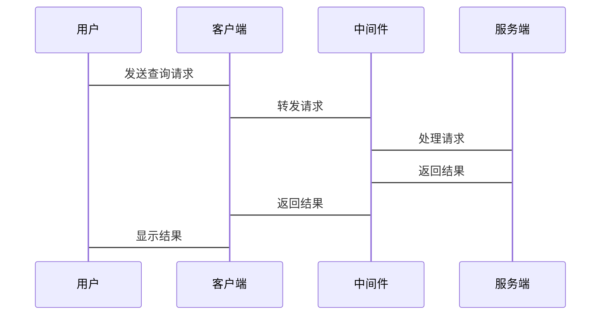

                 


# 终身学习：构建能持续进化的AI Agent

> 关键词：终身学习，AI Agent，强化学习，自适应学习，知识表示

> 摘要：本文深入探讨了如何构建能够持续进化的AI Agent，通过终身学习的机制，使AI Agent能够不断更新知识库、适应新环境并优化决策能力。文章从核心概念、算法原理、系统架构到项目实战，详细阐述了构建终身学习AI Agent的各个方面，为读者提供了一套完整的解决方案。

---

# 第一部分: 终身学习与AI Agent的背景介绍

## 第1章: 终身学习与AI Agent概述

### 1.1 终身学习的定义与特点

#### 1.1.1 终身学习的定义
终身学习是指个体在一生中不断获取、更新和应用知识的过程。与传统一次性学习不同，终身学习强调持续性和适应性，以应对快速变化的环境和复杂的问题。

#### 1.1.2 终身学习的核心特点
- **持续性**：学习是一个无止境的过程，贯穿个体一生。
- **适应性**：能够根据环境变化调整学习内容和方法。
- **主动性**：学习者主动寻求新知识，而非被动接受。
- **个性化**：学习内容和方式根据个体需求定制。

#### 1.1.3 终身学习与传统学习方式的对比
| 特性             | 终身学习               | 传统学习             |
|------------------|------------------------|----------------------|
| 时间跨度         | 终身                   | 有限（如学校教育）   |
| 学习目标         | 实现个人成长与适应     | 获取特定知识或技能   |
| 学习方式         | 主动性高，自我驱动     | 被动接受，教师主导   |
| 知识更新         | 高频更新               | 低频或固定           |

### 1.2 AI Agent的定义与特点

#### 1.2.1 AI Agent的定义
AI Agent（人工智能代理）是指能够感知环境、自主决策并执行任务的智能实体。它通过传感器获取信息，利用推理机制做出决策，并通过执行器与环境交互。

#### 1.2.2 AI Agent的核心特点
- **自主性**：能够在没有外部干预的情况下自主运行。
- **反应性**：能够实时感知环境并做出反应。
- **目标导向**：根据预设或动态调整的目标执行任务。
- **学习能力**：能够通过经验或数据改进性能。

#### 1.2.3 AI Agent与传统程序的区别
| 特性             | AI Agent               | 传统程序             |
|------------------|------------------------|----------------------|
| 智能性           | 高                     | 低                   |
| 学习能力         | 具备                   | 不具备               |
| 决策能力         | 强大                   | 有限或无             |
| 适应性           | 高                     | 低                   |

### 1.3 终身学习与AI Agent的结合

#### 1.3.1 终身学习在AI Agent中的应用
- **知识更新**：AI Agent能够不断更新其知识库，以应对新环境和任务。
- **自适应决策**：通过终身学习，AI Agent能够根据新信息调整决策策略。
- **持续进化**：AI Agent通过学习不断优化自身性能，实现进化。

#### 1.3.2 AI Agent实现终身学习的必要性
- **环境复杂性**：现实世界充满不确定性，AI Agent需要不断适应。
- **任务多样性**：AI Agent可能需要执行多种任务，终身学习使其具备更强的通用性。
- **数据洪流**：随着数据量的爆炸式增长，AI Agent需要持续学习以保持竞争力。

#### 1.3.3 终身学习与AI Agent的未来发展趋势
- **智能化**：AI Agent将更加智能化，具备更强的自主学习能力。
- **协作性**：AI Agent之间将实现协作学习，共同提升整体性能。
- **实时性**：终身学习将使AI Agent具备实时进化的能力，能够在动态环境中迅速调整。

### 1.4 本章小结
本章介绍了终身学习和AI Agent的基本概念、特点及其结合的必要性。终身学习为AI Agent提供了持续进化的能力，使其能够在复杂多变的环境中保持竞争力。

---

## 第2章: 终身学习AI Agent的核心概念

### 2.1 终身学习AI Agent的原理

#### 2.1.1 知识表示与更新机制
知识表示是终身学习AI Agent的核心，常见的表示方法包括符号表示、向量表示和图表示。知识更新机制则通过遗忘曲线和强化学习实现。

#### 2.1.2 自适应学习算法
自适应学习算法能够根据环境反馈动态调整学习策略。例如，基于强化学习的算法可以根据奖励信号优化决策模型。

#### 2.1.3 知识库的构建与维护
知识库是终身学习AI Agent的存储单元，需要不断更新和优化。知识库的构建可以通过监督学习、无监督学习和半监督学习实现。

### 2.2 终身学习与AI Agent的联系

#### 2.2.1 终身学习如何赋能AI Agent
- **提升决策能力**：通过不断学习，AI Agent能够做出更准确的决策。
- **增强适应性**：终身学习使AI Agent能够快速适应新环境和任务。
- **优化性能**：通过持续学习，AI Agent的性能不断提升。

#### 2.2.2 AI Agent如何实现持续进化
- **在线学习**：AI Agent可以在运行时通过在线学习更新知识库。
- **迁移学习**：利用迁移学习技术，AI Agent可以快速适应新任务。
- **自我监督**：通过自我监督学习，AI Agent能够发现并纠正错误。

#### 2.2.3 终身学习与AI Agent的协同作用
终身学习为AI Agent提供了持续进化的能力，而AI Agent则为终身学习提供了应用场景和反馈机制。两者的协同作用使得AI Agent能够不断优化自身性能，同时推动终身学习技术的发展。

### 2.3 核心概念对比表

| 特性             | 终身学习               | AI Agent               |
|------------------|------------------------|-------------------------|
| 核心目标         | 实现个人成长与适应     | 完成目标任务             |
| 技术手段         | 在线学习、迁移学习     | 强化学习、知识表示       |
| 应用场景         | 教育、职业发展         | 智能助手、自动驾驶       |
| 优势             | 灵活性高               | 自主性强、决策能力强大   |

### 2.4 本章小结
本章详细探讨了终身学习AI Agent的核心概念，包括知识表示、自适应学习算法和知识库的构建与维护。终身学习与AI Agent的结合为AI Agent提供了持续进化的能力，使其能够在复杂环境中不断优化自身性能。

---

## 第3章: 强化学习算法在终身学习AI Agent中的应用

### 3.1 强化学习算法概述

#### 3.1.1 强化学习的基本概念
强化学习是一种通过试错机制来优化决策模型的算法。学习 agent通过与环境交互，根据反馈的奖励信号调整策略，以最大化累计奖励。

#### 3.1.2 强化学习的核心算法
- **Q-learning**：基于Q值函数的强化学习算法，适用于离线学习。
- **Deep Q-Network (DQN)**：利用深度神经网络近似Q值函数，适用于高维状态空间。
- **Policy Gradient**：基于策略梯度的强化学习算法，直接优化策略参数。

#### 3.1.3 强化学习的应用场景
强化学习广泛应用于游戏AI、机器人控制、自动驾驶等领域。

### 3.2 基于强化学习的终身学习算法

#### 3.2.1 算法原理
基于强化学习的终身学习算法通过在线学习和知识表示更新机制，实现知识库的动态优化。算法的核心是通过强化学习更新Q值函数或策略参数。

#### 3.2.2 算法实现步骤
1. 初始化知识库和强化学习模型。
2. 通过传感器获取环境信息。
3. 根据当前状态选择动作，并执行动作。
4. 根据环境反馈更新强化学习模型。
5. 更新知识库，优化知识表示。

#### 3.2.3 算法的优缺点分析
- **优点**：能够实时更新知识库，适应新环境。
- **缺点**：计算复杂度高，需要大量计算资源。

### 3.3 强化学习算法的数学模型

#### 3.3.1 Q-learning算法公式
$$ Q(s, a) = Q(s, a) + \alpha \cdot (r + \gamma \cdot \max_{a'} Q(s', a') - Q(s, a)) $$

其中：
- \( Q(s, a) \)：状态 \( s \) 下动作 \( a \) 的Q值。
- \( \alpha \)：学习率。
- \( r \)：奖励。
- \( \gamma \)：折扣因子。
- \( s' \)：下一个状态。

#### 3.3.2 Deep Q-Network (DQN) 算法
DQN通过深度神经网络近似Q值函数，适用于高维状态空间。神经网络通过经验回放和目标网络实现稳定训练。

### 3.4 本章小结
本章探讨了强化学习算法在终身学习AI Agent中的应用，重点介绍了Q-learning和DQN算法的原理和实现。强化学习为终身学习AI Agent提供了有效的学习机制，使其能够在动态环境中不断优化决策。

---

## 第4章: 终身学习AI Agent的系统架构设计

### 4.1 问题场景介绍
本章以一个智能助手AI Agent为例，探讨其系统架构设计。智能助手需要通过终身学习不断优化自身性能，以更好地满足用户需求。

### 4.2 系统功能设计

#### 4.2.1 领域模型设计
领域模型描述了智能助手的核心功能模块，包括自然语言处理、知识库管理、强化学习算法等。

#### 4.2.2 系统功能模块
- **自然语言处理模块**：负责理解和生成自然语言。
- **知识库管理模块**：负责知识的存储和更新。
- **强化学习模块**：负责优化决策模型。
- **用户交互模块**：负责与用户的交互。

#### 4.2.3 领域模型类图
```mermaid
classDiagram
    class KnowledgeBase {
        + map<string, object> knowledge;
        + update(knowledge);
    }
    class NLPModule {
        + string process(string input);
    }
    class ReinforcementLearning {
        + void update_policy();
    }
    class UserInteraction {
        + string get_user_input();
        + void send_response(string response);
    }
    KnowledgeBase o-> ReinforcementLearning
    NLPModule o-> ReinforcementLearning
    ReinforcementLearning o-> UserInteraction
```

### 4.3 系统架构设计

#### 4.3.1 系统架构图
```mermaid
archi
    客户端
    中间件
    服务端
```

### 4.4 系统接口设计

#### 4.4.1 系统接口设计
- **知识库接口**：提供知识的读写和查询功能。
- **自然语言处理接口**：提供文本的理解和生成功能。
- **强化学习接口**：提供决策模型的更新和优化功能。

#### 4.4.2 系统交互序列图


### 4.5 本章小结
本章详细探讨了终身学习AI Agent的系统架构设计，包括领域模型、系统架构和系统接口设计。系统架构的设计为终身学习AI Agent的实现提供了理论基础和技术支持。

---

## 第5章: 终身学习AI Agent的项目实战

### 5.1 环境安装

#### 5.1.1 安装Python环境
安装Python 3.8及以上版本，并配置好环境变量。

#### 5.1.2 安装依赖库
安装所需的依赖库，如TensorFlow、Keras、Mermaid等。

### 5.2 核心代码实现

#### 5.2.1 知识库管理模块
```python
class KnowledgeBase:
    def __init__(self):
        self.knowledge = {}

    def update(self, key, value):
        self.knowledge[key] = value

    def get(self, key):
        return self.knowledge.get(key, None)
```

#### 5.2.2 自然语言处理模块
```python
class NLPModule:
    def process(self, input_str):
        # 示例：简单的关键词提取
        keywords = input_str.split()
        return keywords
```

#### 5.2.3 强化学习模块
```python
class ReinforcementLearning:
    def __init__(self):
        self.q_table = {}

    def update_policy(self, state, action, reward, next_state):
        if not state in self.q_table:
            self.q_table[state] = {}
        self.q_table[state][action] = self.q_table[state].get(action, 0) + 0.1 * (reward + 0.95 * max(self.q_table.get(next_state, {}).values()) - self.q_table[state][action])
```

#### 5.2.4 用户交互模块
```python
class UserInteraction:
    def get_user_input(self):
        return input("请输入您的需求：")

    def send_response(self, response):
        print("AI Assistant:", response)
```

### 5.3 代码应用解读与分析

#### 5.3.1 知识库管理模块解读
知识库管理模块负责存储和更新知识，通过简单的键值对实现知识的存储和查询。

#### 5.3.2 自然语言处理模块解读
自然语言处理模块通过关键词提取的方式实现简单的自然语言理解，实际应用中可以使用更复杂的NLP库如spaCy或NLTK。

#### 5.3.3 强化学习模块解读
强化学习模块通过Q-learning算法实现决策模型的更新，状态空间和动作空间的定义需要根据具体任务进行调整。

### 5.4 案例分析和详细讲解剖析
以智能助手为例，详细分析其在终身学习中的应用。通过实际案例，展示如何通过终身学习优化智能助手的性能。

### 5.5 本章小结
本章通过实际项目案例，详细讲解了终身学习AI Agent的核心代码实现。通过环境安装、代码编写和案例分析，读者可以更好地理解终身学习AI Agent的实现过程。

---

## 第6章: 终身学习AI Agent的最佳实践

### 6.1 最佳实践Tips

#### 6.1.1 知识库管理
- 定期清理过时的知识，保持知识库的准确性。
- 使用分布式存储技术，提高知识库的访问效率。

#### 6.1.2 强化学习优化
- 选择适合具体任务的强化学习算法，避免盲目使用流行算法。
- 合理设置学习率和折扣因子，平衡探索与利用。

#### 6.1.3 系统架构设计
- 根据实际需求设计系统架构，避免过度复杂化。
- 采用微服务架构，提高系统的可扩展性和可维护性。

### 6.2 小结
通过本文的探讨，读者可以了解到构建终身学习AI Agent的关键点和注意事项。

### 6.3 注意事项

#### 6.3.1 数据隐私
- 遵守数据隐私法律法规，保护用户数据安全。
- 避免数据泄露，确保系统的安全性。

#### 6.3.2 系统性能
- 定期优化系统性能，提高响应速度。
- 使用高效的算法和数据结构，减少资源消耗。

### 6.4 拓展阅读
- 《强化学习：算法与应用》
- 《分布式系统：概念与设计》
- 《知识图谱：构建与应用》

---

## 作者：AI天才研究院/AI Genius Institute & 禅与计算机程序设计艺术 /Zen And The Art of Computer Programming

---

# 本文结束

