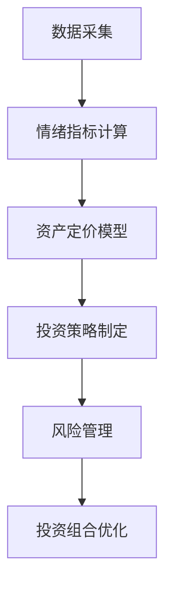

                 

# 罗伯特·席勒的行为金融学与价值投资

---

## 关键词
- 行为金融学
- 价值投资
- 投资者心理
- 资产定价
- 市场情绪

---

## 摘要
本文深入探讨了罗伯特·席勒的行为金融学理论及其与价值投资的结合。通过分析行为金融学的核心概念、算法原理、数学模型以及系统架构，结合实际项目实战和最佳实践，为投资者提供全面的理论支持和实践指导。文章旨在帮助读者理解如何将行为金融学的洞见应用于价值投资策略中，从而在复杂多变的市场环境中做出更明智的投资决策。

---

## 正文

### 第一部分：行为金融学与价值投资概述

#### 第1章：行为金融学的背景与核心概念

##### 1.1 行为金融学的起源与发展
- **1.1.1 传统金融学的局限性**
  - 传统金融学假设投资者是理性的，市场是有效的。
  - 但在现实中，市场常常出现非理性波动，传统模型无法解释。
- **1.1.2 行为金融学的兴起**
  - 20世纪80年代，行为金融学逐渐兴起，试图解释市场中的非理性行为。
  - 罗伯特·席勒是行为金融学的代表人物之一。
- **1.1.3 行为金融学的核心假设与研究方法**
  - 研究投资者心理和行为偏差。
  - 结合心理学、经济学和金融学的多学科方法。

##### 1.2 价值投资的基本概念
- **1.2.1 价值投资的定义与核心理念**
  - 价值投资：寻找市场价格低于内在价值的资产。
  - 核心理念：市场短期是投票器，长期是称重机。
- **1.2.2 价值投资与行为金融学的联系**
  - 价值投资关注长期基本面，行为金融学研究短期市场情绪。
  - 两者结合：理解市场情绪波动，避免非理性决策。
- **1.2.3 价值投资的基本原则与策略**
  - 长期投资，分散投资，避免追涨杀跌。

---

#### 第2章：行为金融学与传统金融学的对比

##### 2.1 传统金融学的核心假设
- **2.1.1 理性人假设**
  - 投资者是理性的，追求效用最大化。
  - 市场参与者能够正确评估资产价值。
- **2.1.2 市场有效假说**
  - 强有效市场：所有信息已反映在价格中。
  - 弱有效市场：价格反映可获得的信息。
- **2.1.3 CAPM模型与APT模型**
  - CAPM：资本资产定价模型，假设市场是理性的。
  - APT：套利定价理论，假设市场是有效的。

##### 2.2 行为金融学的修正与补充
- **2.2.1 行为偏差与非理性决策**
  - 过度自信、从众心理、损失厌恶等行为偏差。
- **2.2.2 市场情绪与投资者心理**
  - 市场情绪波动影响资产价格。
  - 投资者心理偏差导致市场泡沫与崩盘。
- **2.2.3 有限理性与认知偏差**
  - 人类认知有限，无法完全理性决策。

---

### 第二部分：行为金融学的核心理论与模型

#### 第3章：行为金融学的核心理论

##### 3.1 前景理论（Prospect Theory）
- **3.1.1 前景理论的基本框架**
  - 由Kahneman和Tversky提出。
  - 区分“获得”和“损失”两种情况。
- **3.1.2 概率加权与价值函数**
  - 概率加权：高概率事件权重增加，低概率事件权重减少。
  - 价值函数：损失的权重高于收益。
- **3.1.3 前景理论在投资决策中的应用**
  - 解释投资者对损失的厌恶和对收益的偏好。

##### 3.2 情绪周期理论（Momentum and Sentiment）
- **3.2.1 情绪周期的定义与特征**
  - 市场情绪周期：乐观→怀疑→悲观→乐观。
- **3.2.2 情绪周期与资产价格波动**
  - 情绪波动导致资产价格偏离内在价值。
  - 情绪指标：投资者情绪指数（如AAII）。
- **3.2.3 情绪指标的构建与应用**
  - 使用投资者情绪数据预测市场波动。

---

#### 第4章：价值投资的策略与实践

##### 4.1 价值投资的基本策略
- **4.1.1 低市盈率与高市净率策略**
  - 寻找市场价格低于内在价值的资产。
- **4.1.2 高股息率策略**
  - 投资高股息率股票，获取稳定收益。
- **4.1.3 企业基本面分析与估值**
  - 财务报表分析，DCF模型，市盈率、市净率等估值指标。

##### 4.2 行为金融学视角下的价值投资
- **4.2.1 行为偏差对价值投资的影响**
  - 避免追涨杀跌，坚持长期投资。
- **4.2.2 投资者心理与市场情绪的互动**
  - 理解市场情绪，避免非理性决策。
- **4.2.3 价值投资中的行为风险管理**
  - 管理情绪波动，保持投资纪律。

---

### 第三部分：行为金融学与价值投资的结合

#### 第5章：行为金融学与资产定价模型

##### 5.1 基于行为的资产定价模型
- **5.1.1 基于情绪的资产定价**
  - 情绪指标作为资产定价的因素。
- **5.1.2 基于认知偏差的定价模型**
  - 理解投资者认知偏差对价格的影响。
- **5.1.3 行为因素对资产收益的影响**
  - 情绪波动与资产收益的关系。

##### 5.2 行为金融学视角下的风险管理
- **5.2.1 风险偏好与行为偏差**
  - 风险厌恶与市场情绪。
- **5.2.2 行为风险管理策略**
  - 通过情绪指标调整投资组合。
- **5.2.3 风险定价与市场波动**
  - 理解市场波动中的行为因素。

---

#### 第6章：行为金融学与价值投资的结合

##### 6.1 行为金融学对价值投资的补充
- **6.1.1 行为偏差对价值投资的影响**
  - 价值投资者容易受到情绪影响。
- **6.1.2 投资者心理与市场情绪的互动**
  - 理解市场情绪，避免非理性决策。
- **6.1.3 价值投资中的行为风险管理**
  - 管理情绪波动，保持投资纪律。

---

### 第四部分：项目实战与最佳实践

#### 第7章：行为金融学与价值投资的系统架构

##### 7.1 系统架构设计
- **7.1.1 投资决策支持系统的功能模块**
  - 数据采集：市场数据、情绪数据。
  - 分析模块：情绪指标、基本面分析。
  - 策略制定：基于行为金融学的策略。

##### 7.2 系统架构的mermaid图

##### 7.3 项目实战
- **7.3.1 环境安装**
  - Python、Pandas、Matplotlib。
- **7.3.2 核心实现**
  - 情绪指标计算：使用投资者情绪数据。
  - 资产定价模型：基于情绪的资产定价。
- **7.3.3 案例分析**
  - 分析实际市场案例，验证模型的有效性。

---

## 结论

罗伯特·席勒的行为金融学为价值投资提供了新的视角。通过结合行为金融学与价值投资，投资者可以更好地理解市场情绪波动，避免非理性决策。未来，随着行为金融学的深入研究，价值投资将更加精准和科学。

---

## 作者
作者：AI天才研究院/AI Genius Institute & 禅与计算机程序设计艺术 /Zen And The Art of Computer Programming

---

希望这篇文章能为您提供有价值的信息和启发！如果需要进一步的分析或补充，请随时告知。

