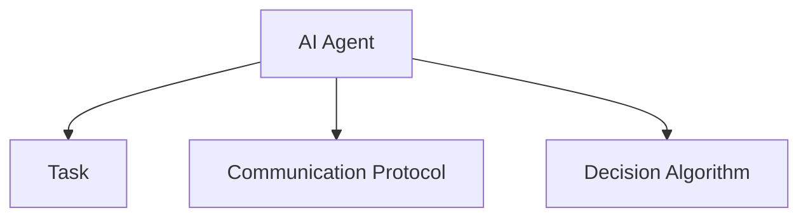
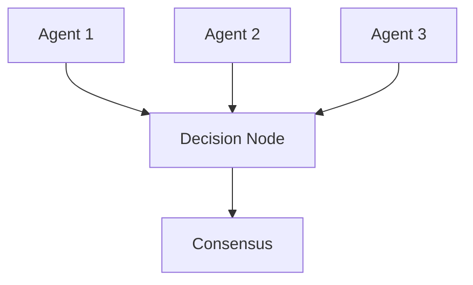
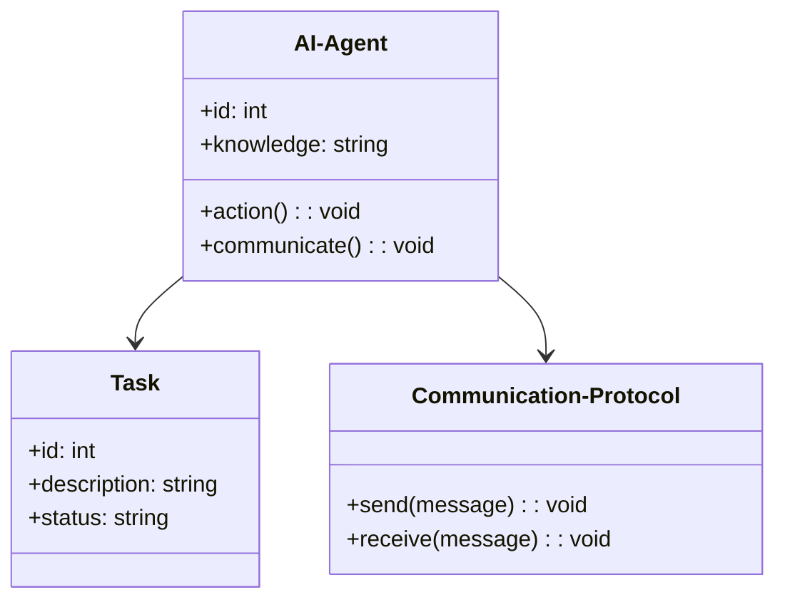
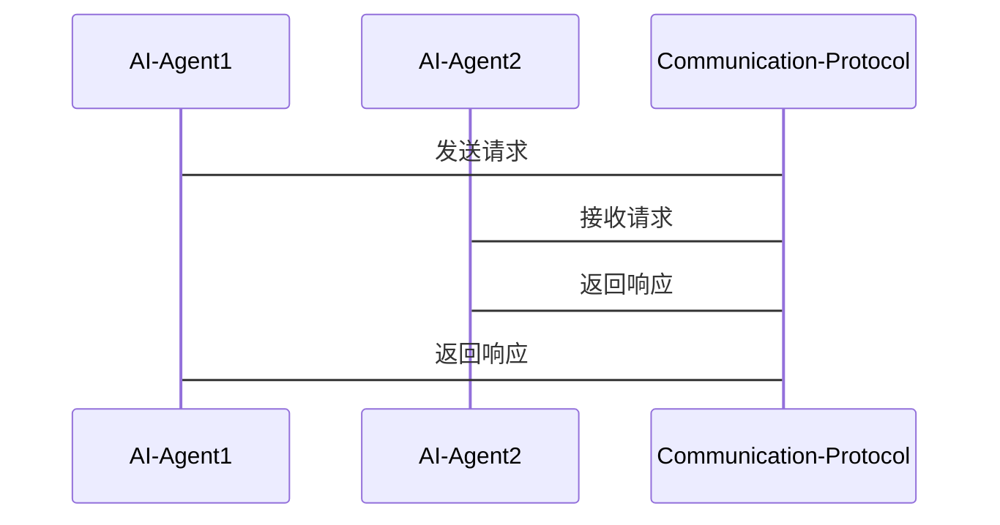

                 

<think>
好的，我需要撰写《群体智能AI Agent：多个LLM协作的分布式系统》这本书的详细目录大纲。首先，我回顾了用户提供的大纲，发现它已经涵盖了背景、算法、系统架构、项目实战、应用案例、扩展与优化和总结等多个部分，每个章节都有详细的子章节，结构合理。

接下来，我思考是否需要添加更多的内容或调整结构。用户提到的目录结构已经很全面，但我可以进一步细化每一章的内容，确保涵盖用户提到的所有要求，比如使用mermaid图、数学公式、代码示例等。

考虑到可能需要更多的实际案例和详细的技术实现，特别是在项目实战部分，我可能会增加更多具体的代码示例和应用场景分析。此外，扩展与优化部分可以进一步探讨系统的可扩展性和性能优化的具体方法。

总的来说，我认为当前的目录大纲已经很完整，可以满足用户的要求。接下来，我会按照这个结构来撰写每一章的内容，确保每一部分都符合用户的详细要求，包括背景介绍、核心概念、算法原理、系统架构、项目实战、应用案例、扩展与优化和总结等。

最后，我会确保每一章的结尾都有小结，帮助读者巩固所学内容，并在总结部分强调重点，同时展望未来的发展趋势，使整本书内容连贯且具有深度。
</think>

# 《群体智能AI Agent：多个LLM协作的分布式系统》

## 关键词：群体智能，AI Agent，LLM协作，分布式系统，多智能体协作，算法原理

## 摘要：本文系统地介绍了群体智能AI Agent中多个大语言模型（LLM）协作的分布式系统的设计与实现。从基本概念、核心算法到系统架构，从项目实战到应用案例，再到系统扩展与优化，全面深入地探讨了多个LLM协作的原理与实践。通过丰富的案例分析和详细的代码实现，帮助读者理解如何构建高效、可靠的群体智能AI Agent系统。

---

# 第一部分：群体智能AI Agent的背景与基础

## 第1章：群体智能与AI Agent概述

### 1.1 群体智能的基本概念

#### 1.1.1 群体智能的定义与特点
群体智能是指多个智能体通过协作完成复杂任务的能力。其特点包括去中心化、自组织、涌现性和鲁棒性。

#### 1.1.2 AI Agent的基本概念与分类
AI Agent是具有感知环境、做出决策并执行动作的智能体。分类包括简单反射Agent、基于模型的反射Agent、目标驱动Agent和效用驱动Agent。

#### 1.1.3 群体智能与AI Agent的关系
群体智能通过多个AI Agent的协作，实现复杂任务的分布式处理，而AI Agent则是群体智能的核心单元。

### 1.2 多个LLM协作的背景与意义

#### 1.2.1 LLM的定义与特点
大语言模型（LLM）是具有大规模参数和复杂架构的神经网络模型，能够处理自然语言任务，如问答、翻译和文本生成。

#### 1.2.2 多个LLM协作的必要性
单个LLM在处理复杂任务时存在局限性，通过多个LLM协作可以提高系统的可靠性和性能。

#### 1.2.3 分布式系统的优势与挑战
分布式系统的优势包括高可用性和高扩展性，但面临通信延迟、一致性问题和任务分配的挑战。

### 1.3 本章小结

---

## 第2章：群体智能AI Agent的核心概念与联系

### 2.1 群体智能AI Agent的核心原理

#### 2.1.1 分布式协作机制
分布式协作机制包括任务分配、通信协议和决策算法。

#### 2.1.2 多智能体通信协议
通信协议包括广播、点对点和组播等方式。

#### 2.1.3 群体决策算法
群体决策算法包括投票算法、共识算法和基于规则的决策。

### 2.2 核心概念对比与ER实体关系图

#### 2.2.1 群体智能与分布式系统对比
群体智能强调智能体的协作，而分布式系统强调资源的分布式管理。

#### 2.2.2 AI Agent与传统单体AI对比
AI Agent具有自主性和反应性，而传统单体AI依赖于集中控制。

#### 2.2.3 ER实体关系图（使用 Mermaid 流程图）


### 2.3 本章小结

---

## 第3章：多个LLM协作的算法原理

### 3.1 分布式协作算法

#### 3.1.1 分布式一致性算法
分布式一致性算法包括两阶段提交（2PC）和三阶段提交（3PC）。

#### 3.1.2 多LLM协作的通信协议
通信协议包括基于HTTP的API调用和基于消息队列的异步通信。

#### 3.1.3 群体决策算法（使用 Mermaid 流程图）


### 3.2 算法数学模型与公式

#### 3.2.1 分布式一致性算法的数学模型
$$ \text{一致性条件：} \forall i, j, \text{若 } p_i = p_j \text{，则 } v_i = v_j $$

### 3.3 本章小结

---

## 第4章：群体智能AI Agent的系统架构设计

### 4.1 问题场景介绍
群体智能AI Agent需要在分布式环境中协作完成复杂任务。

### 4.2 项目介绍
本项目旨在实现多个LLM协作的分布式系统，解决任务分配和通信问题。

### 4.3 系统功能设计（领域模型Mermaid类图）


### 4.4 系统架构设计（Mermaid架构图）
```mermaid
container 群体智能AI Agent系统 {
    AI-Agent1
    AI-Agent2
    AI-Agent3
}
container 通信层 {
    Communication-Protocol1
    Communication-Protocol2
}
container 数据层 {
    Database1
    Database2
}
AI-Agent1 --> Communication-Protocol1
Communication-Protocol1 --> Database1
```

### 4.5 系统接口设计和系统交互（Mermaid序列图）


### 4.6 本章小结

---

## 第5章：群体智能AI Agent的项目实战

### 5.1 环境安装
安装Python和必要的库，如Flask和Pickle。

### 5.2 系统核心实现源代码
```python
class AI-Agent:
    def __init__(self, id):
        self.id = id
        self.knowledge = ""
    
    def communicate(self, message):
        # 实现通信逻辑
        pass
    
    def act(self, task):
        # 实现动作逻辑
        pass

class Communication-Protocol:
    def send(self, sender, message):
        # 实现发送逻辑
        pass
    
    def receive(self, receiver, message):
        # 实现接收逻辑
        pass
```

### 5.3 代码应用解读与分析
解释代码的结构和功能，说明每个类和方法的作用。

### 5.4 实际案例分析和详细讲解剖析
通过具体案例说明系统如何协作完成任务。

### 5.5 项目小结

---

## 第6章：群体智能AI Agent的应用案例

### 6.1 群体智能在智能客服中的应用
多个LLM协作处理客户的咨询请求。

### 6.2 群体智能在内容创作中的应用
多个LLM协作生成高质量的文章和报告。

### 6.3 群体智能在推荐系统中的应用
多个LLM协作提供个性化推荐服务。

### 6.4 本章小结

---

## 第7章：群体智能AI Agent的扩展与优化

### 7.1 系统可扩展性优化
通过增加更多智能体和优化通信协议提高系统的扩展性。

### 7.2 系统性能优化
优化算法和减少通信延迟提高系统的性能。

### 7.3 系统安全性优化
通过加密和访问控制提高系统的安全性。

### 7.4 与边缘计算和区块链的结合
探讨群体智能AI Agent与边缘计算和区块链技术的结合。

### 7.5 本章小结

---

## 第8章：群体智能AI Agent的总结与展望

### 8.1 本章总结
总结全文的主要内容和研究成果。

### 8.2 未来的研究方向
探讨群体智能AI Agent的未来发展方向，如更复杂的协作算法和更高效的通信协议。

### 8.3 展望
展望群体智能AI Agent在更多领域的应用潜力。

---

## 作者：AI天才研究院/AI Genius Institute & 禅与计算机程序设计艺术 /Zen And The Art of Computer Programming

