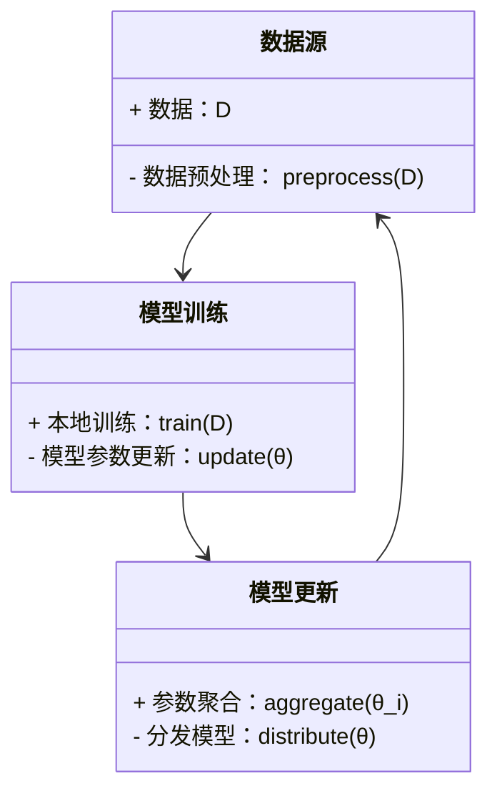
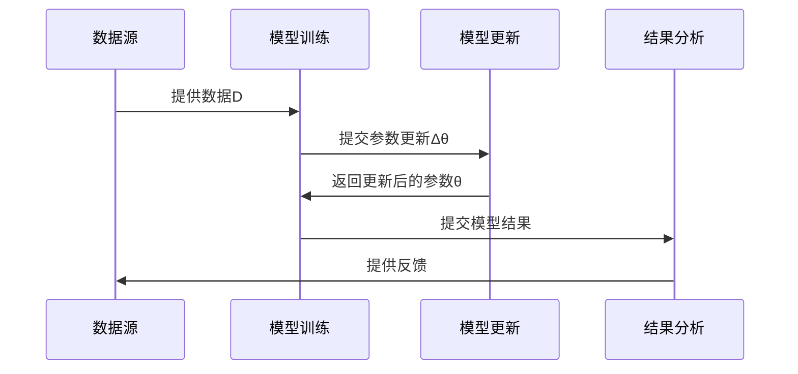

                 


# 联邦学习在AI Agent隐私保护中的高级应用

> 关键词：联邦学习, AI Agent, 隐私保护, 分布式机器学习, 安全多方计算

> 摘要：本文深入探讨联邦学习在AI Agent中的隐私保护应用，结合理论与实践，分析其核心原理、算法实现、系统架构及项目案例，为AI Agent的安全发展提供参考。

---

## 第一部分：背景介绍

### 第1章：联邦学习与AI Agent概述

#### 1.1 联邦学习的基本概念

联邦学习（Federated Learning）是一种分布式机器学习技术，允许多个参与者在不共享原始数据的情况下共同训练模型。其核心在于数据不出域，模型在各端进行训练，并通过通信协议将模型参数汇总到中心服务器或协调者，更新全局模型。与传统集中式机器学习不同，联邦学习通过保护数据隐私和本地化计算，确保数据安全。

#### 1.2 AI Agent的概念与应用场景

AI Agent（人工智能代理）是一种能够感知环境、自主决策并执行任务的智能实体。AI Agent广泛应用于推荐系统、自然语言处理、自动驾驶等领域。在这些场景中，AI Agent需要处理大量敏感数据，如用户行为数据、位置信息等。然而，这些数据的收集和处理可能涉及隐私泄露风险，因此隐私保护成为AI Agent设计中的重要挑战。

#### 1.3 隐私保护的重要性

在AI Agent中，隐私保护不仅是用户数据安全的需求，也是法律法规的要求。随着数据泄露事件的频发，数据隐私保护已成为全球关注的焦点。联邦学习通过在数据源端进行模型训练，避免了数据集中存储和传输，从而有效保护了数据隐私。

---

## 第二部分：核心概念与联系

### 第2章：联邦学习的核心原理

#### 2.1 数据安全与隐私保护

在联邦学习中，数据安全是通过多种技术手段实现的。首先，数据加密技术可以确保数据在传输过程中的安全性，如使用加密协议对数据进行加密传输，防止数据被截获或篡改。其次，安全多方计算（SMPC）技术允许多个参与方在不共享数据的情况下进行联合计算，确保数据隐私。

#### 2.2 联邦学习的通信协议

联邦学习的通信协议主要用于模型参数的同步和更新。常见的通信协议包括基于加密的通信协议和基于区块链的通信协议。基于加密的通信协议通过加密技术确保数据传输的安全性；而基于区块链的通信协议则通过区块链的不可篡改性保证通信过程的透明和可信。

#### 2.3 模型更新机制

模型更新机制是联邦学习的核心部分。在每个训练周期中，各个参与方使用本地数据训练模型，并将模型参数更新量发送给中心服务器。中心服务器将所有参与方的参数更新量进行聚合，得到全局模型的更新参数，并将更新后的模型参数分发给所有参与方。这种机制确保了模型的准确性和数据隐私的保护。

### 第3章：AI Agent与联邦学习的结合

#### 3.1 联邦学习在AI Agent中的应用

在AI Agent中，联邦学习可以应用于智能推荐系统和自然语言处理等领域。例如，在智能推荐系统中，多个用户的本地设备可以在不共享用户数据的情况下，联合训练推荐模型，从而提高推荐的准确性和个性化。在自然语言处理中，多个机构可以在不共享本地文本数据的情况下，联合训练语言模型，提高模型的性能。

#### 3.2 联邦学习与传统分布式学习的对比

与传统分布式学习相比，联邦学习在数据隐私保护方面具有明显优势。传统分布式学习通常需要将数据集中存储在多个节点上，数据仍然存在被攻击的风险。而联邦学习通过在数据源端进行模型训练，避免了数据的集中存储和传输，从而有效保护了数据隐私。

---

## 第三部分：算法原理讲解

### 第4章：联邦学习算法的数学模型

#### 4.1 模型更新的数学推导

在联邦学习中，模型更新的过程可以通过数学公式进行描述。假设我们有一个全局模型参数$\theta$，各个参与方的本地模型参数为$\theta_i$。每个参与方在本地数据上训练模型，得到参数更新量$\Delta\theta_i$。中心服务器将所有参与方的参数更新量进行聚合，得到全局模型的更新参数$\Delta\theta = \sum_i \Delta\theta_i$，并将其分发给所有参与方，更新各自的本地模型参数。

$$
\theta_{\text{new}} = \theta + \Delta\theta
$$

#### 4.2 安全多方计算的算法实现

安全多方计算是一种在不泄露各方数据的前提下，共同计算结果的技术。其核心在于通过加密技术和协议设计，确保计算过程中的数据隐私。例如，在安全多方计算中，各方可以通过秘密分享的方式，将数据分割成多个部分，分别进行计算，最终汇总得到结果。

### 第5章：基于区块链的联邦学习算法

#### 5.1 区块链技术的引入

区块链技术通过去中心化和不可篡改性，为联邦学习提供了更高的安全性和透明性。在基于区块链的联邦学习中，模型更新的过程可以通过区块链进行记录和验证，确保模型更新的合法性和可信度。

#### 5.2 区块链与联邦学习的结合

在基于区块链的联邦学习中，每个参与方的模型更新操作都会被记录在区块链上，形成一个不可篡改的记录。中心服务器可以通过验证区块链上的记录，确保模型更新的合法性和一致性。

---

## 第四部分：系统分析与架构设计方案

### 第6章：系统功能设计

#### 6.1 领域模型

在AI Agent的联邦学习系统中，领域模型需要涵盖数据源、模型训练、模型更新和结果分析等功能。通过Mermaid类图可以清晰展示系统的各个模块及其关系。



#### 6.2 系统架构

系统的架构设计需要考虑数据的安全性和系统的可扩展性。通过Mermaid架构图可以展示系统的整体结构和模块之间的关系。


#### 6.3 系统交互

系统的交互过程可以通过Mermaid序列图进行描述，展示各个模块之间的协作和数据流。



---

## 第五部分：项目实战

### 第7章：环境安装与系统实现

#### 7.1 环境安装

在实现联邦学习系统之前，需要安装必要的软件和库，例如Python、TensorFlow、Flask等。以下是安装命令：

```bash
pip install numpy
pip install tensorflow
pip install flask
```

#### 7.2 核心代码实现

以下是联邦学习系统的核心代码示例，展示了模型训练和参数更新的过程。

```python
import numpy as np
import tensorflow as tf

# 初始化模型
model = tf.keras.Sequential([
    tf.keras.layers.Dense(64, activation='relu'),
    tf.keras.layers.Dense(10, activation='softmax')
])
model.compile(optimizer='adam', loss='sparse_categorical_crossentropy', metrics=['accuracy'])

# 模型训练
def train_model(model, x, y):
    model.fit(x, y, epochs=10, batch_size=32, verbose=0)
    return model.get_weights()

# 模型更新
def aggregate_weights(weights_list):
    total_weights = [np.zeros_like(w) for w in weights_list[0]]
    for w in weights_list:
        for i in range(len(total_weights)):
            total_weights[i] += w[i]
    total_weights = [w / len(weights_list) for w in total_weights]
    return total_weights

# 模型分发
def distribute_model(model, weights):
    model.set_weights(weights)
    return model
```

### 第8章：实际案例分析

#### 8.1 案例介绍

假设我们有一个智能推荐系统，多个用户的本地设备需要联合训练推荐模型。每个用户的本地设备运行上述代码，通过联邦学习进行模型训练，最终得到一个全局推荐模型。

#### 8.2 代码解读与分析

在上述代码中，模型训练函数`train_model`使用本地数据训练模型，并返回模型权重。模型更新函数`aggregate_weights`将所有参与方的模型权重进行聚合，得到全局模型的权重。模型分发函数`distribute_model`将全局模型权重分发给所有参与方，更新各自的本地模型。

#### 8.3 项目总结

通过该项目，我们验证了联邦学习在AI Agent中的应用可行性，成功实现了在不共享数据的情况下，联合训练推荐模型，保护了用户数据隐私。

---

## 第六部分：最佳实践与注意事项

### 第9章：最佳实践

在实际应用中，需要注意以下几点：

1. **数据预处理**：确保数据的格式和规范一致，避免因数据格式问题导致模型训练失败。
2. **模型选择**：根据具体场景选择合适的模型结构和参数，确保模型的准确性和训练效率。
3. **通信协议设计**：合理设计通信协议，确保模型参数的高效传输和聚合。

### 第10章：小结与注意事项

通过本文的详细讲解和案例分析，我们可以看到联邦学习在AI Agent中的巨大潜力。在实际应用中，需要综合考虑数据隐私、模型性能和系统可扩展性，确保系统的安全性和高效性。

### 第11章：扩展阅读

建议读者进一步阅读以下资料，深入了解联邦学习和AI Agent的相关技术：

- [《联邦学习：隐私保护下的分布式机器学习》](#)
- [《AI Agent：智能代理的设计与实现》](#)

---

## 作者

作者：AI天才研究院/AI Genius Institute & 禅与计算机程序设计艺术 /Zen And The Art of Computer Programming

---

**感谢您的阅读！如需进一步探讨或获取更多资源，请随时联系。**

