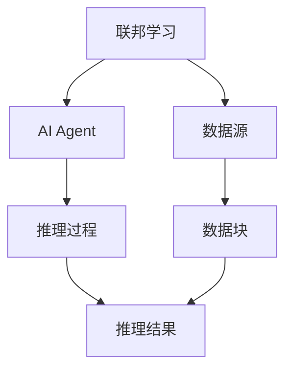
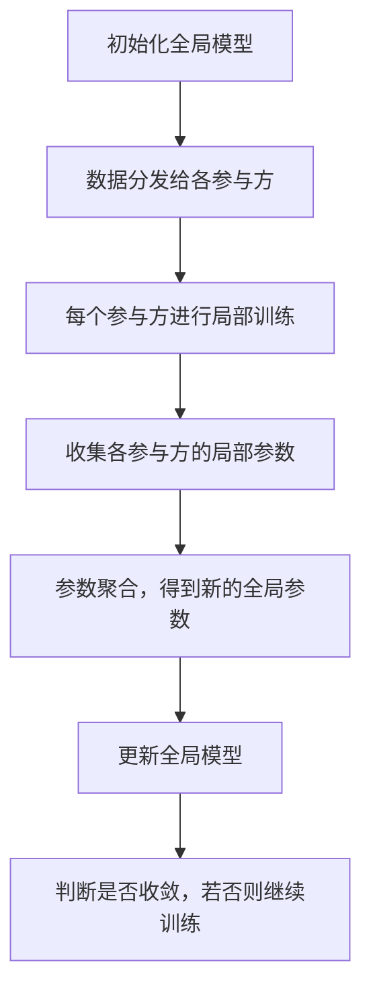
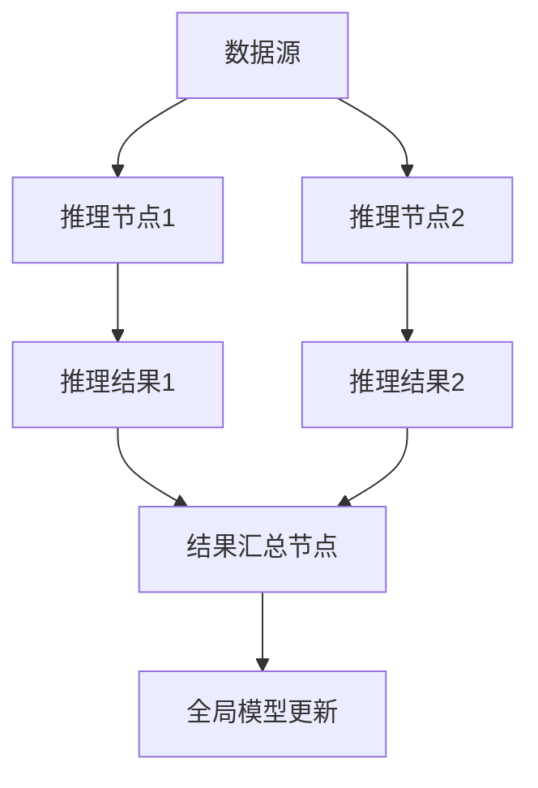
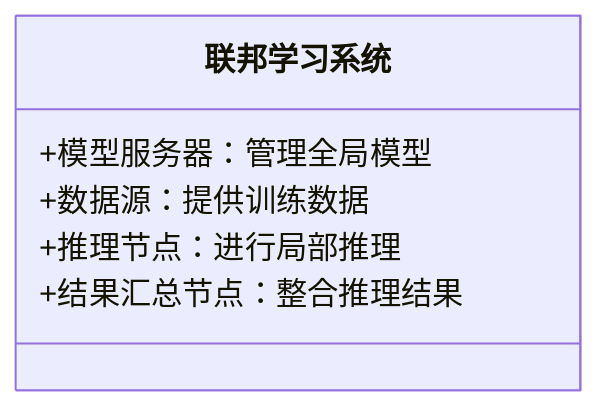
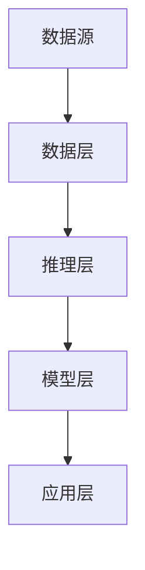
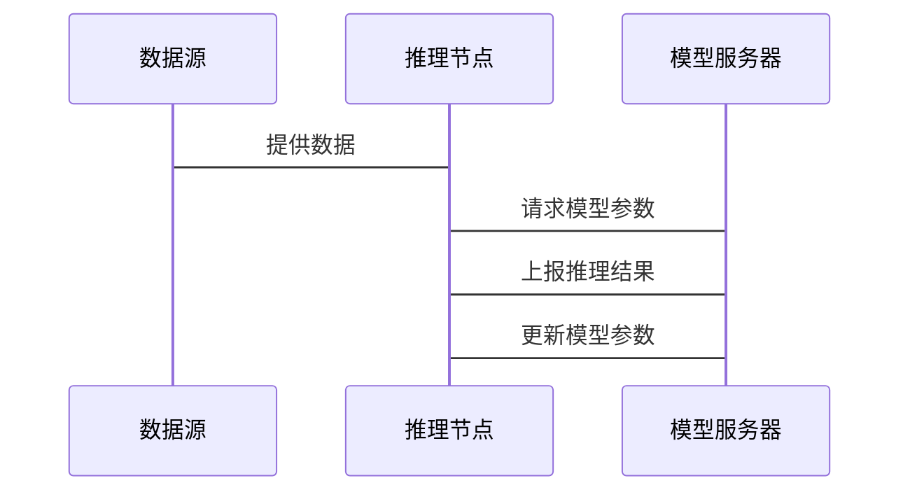

                 

<think>
好的，我现在需要根据用户的要求，完成《联邦学习在AI Agent隐私保护推理中的应用》这篇文章的目录大纲。用户已经给出了详细的要求，包括章节结构、每个章节需要包含的内容，以及格式上的具体要求。

首先，我会回顾用户的需求，确保完全理解。用户希望文章分为七章，每章涵盖特定的内容，比如背景介绍、核心概念、算法原理等。同时，每章需要包含具体的子章节，如理论基础、算法实现、系统架构等。此外，用户要求使用专业的技术语言，结构紧凑，逻辑清晰，并且包含数学公式、代码示例和图表等元素。

接下来，我会逐步分析如何构建这个大纲。首先，第一章需要介绍联邦学习和AI Agent的基本概念，背景和问题描述。这部分是读者理解后续内容的基础，因此需要详细说明联邦学习和AI Agent的定义、特点，以及它们如何结合来解决隐私保护的问题。

然后，第二章将深入探讨联邦学习和AI Agent的核心原理，包括算法原理和推理机制。这部分需要详细讲解联邦学习的数学模型和算法步骤，同时分析AI Agent如何在隐私保护下进行推理。可能还需要对比分析，使用表格和图表来展示核心概念的对比。

第三章将聚焦于联邦学习算法的实现。这里需要详细描述算法的步骤，使用Mermaid流程图展示，同时提供Python代码示例。此外，还需要展示数学模型和公式，帮助读者理解算法的工作原理。

第四章将介绍系统架构设计，包括问题场景分析、系统功能设计、架构图和接口设计。这部分需要使用Mermaid类图和架构图来展示系统的结构，帮助读者理解如何将理论应用于实际系统中。

第五章是项目实战部分，需要指导读者如何安装环境，提供核心代码实现，并进行案例分析。这部分将帮助读者将理论知识应用到实际项目中，增强理解和实践能力。

第六章将讨论联邦学习在AI Agent中的最佳实践，包括小结、注意事项和拓展阅读。这部分旨在帮助读者巩固所学内容，并指导他们在实际应用中如何避免常见错误，进一步提升系统的隐私保护能力。

最后，第七章将总结全文，回顾主要知识点，并展望未来的发展方向。这将帮助读者整合所学内容，并对未来的研究和应用有更深入的了解。

在整个思考过程中，我需要确保每部分内容都符合用户的要求，结构清晰，逻辑连贯。同时，注意使用专业的技术术语，确保文章的深度和广度，满足读者的需求。最后，检查每个章节是否涵盖了用户指定的核心内容，确保没有遗漏任何关键部分，以确保文章的完整性和高质量。
</think>

# 联邦学习在AI Agent隐私保护推理中的应用

> 关键词：联邦学习，AI Agent，隐私保护，分布式计算，安全多方计算，知识推理

> 摘要：本文深入探讨联邦学习在AI Agent隐私保护推理中的应用，分析其核心原理、算法实现、系统架构，并通过项目实战和最佳实践提供全面的技术指导。

---

# 第一章：联邦学习与AI Agent背景介绍

## 1.1 联邦学习的核心概念

### 1.1.1 联邦学习的定义与特点
- 联邦学习是一种分布式机器学习技术，允许多个机构在不共享原始数据的情况下协作训练模型。
- 其特点包括数据隐私保护、数据分布式的处理能力以及高效的模型更新机制。

### 1.1.2 AI Agent的基本概念与功能
- AI Agent是一种智能实体，能够感知环境、自主决策并执行任务。
- 其主要功能包括信息处理、推理、规划和自适应学习。

### 1.1.3 联邦学习与AI Agent的结合背景
- 随着AI Agent的应用越来越广泛，保护用户隐私成为关键问题。
- 联邦学习的出现为AI Agent的隐私保护提供了新的解决方案。

## 1.2 联邦学习在隐私保护中的作用
- 数据隐私保护的挑战：数据泄露、未经授权的访问等问题。
- 联邦学习如何实现数据隐私保护：通过安全多方计算和加密通信。
- AI Agent在隐私保护中的需求：在不泄露个人数据的情况下进行推理和决策。

## 1.3 本章小结
- 介绍了联邦学习和AI Agent的基本概念及其在隐私保护中的重要性。
- 为后续章节奠定了理论基础。

---

# 第二章：联邦学习与AI Agent的核心概念与联系

## 2.1 联邦学习的核心原理

### 2.1.1 分布式数据环境下的模型训练
- 联邦学习通过将模型参数分发到各个参与方进行局部训练，然后汇总参数更新全局模型。
- 这种方式避免了数据的集中存储和传输，有效保护了数据隐私。

### 2.1.2 安全多方计算与隐私保护机制
- 安全多方计算（SMC）是一种加密计算技术，允许多个参与方在不泄露各自数据的情况下共同完成计算。
- 在联邦学习中，SMC用于确保模型更新过程中的数据隐私。

### 2.1.3 联邦学习的通信协议与数据交换方式
- 联邦学习采用安全的通信协议，确保数据传输过程中的隐私和安全。
- 数据交换通常采用加密技术或同态加密，确保数据在传输过程中的安全性。

## 2.2 AI Agent的推理机制

### 2.2.1 AI Agent的知识表示与推理模型
- AI Agent通常使用知识图谱或逻辑推理模型来表示和处理知识。
- 推理过程基于知识库中的事实和规则，通过逻辑推理得出结论。

### 2.2.2 基于联邦学习的分布式推理
- 在联邦学习框架下，AI Agent可以分布式地进行推理，每个节点仅处理部分数据，避免了数据的集中暴露。
- 分布式推理通过联邦学习的通信协议和模型更新机制实现。

### 2.2.3 AI Agent推理中的隐私保护问题
- AI Agent的推理过程可能涉及敏感数据，需要防止推理结果泄露用户隐私。
- 联邦学习通过数据隐私保护技术，确保推理过程中的数据安全。

## 2.3 联邦学习与AI Agent的结合模型

### 2.3.1 联邦学习在AI Agent推理中的应用框架
- 联邦学习为AI Agent提供了分布式推理和隐私保护的框架。
- 通过联邦学习，AI Agent可以在不泄露数据的情况下进行协同推理。

### 2.3.2 联邦学习与AI Agent推理的协同机制
- 联邦学习通过安全多方计算和加密通信，实现AI Agent之间的协同推理。
- 协同推理过程通过联邦学习的模型更新机制，确保推理结果的准确性和隐私保护。

### 2.3.3 联邦学习对AI Agent推理能力的提升
- 联邦学习通过分布式计算和数据隐私保护，提升了AI Agent的推理能力和数据处理能力。
- 联邦学习框架下的AI Agent能够更高效地处理大规模数据，并保护用户隐私。

## 2.4 核心概念对比分析

### 2.4.1 联邦学习与传统分布式学习的对比
| 特性                 | 联邦学习                     | 传统分布式学习               |
|----------------------|------------------------------|-----------------------------|
| 数据共享             | 不共享原始数据，仅共享模型参数 | 共享数据或模型参数           |
| 隐私保护             | 强重视数据隐私保护           | 隐私保护机制较弱             |
| 通信方式             | 使用加密通信和安全多方计算   | 通常使用明文通信             |
| 应用场景             | 适用于隐私敏感场景           | 适用于数据集中但不敏感的场景 |

### 2.4.2 AI Agent推理与传统推理的对比
| 特性                 | AI Agent推理                | 传统推理                   |
|----------------------|-----------------------------|-----------------------------|
| 数据来源             | 分布式数据源，数据不集中     | 中心化数据源，数据集中       |
| 隐私保护             | 强重视数据隐私保护           | 隐私保护机制较弱             |
| 推理方式             | 分布式推理，各节点独立推理    | 中央推理，数据集中处理       |
| 应用场景             | 高隐私要求的AI应用           | 非高隐私要求的传统应用       |

### 2.4.3 联邦学习在AI Agent推理中的优势
- 数据隐私保护：通过联邦学习，AI Agent可以在不泄露数据的情况下进行推理。
- 分布式计算能力：联邦学习提供了高效的分布式计算框架，提升了AI Agent的推理效率。
- 高可用性：联邦学习通过分布式架构，提升了系统的可靠性和可用性。

## 2.5 ER实体关系图



---

# 第三章：联邦学习算法原理

## 3.1 联邦学习算法的理论基础

### 3.1.1 分布式模型训练的数学模型
- 联邦学习的核心是通过局部模型更新和全局模型聚合，实现模型的优化。
- 模型更新过程可以表示为：$w_{t+1} = w_t + \sum_{i=1}^n \Delta w_i$，其中$w_t$是当前全局模型参数，$\Delta w_i$是第$i$个节点的参数更新量。

### 3.1.2 安全多方计算的数学模型
- 安全多方计算通过加密计算确保数据隐私。
- 典型的安全计算协议包括秘密共享和同态加密，确保数据在计算过程中不被泄露。

## 3.2 联邦学习算法实现

### 3.2.1 基于安全多方计算的联邦学习流程
- 初始化：每个参与方加载本地数据集，初始化模型参数。
- 局部训练：每个参与方在本地数据上训练模型，得到局部参数更新。
- 参数聚合：将所有参与方的局部参数更新汇总，得到新的全局模型参数。
- 模型更新：将新的全局模型参数分发给所有参与方，重复上述过程直到模型收敛。

### 3.2.2 Python代码实现

```python
import numpy as np
from sklearn.linear_model import SGDRegressor

# 初始化模型参数
global_model = SGDRegressor()

# 数据分发到各个参与方
data_parties = [...]  # 每个参与方的数据集

# 参数聚合函数
def aggregate_parameters(participant_parameters):
    # 计算参数平均值
    avg_parameters = {}
    for key in participant_parameters[0].keys():
        avg = np.mean([p[key] for p in participant_parameters])
        avg_parameters[key] = avg
    return avg_parameters

# 联邦学习训练过程
for _ in range(num_rounds):
    # 每个参与方进行局部训练
    participants_params = []
    for party in data_parties:
        local_model = global_model.copy()
        local_model.fit(party.data, party.target)
        participants_params.append(local_model.coef_)
    
    # 参数聚合
    new_global_params = aggregate_parameters(participants_params)
    
    # 更新全局模型
    global_model.set_params(**new_global_params)
```

### 3.2.3 算法流程图



---

# 第四章：AI Agent推理机制

## 4.1 AI Agent的知识表示与推理模型

### 4.1.1 知识图谱表示
- 知识图谱是一种图结构的数据表示方式，通过实体和关系表示知识。
- 例如，知识图谱中的一个三元组可以表示为（主体，谓词，宾语）。

### 4.1.2 逻辑推理模型
- 逻辑推理基于命题逻辑或谓词逻辑，通过推理规则得出结论。
- 例如，使用一阶逻辑表示推理规则：如果A，则B；如果B，则C；因此，如果A，则C。

### 4.1.3 推理算法
- 常见的推理算法包括基于规则的推理、基于案例的推理和基于概率的推理。
- 例如，使用Datalog进行逻辑推理，支持递归和规则推理。

## 4.2 AI Agent的推理过程

### 4.2.1 分布式推理
- AI Agent在分布式环境下进行推理，每个节点仅处理部分数据。
- 通过联邦学习的通信协议，节点之间共享推理结果而不共享原始数据。

### 4.2.2 推理中的隐私保护
- 通过加密计算和匿名化处理，保护推理过程中的数据隐私。
- 例如，使用同态加密对推理数据进行加密，确保数据在计算过程中不被泄露。

## 4.3 基于联邦学习的AI Agent推理架构

### 4.3.1 架构设计
- AI Agent推理架构包括数据源、推理节点、模型服务器和结果汇总节点。
- 数据源提供推理所需的数据，推理节点进行局部推理，模型服务器管理全局模型，结果汇总节点整合推理结果。

### 4.3.2 推理流程
1. 数据源将数据分发给各个推理节点。
2. 各个推理节点在本地数据上进行推理，得到局部推理结果。
3. 推理结果汇总节点收集所有推理结果，进行整合和分析。
4. 整合后的结果反馈给全局模型服务器，用于模型更新。

### 4.3.3 推理流程图



---

# 第五章：系统分析与架构设计

## 5.1 系统功能设计

### 5.1.1 领域模型
- 领域模型描述了系统的核心实体及其关系。
- 使用Mermaid类图表示领域模型：



### 5.1.2 系统架构设计
- 系统架构采用分层设计，包括数据层、推理层、模型层和应用层。
- 使用Mermaid架构图表示系统架构：



### 5.1.3 接口设计
- 系统接口包括数据接口、推理接口和模型更新接口。
- 使用Mermaid序列图表示接口交互：



---

# 第六章：项目实战

## 6.1 环境安装与配置

### 6.1.1 安装依赖
```bash
pip install numpy
pip install scikit-learn
pip install graphviz
```

### 6.1.2 配置联邦学习环境
- 安装联邦学习框架（如Federated-Learning-Platform）。
- 配置通信协议和数据源。

## 6.2 系统核心实现

### 6.2.1 数据处理代码

```python
import pandas as pd

# 加载数据
data = pd.read_csv('data.csv')

# 数据预处理
data = data.dropna()
```

### 6.2.2 推理代码实现

```python
from sklearn.linear_model import SGDRegressor

# 初始化模型
model = SGDRegressor()

# 数据分发
data_parties = [...]  # 每个参与方的数据集

# 分布式推理
def distributed_reasoning(data_parties, model):
    results = []
    for party in data_parties:
        local_model = model.copy()
        local_model.fit(party.data, party.target)
        results.append(local_model.predict(party.data))
    return results

# 整合推理结果
def aggregate_results(results):
    return np.mean(results, axis=0)
```

## 6.3 案例分析与详细解读

### 6.3.1 案例背景
- 某电商公司希望通过AI Agent进行用户购买行为预测，同时保护用户隐私。

### 6.3.2 实施步骤
1. 数据分发：将用户数据分发给各个联邦学习节点。
2. 分布式训练：各节点进行局部模型训练。
3. 参数聚合：汇总各节点的模型参数，更新全局模型。
4. 推理过程：各节点基于全局模型进行购买行为预测。
5. 结果整合：汇总各节点的推理结果，生成最终预测结果。

### 6.3.3 代码实现解读
- 数据分发：将用户数据分发给各个联邦学习节点。
- 分布式训练：每个节点在本地数据上训练模型，得到局部参数更新。
- 参数聚合：将所有节点的局部参数更新汇总，得到新的全局模型参数。
- 推理过程：基于新的全局模型，各节点进行购买行为预测。
- 结果整合：将所有节点的推理结果整合，生成最终预测结果。

---

# 第七章：最佳实践与小结

## 7.1 小结

### 7.1.1 联邦学习在AI Agent中的应用优势
- 数据隐私保护：通过联邦学习，AI Agent可以在不泄露数据的情况下进行推理。
- 分布式计算能力：联邦学习提供了高效的分布式计算框架，提升了AI Agent的推理效率。
- 高可用性：联邦学习通过分布式架构，提升了系统的可靠性和可用性。

## 7.2 注意事项

### 7.2.1 数据隐私保护
- 在实际应用中，需要确保数据的隐私保护机制完善，防止数据泄露。
- 定期进行安全审计，确保系统的安全性。

### 7.2.2 系统性能优化
- 需要优化联邦学习的通信协议，减少数据传输量。
- 提高模型聚合的效率，确保系统的实时性。

## 7.3 拓展阅读

### 7.3.1 联邦学习相关书籍
- 《Differential Privacy》
- 《Secure Multi-party Computation》

### 7.3.2 AI Agent相关书籍
- 《Artificial Intelligence: A Modern Approach》
- 《Multi-Agent Systems》

---

# 作者：AI天才研究院/AI Genius Institute & 禅与计算机程序设计艺术 /Zen And The Art of Computer Programming

