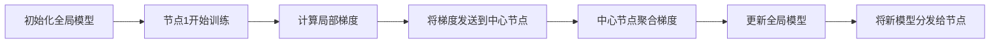
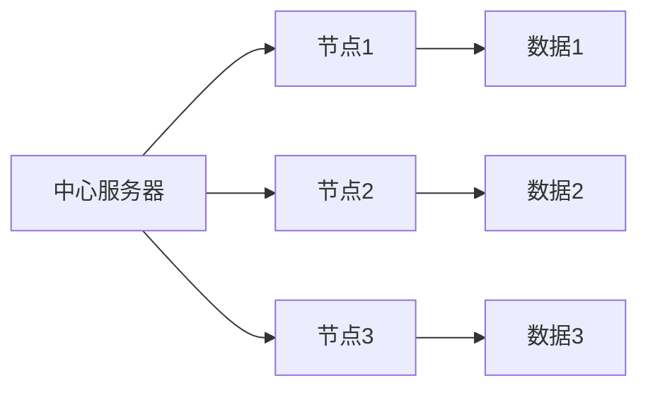

                 


# 联邦学习在分布式AI Agent训练中的应用

---

## 关键词

- 分布式AI Agent
- 联邦学习
- 模型训练
- 数据隐私
- 通信协议

---

## 摘要

随着人工智能技术的快速发展，分布式AI Agent系统在各个领域得到了广泛应用。然而，在分布式环境下进行AI Agent的训练面临着数据隐私、通信成本和模型同步等多方面的挑战。联邦学习作为一种新兴的分布式机器学习方法，通过在分布式节点上进行模型训练，同时保护数据隐私，为分布式AI Agent的训练提供了新的解决方案。本文将从联邦学习的基本概念、算法原理、系统架构到实际应用进行深入探讨，分析其在分布式AI Agent训练中的优势与挑战，并结合实际案例，展示如何通过联邦学习实现高效的分布式AI Agent训练。

---

## 正文

### 第一部分：分布式AI Agent与联邦学习概述

#### 第1章：分布式AI Agent的背景与概念

##### 1.1 分布式AI Agent的背景

随着人工智能技术的快速发展，AI Agent（智能体）已经广泛应用于各个领域，包括自动驾驶、智能推荐、机器人控制等。然而，随着应用规模的扩大，单点集中式AI Agent的训练模式逐渐暴露出一些问题，例如数据隐私泄露风险、计算资源消耗过大以及通信延迟等问题。特别是在分布式场景下，多个AI Agent需要协同工作，如何高效地进行模型训练成为了一个新的挑战。

##### 1.2 分布式AI Agent的定义与特点

分布式AI Agent是指在分布式系统中运行的多个智能体，每个智能体负责特定的任务或区域，并通过某种方式协同完成全局目标。分布式AI Agent的特点包括：

1. **去中心化**：分布式AI Agent通常没有中心化的控制节点，每个智能体独立运行并协作。
2. **数据隐私**：每个智能体可能拥有自己的数据，需要保护数据不被其他节点访问。
3. **通信效率**：在分布式环境下，AI Agent之间的通信成本可能较高，需要设计高效的通信协议。
4. **模型同步**：多个智能体需要协同训练一个共享的模型，同时保持各自的独立性。

##### 1.3 分布式AI Agent的应用场景

分布式AI Agent的应用场景包括：

1. **多智能体协作**：例如自动驾驶中的多辆汽车协同决策。
2. **分布式推荐系统**：在多个节点上进行个性化推荐。
3. **边缘计算**：在边缘设备上运行AI Agent，进行实时推理和训练。

#### 第2章：联邦学习的背景与概念

##### 2.1 联邦学习的背景

联邦学习（Federated Learning）是一种新兴的分布式机器学习方法，旨在在不将数据集中到一个中心位置的情况下，通过分布式节点协作训练一个全局模型。联邦学习的核心思想是让每个节点在本地数据上训练模型，并通过某种通信机制将模型参数同步到全局模型中。

##### 2.2 联邦学习的定义与特点

联邦学习的定义是：在多个分布式节点上，通过局部模型训练和参数同步，共同优化一个全局模型，同时保护数据隐私。其特点包括：

1. **数据隐私保护**：联邦学习通过在本地训练模型，避免了数据的直接传输，保护了数据隐私。
2. **去中心化训练**：每个节点独立进行训练，减少对中心化服务器的依赖。
3. **高效通信**：通过设计高效的通信协议，降低模型同步的开销。

##### 2.3 联邦学习与分布式AI Agent的关系

联邦学习为分布式AI Agent的训练提供了一种新的思路。通过联邦学习，多个AI Agent可以在不共享原始数据的情况下，协同训练一个全局模型，同时保持各自的独立性和隐私性。这种模式不仅解决了数据隐私问题，还提高了训练效率，降低了通信成本。

---

### 第二部分：联邦学习的核心概念与算法原理

#### 第3章：联邦学习的核心概念

##### 3.1 数据分布与模型同步

在联邦学习中，数据通常分布在网络中的多个节点上，每个节点拥有自己的数据集。模型同步是指将各个节点的局部模型参数聚合到一个全局模型中。常见的模型同步方法包括联邦平均（FedAvg）和联邦加权平均（FedWeightedAvg）。

##### 3.2 联邦学习的通信协议

通信协议是联邦学习中节点之间交互的规则。常见的通信协议包括：

1. **同步通信**：所有节点同时进行模型训练和同步。
2. **异步通信**：节点可以异步地进行模型训练和同步，减少通信开销。

##### 3.3 模型更新机制

模型更新机制决定了如何将各个节点的局部模型参数聚合到全局模型中。常见的模型更新机制包括：

1. **参数平均**：将各个节点的模型参数平均得到全局模型。
2. **加权平均**：根据节点的贡献大小进行加权平均。

##### 3.4 数据隐私保护

联邦学习通过在本地训练模型，避免了原始数据的传输，保护了数据隐私。此外，还可以通过加密技术进一步增强数据安全性。

##### 3.5 联邦学习的协议对比

以下是几种常见的联邦学习协议的对比：

| 协议名称 | 特点 | 优点 | 缺点 |
|----------|------|------|------|
| FedAvg    | 参数平均 | 简单高效 | 通信开销较高 |
| FedProx   | 带有正则项的参数更新 | 支持异构数据 | 计算复杂度较高 |
| FedSGD    | 分层优化 | 适合大规模数据 | 需要中心化服务器 |

#### 第4章：联邦学习的算法原理

##### 4.1 联邦学习的基本算法

###### 4.1.1 联邦平均（FedAvg）算法

FedAvg算法的核心思想是通过将各个节点的模型参数平均，得到一个全局模型。具体步骤如下：

1. **初始化**：所有节点初始化为相同的初始参数。
2. **局部训练**：每个节点在本地数据上训练模型，得到局部参数更新。
3. **参数聚合**：将各个节点的局部参数更新聚合到全局模型中。
4. **模型同步**：将全局模型分发给各个节点，进行下一轮训练。

###### 4.1.2 联邦加权平均（FedWeightedAvg）算法

FedWeightedAvg算法是对FedAvg的一种扩展，引入了节点权重的概念。具体步骤如下：

1. **初始化**：所有节点初始化为相同的初始参数。
2. **局部训练**：每个节点在本地数据上训练模型，得到局部参数更新，并计算节点权重。
3. **参数聚合**：将各个节点的局部参数更新按照权重进行加权平均，得到全局模型。
4. **模型同步**：将全局模型分发给各个节点，进行下一轮训练。

###### 4.1.3 联邦学习的优化策略

为了提高联邦学习的效率，可以采用以下优化策略：

1. **动态调整通信频率**：根据网络状况动态调整模型同步的频率。
2. **局部模型压缩**：在通信过程中对模型参数进行压缩，减少带宽占用。
3. **异步更新**：允许节点在不同时间进行模型更新，减少通信开销。

##### 4.2 联邦学习的数学模型

###### 4.2.1 损失函数

全局模型的损失函数可以表示为各个节点损失函数的平均：

$$ L_{\text{global}} = \frac{1}{N} \sum_{i=1}^{N} L_i $$

其中，$N$ 是节点的数量，$L_i$ 是第 $i$ 个节点的损失函数。

###### 4.2.2 优化目标

联邦学习的目标是最小化全局损失函数：

$$ \min_{\theta} \frac{1}{N} \sum_{i=1}^{N} L_i(\theta) $$

其中，$\theta$ 是全局模型的参数。

###### 4.2.3 同步机制

全局模型的更新可以通过以下步骤实现：

1. 每个节点计算局部梯度：
   $$ \nabla L_i(\theta_i) $$
2. 将所有节点的梯度进行平均：
   $$ \nabla L_{\text{global}} = \frac{1}{N} \sum_{i=1}^{N} \nabla L_i(\theta_i) $$
3. 更新全局模型：
   $$ \theta_{\text{new}} = \theta_{\text{old}} - \eta \nabla L_{\text{global}} $$

其中，$\eta$ 是学习率。

##### 4.3 联邦学习的算法流程

以下是一个简单的联邦学习算法流程：



---

### 第三部分：系统架构与设计

#### 第5章：联邦学习的系统架构

##### 5.1 系统组成

联邦学习系统通常由以下几个部分组成：

1. **节点**：负责本地模型训练的计算节点。
2. **通信层**：负责节点之间的通信，包括数据传输和模型同步。
3. **中心服务器**：负责协调各个节点的训练过程，聚合模型参数。
4. **数据层**：存储各个节点的本地数据。

##### 5.2 功能设计

联邦学习系统的主要功能包括：

1. **数据管理**：管理和分配数据到各个节点。
2. **模型训练**：在各个节点上进行局部模型训练。
3. **模型同步**：将各个节点的模型参数聚合到全局模型中。
4. **结果评估**：评估全局模型的性能。

##### 5.3 架构图

以下是一个联邦学习系统的架构图：



---

### 第四部分：项目实战与案例分析

#### 第6章：项目实战

##### 6.1 环境安装

要实现联邦学习，首先需要安装以下工具和库：

1. **Python**：用于编写代码。
2. **TensorFlow或PyTorch**：用于模型训练。
3. **Flask或Django**：用于搭建中心服务器。
4. **网络通信库**：例如socket或requests库。

##### 6.2 核心实现

以下是一个简单的联邦学习实现代码：

```python
import numpy as np
from tensorflow.keras import layers, models

# 初始化全局模型
def create_model():
    model = models.Sequential()
    model.add(layers.Dense(128, activation='relu', input_shape=(input_dim,)))
    model.add(layers.Dense(10, activation='softmax'))
    model.compile(optimizer='adam', loss='sparse_categorical_crossentropy', metrics=['accuracy'])
    return model

# 联邦平均算法
def fed_avg(models):
    weights = [model.get_weights() for model in models]
    avg_weights = []
    for i in range(len(weights[0])):
        avg_weights.append(np.mean([w[i] for w in weights], axis=0))
    return avg_weights

# 节点训练函数
def train_local_model(model, data, epochs=1):
    model.fit(data.x, data.y, epochs=epochs, batch_size=32, verbose=0)
    return model

# 中心服务器协调函数
def central_server(models, data):
    for model in models:
        model = train_local_model(model, data)
        server.receive_model(model)
    new_weights = fed_avg([model.get_weights() for model in models])
    for model in models:
        model.set_weights(new_weights)
```

##### 6.3 案例分析

以下是一个简单的案例分析，假设我们有3个节点，每个节点都有自己的数据集：

1. **节点1**：训练数据集A
2. **节点2**：训练数据集B
3. **节点3**：训练数据集C

通过联邦学习，我们可以训练一个全局模型，该模型在所有节点的数据上进行优化，同时保护每个节点的数据隐私。

##### 6.4 总结

通过实际项目实战，我们可以看到联邦学习在分布式AI Agent训练中的高效性和实用性。同时，我们也可以根据实际需求对算法进行优化，例如动态调整通信频率、引入加密技术等。

---

### 第五部分：最佳实践与总结

#### 第7章：最佳实践

##### 7.1 小结

联邦学习作为一种分布式机器学习方法，为分布式AI Agent的训练提供了一种新的思路。通过在本地训练模型并聚合参数，联邦学习可以在不共享原始数据的情况下，训练一个全局模型。

##### 7.2 注意事项

在实际应用中，需要注意以下几点：

1. **数据隐私保护**：确保数据在传输和训练过程中不被泄露。
2. **通信效率优化**：通过优化通信协议和模型压缩技术，降低通信成本。
3. **模型收敛性**：在设计算法时，需要考虑模型的收敛性和训练效率。

##### 7.3 拓展阅读

对于感兴趣的研究者，可以进一步研究以下内容：

1. **联邦学习的优化算法**：例如异步联邦学习、动态权重分配等。
2. **联邦学习的应用场景**：例如多智能体协作、边缘计算等。
3. **联邦学习的隐私保护技术**：例如同态加密、差分隐私等。

---

## 作者信息

作者：AI天才研究院 & 禅与计算机程序设计艺术

