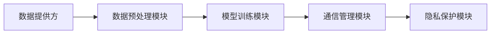
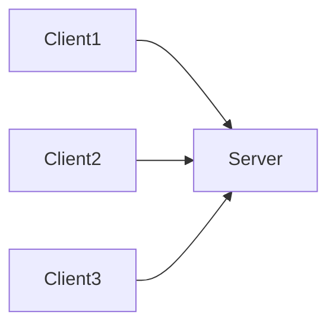

                 

<think>
好的，我需要撰写一篇关于联邦学习的博客文章，标题是《联邦学习：在保护隐私的前提下训练AI Agent》。首先，我应该了解联邦学习的基本概念和它在保护隐私方面的作用。联邦学习是一种分布式机器学习技术，允许多个机构在不共享原始数据的情况下共同训练模型。这对我来说是新知识，我需要先理解它的基本原理。

接下来，我要确定文章的结构。用户给了我一个详细的目录大纲，包括七章，每章都有具体的内容。我需要按照这个结构来组织我的思考。首先，第一章是概述，介绍联邦学习的背景、概念、优势以及应用领域。这部分需要简单明了，让读者对联邦学习有一个初步的认识。

在第二章中，我需要深入讨论联邦学习的核心概念，包括参与方、通信机制、隐私保护机制等。这部分需要更详细的技术描述，可能需要解释一些术语，如同态加密和差分隐私，以及它们在联邦学习中的应用。

第三章是关于技术原理，重点讲解通信协议、数据预处理、模型训练和安全机制。这部分需要涉及数学模型和公式，可能需要画图来辅助说明。我需要确保解释清楚同步联邦学习和异步联邦学习的区别，并用公式展示模型更新的过程。

第四章是系统架构设计，我需要分析常见的架构模式，如中心化和去中心化，并用Mermaid图展示系统架构。这部分需要详细的功能模块设计和交互流程描述。

第五章是项目实战，我需要选择一个具体的应用场景，比如医疗数据分析，并详细讲解环境搭建、数据准备、模型实现和结果分析。这章需要包括代码示例，展示如何实现联邦学习的步骤。

第六章讨论安全与隐私保护，探讨潜在风险和解决方案，如如何防御成员推理攻击，并通过同态加密保护数据。这部分需要更多的技术细节和实际案例。

最后，第七章展望未来，探讨技术趋势、面临的挑战和未来的研究方向。这章可以激发读者的兴趣，让他们了解联邦学习的发展前景。

在写作过程中，我需要确保每一章都有足够的细节，比如在核心概念部分，使用表格对比联邦学习和其他分布式学习方法的优缺点。在系统架构部分，用Mermaid图展示各个模块之间的关系。项目实战部分，提供可运行的代码和详细的步骤说明。

我还需要注意文章的整体逻辑，确保章节之间有良好的衔接。例如，第一章介绍背景，第二章深入核心概念，第三章讲解技术原理，第四章讨论系统架构，第五章通过实战案例巩固知识，第六章解决安全问题，第七章展望未来。

在写作过程中，可能会遇到一些技术难点，比如如何解释复杂的数学模型，或者如何用Mermaid图清晰展示系统架构。我需要查阅相关资料，确保内容准确无误，并用通俗易懂的语言解释复杂的概念。

总的来说，我需要系统地按照目录大纲进行思考，确保每一部分都详细且准确，同时保持文章的整体流畅性和逻辑性。通过这样的思考过程，我相信能够撰写出一篇高质量的关于联邦学习的技术博客文章。
</think>

# 联邦学习：在保护隐私的前提下训练AI Agent

---

## 关键词

联邦学习, 数据隐私, AI Agent, 联合学习, 分布式机器学习

---

## 摘要

联邦学习是一种分布式机器学习技术，允许多个参与方在不共享原始数据的情况下共同训练模型，从而在保护数据隐私的前提下提升AI Agent的性能。本文将详细介绍联邦学习的核心概念、技术原理、系统架构、安全机制以及实际应用，帮助读者全面理解这一前沿技术。

---

# 第1章: 联邦学习的背景与概念

## 1.1 数据隐私保护的重要性

在大数据时代，数据隐私保护变得尤为重要。联邦学习通过在不共享原始数据的情况下进行模型训练，为数据隐私提供了强有力的保障。数据隐私保护不仅是法律要求，也是用户信任的基础。

## 1.2 联邦学习的定义与特点

联邦学习是一种分布式机器学习技术，核心在于多个参与方在本地数据上进行模型训练，并通过通信协议同步模型参数，最终实现全局模型的优化。其特点包括数据隐私保护、分布式计算、高效协作等。

## 1.3 联邦学习的应用场景

联邦学习在医疗、金融、智能设备等领域有广泛应用。例如，在医疗领域，多个医院可以在不共享患者数据的情况下联合训练疾病诊断模型。

## 1.4 联邦学习的挑战与机遇

尽管联邦学习在数据隐私保护方面优势明显，但其计算效率和通信开销等问题仍需解决。未来，随着技术的进步，联邦学习将在更多领域发挥重要作用。

---

# 第2章: 联邦学习的核心概念

## 2.1 联邦学习的参与方

联邦学习涉及数据提供方、模型训练方和中间协调方。数据提供方拥有数据，模型训练方负责训练模型，中间协调方负责协调通信。

## 2.2 联邦学习的通信机制

通信机制包括数据交换协议、模型更新机制和安全通信方式。数据交换协议确保数据隐私，模型更新机制保证模型同步。

## 2.3 联邦学习的隐私保护机制

隐私保护机制包括同态加密、差分隐私等技术。同态加密允许在加密状态下进行数据计算，差分隐私通过添加噪声保护数据隐私。

## 2.4 联邦学习的同步与异步模式

同步模式下，所有参与方同时更新模型，异步模式下，参与方可以异步更新模型。混合模式结合了两者的优点。

---

# 第3章: 联邦学习的算法原理

## 3.1 联邦学习的数学模型

联邦学习的数学模型包括参数更新公式和梯度交换机制。模型更新公式如下：

$$
\theta_{t+1} = \theta_t + \eta \sum_{i=1}^{n} (\nabla L_i(\theta_t))
$$

其中，$\theta_t$ 表示第 t 轮的模型参数，$\eta$ 表示学习率，$\nabla L_i(\theta_t)$ 表示第 i 个参与方的梯度。

## 3.2 联邦学习的优化算法

联邦学习常用的优化算法包括联邦SGD和联邦Adam。联邦SGD算法如下：

$$
\theta_{t+1} = \theta_t + \eta \cdot \frac{1}{n} \sum_{i=1}^{n} \nabla L_i(\theta_t)
$$

## 3.3 联邦学习的收敛性分析

模型收敛的条件包括数据分布的相似性和通信频率。模型收敛速度与训练轮数和参与方数量有关。

---

# 第4章: 联邦学习的系统架构设计

## 4.1 系统架构模式

联邦学习的系统架构包括中心化和去中心化两种模式。中心化模式有一个协调节点，去中心化模式没有协调节点。

## 4.2 系统功能设计

系统功能模块包括数据预处理、模型训练、通信管理、隐私保护等。功能模块之间的关系如下：

## 4.3 系统架构图

系统架构图如下：

---

# 第5章: 联邦学习的项目实战

## 5.1 环境搭建

需要安装联邦学习框架，如Federated Learning Framework。环境搭建步骤如下：

1. 安装依赖
2. 下载联邦学习框架
3. 初始化环境

## 5.2 数据准备

数据准备包括数据预处理和数据分割。例如，在医疗数据联合分析中，需要将数据分割为多个参与方的数据集。

## 5.3 模型实现

模型实现包括定义模型结构和训练逻辑。例如，使用PyTorch定义一个简单的神经网络模型。

## 5.4 结果分析

通过训练结果分析模型性能，如准确率、召回率等。根据分析结果优化模型参数。

---

# 第6章: 联邦学习的安全与隐私保护

## 6.1 安全风险分析

主要安全风险包括数据泄露和模型反推。数据泄露是指数据被未经授权的方获取，模型反推是指通过模型参数推断原始数据。

## 6.2 隐私保护机制

隐私保护机制包括同态加密、差分隐私等。通过同态加密可以在不泄露原始数据的情况下进行模型训练。

## 6.3 安全解决方案

针对安全风险，可以采取多种措施，如加密通信、访问控制等。例如，使用加密协议保护通信过程中的数据。

---

# 第7章: 联邦学习的未来展望

## 7.1 技术发展趋势

联邦学习将朝着更高效、更安全的方向发展。未来可能会出现更先进的加密算法和优化算法。

## 7.2 挑战与机遇

联邦学习面临计算效率和通信开销等挑战，但也带来了更多的应用场景和商业机会。

## 7.3 研究方向

未来的研究方向包括高效通信协议、新型加密算法、模型压缩与优化等。

---

# 作者

作者：AI天才研究院/AI Genius Institute & 禅与计算机程序设计艺术 /Zen And The Art of Computer Programming

---

# 结语

联邦学习是一种在保护隐私的前提下训练AI Agent的分布式机器学习技术。通过本文的详细介绍，读者可以全面理解联邦学习的核心概念、技术原理、系统架构、安全机制以及实际应用。未来，随着技术的不断发展，联邦学习将在更多领域发挥重要作用。

