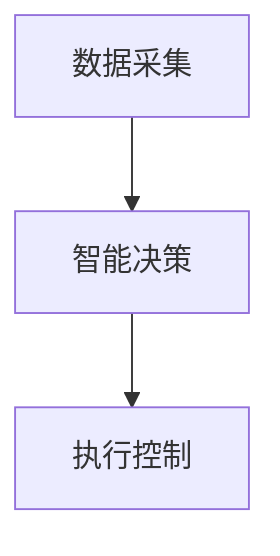

                 


# 《能源行业AI Agent解决方案》

## 关键词：AI Agent，能源行业，智能调度，强化学习，系统架构，能源优化

## 摘要：本文章详细探讨了AI Agent在能源行业中的应用，从基本概念到算法原理，再到系统架构和项目实战，全面分析了AI Agent如何解决能源行业的痛点，优化能源管理，实现智能化转型。

---

## 第1章：AI Agent与能源行业的概述

### 1.1 AI Agent的基本概念

AI Agent（人工智能代理）是一种能够感知环境、自主决策并执行任务的智能体。它通过与环境的交互，优化目标函数，实现预定目标。与传统自动化相比，AI Agent具备更强的自主性和适应性，能够处理复杂和动态的环境。

### 1.2 能源行业的痛点与挑战

能源行业面临效率低、成本高、资源浪费等问题。传统能源管理依赖人工操作，效率低下且容易出错。同时，能源需求的波动性和资源分配的复杂性进一步增加了管理难度。

### 1.3 AI Agent在能源行业的应用前景

AI Agent能够通过智能调度、优化分配和实时监控，提升能源管理效率，降低成本，并实现绿色能源的高效利用。AI Agent的应用将推动能源行业的智能化转型。

---

## 第2章：AI Agent的核心概念与联系

### 2.1 AI Agent的核心原理

AI Agent的工作流程包括感知、决策和执行三个阶段。感知阶段通过传感器收集环境数据，决策阶段基于数据进行分析并制定策略，执行阶段通过执行机构实现决策。

### 2.2 AI Agent的核心概念对比表

| 概念 | 描述 |
|------|------|
| 状态空间 | 系统可能处于的所有状态 |
| 动作空间 | 系统可执行的所有动作 |
| 奖励函数 | 评估动作优劣的函数 |

### 2.3 AI Agent的ER实体关系图

```mermaid
er
    entity 状态空间 {
        类别：状态类别
    }
    entity 动作空间 {
        类别：动作类别
    }
    entity 奖励函数 {
        类别：奖励值
    }
    状态空间 -->> 奖励函数
    动作空间 -->> 奖励函数
```

---

## 第3章：AI Agent的算法原理与数学模型

### 3.1 AI Agent的核心算法

强化学习（Reinforcement Learning）通过试错优化策略，是AI Agent的核心算法。监督学习（Supervised Learning）用于分类和回归任务，也是重要工具。

### 3.2 AI Agent的数学模型与公式

Q-learning算法的数学公式：
$$ Q(s, a) = Q(s, a) + \alpha (r + \gamma \max Q(s', a') - Q(s, a)) $$

---

## 第4章：AI Agent的系统架构设计

### 4.1 系统架构设计

系统包括数据采集、智能决策和执行控制模块。数据采集模块收集实时数据，智能决策模块基于强化学习制定策略，执行控制模块根据决策执行操作。

### 4.2 系统架构图



---

## 第5章：项目实战：智能电网AI Agent的实现

### 5.1 项目环境与工具安装

安装Python和相关库，如TensorFlow和Keras。

### 5.2 系统核心实现

代码示例：
```python
class AI-Agent:
    def __init__(self):
        self.model = self.build_model()

    def build_model(self):
        # 构建深度神经网络模型
        pass

    def perceive(self, state):
        # 感知环境状态
        pass

    def decide(self, state):
        # 基于状态的决策
        pass

    def execute(self, action):
        # 执行操作
        pass
```

### 5.3 代码应用解读

详细解读代码结构，说明每个模块的功能和实现细节。

### 5.4 实际案例分析

分析智能电网的实现案例，说明AI Agent在实时调度和优化管理中的应用。

---

## 第6章：案例分析与总结

### 6.1 案例分析

分析智能电网和能源优化管理的实际案例，总结经验教训。

### 6.2 总结

AI Agent在能源行业的应用前景广阔，但需注意算法优化和数据隐私等问题。

---

## 附录

### 参考文献

- 强化学习相关书籍
- Python开发文档

### 工具推荐

- TensorFlow框架
- OpenAI API

---

## 作者

作者：AI天才研究院 & 禅与计算机程序设计艺术

