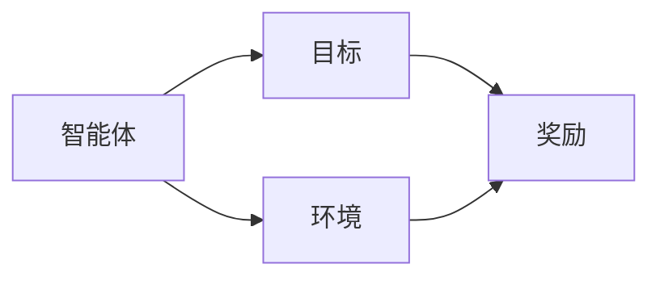
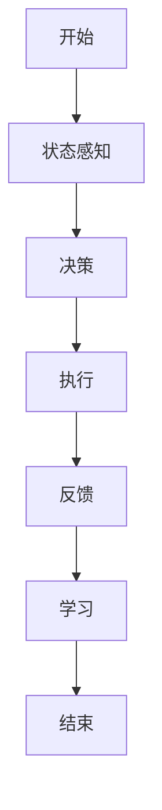
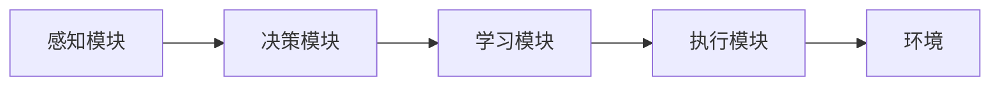
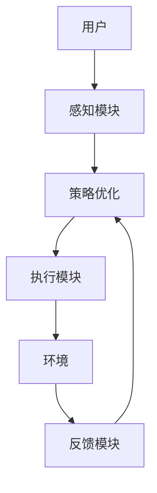

                 


# 自主学习型AI Agent：持续进化的智能体

> 关键词：自主学习型AI Agent, 智能体行为模型, 持续进化算法, 强化学习, 自适应算法, 系统架构设计

> 摘要：本文深入探讨了自主学习型AI Agent的核心概念、算法原理、系统架构以及实际应用。通过理论分析与实践案例结合的方式，详细阐述了自主学习型AI Agent的定义、核心概念、算法实现、系统设计和项目实战，帮助读者全面理解并掌握这一前沿技术。

---

## 正文

### 第一部分: 自主学习型AI Agent基础概念

#### 第1章: 自主学习型AI Agent的定义与背景

##### 1.1 自主学习型AI Agent的核心概念

###### 1.1.1 自主学习型AI Agent的定义

自主学习型AI Agent是一种能够通过与环境交互、自我感知和自适应学习来实现持续进化的智能体。与传统的被动接收指令的AI不同，它具备主动探索、自我优化和动态调整的能力，能够在复杂多变的环境中独立完成任务。

###### 1.1.2 自主学习与传统AI的区别

| **维度**   | **传统AI**                      | **自主学习型AI Agent**              |
|------------|---------------------------------|------------------------------------|
| **输入方式** | 预定义规则或数据               | 自主感知环境并生成输入              |
| **决策方式** | 基于预设规则或模型             | 基于实时反馈和动态调整              |
| **进化能力** | 依赖人工优化或数据更新         | 具备自我学习和进化能力              |

###### 1.1.3 自主学习型AI Agent的背景与现状

近年来，随着深度学习和强化学习的快速发展，AI Agent逐渐从单一任务处理向多任务、多环境的自主学习方向演进。特别是在游戏AI、机器人控制和自动化系统等领域，自主学习型AI Agent展现出巨大的潜力和应用价值。

##### 1.2 自主学习型AI Agent的背景介绍

###### 1.2.1 问题背景

在传统AI系统中，任务的执行高度依赖于预定义的规则和数据，缺乏灵活性和适应性。面对未知或动态变化的环境，系统往往需要人工干预或重新训练，这极大地限制了AI的广泛应用。

###### 1.2.2 问题描述

自主学习型AI Agent的目标是通过自我感知和自适应学习，解决以下问题：
- 如何在复杂环境中实现目标？
- 如何通过反馈机制进行自我优化？
- 如何在动态变化的环境中持续进化？

###### 1.2.3 问题解决

通过结合强化学习、自适应算法和持续进化机制，自主学习型AI Agent能够实时感知环境、动态调整策略，并在任务执行过程中不断优化自身性能。

###### 1.2.4 边界与外延

自主学习型AI Agent的核心是“自主性”和“持续进化能力”，其外延包括但不限于：
- 自我监控与反馈机制
- 动态规划与策略优化
- 多环境适应性

###### 1.2.5 核心要素组成

- **感知模块**：环境数据的采集与处理
- **决策模块**：基于感知数据的策略生成
- **学习模块**：通过反馈进行策略优化
- **执行模块**：将策略转化为具体行动

---

#### 第2章: 自主学习型AI Agent的核心概念与联系

##### 2.1 核心概念原理

###### 2.1.1 自主学习机制

自主学习机制是AI Agent的核心，通过以下步骤实现：
1. 感知环境状态
2. 生成候选行动
3. 执行行动并获取反馈
4. 更新策略模型

###### 2.1.2 智能体行为模型

智能体行为模型描述了AI Agent在环境中的行为模式，通常包括：
- **目标设定**：明确任务目标
- **行动选择**：基于当前状态选择最优行动
- **反馈处理**：根据环境反馈调整策略

###### 2.1.3 持续进化算法

持续进化算法是一种动态优化算法，通过以下步骤实现：
1. 初始化策略模型
2. 执行任务并获取反馈
3. 更新策略参数
4. 重复迭代，逐步优化

##### 2.2 核心概念属性特征对比

| **属性**         | **传统AI**                      | **自主学习型AI Agent**              |
|------------------|---------------------------------|------------------------------------|
| **自主性**       | 低                             | 高                                 |
| **适应性**       | 有限                           | 强                                 |
| **进化能力**     | 无                             | 具备                               |

##### 2.3 ER实体关系图



---

#### 第3章: 自主学习型AI Agent的算法原理

##### 3.1 算法原理讲解

###### 3.1.1 强化学习算法

强化学习（Reinforcement Learning, RL）是实现自主学习的核心算法之一。通过以下步骤实现：
1. **状态感知**：智能体感知当前环境状态
2. **决策**：基于状态选择行动
3. **执行**：执行选择的行动
4. **反馈**：获得环境反馈（奖励或惩罚）
5. **学习**：更新策略以最大化累计奖励



###### 3.1.2 自适应算法

自适应算法通过动态调整参数实现策略优化，常用算法包括：
- **Q-learning**：基于Q值表的策略优化
- **Deep Q-Network (DQN)**：使用深度神经网络近似Q值函数

##### 3.2 算法数学模型

###### 3.2.1 状态空间模型

$$ S = \{s_1, s_2, ..., s_n\} $$

###### 3.2.2 行动空间模型

$$ A = \{a_1, a_2, ..., a_m\} $$

###### 3.2.3 奖励函数

$$ R(s, a) = r $$

##### 3.3 算法实现代码

```python
def autonomous_learning_agent():
    state = 感知
    action = 选择最优行动
    reward = 获取反馈
    update策略模型
    return 策略优化后的模型
```

---

### 第二部分: 自主学习型AI Agent的系统架构设计

#### 第4章: 系统架构设计

##### 4.1 系统功能设计

- **感知模块**：环境数据的采集与处理
- **决策模块**：基于感知数据的策略生成
- **学习模块**：通过反馈进行策略优化
- **执行模块**：将策略转化为具体行动

##### 4.2 系统架构设计



##### 4.3 系统接口设计

- **输入接口**：环境数据
- **输出接口**：执行指令
- **反馈接口**：奖励信号

##### 4.4 系统交互设计



---

### 第三部分: 自主学习型AI Agent的项目实战

#### 第5章: 项目实战

##### 5.1 环境安装

- 安装Python和相关库（如TensorFlow、Keras）
- 安装强化学习框架（如OpenAI Gym）

##### 5.2 系统核心实现源代码

```python
import numpy as np
import gym

class AutonomousAgent:
    def __init__(self, env):
        self.env = env
        self.state_space = env.observation_space.shape[0]
        self.action_space = env.action_space.n
        self.learning_rate = 0.01
        self.model = self.build_model()

    def build_model(self):
        # 构建神经网络模型
        pass

    def perceive(self):
        # 感知环境状态
        pass

    def decide(self):
        # 生成决策
        pass

    def execute(self):
        # 执行决策
        pass

    def learn(self):
        # 更新策略模型
        pass

# 初始化环境和智能体
env = gym.make('CartPole-v1')
agent = AutonomousAgent(env)

# 开始训练
for _ in range(1000):
    state = env.reset()
    while True:
        action = agent.decide(state)
        next_state, reward, done, _ = env.step(action)
        agent.learn(state, action, reward, next_state, done)
        if done:
            break
```

##### 5.3 案例分析与详细解读

以经典控制任务CartPole为例，通过强化学习算法训练智能体实现平衡杆的持续平衡。训练过程中，智能体会逐步优化策略，最终在复杂环境中实现目标。

---

### 第四部分: 自主学习型AI Agent的最佳实践

#### 第6章: 最佳实践

##### 6.1 注意事项

- **算法选择**：根据任务需求选择合适的强化学习算法
- **环境设计**：确保环境的多样性和挑战性
- **反馈机制**：设计合理的奖励函数
- **模型优化**：定期调整学习率和策略参数

##### 6.2 小结

自主学习型AI Agent通过持续进化算法和强化学习实现任务目标，具备强大的适应性和进化能力，能够在复杂多变的环境中完成复杂的任务。

##### 6.3 注意事项

- 避免过度优化导致模型过拟合
- 定期监控和调整训练参数
- 保持系统的可解释性和透明性

##### 6.4 拓展阅读

- 《强化学习入门》
- 《深度学习与强化学习结合》
- 《自主学习型AI Agent的应用案例》

---

### 作者

作者：AI天才研究院/AI Genius Institute & 禅与计算机程序设计艺术 /Zen And The Art of Computer Programming

---

通过以上结构，我们可以看到，自主学习型AI Agent是一个复杂而强大的技术，它结合了多种算法和系统设计，能够实现持续进化和自我优化。希望这篇文章能够为读者提供清晰的思路和实践指导。

