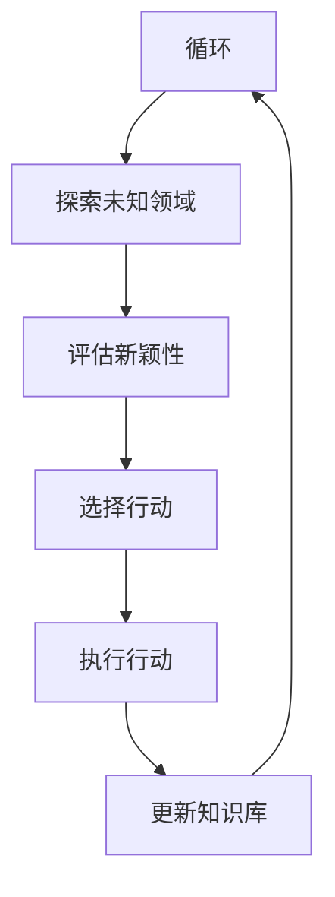
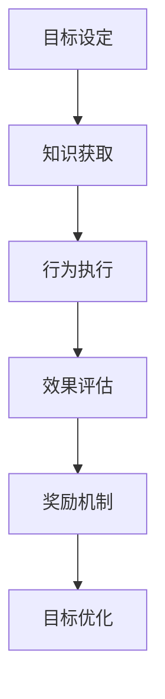
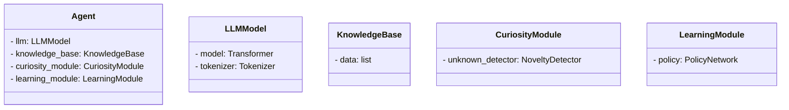
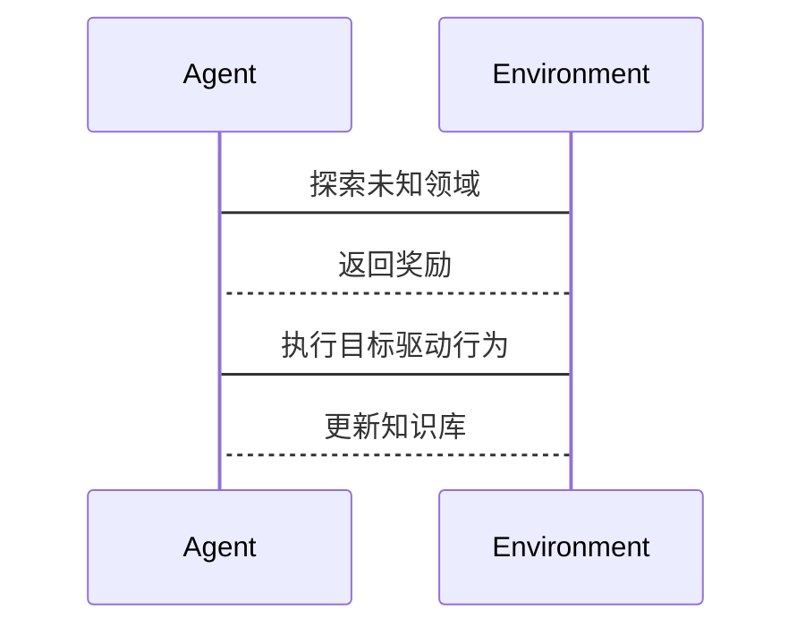

                 


# 自主探索型AI Agent：LLM驱动的好奇心与学习动机

> **关键词**：自主探索型AI Agent，LLM，好奇心，学习动机，AI算法，系统架构设计

> **摘要**：本文深入探讨了自主探索型AI Agent的核心概念、算法原理、系统架构设计及实际应用。通过分析好奇心驱动的探索算法和基于LLM的学习动机模型，结合具体项目案例，展示了如何构建具备自主学习能力的AI系统。文章内容涵盖理论与实践，旨在为AI开发者和研究人员提供有价值的参考。

---

## 第1章: 自主探索型AI Agent概述

### 1.1 自主探索型AI Agent的背景与问题背景

#### 1.1.1 自主探索型AI Agent的背景

自主探索型AI Agent是一种结合了人工智能（AI）、机器学习（ML）和自然语言处理（NLP）的智能体，其核心特征是具备主动探索未知环境、自主学习新知识和自适应调整行为的能力。传统AI系统通常依赖于外部指令或固定规则，而自主探索型AI Agent则通过内在动机驱动，能够在复杂动态环境中实现自我改进和目标优化。

随着大语言模型（LLM）技术的快速发展，AI Agent的能力得到了显著提升。LLM不仅能够理解上下文，还能通过与环境的交互生成目标驱动的行为，从而实现自主探索。

#### 1.1.2 问题背景与问题描述

在实际应用中，传统AI系统往往面临以下问题：
- **依赖外部指令**：无法在无明确指令的情况下主动解决问题。
- **缺乏灵活性**：难以适应环境变化或未知任务。
- **学习效率低下**：需要大量人工标注数据，且难以实现自我改进。

自主探索型AI Agent的目标是通过内在动机（如好奇心）和学习动机（如知识获取），实现以下能力：
1. **主动探索**：在未知环境中主动发现新知识。
2. **自我学习**：通过与环境交互，不断优化自身行为。
3. **目标驱动**：基于内在动机，自主设定目标并解决问题。

#### 1.1.3 问题解决与边界

自主探索型AI Agent的核心问题在于如何设计算法和系统架构，使其能够在动态复杂环境中实现自主探索和自我改进。其边界包括：
- **能力边界**：基于LLM的能力限制，无法完成超出模型理解范围的任务。
- **环境边界**：适用于结构化或半结构化的任务环境，难以处理高度非结构化的任务。
- **安全边界**：需确保探索行为的安全性和可控性。

#### 1.1.4 概念结构与核心要素

自主探索型AI Agent的核心要素包括：
1. **好奇心驱动模块**：通过内在动机驱动主动探索。
2. **学习动机模块**：通过外部奖励或知识获取驱动学习。
3. **LLM集成模块**：基于大语言模型实现自然语言理解和生成。
4. **环境交互模块**：与外部环境进行数据交换和行为执行。

### 1.2 自主探索型AI Agent的核心概念与联系

#### 1.2.1 核心概念原理

**好奇心驱动的探索**：
好奇心是自主探索的核心动力。通过未知性、新颖性和不确定性，AI Agent会主动探索未知领域，从而扩展知识边界。

**学习动机驱动的优化**：
学习动机是AI Agent通过外部奖励或知识获取实现目标优化的内在动力。基于LLM的学习动机模型能够将知识获取与行为目标相结合，实现自我改进。

**LLM的语义理解与生成**：
LLM（大语言模型）通过语义理解生成目标驱动的行为，是实现自然语言交互和知识推理的关键技术。

#### 1.2.2 核心概念属性特征对比表

| **核心概念** | **属性特征**           | **详细说明**                                                                 |
|--------------|------------------------|-----------------------------------------------------------------------------|
| 好奇心驱动   | 内在动机               | 基于未知性、新颖性和不确定性，驱动AI Agent主动探索未知领域。                                     |
| 学习动机驱动 | 外部奖励与知识获取     | 通过外部奖励或知识获取，优化行为目标，实现自我改进。                                             |
| LLM集成      | 自然语言理解与生成     | 通过LLM实现与环境的自然语言交互，生成目标驱动的行为。                                             |

#### 1.2.3 实体关系图（ER图）

```mermaid
erDiagram
    actor "AI Agent" {
        attribute: id
    }
    actor "环境" {
        attribute: id
    }
    actor "知识库" {
        attribute: id
    }
    AI Agent --> 环境: 交互
    AI Agent --> 知识库: 学习
```

---

## 第2章: 好奇心驱动的探索算法

### 2.1 好奇心驱动的探索算法原理

#### 2.1.1 算法流程图（mermaid）



#### 2.1.2 Python实现代码

```python
def curiosity_driven_exploration(agent, environment):
    while True:
        unknown_area = agent.find_unknown(environment)
        if not unknown_area:
            break
        action = agent.select_action(unknown_area)
        reward = environment.execute_action(action)
        agent.update_knowledge(reward)
```

#### 2.1.3 数学模型与公式

好奇心驱动的探索算法可以通过以下数学模型表示：

$$
\text{新颖性}(x) = \frac{1}{\sum_{i=1}^{n} |x_i - x| + 1}
$$

其中，$x$ 是当前探索点，$x_i$ 是已知点。

---

## 第3章: 基于LLM的学习动机模型

### 3.1 学习动机模型原理

#### 3.1.1 模型流程图（mermaid）



#### 3.1.2 Python实现代码

```python
def llm_based_learning(agent, environment):
    target = agent.set_goal(environment)
    knowledge = agent.obtain_knowledge(target)
    action = agent.decide_action(knowledge)
    reward = environment.execute_action(action)
    agent.update_policy(reward)
```

#### 3.1.3 数学模型与公式

基于LLM的学习动机模型可以表示为：

$$
R(s, a) = \alpha \cdot P(s, a) + \beta \cdot Q(s, a)
$$

其中，$R$ 是奖励函数，$s$ 是状态，$a$ 是动作，$\alpha$ 和 $\beta$ 是权重系数，$P$ 和 $Q$ 分别是基于LLM的策略和价值函数。

---

## 第4章: 系统分析与架构设计

### 4.1 系统功能设计

#### 4.1.1 领域模型（mermaid类图）



#### 4.1.2 系统架构设计（mermaid架构图）

```mermaid
architectural {
    main {
        Agent
    }
    modules {
        llm
        knowledge_base
        curiosity_module
        learning_module
    }
    connections {
        Agent --> llm
        Agent --> knowledge_base
        Agent --> curiosity_module
        Agent --> learning_module
    }
}
```

#### 4.1.3 系统交互流程（mermaid序列图）



---

## 第5章: 自主探索型AI Agent项目实战

### 5.1 项目环境安装与配置

#### 5.1.1 开发环境搭建

```bash
# 安装Python和相关依赖
python3 --version
pip install transformers numpy torch
```

#### 5.1.2 依赖库安装

```bash
pip install -r requirements.txt
```

### 5.2 核心功能实现

#### 5.2.1 好奇心驱动模块实现

```python
class CuriosityModule:
    def __init__(self):
        self.detector = NoveltyDetector()

    def find_unknown(self, environment):
        return self.detector.detect Novelty(environment)
```

#### 5.2.2 学习动机模块实现

```python
class LearningModule:
    def __init__(self):
        self.policy = PolicyNetwork()

    def update_policy(self, reward):
        self.policy.update(reward)
```

### 5.3 项目案例分析与解读

#### 5.3.1 实际案例分析

**案例：基于LLM的教育辅导AI**

```python
# 初始化AI Agent
agent = AIAssistant(llm=LLMModel(), knowledge_base=KnowledgeBase())

# 执行探索任务
agent.exploration_mode(environment=EducationEnvironment())
```

#### 5.3.2 代码实现与解读

**代码实现：**

```python
def main():
    agent = AIAssistant()
    environment = EducationEnvironment()
    agent.exploration_mode(environment)
    agent.learning_mode(environment)

if __name__ == "__main__":
    main()
```

**代码解读：**

1. **初始化AI Agent**：创建AI助手实例，集成LLM和知识库模块。
2. **进入探索模式**：通过`exploration_mode`方法，AI Agent开始探索未知领域。
3. **进入学习模式**：通过`learning_mode`方法，AI Agent基于探索结果进行知识学习和目标优化。

---

## 第6章: 最佳实践、小结与拓展阅读

### 6.1 最佳实践

1. **环境安全设计**：在实际应用中，需确保AI Agent的探索行为不会对环境或用户造成负面影响。
2. **模型调优**：根据具体任务需求，对LLM和算法进行调优，以提高探索效率和学习效果。
3. **知识管理**：建立高效的知识管理系统，确保知识获取和更新的及时性。

### 6.2 小结

本文详细介绍了自主探索型AI Agent的核心概念、算法原理和系统架构设计，并通过实际案例展示了其在教育领域的应用。通过好奇心驱动的探索算法和基于LLM的学习动机模型，AI Agent能够实现主动探索和自我改进，从而在复杂动态环境中完成目标任务。

### 6.3 注意事项

1. **数据隐私**：在实际应用中，需注意数据隐私和用户隐私保护。
2. **模型泛化能力**：需关注AI Agent的模型泛化能力，确保其在不同环境中的适应性。
3. **算法收敛性**：需关注算法的收敛性，确保探索行为的有效性和效率。

### 6.4 拓展阅读

1. **推荐书籍**：
   - 《深度学习》——Ian Goodfellow
   - 《人工智能：一种现代方法》—— Stuart Russell
2. **推荐论文**：
   - "Curiosity-Driven Exploration for Deep Reinforcement Learning"（ curiosity-driven exploration论文）
   - "Large Language Models for Reasoning”（LLM推理论文）

---

## 作者

**作者：AI天才研究院/AI Genius Institute & 禅与计算机程序设计艺术 /Zen And The Art of Computer Programming**

--- 

以上是《自主探索型AI Agent：LLM驱动的好奇心与学习动机》的技术博客文章的完整内容，涵盖了从理论到实践的详细讲解，旨在为AI开发者和研究人员提供有价值的参考。

