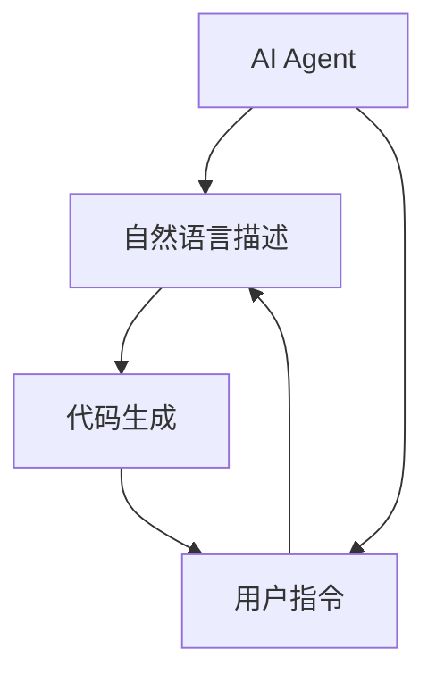
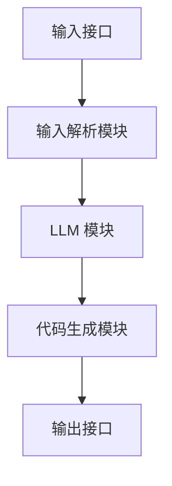

                 

<think>
好的，我现在需要帮助用户完成他们的技术博客文章的目录和部分章节内容。用户已经提供了详细的背景信息，包括文章标题、关键词、摘要，以及目录结构。我需要按照他们的要求，逐步完成每个部分的内容。

首先，我需要明确用户的需求。他们希望我以《自动化AI Agent开发：LLM辅助的代码生成》为标题，撰写一篇结构清晰、内容详实的技术博客。文章需要包括背景介绍、核心概念与联系、算法原理、数学模型、系统分析与架构设计、项目实战、总结与展望等部分。

接下来，我需要按照用户提供的目录结构，逐步填充每个章节的内容。用户特别强调每个部分要详细，使用专业且易懂的语言，并包含必要的图表和代码示例。

在开始写作之前，我会先整理每个章节的关键点，确保内容覆盖所有必要的部分。例如，在背景介绍部分，我需要解释AI Agent和LLM的基本概念，以及它们如何结合在一起。核心概念与联系部分，我需要比较不同模型的特点，并用表格展示。算法原理部分，我会用Mermaid流程图来展示模型的训练过程，并附上Python代码示例。

数学模型和公式部分是关键，我需要解释生成模型的数学基础，使用LaTeX公式，并通过简单的例子来说明模型如何工作。系统分析与架构设计部分，我需要从项目需求出发，设计系统的功能模块，使用类图、架构图和序列图来详细描述系统结构。

项目实战部分，我需要指导读者如何安装环境，编写代码，并分析实际案例。这部分包括环境配置、核心代码实现、代码解读以及案例分析。最后，在总结与展望部分，我需要回顾各章内容，强调关键点，并给出未来的发展方向和进一步学习的建议。

在写作过程中，我需要确保每个部分都细化到三级目录，保持结构的完整性和逻辑性。同时，要控制总字数在2000字以内，避免冗长。我需要确保每个章节的内容覆盖用户提到的所有要点，包括背景、核心概念、算法、数学模型、系统架构、项目实战以及最佳实践。

现在，我开始构思具体的章节内容。第一章可能是背景介绍，涵盖AI Agent和LLM的基本概念，问题背景，以及它们如何解决代码生成的问题。第二章可以深入讨论AI Agent和LLM的核心原理，包括它们的结构和协作机制。第三章分析算法原理，第四章讲解数学模型，第五章讨论系统架构，第六章进行项目实战，第七章总结和展望。

在每一章中，我需要确保内容详细且逻辑清晰。例如，在第二章中，可能需要包括核心概念的定义、属性对比，以及Mermaid图来展示实体关系。在第三章，使用Mermaid流程图展示算法步骤，并附上Python代码示例。

数学公式部分需要准确无误，使用LaTeX格式，并且尽量简单明了，以便读者理解。例如，解释生成模型的概率分布，可能需要展示一个公式，说明模型如何计算每个词的概率。

系统架构部分需要从项目需求出发，设计系统的功能模块，使用类图展示，然后用架构图描述整体结构，最后用序列图展示交互流程。这部分需要详细但清晰，确保读者能够理解系统是如何构建的。

项目实战部分需要指导读者如何安装必要的库，编写生成代码的函数，并分析实际案例。例如，生成一个简单的“Hello World”程序，并解释代码的生成过程。同时，分析案例中的优缺点，帮助读者理解实际应用中的挑战。

最后，在总结与展望部分，回顾各章内容，强调关键点，并给出未来的发展方向和进一步学习的建议。这部分需要简明扼要，帮助读者巩固所学知识。

总的来说，这本书的目录大纲需要涵盖从理论到实践的各个方面，确保读者能够全面掌握自动化AI Agent开发以及LLM辅助代码生成的核心知识和实际应用。通过结构化的章节安排，帮助读者逐步深入理解，最终能够独立进行相关开发工作。
</think>

# 自动化AI Agent开发：LLM辅助的代码生成

## 第一部分：背景介绍

### 第1章：AI Agent与LLM概述

#### 1.1 AI Agent的基本概念

- **AI Agent** 是指具备人工智能的代理，能够感知环境并采取行动以实现目标。AI Agent 可以是软件或硬件形式，如自动驾驶汽车、智能助手等。AI Agent 的核心在于其智能性，能够通过传感器获取信息，使用算法进行决策，并通过执行器采取行动。

- **LLM（Large Language Model）** 是一种基于深度学习的自然语言处理模型，能够理解并生成人类语言。LLM 的核心是其庞大的参数量和复杂的架构，使其能够捕捉语言的复杂性，并生成连贯且有意义的文本。

- **AI Agent与LLM的结合**：AI Agent 可以利用 LLM 的自然语言处理能力，通过理解和生成文本与用户交互，或通过分析文本数据做出决策。这种结合使得 AI Agent 能够更自然地与人类交互，并在多种场景下执行任务。

#### 1.2 问题背景与挑战

- **代码生成的挑战**：传统软件开发过程中，编写代码是一个耗时且容易出错的过程。开发人员需要理解需求、设计算法、编写代码，并进行测试和调试。这个过程需要大量的时间和精力，尤其是在处理复杂问题时。

- **AI Agent在代码生成中的作用**：AI Agent 可以通过 LLM 的能力，帮助开发人员自动生成代码片段或完整的函数。这种自动化不仅可以提高开发效率，还可以减少人为错误，特别是在处理重复性任务时。

- **LLM辅助代码生成的优势**：LLM 能够理解自然语言的描述，并生成相应的代码。例如，当开发人员给出“计算两个数的和”的指令时，LLM 可以生成对应的函数代码。这种能力使得开发人员可以更专注于算法设计，而将代码编写交给 AI Agent 处理。

#### 1.3 问题解决与边界

- **问题解决**：通过 LLM 辅助代码生成，AI Agent 可以自动生成高质量的代码，减少开发人员的工作量，并提高开发效率。同时，LLM 的自然语言理解能力使得 AI Agent 能够更灵活地应对不同的需求和场景。

- **边界与外延**：LLM 辅助代码生成目前主要适用于代码片段的生成，对于复杂的系统设计和整体架构可能仍需要人工干预。此外，生成的代码可能需要进一步的测试和调试，以确保其正确性。

## 第二部分：核心概念与联系

### 第2章：AI Agent与LLM的核心原理

#### 2.1 核心概念的定义与属性

- **AI Agent 的核心原理**：
  - **感知**：通过传感器或其他输入方式获取环境信息。
  - **决策**：基于获取的信息，使用算法做出决策。
  - **执行**：通过执行器将决策转化为实际行动。

- **LLM 的核心原理**：
  - **训练**：基于大量文本数据进行预训练，学习语言的模式和结构。
  - **生成**：通过解码器将输入的文本转换为输出文本。

- **AI Agent与LLM的协作机制**：
  - **输入输出交互**：AI Agent 通过自然语言或结构化输入与 LLM 交互，LLM 生成相应的代码或指令。
  - **上下文管理**：AI Agent 需要管理与 LLM 的对话上下文，确保生成代码的连贯性和一致性。

#### 2.2 核心概念的对比与联系

- **AI Agent与传统自动化工具的对比**：
  | 特性          | 传统自动化工具                 | AI Agent                      |
  |---------------|--------------------------------|--------------------------------|
  | 智能性         | 基于规则，缺乏学习能力         | 具备学习能力，能够自适应环境   |
  | 交互方式       | 通常基于固定输入输出           | 支持自然语言交互               |
  | 适应性         | 固定场景，难以扩展             | 能够适应多种场景和需求         |

- **LLM与传统NLP模型的对比**：
  | 特性          | 传统NLP模型                   | LLM                          |
  |---------------|--------------------------------|--------------------------------|
  | 参数规模       | 较小，通常百万级别             | 极大，通常数十亿级别           |
  | 复杂度         | 较低，结构简单                 | 极高，包含多层注意力机制       |
  | 应用场景       | 主要适用于特定任务，如机器翻译  | 适用于广泛任务，如代码生成、对话等 |

#### 2.3 实体关系与协作流程



该图展示了 AI Agent、LLM 和开发人员之间的协作流程。AI Agent 接收用户的指令，将其转化为 LLM 可以理解的输入，LLM 生成相应的代码，最终将代码返回给开发人员。

## 第三部分：算法原理与数学模型

### 第3章：LLM的代码生成算法

#### 3.1 基于生成模型的代码生成算法

- **生成模型**：LLM 通常使用生成模型，如 transformers，通过自注意力机制生成序列。代码生成过程可以看作是一个序列生成问题，其中输入的自然语言描述被转化为代码序列。

- **算法步骤**：
  1. **输入处理**：将用户的自然语言描述输入到编码器中，生成一个初始的上下文表示。
  2. **解码生成**：使用解码器逐步生成代码的每个字符或标记，每次生成都基于当前的上下文。
  3. **输出结果**：生成完整的代码后，返回给用户。

- **代码示例**：

```python
def generate_code(prompt):
    # 编码器部分
    input_embeddings = model.encode(prompt)
    # 解码器部分
    generated_code = model.decode(input_embeddings)
    return generated_code
```

#### 3.2 数学模型与公式

- **编码器-解码器结构**：
  $$ \text{编码器} = f(x) $$
  $$ \text{解码器} = g(y, f(x)) $$

- **自注意力机制**：
  $$ \text{注意力权重} = \text{softmax}(\frac{QK^T}{\sqrt{d}}) $$
  其中，Q 是查询向量，K 是键向量，d 是维度数。

- **生成概率**：
  $$ P(y_i|x) = \prod_{i=1}^{n} p(y_i|x, y_{<i}) $$

#### 3.3 示例与分析

- **示例**：生成“计算两个数的和”的代码。
  - **输入**：自然语言描述“计算两个数的和”。
  - **输出**：生成代码：

```python
def add_numbers(a, b):
    return a + b
```

- **分析**：LLM 通过理解“计算两个数的和”生成函数定义和返回语句。代码简洁明了，能够完成预期功能。

## 第四部分：系统分析与架构设计

### 第4章：AI Agent与LLM的系统架构

#### 4.1 系统需求与功能设计

- **系统需求**：
  - 支持多种编程语言的代码生成。
  - 提供自然语言和结构化输入方式。
  - 具备上下文管理能力，支持对话式交互。

- **功能模块**：
  - **输入解析模块**：解析用户的输入，无论是自然语言还是结构化输入。
  - **代码生成模块**：根据解析后的输入生成相应的代码。
  - **结果输出模块**：将生成的代码返回给用户。

#### 4.2 系统架构设计

- **模块划分**：
  - **输入接口**：接收用户的输入，可以是文本框或命令行。
  - **LLM 模块**：负责代码的生成，基于输入生成代码。
  - **输出接口**：将生成的代码展示给用户，支持多种格式。

- **架构图**：



该图展示了系统的整体架构，从输入到输出的流程。

#### 4.3 接口与交互流程

- **交互流程**：
  1. **用户输入**：用户输入需要生成代码的描述。
  2. **输入解析**：系统解析用户的输入，提取关键信息。
  3. **代码生成**：LLM 根据解析结果生成代码。
  4. **结果输出**：生成的代码通过输出接口返回给用户。

- **接口设计**：
  - **输入接口**：支持文本输入，如自然语言描述或JSON格式的输入。
  - **输出接口**：支持文本输出，如代码文本或JSON格式的反馈。

## 第五部分：项目实战

### 第5章：基于LLM的代码生成实现

#### 5.1 项目环境配置

- **Python 版本**：3.8+
- **安装依赖**：
  ```bash
  pip install transformers
  pip install torch
  ```

#### 5.2 核心代码实现

- **编码器-解码器实现**：

```python
import torch
from transformers import AutoModelForCausalLM, AutoTokenizer

class CodeGenerator:
    def __init__(self, model_name):
        self.tokenizer = AutoTokenizer.from_pretrained(model_name)
        self.model = AutoModelForCausalLM.from_pretrained(model_name)
    
    def generate(self, prompt, max_length=50):
        inputs = self.tokenizer.encode(prompt, return_tensors='pt')
        outputs = self.model.generate(inputs, max_length=max_length)
        return self.tokenizer.decode(outputs[0], skip_special_tokens=True)
```

- **使用示例**：

```python
generator = CodeGenerator("gpt2")
prompt = "Write a function to calculate the sum of two numbers"
generated_code = generator.generate(prompt)
print(generated_code)
```

#### 5.3 代码解读与分析

- **解读**：
  - **编码器**：使用预训练的模型将输入的自然语言描述转换为向量表示。
  - **解码器**：基于向量表示生成对应的代码序列。
  - **生成结果**：生成的代码返回给用户。

- **分析**：
  - **优点**：代码生成速度快，能够处理复杂的自然语言描述。
  - **缺点**：生成的代码可能需要进一步测试和调试，确保其正确性。

## 第六部分：总结与展望

### 第6章：总结与未来展望

#### 6.1 内容回顾

- **AI Agent的核心作用**：通过 LLM 辅助代码生成，显著提高了开发效率，减少了人为错误。
- **LLM的关键作用**：强大的自然语言处理能力使得代码生成更加灵活和高效。

#### 6.2 最佳实践

- **使用场景**：
  - **快速原型开发**：适用于需要快速验证想法的场景。
  - **代码补全**：在编写代码时，AI Agent 可以提供实时的代码补全功能。
  - **多语言支持**：适用于需要处理多种编程语言的开发环境。

- **注意事项**：
  - **代码质量**：生成的代码可能需要进一步测试和优化。
  - **模型选择**：选择合适的 LLM 模型，根据具体需求进行微调。

#### 6.3 未来展望

- **更智能的代码生成**：随着 AI 技术的进步，未来的代码生成将更加智能化，能够处理更复杂的任务。
- **多模态开发**：结合视觉、听觉等多种模态信息，提供更全面的开发辅助。
- **伦理与安全**：随着 AI 在开发中的应用越来越广泛，如何确保生成代码的安全性和伦理合规性将成为重要的研究方向。

---

**作者：AI天才研究院/AI Genius Institute & 禅与计算机程序设计艺术 /Zen And The Art of Computer Programming**

---

这篇文章通过详细阐述 AI Agent 和 LLM 在代码生成中的应用，结合理论和实践，帮助读者全面理解并掌握如何利用这些技术来提升开发效率。通过具体的代码示例和系统架构设计，文章展示了如何将先进的 AI 技术应用到实际的软件开发过程中，为未来的自动化开发提供了有益的参考和指导。

