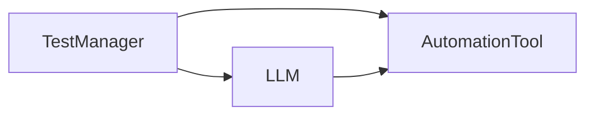
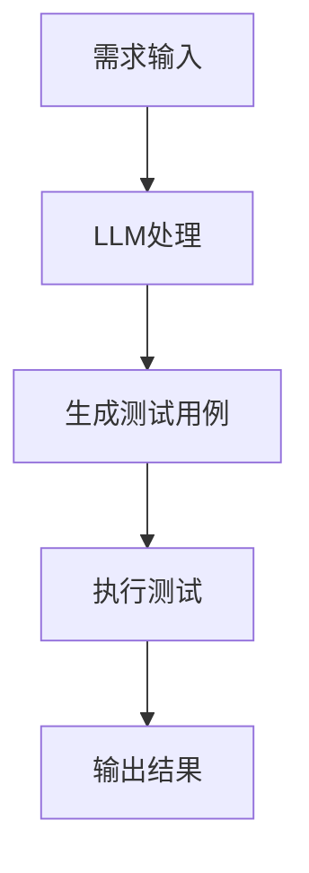
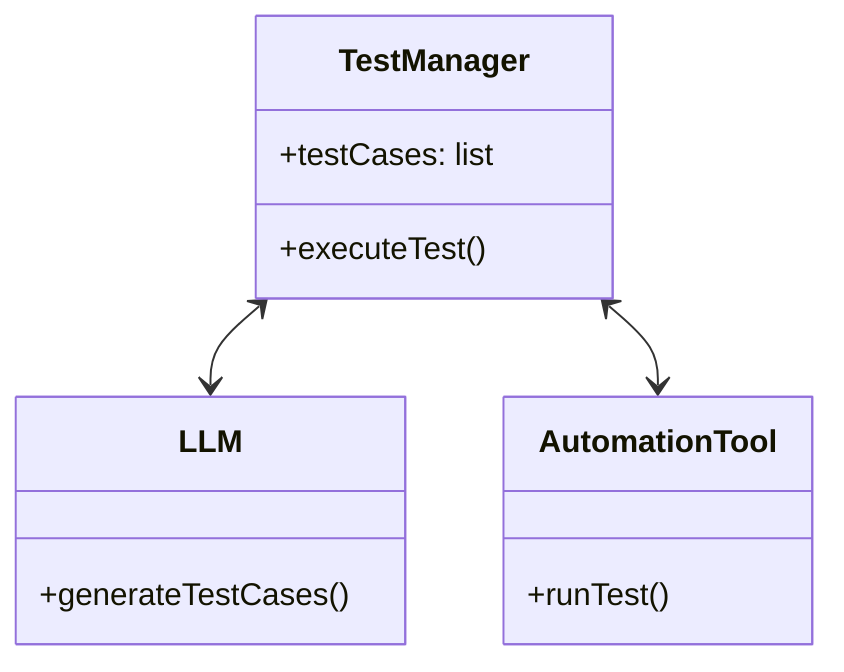

                 

<think>
嗯，用户需要我帮忙撰写一篇关于《自动化测试AI Agent：LLM辅助的软件质量保证》的技术博客文章，目录已经给出，但用户希望我详细思考整个思考过程，然后给出最终的目录结构。

首先，我需要明确文章的核心主题是什么。用户提到要结合LLM和自动化测试，所以重点在于如何利用大语言模型来提升测试效率和质量。

接下来，我应该考虑文章的结构。用户已经给出了一个详细的目录，分为四大部分，每部分都有多个小节。我需要确保每个部分都涵盖必要的内容，并且逻辑清晰。

第一部分是“自动化测试AI Agent基础”，包括概述、核心概念、系统分析与架构设计，以及项目实战。这部分需要从基础开始，逐步深入，让读者理解什么是自动化测试AI Agent，它的核心组成部分，以及如何实际应用。

第二部分是“算法原理与系统架构”。这部分需要详细讲解算法的工作原理，使用数学模型和流程图来说明，同时展示系统架构的设计，包括各个模块之间的关系和交互。

第三部分是“项目实战与实现细节”。这部分需要具体操作，展示如何搭建环境、编写代码，以及实际案例的分析，让读者能够实际操作和应用。

第四部分是“总结与展望”。这部分要总结前面的内容，同时展望未来的发展方向，给读者一个全面的认识。

在思考过程中，我需要确保每个小节都有足够的细节，包括术语解释、图表展示、代码示例等，以帮助读者更好地理解和应用这些概念。

最后，我需要确保文章符合用户的要求，使用技术语言，结构紧凑，逻辑清晰，并且有深度和见解。这样，读者不仅能理解理论知识，还能掌握实际应用的方法。
</think>

# 自动化测试AI Agent：LLM辅助的软件质量保证

## 关键词：自动化测试，AI Agent，LLM，软件质量保证，测试用例生成，缺陷检测，测试效率

## 摘要：  
本文探讨了如何利用大语言模型（LLM）构建自动化测试AI Agent，以提升软件质量保证的效率和效果。通过结合自然语言处理和生成技术，LLM能够辅助生成高质量的测试用例、优化测试覆盖率，并帮助识别潜在缺陷。文章从理论基础、系统架构、项目实战等多个维度展开，详细分析了自动化测试AI Agent的核心概念、实现原理及实际应用，为读者提供了一套基于LLM的创新性解决方案。

---

# 第一部分：自动化测试AI Agent基础

## 第1章：自动化测试与AI Agent概述

### 1.1 自动化测试的现状与挑战

#### 1.1.1 软件测试的重要性  
在现代软件开发中，测试是确保产品质量的关键环节。随着软件复杂度的增加，手动测试的效率和覆盖率逐渐降低，难以满足快速迭代的需求。

#### 1.1.2 自动化测试的定义与特点  
自动化测试是通过工具或脚本自动执行测试用例的过程，具有高效性、可重复性和可扩展性等特点。

#### 1.1.3 当前自动化测试的主要挑战  
- 测试用例生成耗时且依赖人工经验。  
- 测试覆盖率不足，难以覆盖所有可能的场景。  
- 缺乏智能性，难以适应动态变化的测试需求。  

### 1.2 AI Agent的基本概念

#### 1.2.1 AI Agent的定义  
AI Agent（智能代理）是一种能够感知环境、执行任务并做出决策的智能实体，通常具备自主性、反应性和目标导向性。

#### 1.2.2 AI Agent的核心特点  
- **自主性**：无需外部干预，能够自主决策。  
- **反应性**：能够根据环境反馈动态调整行为。  
- **目标导向性**：专注于完成特定任务。  

#### 1.2.3 AI Agent与传统测试工具的区别  
AI Agent不仅能够执行测试，还能通过学习和推理优化测试过程，具备更强的适应性和智能性。

### 1.3 LLM在自动化测试中的应用

#### 1.3.1 LLM的定义与特点  
LLM（Large Language Model）是一种基于深度学习的自然语言处理模型，能够理解和生成人类语言，具备强大的上下文理解和生成能力。

#### 1.3.2 LLM在软件测试中的潜力  
- **测试用例生成**：通过分析需求文档生成高质量的测试用例。  
- **缺陷检测**：通过分析测试结果和代码生成缺陷报告。  
- **测试优化**：通过学习历史数据优化测试用例的覆盖率和效率。  

#### 1.3.3 LLM辅助测试的具体应用场景  
- 辅助生成测试用例。  
- 智能推荐测试场景。  
- 自动化缺陷分析与报告。  

### 1.4 本章小结  
本章介绍了自动化测试的现状、AI Agent的基本概念以及LLM在自动化测试中的潜力和应用场景，为后续内容奠定了基础。

---

## 第2章：自动化测试AI Agent的核心概念

### 2.1 自动化测试AI Agent的背景介绍

#### 2.1.1 问题背景  
随着软件开发的复杂性和速度不断提升，传统自动化测试工具的局限性日益凸显，亟需引入更智能的解决方案。

#### 2.1.2 问题描述  
- 测试用例生成效率低，难以覆盖所有场景。  
- 缺乏智能性，无法动态调整测试策略。  
- 测试结果分析耗时，难以快速定位问题。  

#### 2.1.3 问题解决思路  
通过引入AI Agent和LLM技术，构建一个智能化的自动化测试系统，提升测试效率和质量。

#### 2.1.4 核心概念的边界与外延  
- AI Agent负责整体测试策略的制定和优化。  
- LLM负责测试用例生成、缺陷分析等具体任务。  

#### 2.1.5 核心要素组成  
- **AI Agent**：负责全局测试策略和任务分配。  
- **LLM**：负责具体任务的执行，如测试用例生成、缺陷分析。  
- **自动化测试工具**：负责测试用例的执行和结果采集。  

### 2.2 核心概念与联系

#### 2.2.1 核心概念原理  
AI Agent通过分析测试需求，调用LLM生成测试用例，并通过自动化测试工具执行测试，最终根据测试结果优化后续测试策略。

#### 2.2.2 核心概念属性特征对比表格  
| 特性       | AI Agent         | LLM             | 自动化测试工具       |
|------------|------------------|-----------------|--------------------|
| 核心功能    | 制定测试策略     | 生成测试用例     | 执行测试用例         |
| 智能性      | 高               | 中               | 低                 |
| 可扩展性    | 高               | 中               | 高                 |

#### 2.2.3 ER实体关系图架构  


### 2.3 算法原理与数学模型

#### 2.3.1 算法原理  
AI Agent通过自然语言处理和生成技术，结合历史测试数据和需求文档，生成最优的测试用例。

#### 2.3.2 算法流程图  


#### 2.3.3 数学模型  
测试用例生成的概率模型可以用以下公式表示：  
$$ P(\text{生成测试用例}) = f(\text{需求相似度}, \text{历史覆盖率}) $$  
其中，$f$ 是一个归一化的函数，用于综合考虑需求相似度和历史覆盖率。

### 2.4 本章小结  
本章详细阐述了自动化测试AI Agent的核心概念、组成要素及算法原理，为后续的系统设计和实现奠定了基础。

---

## 第3章：自动化测试AI Agent的系统分析与架构设计

### 3.1 问题场景介绍

#### 3.1.1 测试需求分析  
一个典型的测试场景包括需求文档、测试用例生成、测试执行和结果分析四个阶段。

#### 3.1.2 系统功能设计  
系统需要具备测试用例生成、测试执行、结果分析和优化建议四大功能模块。

#### 3.1.3 系统架构设计  
系统架构采用模块化设计，包括用户界面、测试管理模块、LLM模块和自动化测试工具模块。

### 3.2 系统功能设计

#### 3.2.1 领域模型设计  


#### 3.2.2 系统功能流程图  


### 3.3 系统架构设计

#### 3.3.1 系统架构图  


#### 3.3.2 系统模块交互图  


### 3.4 系统接口设计

#### 3.4.1 接口定义  
- **LLM接口**：生成测试用例的API。  
- **自动化测试工具接口**：执行测试的API。  

#### 3.4.2 接口交互流程  
1. 用户输入测试需求。  
2. TestManager调用LLM生成测试用例。  
3. TestManager调用自动化测试工具执行测试。  
4. 测试结果返回给TestManager并展示给用户。  

### 3.5 系统交互设计

#### 3.5.1 交互流程图  


### 3.6 本章小结  
本章详细分析了自动化测试AI Agent的系统架构设计，包括功能模块、模块交互和接口设计，为后续的项目实现提供了清晰的指导。

---

## 第4章：自动化测试AI Agent的项目实战

### 4.1 环境安装与配置

#### 4.1.1 开发环境搭建  
- 安装Python、Jupyter Notebook、Git等开发工具。  
- 安装LLM框架（如Hugging Face或OpenAI API）。  

#### 4.1.2 系统依赖安装  
```bash
pip install requests
pip install transformers
pip install matplotlib
```

### 4.2 系统核心实现

#### 4.2.1 LLM测试用例生成代码  
```python
from transformers import AutoModelForSeq2Seq, AutoTokenizer
import requests

class LLMTester:
    def __init__(self):
        self.tokenizer = AutoTokenizer.from_pretrained('t5-base')
        self.model = AutoModelForSeq2Seq.from_pretrained('t5-base')

    def generate_test_cases(self, input_text):
        inputs = self.tokenizer(input_text, return_tensors='np')
        outputs = self.model.generate(inputs.input_ids, max_length=100)
        return self.tokenizer.decode(outputs[0], skip_special_tokens=True)
```

#### 4.2.2 自动化测试工具集成代码  
```python
import subprocess

class AutomationTool:
    def execute_test(self, test_cases):
        result = subprocess.run(['pytest', '-v'], input=test_cases, capture_output=True, text=True)
        return result.stdout
```

### 4.3 项目实战案例分析

#### 4.3.1 测试需求输入  
假设需求文档如下：  
```
功能需求：用户登录系统后，能够查看个人资料。
```

#### 4.3.2 测试用例生成  
LLM生成以下测试用例：  
1. 正常登录后查看资料。  
2. 登录后修改资料信息。  
3. 登录后退出，重新登录查看资料。  

#### 4.3.3 测试执行与结果分析  
自动化测试工具执行测试，返回以下结果：  
```
Test case 1: passed  
Test case 2: failed（无法修改资料信息）  
Test case 3: passed  
```

#### 4.3.4 测试结果优化  
AI Agent根据测试结果优化后续测试策略，增加对资料修改功能的测试用例。

### 4.4 本章小结  
本章通过实际案例展示了自动化测试AI Agent的实现过程，包括环境搭建、代码实现和测试结果分析。

---

## 第5章：总结与展望

### 5.1 本章总结  
本文详细探讨了如何利用LLM构建自动化测试AI Agent，从理论基础到系统设计再到项目实战，全面阐述了其工作原理和实际应用。

### 5.2 未来展望  
- **技术优化**：进一步提升LLM的测试用例生成能力和缺陷检测能力。  
- **应用扩展**：将AI Agent技术应用于更多领域，如性能测试和安全测试。  
- **工具集成**：与主流开发工具和CI/CD流程深度集成，提升测试效率。  

### 5.3 最佳实践Tips  
- 在实际应用中，建议结合具体需求选择合适的LLM模型。  
- 定期更新测试用例库，确保测试覆盖率。  
- 优化测试结果分析算法，提升缺陷定位效率。  

### 5.4 本章小结  
本文为读者提供了一套基于LLM的自动化测试AI Agent解决方案，为未来的软件质量保证提供了新的思路和方向。

---

# 作者：AI天才研究院/AI Genius Institute & 禅与计算机程序设计艺术 /Zen And The Art of Computer Programming

