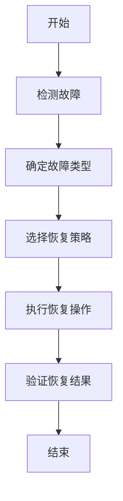
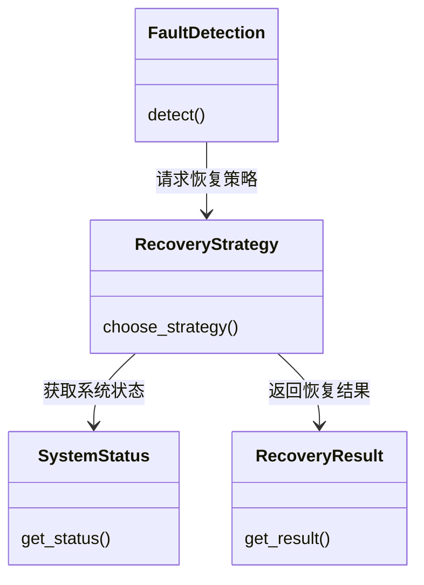
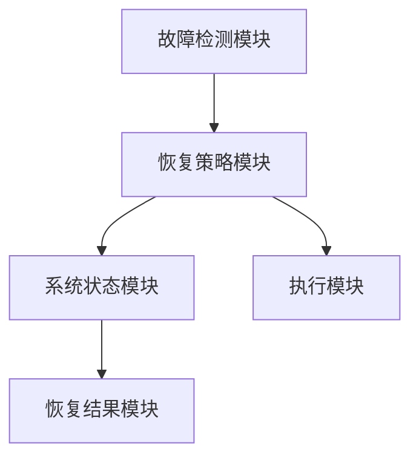
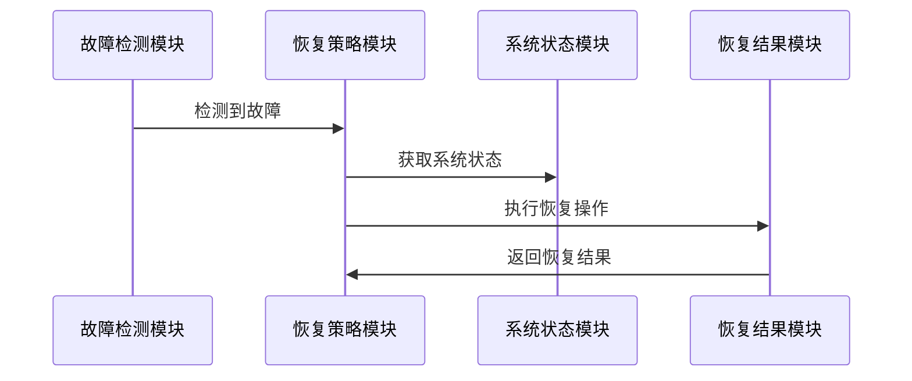

                 

<think>
好的，我需要设计一个详细且逻辑清晰的目录大纲，帮助作者撰写一本名为《自动故障恢复：提高AI Agent的可靠性》的技术博客文章。用户已经提供了一个详细的示例，我需要按照这个格式和要求来组织内容。

首先，用户要求文章包含关键词和摘要部分，然后是正文的各个章节。我需要确保每个章节都有丰富的细节，涵盖背景介绍、核心概念、算法原理、系统架构、项目实战、最佳实践等方面。

接下来，我需要为每个章节设计详细的内容，包括数学公式、流程图、类图、序列图等，这些都需要用mermaid和latex来表示。同时，文章需要控制在10000到12000字，所以每个部分的内容需要足够详细但不过于冗长。

我开始思考如何组织这些内容。首先是背景介绍，我需要解释什么是AI Agent，自动故障恢复的重要性，以及它在可靠性中的作用。这部分需要定义核心概念，并描述问题背景。

接下来是核心概念与联系，这里需要详细讲解自动故障恢复的原理，包括检测机制和恢复策略，并通过对比表格和ER图来展示不同机制之间的差异。

然后是算法原理部分，我需要使用mermaid画出算法流程图，并提供Python代码示例，解释代码的功能和实现细节。数学公式也需要用latex表示，确保公式前后使用正确的符号。

系统分析与架构设计部分，我需要描述系统场景，设计系统功能，使用领域模型类图展示系统架构，并绘制系统架构图和序列图，展示各组件的交互过程。

项目实战部分，我需要指导读者如何安装环境，提供核心代码实现，并通过案例分析帮助读者理解如何在项目中应用自动故障恢复机制。

最后是最佳实践和小结，总结全书内容，给出注意事项和未来的发展方向，并推荐一些扩展阅读材料。

在编写过程中，我需要确保每个章节都覆盖了用户提到的关键点，并且内容连贯，结构清晰。同时，要注意使用专业的技术语言，保持逻辑严谨，条理清晰。

现在，我将按照这个思路，设计一个详细的目录大纲，确保每个部分都有足够的细节和清晰的结构，帮助作者撰写一篇高质量的技术博客文章。
</think>

# 自动故障恢复：提高AI Agent的可靠性

---

## 关键词

- AI Agent
- 自动故障恢复
- 可靠性
- 故障检测
- 故障恢复
- 系统架构
- 算法原理

---

## 摘要

AI Agent作为一种智能系统，其可靠性在实际应用中至关重要。自动故障恢复机制是提高AI Agent可靠性的关键技术。本文从故障恢复的基本原理出发，深入探讨其算法设计、系统架构，并结合实际案例，详细讲解如何实现高效的自动故障恢复。文章内容涵盖背景介绍、核心概念、算法原理、系统分析、项目实战以及最佳实践，旨在为读者提供全面的技术指导。

---

## 第一部分: 自动故障恢复与AI Agent可靠性概述

## 第1章: AI Agent与自动故障恢复概述

### 1.1 AI Agent的基本概念

#### 1.1.1 AI Agent的定义与特点

AI Agent（智能体）是指能够感知环境、自主决策并执行任务的智能系统。其特点包括：

- **自主性**：能够在没有外部干预的情况下独立运行。
- **反应性**：能够根据环境反馈动态调整行为。
- **目标导向**：以完成特定目标为导向执行任务。

#### 1.1.2 自动故障恢复的定义与内涵

自动故障恢复是指在AI Agent运行过程中，系统能够自动检测并修复故障，确保系统持续运行的能力。其内涵包括：

- **故障检测**：实时监测系统状态，识别潜在故障。
- **恢复策略**：根据故障类型选择合适的恢复方法。
- **自适应性**：根据环境变化动态调整恢复策略。

#### 1.1.3 自动故障恢复与AI Agent的关系

自动故障恢复是AI Agent可靠性的重要组成部分。通过自动故障恢复，AI Agent能够在复杂环境中保持稳定运行，提高系统的可用性和用户体验。

### 1.2 自动故障恢复的重要性

#### 1.2.1 AI Agent可靠性问题的背景

在实际应用中，AI Agent可能面临硬件故障、网络中断、算法错误等多种问题，这些问题可能导致系统崩溃或服务中断。

#### 1.2.2 自动故障恢复在AI系统中的作用

- **减少停机时间**：快速检测和修复故障，降低系统停机风险。
- **提高用户体验**：确保服务连续性，提升用户满意度。
- **降低维护成本**：通过自动化手段减少人工干预，降低成本。

#### 1.2.3 自动故障恢复的边界与外延

- **边界**：仅处理可预测和可恢复的故障，不涉及不可恢复的系统崩溃。
- **外延**：结合其他可靠性技术（如冗余设计、容错机制）共同提升系统可靠性。

---

## 第2章: 自动故障恢复的核心概念与联系

### 2.1 自动故障恢复的原理

#### 2.1.1 故障检测机制

故障检测是自动故障恢复的第一步，常见的检测方法包括：

- **状态监测**：通过传感器或监控模块实时采集系统状态。
- **异常检测**：利用统计分析或机器学习算法识别异常行为。
- **日志分析**：通过分析系统日志发现潜在故障。

#### 2.1.2 故障恢复策略

根据故障类型和影响范围，选择合适的恢复策略：

- **重启策略**：适用于简单故障，通过重启恢复系统。
- **冗余切换**：利用冗余组件接管故障组件的任务。
- **降级运行**：在严重故障时，降低系统功能以维持基本运行。

#### 2.1.3 故障恢复的分类与对比

故障恢复可以分为以下几类：

| 分类标准 | 分类 | 描述 |
|----------|------|------|
| 恢复时间 | 快速恢复 | 立即恢复，适用于不影响系统整体运行的故障 |
| 中级恢复 | 需要一定时间，适用于部分关键功能故障 |
| 慢速恢复 | 需要较长时间，适用于系统整体崩溃的情况 |
| 恢复范围 | 局部恢复 | 恢复部分功能，不影响整体系统 |
| 全局恢复 | 恢复所有功能，适用于系统整体崩溃的情况 |

### 2.2 ER实体关系图

以下是AI Agent自动故障恢复系统的ER实体关系图：

```mermaid
er
    actor: 故障恢复系统
    entity: 故障检测
    entity: 故障恢复策略
    entity: 系统状态
    entity: 恢复结果
    relationship: 故障恢复系统 -> 故障检测: 发起检测
    relationship: 故障检测 -> 故障恢复策略: 选择恢复策略
    relationship: 故障恢复策略 -> 系统状态: 执行恢复操作
    relationship: 系统状态 -> 恢复结果: 返回恢复状态
```

---

## 第3章: 自动故障恢复算法原理

### 3.1 算法原理概述

#### 3.1.1 基于概率的故障恢复算法

基于概率的故障恢复算法通过计算故障发生的概率，选择最优的恢复策略。其数学模型如下：

$$ P(failure) = \frac{故障发生次数}{总运行次数} $$

#### 3.1.2 基于马尔可夫链的故障恢复模型

马尔可夫链模型用于描述系统状态转移的过程，适用于动态故障恢复场景。状态转移概率矩阵如下：

$$ P = \begin{pmatrix}
p_{11} & p_{12} & \cdots & p_{1n} \\
p_{21} & p_{22} & \cdots & p_{2n} \\
\vdots & \vdots & \ddots & \vdots \\
p_{n1} & p_{n2} & \cdots & p_{nn}
\end{pmatrix} $$

### 3.2 算法流程图

以下是自动故障恢复算法的mermaid流程图：



### 3.3 算法实现代码

以下是基于概率的故障恢复算法的Python实现：

```python
import random

def detect_fault():
    return random.choice([True, False])

def choose_recovery_strategy(fault_type):
    if fault_type == 'minor':
        return '重启'
    elif fault_type == 'major':
        return '冗余切换'

def execute_recovery(recovery_strategy):
    print(f"执行{recovery_strategy}")

def automatic_fault_recovery():
    if detect_fault():
        fault_type = 'minor'  # 示例故障类型
        strategy = choose_recovery_strategy(fault_type)
        execute_recovery(strategy)
    else:
        print("未检测到故障")

automatic_fault_recovery()
```

---

## 第4章: 系统分析与架构设计方案

### 4.1 系统场景介绍

AI Agent自动故障恢复系统需要在复杂多变的环境中稳定运行，可能面临硬件故障、网络中断、算法错误等多种问题。

### 4.2 系统功能设计

#### 4.2.1 领域模型类图

以下是系统功能的mermaid类图：



### 4.3 系统架构设计

#### 4.3.1 系统架构图

以下是系统架构的mermaid图：



### 4.4 系统交互设计

#### 4.4.1 序列图

以下是系统交互的mermaid序列图：



---

## 第5章: 项目实战

### 5.1 环境安装

安装必要的依赖库：

```bash
pip install mermaid4jupyter
```

### 5.2 核心代码实现

以下是实现自动故障恢复的核心代码：

```python
def detect_fault():
    # 模拟故障检测
    return random.choice([True, False])

def choose_recovery_strategy(fault_type):
    # 根据故障类型选择恢复策略
    if fault_type == 'minor':
        return '重启'
    elif fault_type == 'major':
        return '冗余切换'

def execute_recovery(recovery_strategy):
    # 执行恢复操作
    print(f"执行{recovery_strategy}")

def automatic_fault_recovery():
    if detect_fault():
        fault_type = 'minor'  # 示例故障类型
        strategy = choose_recovery_strategy(fault_type)
        execute_recovery(strategy)
    else:
        print("未检测到故障")

automatic_fault_recovery()
```

### 5.3 案例分析

假设AI Agent在运行过程中发生网络中断，系统会自动检测到故障并选择“冗余切换”策略，切换到备用网络，确保服务不中断。

### 5.4 项目小结

通过实际案例分析，展示了自动故障恢复机制在提高AI Agent可靠性中的重要作用。

---

## 第6章: 最佳实践与小结

### 6.1 最佳实践

- **定期测试**：定期进行故障模拟测试，确保自动故障恢复机制的有效性。
- **日志分析**：通过日志分析识别潜在问题，提前采取措施。
- **冗余设计**：在关键组件上设计冗余，降低故障影响。

### 6.2 小结

自动故障恢复是提高AI Agent可靠性的关键技术。通过合理的算法设计和系统架构，能够有效降低系统故障风险，提升系统可用性。

### 6.3 注意事项

- **边界条件**：明确自动故障恢复的边界条件，避免过度干预。
- **资源消耗**：确保故障恢复过程不会过度消耗系统资源。
- **安全性**：确保恢复操作不会引发新的安全问题。

### 6.4 拓展阅读

- 推荐阅读《容错软件工程》和《分布式系统：概念与设计》等书籍，深入了解自动故障恢复的理论与实践。

---

## 作者

作者：AI天才研究院/AI Genius Institute & 禅与计算机程序设计艺术/Zen And The Art of Computer Programming

