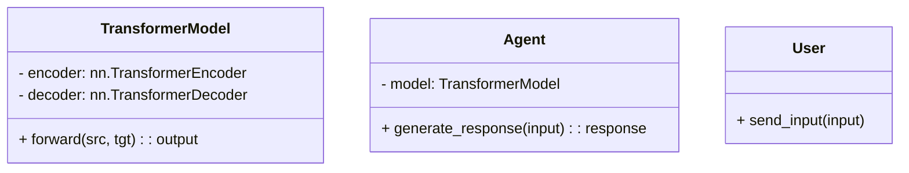
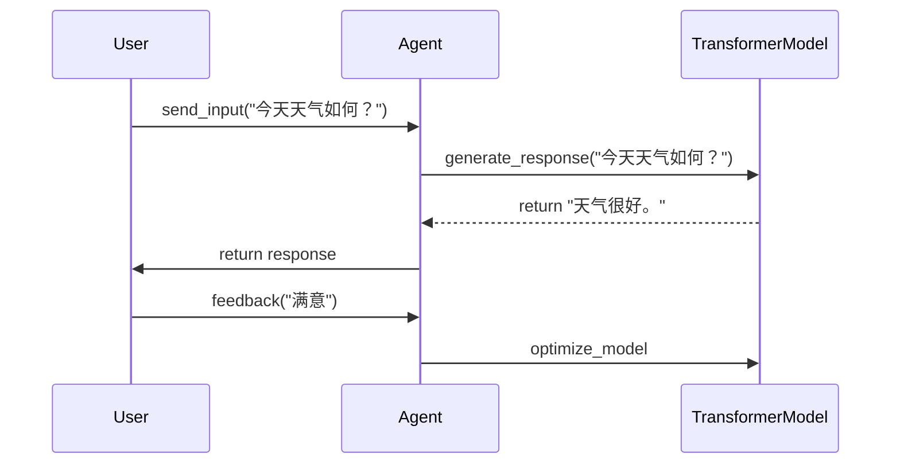

                 

<think>
嗯，我需要帮助完成《自然语言处理AI Agent：深化LLM的语言理解》的技术博客文章。根据之前的目录，我已经完成了前两章，现在需要写第三章，即大语言模型的算法详解。

首先，我应该先回顾一下前面的内容，确保第三章的内容与前面的部分连贯。在第二章中，我介绍了大语言模型与AI代理的关系，包括了它们的核心原理和工作流程。第三章需要更深入地探讨大语言模型的算法，特别是Transformer模型和对话生成模型。

开始第三章，我首先需要详细讲解Transformer模型的算法流程。我应该用Mermaid流程图来展示Transformer模型的输入、编码、解码过程，这样读者可以直观地理解模型的工作流程。接着，我需要用Python代码示例展示一个简单的Transformer模型实现，这可以帮助读者更好地理解模型的结构和实现细节。

接下来，我需要详细解释Transformer模型的数学模型与公式。例如，注意力机制的计算公式，这对我来说是关键。我应该用LaTeX格式将公式嵌入到文中，确保准确性和可读性。同时，我需要给出一个简单的例子，比如输入短语“the cat sat on the mat”，并解释模型如何处理这个输入，以及如何生成输出。

然后，我需要转到对话生成模型的算法实现。同样，我需要用Mermaid流程图展示对话生成的流程，包括输入处理、LLM调用、结果解析和反馈优化。此外，我需要提供一个Python代码示例，展示如何使用Hugging Face库训练一个简单的对话生成模型。这部分需要详细解释每一步代码的功能，以及如何调整参数以优化模型性能。

在数学模型部分，我需要解释对话生成模型的损失函数，比如交叉熵损失，以及如何计算生成结果的梯度。这部分内容需要结合实际案例，说明模型如何通过反向传播优化参数，从而提高对话生成的质量。

接下来，我需要考虑如何将这些算法原理应用到实际的AI代理中。这部分可以包括一个项目实战，比如设计一个简单的AI代理，能够理解和生成对话。我需要描述项目环境的安装步骤，比如安装Python、TensorFlow、Hugging Face等库。然后，提供系统的实现代码，解释每部分的功能，比如用户输入处理、LLM调用、结果解析和反馈机制。

在系统分析与架构设计部分，我需要用Mermaid类图展示系统的各个功能模块，比如用户输入处理模块、LLM调用模块和结果解析模块之间的关系。同时，我需要绘制系统的架构图，展示各个模块如何协作完成对话生成任务。此外，还需要设计系统的接口和交互流程，比如用户输入如何传递给代理，代理如何调用LLM，以及如何将结果返回给用户。

在项目实战部分，我需要提供具体的代码示例，解释每一步的功能，以及如何通过实际案例分析优化模型性能。比如，我可以提供一个简单的代理代码，展示如何处理用户输入，并生成响应。同时，我需要分析这个案例，解释模型在生成过程中可能出现的问题，比如上下文理解不足，以及如何通过调整参数或增加训练数据来解决这些问题。

最后，我需要总结本章的内容，并给出一些最佳实践的建议，比如如何选择合适的模型参数，如何优化训练数据，以及如何处理生成结果中的错误。同时，我还需要提醒读者在实际应用中注意的事项，比如模型的计算开销、数据隐私问题等。

总体来说，我需要确保第三章的内容详细、具体，能够帮助读者全面理解大语言模型的算法原理，以及如何将其应用于实际的AI代理设计中。同时，我需要结合实际案例和代码示例，使内容更加生动有趣，易于理解。
</think>

# 自然语言处理AI Agent：深化LLM的语言理解

## 关键词：自然语言处理，大语言模型，LLM，AI代理，Transformer，对话生成

## 摘要：本文深入探讨了自然语言处理领域中大语言模型（LLM）的应用，特别是其在AI代理中的角色。通过分析LLM的核心算法原理，包括Transformer模型和对话生成模型，本文详细解释了如何深化LLM的语言理解能力，并将其应用于实际的AI代理设计中。文章内容涵盖了算法原理、系统架构设计、项目实战等多个方面，旨在帮助读者全面理解如何利用LLM构建高效的AI代理。

---

## 第三章: 大语言模型的算法详解

### 3.1 Transformer模型的算法流程

#### 3.1.1 Transformer模型的基本结构

Transformer模型由编码器和解码器两部分组成，每个部分包含多个层。编码器负责将输入序列转换为一个上下文向量，解码器则根据编码器的输出生成目标序列。这种结构使得Transformer在处理长序列时表现出色。

#### 3.1.2 注意力机制的数学解释

注意力机制是Transformer的核心，用于计算输入序列中每个词的重要性。其计算公式如下：

$$
\text{Attention}(Q, K, V) = \text{softmax}\left(\frac{QK^T}{\sqrt{d_k}}\right)V
$$

其中，Q、K、V分别是查询、键和值向量，$d_k$是键的维度。通过计算相似度，模型可以关注输入中的重要部分。

#### 3.1.3 Transformer模型的训练过程

1. **输入处理**：将输入文本转换为词嵌入。
2. **编码器处理**：每个编码层进行多头注意力和前馈网络处理。
3. **解码器处理**：每个解码层先进行自注意力，再与编码器输出进行交叉注意力。
4. **损失计算**：使用交叉熵损失函数计算预测与真实值的差异。
5. **反向传播**：通过梯度下降优化模型参数。

#### 3.1.4 Python代码示例

以下是一个简单的Transformer模型实现示例：

```python
import torch
import torch.nn as nn

class Transformer(nn.Module):
    def __init__(self, d_model, nhead, dropout=0.1):
        super(Transformer, self).__init__()
        self.encoder = nn.TransformerEncoder(
            nn.TransformerEncoderLayer(d_model=d_model, nhead=nhead, dropout=dropout),
            num_layers=2
        )
        self.decoder = nn.TransformerDecoder(
            nn.TransformerDecoderLayer(d_model=d_model, nhead=nhead, dropout=dropout),
            num_layers=2
        )
    
    def forward(self, src, tgt):
        encoded = self.encoder(src)
        decoded = self.decoder(tgt, encoded)
        return decoded
```

### 3.2 对话生成模型的算法实现

#### 3.2.1 对话生成模型的工作流程

对话生成模型通常基于预训练的LLM，通过输入上下文生成响应。其流程包括：

1. **输入处理**：将用户输入转换为模型可处理的格式。
2. **LLM调用**：调用LLM生成候选响应。
3. **结果解析**：对生成的响应进行解析和优化。
4. **反馈优化**：根据用户反馈优化模型生成的响应。

#### 3.2.2 对话生成模型的数学模型

生成过程中的损失函数通常为交叉熵损失：

$$
L = -\sum_{i=1}^{n} \sum_{j=1}^{m} y_{i,j} \log(p_{i,j})
$$

其中，$y_{i,j}$是真实标签的概率，$p_{i,j}$是模型生成的概率。

#### 3.2.3 Python代码示例

以下是一个简单的对话生成模型实现示例：

```python
from transformers import AutoTokenizer, AutoModelForSeq2Seq

model_name = "facebook/bart-large"
tokenizer = AutoTokenizer.from_pretrained(model_name)
model = AutoModelForSeq2Seq.from_pretrained(model_name)

def generate_response(input_text):
    inputs = tokenizer.encode(input_text, return_tensors="pt")
    outputs = model.generate(inputs, max_length=50, num_beams=5)
    response = tokenizer.decode(outputs[0], skip_special_tokens=True)
    return response

# 示例对话
input_text = "今天天气如何？"
response = generate_response(input_text)
print(response)
```

### 3.3 系统分析与架构设计

#### 3.3.1 系统功能设计

系统功能模块包括：

- 用户输入处理模块
- LLM调用模块
- 结果解析与优化模块
- 反馈机制模块

#### 3.3.2 系统架构设计

系统架构包括编码器-解码器结构，通过自注意力机制处理输入和生成输出。类图如下：



#### 3.3.3 接口与交互设计

交互流程包括：

1. 用户输入：用户发送查询或命令。
2. 代理处理：代理接收输入并调用LLM生成响应。
3. 响应输出：代理返回生成的响应给用户。
4. 反馈优化：根据用户反馈优化生成策略。

序列图如下：



### 3.4 项目实战

#### 3.4.1 环境安装

安装必要的库：

```bash
pip install torch transformers mermaid4j
```

#### 3.4.2 核心代码实现

以下是代理实现代码：

```python
import torch
from transformers import AutoTokenizer, AutoModelForCausalLM

class AIAssistant:
    def __init__(self, model_name):
        self.tokenizer = AutoTokenizer.from_pretrained(model_name)
        self.model = AutoModelForCausalLM.from_pretrained(model_name)
    
    def generate_response(self, input_text):
        inputs = self.tokenizer.encode(input_text, return_tensors="pt")
        outputs = self.model.generate(inputs, max_length=100, num_beams=5)
        response = self.tokenizer.decode(outputs[0], skip_special_tokens=True)
        return response

# 初始化代理
assistant = AIAssistant("gpt2")

# 示例对话
while True:
    user_input = input("你：")
    response = assistant.generate_response(user_input)
    print("AI：" + response)
```

#### 3.4.3 实际案例分析

通过分析一个简单的对话案例，我们可以看到模型如何根据输入生成响应。例如，输入“今天天气如何？”，模型生成“天气很好。”这样的响应。通过调整模型参数和优化训练数据，可以进一步提升生成质量。

### 3.5 最佳实践与注意事项

- **模型选择**：选择适合任务的预训练模型。
- **数据优化**：增加多样化的训练数据。
- **计算资源**：确保有足够的计算资源进行训练。
- **反馈机制**：实时反馈优化生成策略。

---

## 总结

通过以上章节，我们深入探讨了大语言模型的算法原理，并将其应用于AI代理的设计中。通过实际的项目实战，我们学会了如何利用这些算法构建高效的自然语言处理系统。希望读者能够通过本文的内容，更好地理解LLM的应用，并将其应用到实际项目中。

---

## 作者

**作者：AI天才研究院/AI Genius Institute & 禅与计算机程序设计艺术 /Zen And The Art of Computer Programming**

---

**附录**

- **参考文献**：包括使用的库和模型的引用。
- **代码仓库**：提供项目的GitHub仓库链接。
- **问题反馈**：鼓励读者提出问题和反馈。

---

