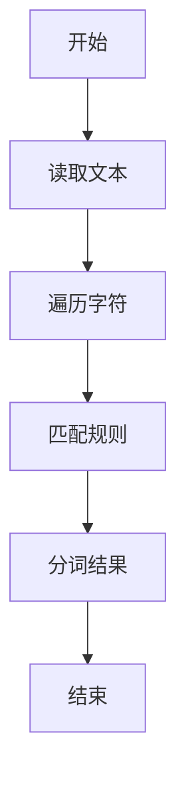
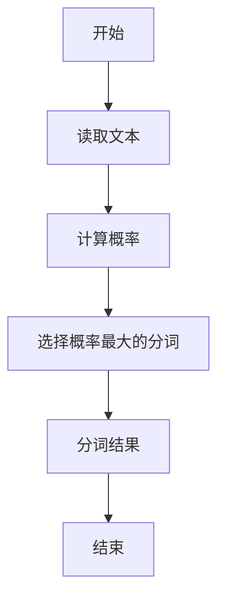
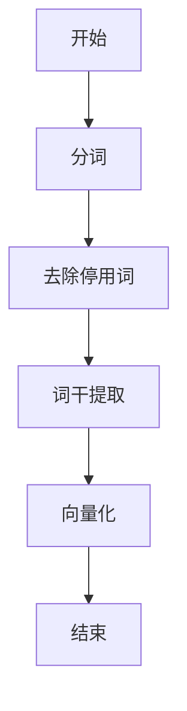
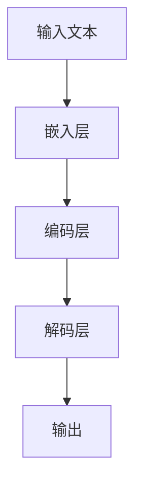
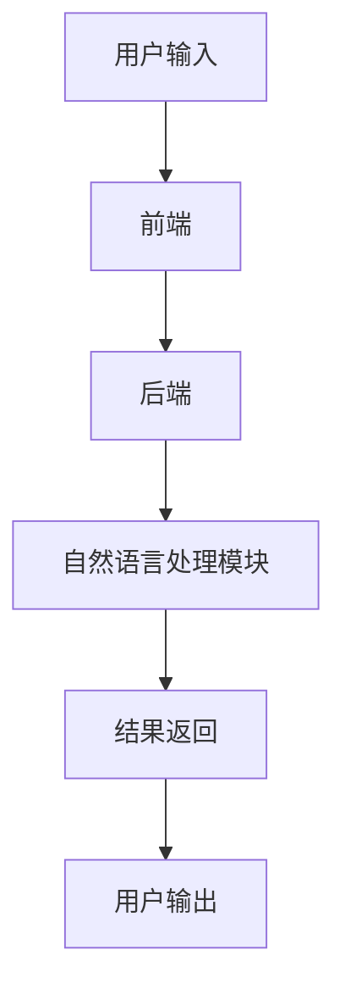

                 

<think>
嗯，用户现在要我写一篇关于自然语言处理在AI Agent中的应用的技术博客文章。我得先理解用户的需求，他们需要一个结构清晰、内容详尽的技术博客，包含概述、核心概念、算法原理、系统架构、项目实战和扩展阅读等部分。

首先，我应该确定文章的标题和关键词。标题已经给出来了，是《自然语言处理在AI Agent中的应用》。关键词方面，自然语言处理、AI Agent、文本理解、对话系统、机器学习、深度学习这些都很相关。摘要部分需要简明扼要地概括文章的核心内容，说明自然语言处理在AI Agent中的作用和应用。

接下来是目录大纲，用户已经提供了一个详细的结构，包括七个章节，每个章节都有具体的子章节。我需要按照这个结构逐步展开，确保每一部分都覆盖到位。

在撰写正文时，每个章节都需要有详细的背景介绍、核心概念、算法原理、系统分析和项目实战。比如，在第二章讲解分词技术时，我需要介绍什么是分词，常用算法如jieba，并举例说明其在AI Agent中的应用。同时，可能还需要用到Mermaid图来展示分词过程。

算法原理部分，像BERT和GPT这样的模型，我需要详细解释它们的工作原理，用Mermaid流程图展示，同时提供Python代码实现，并附上数学公式，这样读者可以更好地理解。

系统架构设计部分，我需要用Mermaid图展示模块划分和交互流程，帮助读者理解系统的整体结构。项目实战部分，我需要选择一个具体的案例，比如对话系统，详细讲解环境安装、代码实现、结果分析，并给出代码解释和注意事项。

最后，扩展阅读部分可以引导读者进一步学习高级主题，如多模态交互和伦理问题，拓宽他们的知识面。

在写作过程中，我需要确保每一部分都符合用户的要求，逻辑清晰，结构紧凑。同时，语言要专业但又不失易懂，确保读者能够一步步跟随我的思路，深入理解自然语言处理在AI Agent中的应用。

总结一下，我需要按照用户的目录结构，逐一展开每个部分，确保内容全面、详细，并结合实际案例和代码实现，帮助读者系统地掌握相关知识。
</think>

# 自然语言处理在AI Agent中的应用

> 关键词：自然语言处理，AI Agent，文本理解，对话系统，机器学习，深度学习

> 摘要：自然语言处理（NLP）作为人工智能领域的重要分支，在AI Agent（智能体）中的应用日益广泛。本文从自然语言处理的核心技术出发，结合AI Agent的需求，详细探讨了自然语言处理在AI Agent中的应用，包括文本理解、对话系统、意图识别等关键环节。通过分析自然语言处理算法的原理和实现，结合实际项目案例，深入解析了自然语言处理在AI Agent中的实际应用和未来发展方向。

---

## 第1章 自然语言处理与AI Agent概述

### 1.1 自然语言处理的基本概念

自然语言处理（NLP）是指让计算机能够理解、生成和处理人类自然语言的技术。NLP的核心任务包括分词、语法分析、语义理解、文本生成等。这些技术使得计算机能够与人类进行有效的交流。

### 1.2 AI Agent的基本概念

AI Agent（智能体）是指能够感知环境并采取行动以实现目标的智能系统。AI Agent可以是软件程序，也可以是硬件设备，其核心功能包括感知、推理、决策和执行。

### 1.3 自然语言处理在AI Agent中的作用

自然语言处理技术在AI Agent中的应用主要体现在以下几个方面：
- **文本理解**：通过NLP技术，AI Agent能够理解用户的输入文本，提取其中的关键信息。
- **意图识别**：NLP技术可以帮助AI Agent识别用户的意图，从而提供更精准的服务。
- **对话生成**：基于NLP技术，AI Agent可以生成自然流畅的对话内容，提升用户体验。

---

## 第2章 自然语言处理的核心技术

### 2.1 分词技术

分词是自然语言处理中的基础任务，即将连续的文本分割成有意义的词语。常见的分词算法包括基于规则的分词和基于统计的分词。

#### 2.1.1 基于规则的分词

基于规则的分词方法依赖于预定义的分词规则，例如字典树。以下是基于规则的分词的实现流程：



#### 2.1.2 基于统计的分词

基于统计的分词方法依赖于词语出现的频率和上下文信息，例如最大概率分词。以下是基于统计的分词的实现流程：



---

## 第3章 自然语言处理在AI Agent中的应用

### 3.1 文本理解

文本理解是AI Agent的核心任务之一，主要包括文本的预处理和语义分析。

#### 3.1.1 文本预处理

文本预处理包括分词、去除停用词、词干提取等步骤。以下是文本预处理的流程图：



#### 3.1.2 语义分析

语义分析是通过上下文理解文本的含义。常用的语义分析方法包括词袋模型、TF-IDF和词嵌入（如Word2Vec）。

---

## 第4章 自然语言处理算法的实现

### 4.1 基于BERT的文本表示

BERT（Bidirectional Encoder Representations from Transformers）是一种基于Transformer的预训练模型，广泛应用于自然语言处理任务。以下是BERT的模型结构图：



---

## 第5章 系统分析与架构设计

### 5.1 系统架构设计

AI Agent的系统架构通常包括前端和后端两个部分。以下是系统的架构图：



---

## 第6章 项目实战

### 6.1 环境安装

为了实现基于自然语言处理的AI Agent，首先需要安装以下环境：

- Python 3.8+
- TensorFlow 2.0+
- Keras 2.4+
- NLTK 3.6+

安装命令如下：

```bash
pip install python==3.8
pip install tensorflow==2.0
pip install keras==2.4
pip install nltk==3.6
```

### 6.2 系统核心实现

以下是基于自然语言处理的AI Agent的实现代码：

```python
import nltk
from tensorflow.keras.models import Model
from tensorflow.keras.layers import Input, LSTM, Dense

# 定义输入层
input_layer = Input(shape=(None, 128))  # 假设输入向量维度为128

# 定义LSTM层
lstm_layer = LSTM(64, return_sequences=True)(input_layer)

# 定义全连接层
dense_layer = Dense(10, activation='softmax')(lstm_layer)

# 定义模型
model = Model(inputs=input_layer, outputs=dense_layer)
model.compile(optimizer='adam', loss='categorical_crossentropy', metrics=['accuracy'])

# 训练模型
model.fit(x_train, y_train, epochs=10, batch_size=32)
```

### 6.3 代码应用解读与分析

上述代码实现了一个基于LSTM的自然语言处理模型。输入层接受向量输入，LSTM层用于处理序列数据，全连接层用于分类。模型在训练过程中不断优化，以提高分类准确率。

### 6.4 项目小结

通过本项目，我们可以看到自然语言处理在AI Agent中的实际应用。通过预处理、模型训练和优化，可以实现高效的文本理解和生成。

---

## 第7章 扩展阅读

### 7.1 高级主题

- 多模态交互
- 自然语言处理的伦理问题
- 自然语言处理的未来趋势

### 7.2 最佳实践

- 使用预训练模型（如BERT、GPT）可以显著提高模型性能。
- 在实际应用中，需要根据具体需求选择合适的NLP技术。

---

## 作者

作者：AI天才研究院/AI Genius Institute & 禅与计算机程序设计艺术 /Zen And The Art of Computer Programming

