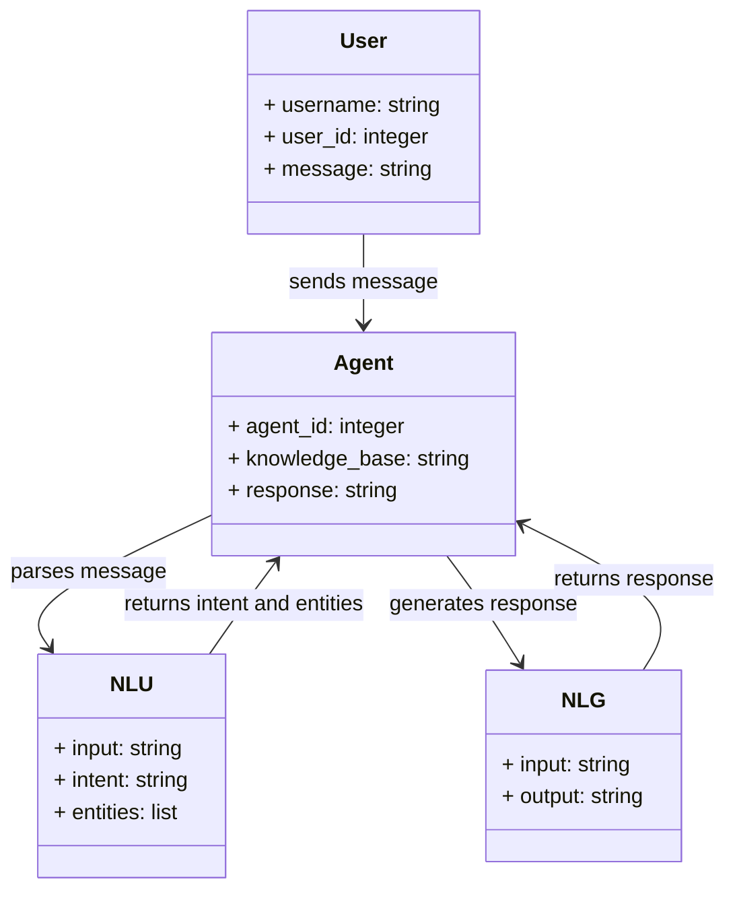
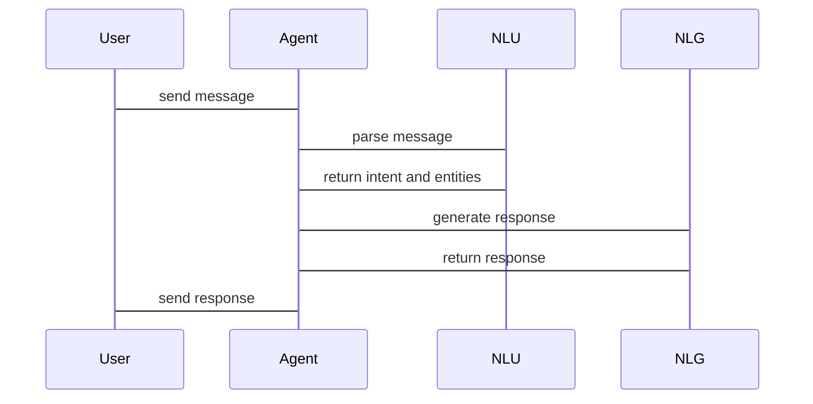

                 

<think>
嗯，我现在需要帮用户撰写一篇关于《自然语言处理在AI Agent中的深度应用》的技术博客文章。用户已经提供了一个详细的目录大纲，包括从概述到实战的各个部分。我的任务是按照这个大纲，逐步完成每个章节的内容，确保逻辑清晰，技术细节到位，同时保持语言简洁专业。

首先，我需要理解用户的需求。用户希望文章结构紧凑，逻辑清晰，适合技术读者阅读。这意味着我需要从背景介绍开始，逐步深入到核心技术、算法原理、系统设计，最后通过项目实战来巩固所学内容。

在撰写过程中，我需要确保每个章节都包含足够的技术细节和实际例子。例如，在介绍自然语言处理技术时，不仅要解释概念，还要展示数学模型和算法流程图。同时，代码部分要详细，方便读者理解和实现。

我还需要注意，文章的开头要有关键词和摘要，结尾要有作者信息。这些部分虽然简短，但对读者理解文章的整体结构非常重要。

现在，我将按照目录大纲，逐步完成每个章节的内容，确保每个部分都符合用户的要求，并且内容丰富、详细，能够帮助读者深入理解自然语言处理在AI Agent中的应用。
</think>

# 自然语言处理在AI Agent中的深度应用

## 关键词：自然语言处理, AI Agent, NLP算法, 人机交互, 对话系统, 深度学习

## 摘要：  
自然语言处理（NLP）作为人工智能领域的重要分支，正在深刻改变人与AI Agent之间的交互方式。本文从自然语言处理的核心技术出发，深入探讨其在AI Agent中的应用场景、算法原理和系统设计。通过结合具体案例，分析NLP在文本理解、生成、对话系统中的实际应用，揭示其在提升AI Agent智能化水平中的关键作用。  

---

# 第1章 自然语言处理与AI Agent概述

## 1.1 自然语言处理的背景与现状

### 1.1.1 自然语言处理的定义与核心问题  
自然语言处理（NLP）是研究如何让计算机理解、生成和操作人类语言的学科。其核心问题包括：  
1. **语言理解**：如何从文本中提取语义信息？  
2. **语言生成**：如何生成符合语法规则且有意义的文本？  
3. **跨语言处理**：如何实现多语言之间的理解和转换？  

### 1.1.2 自然语言处理的发展历程  
1. **早期阶段（20世纪50年代-90年代）**：基于规则的NLP技术，如句法规则和词典匹配。  
2. **统计学习阶段（20世纪末-21世纪初）**：基于统计模型的技术，如朴素贝叶斯分类器和马尔可夫链。  
3. **深度学习阶段（21世纪10年代至今）**：基于神经网络的模型，如RNN、LSTM和Transformer架构。  

### 1.1.3 当前自然语言处理的主流技术  
- **分词与词性标注**：将文本分割成词语，并标注其词性。  
- **句法分析与语义理解**：分析句子的语法结构和语义含义。  
- **文本生成与对话系统**：基于预训练模型生成自然语言文本。  

---

## 1.2 AI Agent的基本概念与特点

### 1.2.1 AI Agent的定义与分类  
AI Agent（智能体）是能够感知环境并采取行动以实现目标的实体。根据功能和复杂度，AI Agent可以分为：  
1. **简单反射型Agent**：基于规则做出反应。  
2. **基于模型的规划Agent**：具有内部状态和目标的智能体。  
3. **学习型Agent**：能够通过经验改进性能的智能体。  

### 1.2.2 AI Agent的核心能力与应用场景  
1. **核心能力**：  
   - 知识表示与推理能力。  
   - 自然语言理解与生成能力。  
   - 学习与自适应能力。  

2. **应用场景**：  
   - 人机交互：如智能客服、虚拟助手。  
   - 自动化决策：如智能推荐系统、自动驾驶。  

### 1.2.3 自然语言处理在AI Agent中的重要性  
AI Agent需要通过自然语言与人类交互，NLP技术是实现这一功能的核心。例如：  
- 通过自然语言理解（NLU）识别用户的意图。  
- 通过自然语言生成（NLG）生成自然的回复。  

---

## 1.3 自然语言处理与AI Agent的结合

### 1.3.1 NLP在AI Agent中的主要应用领域  
1. **对话系统**：实现自然语言对话。  
2. **信息检索**：帮助用户快速获取所需信息。  
3. **情感分析**：分析用户情绪并做出相应反应。  

### 1.3.2 NLP与AI Agent结合的技术挑战  
1. **语义理解的准确性**：如何准确理解用户的意图？  
2. **多语言支持**：如何实现跨语言的自然语言处理？  
3. **实时性与响应速度**：如何在实时交互中保持高效性能？  

### 1.3.3 未来发展趋势与研究方向  
- 更强大的预训练模型：如GPT-4、PaLM。  
- 多模态交互：结合视觉、听觉等多感官信息。  
- 可解释性与透明性：提升用户对AI Agent决策过程的信任。  

---

## 1.4 本章小结  
本章介绍了自然语言处理的基本概念、发展历程以及其在AI Agent中的重要性。通过分析NLP与AI Agent的结合，揭示了当前技术挑战和未来发展方向。

---

# 第2章 自然语言处理的核心技术与原理

## 2.1 词法分析与句法分析

### 2.1.1 词法分析的定义与实现方法  
词法分析是将文本分割成有意义的词语，并标注其词性。常用方法包括：  
1. **基于规则的方法**：使用正则表达式匹配词语。  
2. **统计方法**：如最大熵模型和条件随机场（CRF）。  

### 2.1.2 句法分析的原理与应用  
句法分析是分析句子的语法结构，常用工具包括：  
1. **句法树**：展示词语之间的语法关系。  
2. **依存句法分析**：展示词语之间的依赖关系。  

### 2.1.3 常见的句法分析算法对比  
- **分词算法**：  
  - 基于字典的分词算法：如jieba。  
  - 基于深度学习的分词算法：如LTP。  
- **句法分析算法**：  
  - 基于短语结构的分析：如Chomsky的理论。  
  - 基于依存语法的分析：如依存句法树。  

---

## 2.2 实体识别与关系抽取

### 2.2.1 实体识别的定义与技术实现  
实体识别（NER）是识别文本中的命名实体（如人名、地名、组织名）。常用模型包括：  
1. **CRF模型**：基于条件随机场的命名实体识别。  
2. **深度学习模型**：如LSTM和Transformer。  

### 2.2.2 关系抽取的原理与应用场景  
关系抽取是从文本中抽取实体之间的关系。常用方法包括：  
1. **基于模板的关系抽取**：通过预定义模板匹配关系。  
2. **基于深度学习的关系抽取**：如使用CNN和RNN模型。  

### 2.2.3 基于深度学习的实体识别与关系抽取  
- **深度学习模型**：  
  - LSTM网络：通过循环结构捕捉序列信息。  
  - Transformer网络：通过自注意力机制捕捉全局信息。  

---

## 2.3 文本生成与对话系统

### 2.3.1 文本生成的定义与技术实现  
文本生成是基于输入生成有意义的文本。常用方法包括：  
1. **基于规则的生成**：如模板生成。  
2. **基于统计模型的生成**：如马尔可夫链。  
3. **基于深度学习的生成**：如RNN和Transformer模型。  

### 2.3.2 对话系统的分类与工作原理  
对话系统可以分为：  
1. **基于规则的对话系统**：如ELIZA。  
2. **基于检索的对话系统**：如基于向量空间模型的检索。  
3. **基于生成的对话系统**：如基于预训练模型的生成对话。  

### 2.3.3 基于预训练模型的对话生成技术  
- **主流模型**：  
  - GPT系列：如GPT-2、GPT-3。  
  - BERT系列：如BERT、RoBERTa。  

---

## 2.4 本章小结  
本章详细介绍了自然语言处理中的核心技术，包括词法分析、实体识别、文本生成等，并分析了这些技术在AI Agent中的应用。

---

# 第3章 AI Agent中的自然语言理解

## 3.1 自然语言理解的基本概念

### 3.1.1 自然语言理解的定义与目标  
自然语言理解（NLU）是让计算机能够理解人类语言的技术。其目标是将输入的自然语言文本转化为结构化信息。  

### 3.1.2 自然语言理解的核心任务与挑战  
1. **核心任务**：  
   - 语义分析：理解文本的深层含义。  
   - 情感分析：判断文本的情感倾向。  
2. **技术挑战**：  
   - 语义的模糊性：同一句话可能有多种解释。  
   - 上下文的理解：需要理解对话的背景和上下文。  

---

## 3.2 基于预训练模型的自然语言理解

### 3.2.1 BERT模型的原理与特点  
BERT（Bidirectional Encoder Representations from Transformers）是一种基于Transformer的预训练模型，具有以下特点：  
- **双向编码**：同时考虑单词的前后上下文。  
- **掩码语言模型**：通过掩码技术进行预训练。  

### 3.2.2 GPT模型的原理与特点  
GPT（Generative Pre-trained Transformer）是一种基于Transformer的生成模型，具有以下特点：  
- **单向编码**：仅考虑单词的前文信息。  
- **自回归生成**：逐词生成文本。  

### 3.2.3 其他主流预训练模型的对比与应用  
- **对比模型**：  
  - BERT：更适合理解任务。  
  - GPT：更适合生成任务。  
  - RoBERTa：基于BERT的优化版本。  

---

## 3.3 自然语言理解在AI Agent中的应用

### 3.3.1 信息抽取与知识图谱构建  
信息抽取是从文本中提取结构化信息，构建知识图谱。例如：  
- 从新闻中提取人名、地名、组织名。  

### 3.3.2 文本相似度计算与问答系统  
文本相似度计算用于判断两段文本的相似性。问答系统基于NLU技术回答用户的问题。  

### 3.3.3 多轮对话中的自然语言理解  
在多轮对话中，NLU需要理解上下文，保持对话的连贯性。例如：  
- 用户：我需要预订机票去北京。  
- AI Agent：请问您是今天出发吗？  

---

## 3.4 本章小结  
本章探讨了自然语言理解在AI Agent中的应用，重点介绍了预训练模型及其在信息抽取、问答系统和对话系统中的应用。

---

# 第4章 AI Agent中的自然语言生成

## 4.1 自然语言生成的基本概念

### 4.1.1 自然语言生成的定义与技术实现  
自然语言生成（NLG）是将结构化信息转化为自然语言文本的技术。  

### 4.1.2 自然语言生成的核心任务与挑战  
1. **核心任务**：  
   - 文本摘要：将长文本压缩成短文本。  
   - 对话生成：生成自然的对话回复。  
2. **技术挑战**：  
   - 生成文本的多样性：避免重复内容。  
   - 生成文本的相关性：确保回复与上下文相关。  

---

## 4.2 基于预训练模型的自然语言生成

### 4.2.1 Transformer模型的原理与应用  
Transformer模型通过自注意力机制捕捉全局信息，适用于文本生成任务。  

### 4.2.2 GPT模型在自然语言生成中的应用  
GPT模型通过自回归生成方式，生成高质量的自然语言文本。  

### 4.2.3 BERT模型在自然语言生成中的应用  
BERT模型通过双向编码技术，生成更准确的文本补全。  

---

## 4.3 自然语言生成在AI Agent中的应用

### 4.3.1 对话生成与人机交互  
对话生成是AI Agent实现人机交互的核心技术。例如：  
- 用户：我需要帮助。  
- AI Agent：请问您需要什么帮助？  

### 4.3.2 文本摘要与信息提取  
文本摘要用于将长文本压缩成短文本，帮助用户快速获取关键信息。  

### 4.3.3 多语言自然语言生成与跨语言对话  
跨语言对话需要实现多种语言之间的自然语言生成。例如：  
- 用户：我需要翻译成西班牙语。  
- AI Agent：请问您需要翻译什么内容？  

---

## 4.4 本章小结  
本章探讨了自然语言生成在AI Agent中的应用，重点介绍了预训练模型及其在对话生成、文本摘要和跨语言对话中的应用。

---

# 第5章 自然语言处理的算法原理与数学模型

## 5.1 词嵌入与词向量表示

### 5.1.1 词嵌入的定义与作用  
词嵌入是将词语映射到高维向量空间的技术。  

### 5.1.2 常见的词嵌入方法  
1. **Word2Vec**：通过上下文预测词义。  
2. **GloVe**：基于全局词频统计生成词向量。  

### 5.1.3 词向量的数学表示与计算  
- **Word2Vec模型**：  
  - 输入：词语的上下文。  
  - 输出：词语的向量表示。  
  - 数学公式：  
    $$ P(w_i | w_j) = \text{softmax}(w_j^T w_i) $$  

---

## 5.2 语言模型

### 5.2.1 语言模型的定义与作用  
语言模型用于预测下一个词的概率分布。  

### 5.2.2 基于深度学习的语言模型  
1. **RNN语言模型**：  
   - 输入：序列数据。  
   - 输出：下一个词的概率分布。  
   - 数学公式：  
     $$ P(x_1, x_2, ..., x_n) = \prod_{i=1}^n P(x_i | x_{<i}) $$  
2. **Transformer语言模型**：  
   - 输入：序列数据。  
   - 输出：下一个词的概率分布。  
   - 数学公式：  
     $$ \text{Attention}(Q, K, V) = \text{softmax}\left(\frac{QK^T}{\sqrt{d_k}}\right)V $$  

---

## 5.3 文本分类与情感分析

### 5.3.1 文本分类的定义与技术实现  
文本分类是将文本划分为不同类别的任务。  

### 5.3.2 基于深度学习的文本分类模型  
1. **CNN模型**：通过卷积操作提取文本特征。  
2. **RNN模型**：通过循环操作捕捉序列信息。  

---

## 5.4 本章小结  
本章详细介绍了自然语言处理中的算法原理与数学模型，包括词嵌入、语言模型和文本分类等。

---

# 第6章 系统分析与架构设计方案

## 6.1 问题场景介绍

### 6.1.1 项目介绍  
本项目旨在设计一个基于自然语言处理的AI Agent系统，实现自然语言理解与生成功能。  

### 6.1.2 系统功能设计  
1. **自然语言理解**：实现文本解析与意图识别。  
2. **自然语言生成**：实现文本生成与对话生成。  

---

## 6.2 系统架构设计

### 6.2.1 领域模型（mermaid类图）  


### 6.2.2 系统架构设计（mermaid架构图）  
```mermaid
server
    [Application Layer]
        + NLU模块
        + NLG模块
    [Database Layer]
        + 知识库
    [API Layer]
        + 对外接口
    [User Interface]
        + 用户端
```

### 6.2.3 系统接口设计  
1. **输入接口**：用户输入自然语言文本。  
2. **输出接口**：AI Agent输出自然语言文本。  

### 6.2.4 系统交互设计（mermaid序列图）  


---

## 6.3 本章小结  
本章从系统架构的角度，详细设计了基于自然语言处理的AI Agent系统，包括功能设计、架构设计和交互设计。

---

# 第7章 项目实战

## 7.1 环境安装

### 7.1.1 安装Python与依赖库  
1. 安装Python：  
   ```bash
   # 在终端中输入以下命令
   python --version
   ```
2. 安装依赖库：  
   ```bash
   pip install numpy
   pip install pandas
   pip install tensorflow
   pip install transformers
   ```

---

## 7.2 系统核心实现源代码

### 7.2.1 NLU模块实现代码  
```python
from transformers import pipeline

nlu_pipeline = pipeline("text-classification", model="snli")
def nlu_process(text):
    result = nlu_pipeline(text)
    return result
```

### 7.2.2 NLG模块实现代码  
```python
from transformers import pipeline

nlg_pipeline = pipeline("text-generation", model="gpt2")
def nlg_process(prefix):
    result = nlg_pipeline(prefix, max_length=50)
    return result
```

---

## 7.3 代码应用解读与分析

### 7.3.1 NLU模块解读  
NLU模块使用了预训练的SNLI模型，用于文本分类任务。  

### 7.3.2 NLG模块解读  
NLG模块使用了GPT-2模型，用于文本生成任务。  

---

## 7.4 实际案例分析与详细讲解剖析  
1. **案例分析**：  
   - 用户输入：我需要帮助。  
   - 系统响应：请问您需要什么帮助？  

2. **代码实现**：  
   ```python
   def main():
       text = input("请输入您的需求：")
       nlu_result = nlu_process(text)
       print(nlu_result)
       nlg_result = nlg_process(text)
       print(nlg_result)
   ```

---

## 7.5 项目小结  
本章通过实际案例，详细讲解了基于自然语言处理的AI Agent系统的实现过程，包括环境安装、代码实现和案例分析。

---

# 第8章 最佳实践、小结与注意事项

## 8.1 最佳实践 tips

### 8.1.1 数据预处理  
- 清洗数据：去除噪声。  
- 标注数据：标注实体、句法结构。  

### 8.1.2 模型优化  
- 调参：调整模型参数。  
- 使用更强大的预训练模型：如PaLM、Llama。  

### 8.1.3 系统优化  
- 优化性能：减少计算开销。  
- 提高可解释性：提供可视化界面。  

---

## 8.2 小结  
本文从自然语言处理的核心技术出发，深入探讨了其在AI Agent中的应用场景、算法原理和系统设计。通过结合具体案例，分析了NLP在文本理解、生成、对话系统中的实际应用，揭示了其在提升AI Agent智能化水平中的关键作用。

---

## 8.3 注意事项

### 8.3.1 数据隐私与安全  
保护用户数据的隐私与安全。  

### 8.3.2 模型的可解释性  
确保用户能够理解AI Agent的决策过程。  

### 8.3.3 系统的实时性与响应速度  
优化系统性能，提高响应速度。  

---

## 8.4 拓展阅读  
1. 《自然语言处理入门》  
2. 《深度学习中的自然语言处理》  
3. 《AI Agent的设计与实现》  

---

# 作者：AI天才研究院/AI Genius Institute & 禅与计算机程序设计艺术 /Zen And The Art of Computer Programming

