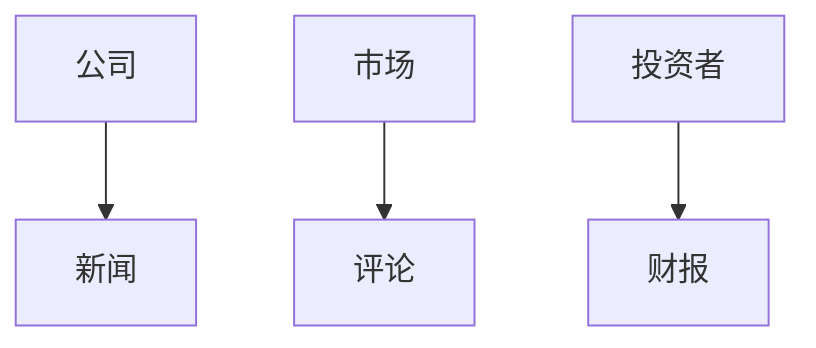
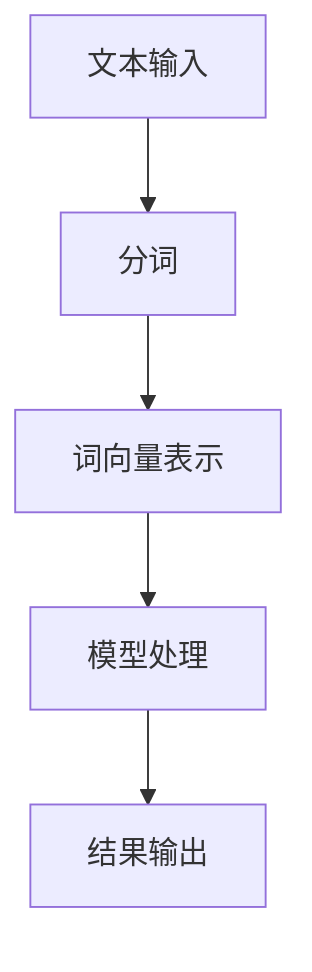

                 

# 自然语言处理在金融AI应用中的最佳实践

> 关键词：自然语言处理（NLP）、人工智能（AI）、金融应用、文本挖掘、机器学习、深度学习

> 摘要：本文深入探讨了自然语言处理技术在金融AI应用中的核心原理、应用场景、算法实现以及系统设计，结合实际案例分析，总结了NLP在金融领域的最佳实践方法，为读者提供了一套系统化、实用的解决方案。

---

# 第一部分: 自然语言处理与金融AI应用的背景与概述

# 第1章: 自然语言处理与金融AI应用的背景

## 1.1 自然语言处理的基本概念

### 1.1.1 自然语言处理的定义与核心概念
自然语言处理（NLP）是人工智能（AI）领域的重要分支，致力于研究如何让计算机理解和生成人类语言。其核心目标是通过算法和模型，实现对文本数据的智能化处理，包括文本解析、信息提取、情感分析、机器翻译等任务。

- **核心概念**：
  - **语言模型**：基于统计或深度学习的方法，预测下一个词的概率分布。
  - **词向量**：将词语表示为低维向量（如Word2Vec、GloVe），捕捉词语之间的语义关系。
  - **序列模型**：如LSTM和Transformer，用于处理序列数据（如文本）。

### 1.1.2 自然语言处理的发展历程
1. **传统NLP**：基于规则的方法，依赖人工编写语法规则，如分词、句法分析。
2. **统计学习**：利用概率模型（如朴素贝叶斯）进行文本分类、信息提取。
3. **深度学习驱动的NLP**：引入神经网络模型（如RNN、LSTM、Transformer），大幅提升处理效果和灵活性。

### 1.1.3 自然语言处理在金融领域的应用潜力
金融领域涉及大量文本数据，如新闻、财报、市场评论等。NLP技术可以从中提取有价值的信息，帮助金融机构进行市场分析、风险评估、欺诈检测等。

---

## 1.2 金融领域的特点与挑战

### 1.2.1 金融数据的特点
- **领域专业性**：金融文本包含大量专业术语和行业知识。
- **数据稀疏性**：某些金融场景（如欺诈检测）的数据量有限。
- **实时性**：金融市场对实时信息处理的需求较高。

### 1.2.2 金融行业的痛点与需求
- **信息处理效率**：如何快速从大量文本中提取关键信息。
- **风险控制**：利用文本数据预测市场风险或企业信用风险。
- **客户交互**：通过智能客服、聊天机器人提升用户体验。

### 1.2.3 金融AI应用的现状与趋势
- **现状**：NLP技术已在金融领域的新闻分析、情感预测等方面取得显著成果。
- **趋势**：随着模型的不断优化，NLP在金融中的应用将更加智能化、自动化。

---

## 1.3 自然语言处理与金融AI的结合

### 1.3.1 NLP在金融中的典型应用场景
- **市场情绪分析**：通过社交媒体或新闻文本预测市场走势。
- **新闻事件抽取**：从新闻中提取公司名称、事件时间等信息。
- **风险评估**：分析企业财报文本，评估企业信用风险。

### 1.3.2 NLP技术如何解决金融问题
- **信息提取**：从非结构化文本中提取关键信息。
- **情感分析**：预测文本中的情感倾向，帮助投资决策。
- **模式识别**：识别文本中的模式和规律，发现潜在的市场机会或风险。

### 1.3.3 金融AI应用中的NLP挑战
- **数据质量**：金融文本可能存在噪声或歧义。
- **模型泛化能力**：如何在小数据情况下保证模型的准确性。
- **实时处理**：如何高效处理实时文本流。

---

## 1.4 本章小结
本章从NLP的基本概念出发，分析了金融领域的特点与需求，探讨了NLP技术在金融中的潜力与应用场景。通过结合实际案例，揭示了NLP在金融AI应用中的重要性。

---

# 第二部分: 自然语言处理在金融应用中的核心概念与联系

# 第2章: 自然语言处理的核心概念与原理

## 2.1 自然语言处理的核心原理

### 2.1.1 语言模型的基本原理
语言模型通过概率分布预测下一个词，常用模型包括：
- **n-gram模型**：基于滑动窗口的简单概率模型。
- **循环神经网络（RNN）**：处理序列数据的模型。
- **Transformer模型**：基于自注意力机制，广泛应用于现代NLP任务。

### 2.1.2 词向量与上下文表示
- **词向量**：将词语表示为向量（如Word2Vec、GloVe）。
- **上下文表示**：通过模型捕捉词的上下文信息（如BERT中的上下文嵌入）。

### 2.1.3 深度学习在NLP中的应用
- **深度学习模型**：如LSTM、Transformer等，已成为现代NLP的核心技术。
- **预训练模型**：如BERT、GPT，通过大规模预训练提升模型的通用性。

---

## 2.2 自然语言处理的关键技术

### 2.2.1 词法分析
- **分词**：将文本分割成词语或短语。
- **词性标注**：为每个词语标注词性（如名词、动词）。

### 2.2.2 句法分析
- **句法结构分析**：解析句子的语法结构（如主语、谓语）。
- **依存关系分析**：分析词语之间的依存关系。

### 2.2.3 语义理解
- **语义角色标注**：分析词语在句子中的语义角色。
- **文本摘要**：从长文本中提取关键信息。

---

## 2.3 自然语言处理在金融中的应用

### 2.3.1 文本分类与金融场景
- **文本分类**：将文本归类到特定类别（如正面、负面、中性）。
- **金融场景**：如新闻分类、客户支持分类。

### 2.3.2 情感分析与市场情绪预测
- **情感分析**：分析文本中的情感倾向，用于市场情绪预测。
- **市场情绪预测**：通过社交媒体数据预测市场走势。

### 2.3.3 实体识别与金融数据提取
- **实体识别**：从文本中识别出人名、地名、机构名等实体。
- **金融数据提取**：从财报、新闻中提取公司名称、金额等信息。

---

## 2.4 核心概念的对比分析

### 2.4.1 NLP技术的对比表格
以下是一个对比表格，展示了NLP技术在不同任务中的表现：

| 技术 | 特点 | 适用场景 |
|------|------|----------|
| 词向量（Word2Vec） | 适合捕捉词义相似性 | 文本分类、情感分析 |
| Transformer | 基于自注意力机制 | 语义理解、机器翻译 |
| LSTM | 处理长序列数据 | 时间序列分析、文本生成 |

### 2.4.2 金融场景中的实体关系图
以下是NLP在金融场景中的实体关系图：

### 2.4.3 Mermaid流程图：NLP在金融中的应用架构

---

## 2.5 本章小结
本章深入分析了NLP的核心原理与关键技术，并结合金融场景，探讨了NLP技术的具体应用。通过对比分析和图示，帮助读者更好地理解NLP在金融中的作用。

---

（以下章节内容请根据需求继续扩展，涵盖算法原理、系统架构、项目实战等部分，确保文章完整性和深度。）

---

# 作者：AI天才研究院/AI Genius Institute & 禅与计算机程序设计艺术 /Zen And The Art of Computer Programming

