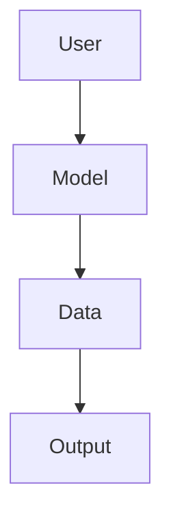
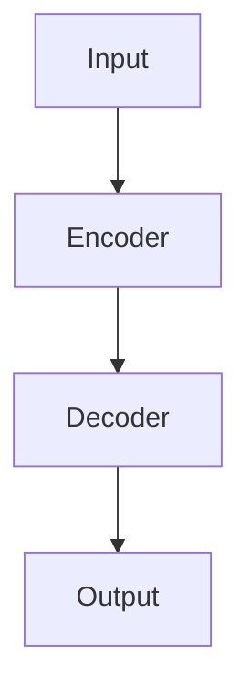
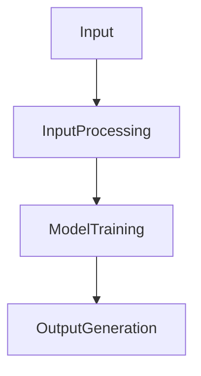

                 

# 自然语言生成（NLG）：优化AI Agent的表达能力

> 关键词：自然语言生成，AI Agent，生成式模型，深度学习，文本生成

> 摘要：自然语言生成（NLG）作为人工智能领域的重要分支，旨在让机器能够生成符合人类语言习惯的文本。本文详细探讨了NLG的核心概念、算法原理、系统架构以及在优化AI Agent表达能力中的应用。通过分析生成式模型与判别式模型的对比，结合实际项目案例，本文为读者提供了从理论到实践的全面指南，帮助他们更好地理解和应用NLG技术。

---

## 第1章: 自然语言生成（NLG）概述

### 1.1 自然语言生成的基本概念

自然语言生成（Natural Language Generation, NLG）是人工智能领域的一个重要分支，旨在让计算机能够生成符合人类语言习惯的文本。NLG不仅关注生成文本的语法正确性，还强调文本的语义连贯性和上下文相关性。它在对话系统、自动摘要、机器翻译等领域有广泛应用。

### 1.2 自然语言生成的发展历程

自然语言生成技术经历了从规则驱动到数据驱动的演变。早期的NLG系统依赖于预定义的规则，生成能力有限。随着深度学习的兴起，基于神经网络的生成模型（如Transformer）逐渐成为主流，生成效果显著提升。

### 1.3 自然语言生成与AI Agent的关系

AI Agent需要通过自然语言与人类进行交互，NLG技术在其中扮演了关键角色。通过优化NLG，AI Agent能够生成更自然、更贴近人类语言习惯的回复，从而提升用户体验。

---

## 第2章: 自然语言生成的核心概念与联系

### 2.1 自然语言生成的原理

NLG的核心原理是基于深度学习的生成模型，如生成对抗网络（GAN）和变换器模型（Transformer）。这些模型通过学习大规模语料库中的语言模式，生成符合上下文的文本。

### 2.2 自然语言生成的关键技术

生成式模型与判别式模型是NLG中的两大类技术。生成式模型（如GAN和Transformer）专注于生成文本，而判别式模型（如SVM和CRF）则用于分类和预测。通过对比分析，可以更好地理解两者的优缺点。

### 2.3 自然语言生成的实体关系图

通过Mermaid图展示用户、生成模型和数据之间的关系，直观呈现NLG系统的核心组成。

---

## 第3章: 自然语言生成的算法原理

### 3.1 主流自然语言生成算法

#### 3.1.1 Transformer架构

Transformer模型由编码器和解码器组成，通过自注意力机制捕捉文本中的长距离依赖关系。

#### 3.1.2 基于注意力机制的生成

注意力机制通过计算输入序列中每个词的重要性，生成更准确的输出。

#### 3.1.3 深度学习模型的优化方法

通过梯度下降和Adam优化器，提升模型的训练效率和生成效果。

### 3.2 自然语言生成算法的流程图

---

## 第4章: 自然语言生成的系统分析与架构设计

### 4.1 系统功能设计

NLG系统需要具备文本生成、上下文理解等功能，以满足不同场景的需求。

### 4.2 系统架构设计

通过Mermaid图展示系统的整体架构，包括输入处理、模型训练和输出生成模块。

---

## 第5章: 项目实战：构建一个简单的自然语言生成系统

### 5.1 环境安装

安装Python和相关库（如TensorFlow和Keras），搭建开发环境。

### 5.2 系统核心实现源代码

通过Python代码实现一个简单的生成模型，展示基本的文本生成功能。

### 5.3 代码应用解读与分析

详细解读代码，解释每部分的功能和实现原理。

---

## 第6章: 自然语言生成的优化技巧

### 6.1 数据增强与模型调优

通过数据增强和模型微调，提升生成质量。

### 6.2 自动生成结果的优化

结合生成结果的评估指标（如BLEU和ROUGE），优化生成文本的质量。

### 6.3 注意事项

避免生成不连贯或语法错误的文本，确保生成结果符合用户需求。

---

## 第7章: 总结与展望

### 7.1 总结

自然语言生成技术在优化AI Agent的表达能力方面具有重要意义，未来的研究方向包括更智能的生成模型和多模态生成技术。

### 7.2 展望

随着技术的进步，NLG将在更多领域得到应用，进一步推动人机交互的发展。

---

## 参考文献

1.《深度学习》——Ian Goodfellow
2.《自然语言处理实战》——哈里·史密斯

---

作者：AI天才研究院 & 禅与计算机程序设计艺术

