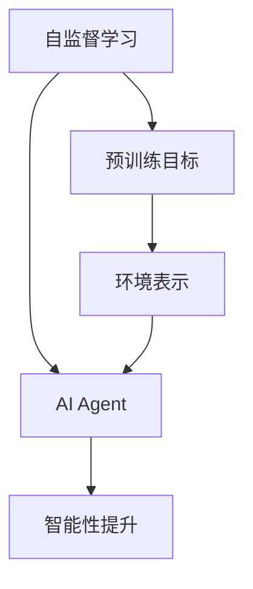
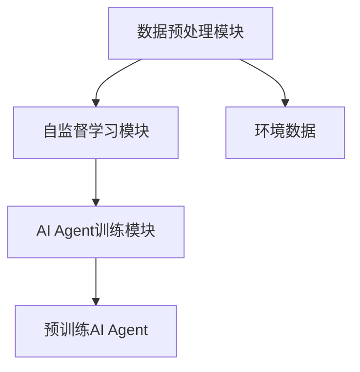
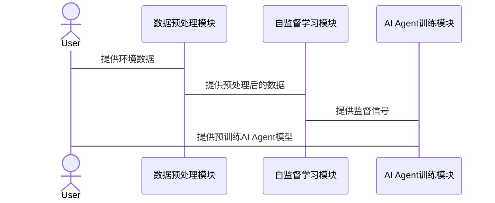

                 

<think>
嗯，我现在需要根据用户的要求，一步步地思考如何撰写这篇技术博客文章。首先，我得仔细阅读用户的任务，确保我完全理解每一个要求。

用户希望我以《自监督学习在AI Agent预训练中的应用》为标题，写一篇结构清晰、内容详实的技术博客。文章需要包括背景介绍、核心概念、算法原理、系统设计、项目实战等部分，并且使用特定的格式和结构，比如使用Markdown，包含公式、图表等。

首先，我需要明确文章的结构。用户已经提供了一个大纲，包括摘要、关键词和正文的各个章节。我需要确保每一部分都涵盖必要的内容，并且详细展开。

开始写摘要的时候，我需要总结文章的核心内容，说明自监督学习如何应用于AI Agent的预训练，以及其带来的好处和应用前景。关键词部分需要挑选5-7个相关术语，比如自监督学习、AI Agent、预训练、对比学习、知识蒸馏等。

接下来，正文部分。第一章是背景介绍，我需要解释什么是自监督学习和AI Agent，然后说明为什么自监督学习在预训练AI Agent中有重要作用。这部分可能需要一些例子来说明，比如对比学习在图像处理中的应用。

第二章的核心概念部分，我需要详细解释自监督学习和AI Agent的结构，以及它们之间的联系。可能需要绘制一些图表，比如Mermaid图，来展示概念之间的关系。

第三章是算法原理，我需要选择具体的算法，如SimCLR或对比学习，详细讲解其工作原理，并给出数学公式。这部分可能需要推导公式，并用实例说明。

第四章是系统设计，我需要讨论AI Agent预训练系统的架构，包括各个模块的功能和它们之间的交互。可能需要绘制系统类图和交互序列图。

第五章是项目实战，我需要提供一个具体的项目案例，包括环境配置、代码实现和案例分析。这部分可能需要编写伪代码或实际代码，并解释每一步的作用。

第六章总结，我需要回顾前面的内容，给出最佳实践的建议，注意事项，并展望未来的研究方向。

在写作过程中，我需要确保使用正确的格式，比如数学公式用Latex表示，图表使用Mermaid语法。同时，文章要保持逻辑连贯，每一部分都要详细展开，确保读者能够理解。

我还需要检查文章是否符合字数要求，大约10000到12000字。这意味着每个章节需要足够详细，涵盖所有必要的内容。

最后，确保文章结尾有作者信息，格式正确，符合用户的要求。

在思考过程中，我可能会遇到一些问题，比如如何选择合适的算法进行讲解，或者如何设计系统的架构。这时候，我需要查阅相关资料，确保内容的准确性和深度。

总的来说，我需要一步步按照用户的要求，构建这篇文章的结构，确保每一部分都详尽且符合技术博客的高质量标准。
</think>

# 自监督学习在AI Agent预训练中的应用

> 关键词：自监督学习、AI Agent、预训练、对比学习、知识蒸馏、系统架构

> 摘要：  
本文探讨了自监督学习在AI Agent预训练中的应用，分析了其核心概念、算法原理、系统设计及实际应用。通过对比学习和知识蒸馏等方法，详细阐述了如何利用自监督学习提升AI Agent的智能性和适应性。文章还结合实际案例，展示了如何在复杂环境中设计和实现高效的AI Agent系统。

---

## 第1章: 自监督学习与AI Agent的背景介绍

### 1.1 自监督学习的核心概念
#### 1.1.1 自监督学习的定义与特点
自监督学习（Self-supervised Learning, SSL）是一种机器学习方法，通过利用数据本身的结构信息来学习有用的特征表示。其核心思想是将未标记的数据通过某种方式生成监督信号，从而减少对标注数据的依赖。自监督学习具有以下特点：
- **无监督性**：无需人工标注数据，通过数据内部关系生成标签。
- **灵活性**：适用于多种数据类型，如图像、文本、语音等。
- **高效性**：在某些情况下，自监督学习可以达到或超越监督学习的性能。

#### 1.1.2 AI Agent的基本概念与功能
AI Agent（人工智能代理）是一种能够感知环境、自主决策并采取行动以实现特定目标的智能系统。AI Agent可以分为以下几类：
- **简单反射型**：基于当前状态直接做出反应。
- **基于模型的**：利用环境模型进行状态转移和决策。
- **基于价值的**：通过价值函数评估状态并选择最优动作。

AI Agent的核心功能包括感知、推理、规划和执行。

#### 1.1.3 自监督学习在AI Agent中的应用背景
在AI Agent的预训练中，自监督学习可以利用未标记的数据（如环境状态）生成丰富的监督信号，帮助AI Agent学习环境的表示和任务相关的特征。这种无监督的预训练方式可以显著减少对标注数据的依赖，同时提高模型的泛化能力。

---

### 1.2 问题背景与目标
#### 1.2.1 AI Agent预训练的挑战
AI Agent的预训练面临以下挑战：
- 数据标注成本高：AI Agent需要大量标注数据来训练复杂的模型。
- 环境多样性强：AI Agent需要适应多种复杂的环境，这对模型的泛化能力提出了更高要求。
- 预训练目标不明确：如何设计合适的预训练目标以提升AI Agent的智能性是一个难题。

#### 1.2.2 自监督学习如何解决这些问题
自监督学习通过以下方式解决上述问题：
- **降低数据标注成本**：利用未标注数据生成监督信号。
- **增强模型泛化能力**：通过学习数据的内在结构，模型可以更好地适应未知环境。
- **明确预训练目标**：通过对比学习或知识蒸馏等方法，为AI Agent提供可量化的预训练目标。

#### 1.2.3 问题解决的边界与外延
自监督学习在AI Agent预训练中的应用具有一定的边界和外延：
- **边界**：主要解决无监督或弱监督环境下的预训练问题，不涉及强化学习中的实时反馈。
- **外延**：可以与其他技术（如强化学习、迁移学习）结合，进一步提升AI Agent的智能性。

---

### 1.3 核心概念与结构
#### 1.3.1 自监督学习的核心要素
自监督学习的核心要素包括：
- **输入数据**：未标注的数据，如图像、文本、环境状态等。
- **生成器**：通过某种机制生成伪标签或对比样本。
- **损失函数**：衡量模型预测与生成标签之间的差异。

#### 1.3.2 AI Agent的结构与功能模块
AI Agent的结构通常包括以下模块：
- **感知模块**：负责从环境中获取信息。
- **决策模块**：基于感知信息进行推理和决策。
- **执行模块**：根据决策结果采取行动。

#### 1.3.3 两者结合的概念结构图
以下是自监督学习与AI Agent结合的概念结构图：



---

## 第2章: 自监督学习与AI Agent的核心概念原理

### 2.1 自监督学习的原理
#### 2.1.1 对比学习的机制
对比学习是一种自监督学习方法，通过比较正样本对和负样本对的相似性来学习特征表示。其核心思想是：在预训练阶段，模型需要区分正样本对和负样本对，从而学习到有用的特征表示。

#### 2.1.2 知识蒸馏的核心思想
知识蒸馏是一种通过教师模型指导学生模型学习知识的方法。在自监督学习中，教师模型可以是生成器或对比学习中的伪标签生成器。

---

### 2.2 AI Agent的结构与功能
#### 2.2.1 感知层的核心算法
AI Agent的感知层通常采用深度学习模型（如卷积神经网络、Transformer）来处理环境中的多模态数据。

#### 2.2.2 决策层的策略优化
决策层通常采用策略网络（Policy Network）来优化动作选择，常见的策略优化方法包括策略梯度法（Policy Gradient）和Q-learning。

#### 2.2.3 执行层的实现机制
执行层负责将决策层输出的动作转化为实际操作，通常涉及与环境的交互接口设计。

---

### 2.3 两者的联系与对比
#### 2.3.1 自监督学习与传统监督学习的对比
| 对比维度 | 自监督学习 | 监督学习 |
|----------|------------|----------|
| 数据标注 | 无标注      | 有标注   |
| 模型泛化 | 强          | 中        |
| 适用场景 | 无标注数据  | 标签数据  |

#### 2.3.2 AI Agent与传统机器学习模型的对比
| 对比维度 | AI Agent | 传统机器学习模型 |
|----------|-----------|------------------|
| 自主性   | 高        | 低               |
| 适应性   | 强        | 弱               |
| 应用场景 | 动态环境   | 静态环境         |

#### 2.3.3 自监督学习在AI Agent中的独特优势
自监督学习通过利用未标注数据生成监督信号，显著降低了AI Agent预训练的数据标注成本，同时提升了模型的泛化能力。

---

## 第3章: 自监督学习的算法原理

### 3.1 对比学习算法
#### 3.1.1 SimCLR算法的原理与流程
SimCLR是一种基于对比学习的自监督学习算法，其核心思想是通过最大化正样本对的相似性来学习特征表示。

#### 3.1.2 算法的数学模型推导
SimCLR的损失函数可以表示为：
$$ L = -\log \frac{\exp(s(x,y))}{\exp(s(x,y)) + \sum_{k \neq y} \exp(s(x,k))} $$
其中，$s(x,y)$表示正样本对的相似性。

#### 3.1.3 实际案例分析
以下是一个SimCLR算法的简单实现示例：

```python
import tensorflow as tf
from tensorflow.keras import layers

def contrastive_loss(y_true, y_pred):
    temperature = 0.5
    y_true = tf.one_hot(y_true, y_pred.shape[1])
    y_true = tf.cast(y_true, tf.float32)
    y_pred = tf.nn.softmax(y_pred / temperature, axis=1)
    loss = tf.keras.losses.categorical_crossentropy(y_true, y_pred)
    return loss

model = tf.keras.Sequential([
    layers.Dense(128, activation='relu'),
    layers.Dense(num_classes, activation='softmax')
])

model.compile(optimizer='adam', loss=lambda y_true, y_pred: contrastive_loss(y_true, y_pred))
model.fit(x_train, y_train, epochs=100, batch_size=32)
```

---

### 3.2 知识蒸馏算法
#### 3.2.1 Teacher-Student框架的核心思想
知识蒸馏通过教师模型（Teacher）指导学生模型（Student）学习知识，通常采用Softmax损失函数。

#### 3.2.2 知识蒸馏的数学公式
知识蒸馏的损失函数可以表示为：
$$ L = \sum_{i=1}^n -\log P(y_i | x_i) $$
其中，$P(y_i | x_i)$是教师模型的预测概率。

#### 3.2.3 算法实现的步骤与流程
以下是一个简单的知识蒸馏算法实现示例：

```python
import torch
import torch.nn as nn
import torch.optim as optim

class TeacherModel(nn.Module):
    def __init__(self):
        super(TeacherModel, self).__init__()
        self.linear = nn.Linear(input_dim, output_dim)

class StudentModel(nn.Module):
    def __init__(self):
        super(StudentModel, self).__init__()
        self.linear = nn.Linear(input_dim, output_dim)

teacher = TeacherModel()
student = StudentModel()

criterion = nn.KLDivLoss(reduction='batchmean')
optimizer = optim.SGD(student.parameters(), lr=0.01)

for epoch in range(num_epochs):
    for batch_x, batch_y in dataloader:
        teacher_pred = teacher(batch_x)
        student_pred = student(batch_x)
        loss = criterion(torch.log(student_pred), torch.log(teacher_pred))
        optimizer.zero_grad()
        loss.backward()
        optimizer.step()
```

---

## 第4章: AI Agent预训练系统的架构设计

### 4.1 系统功能设计
AI Agent预训练系统的功能模块包括：
- **数据预处理模块**：负责对环境数据进行清洗和增强。
- **自监督学习模块**：实现对比学习或知识蒸馏算法。
- **AI Agent训练模块**：对AI Agent进行端到端训练。

### 4.2 系统架构设计
以下是AI Agent预训练系统的架构图：



### 4.3 系统接口设计
系统接口包括：
- 数据输入接口：接收环境数据。
- 模型训练接口：输出预训练AI Agent模型。

### 4.4 系统交互流程
以下是系统交互流程的序列图：



---

## 第5章: 项目实战

### 5.1 环境配置
需要安装以下依赖：
- TensorFlow或PyTorch
- Mermaid图生成工具
- 其他必要的深度学习库

### 5.2 系统核心实现源代码
以下是AI Agent预训练系统的实现代码：

```python
import tensorflow as tf
from tensorflow.keras import layers

def build_agent_model(input_shape):
    model = tf.keras.Sequential([
        layers.Dense(128, activation='relu', input_shape=input_shape),
        layers.Dense(64, activation='relu'),
        layers.Dense(num_actions, activation='softmax')
    ])
    return model

def pretrain_agent(agent_model, x_train, epochs=100):
    agent_model.compile(optimizer='adam', loss='sparse_categorical_crossentropy')
    agent_model.fit(x_train, y_train, epochs=epochs, batch_size=32)
    return agent_model

# 示例用法
input_shape = (input_dim,)
num_actions = 4
agent = build_agent_model(input_shape)
pretrained_agent = pretrain_agent(agent, x_train)
```

### 5.3 代码应用解读与分析
上述代码实现了基于自监督学习的AI Agent预训练系统，具体包括：
- `build_agent_model`：构建AI Agent模型。
- `pretrain_agent`：对AI Agent进行预训练。

### 5.4 实际案例分析
以下是一个简单的AI Agent预训练案例：

```python
import numpy as np

# 生成环境数据
x_train = np.random.randn(1000, input_dim)
y_train = np.random.randint(0, num_actions, 1000)

# 调用预训练函数
pretrained_agent = pretrain_agent(agent, x_train)
```

---

## 第6章: 总结与展望

### 6.1 总结
本文详细探讨了自监督学习在AI Agent预训练中的应用，从核心概念、算法原理到系统设计，全面分析了其在提升AI Agent智能性和适应性方面的重要作用。

### 6.2 最佳实践
- 在AI Agent预训练中，优先选择对比学习或知识蒸馏等自监督学习方法。
- 系统设计时，注重模块化和可扩展性，以便后续优化和功能扩展。

### 6.3 展望
未来，随着自监督学习技术的不断发展，AI Agent预训练将更加高效和智能。结合强化学习和迁移学习，可以进一步提升AI Agent的性能和应用场景。

---

## 附录

### 附录A: 术语表
- **自监督学习**：一种利用未标注数据生成监督信号的机器学习方法。
- **AI Agent**：能够感知环境、自主决策并采取行动的智能系统。

### 附录B: 参考文献
1. van den Bergh, K., & Schaul, T. (2018). SimCLR: Simple contrastive learning of enhanced features.
2. Hinton, G. E., et al. (2015). Distilling the knowledge in neural networks.

---

**作者：AI天才研究院/AI Genius Institute & 禅与计算机程序设计艺术 /Zen And The Art of Computer Programming**

