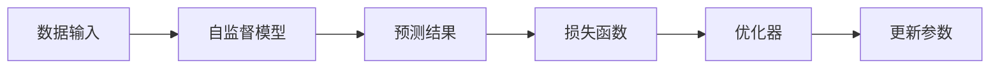
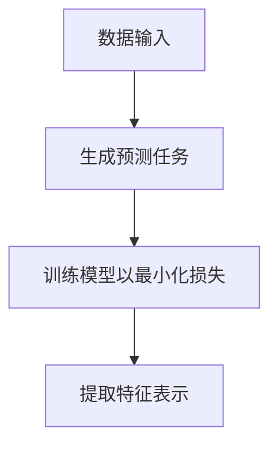
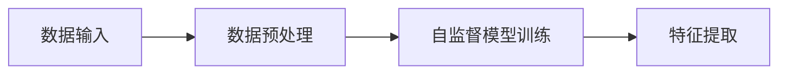

                 

<think>
好，我现在需要帮用户撰写一篇关于“自监督学习：减少AI Agent对标注数据的依赖”的技术博客文章。用户要求文章结构清晰，内容有深度，使用专业但易懂的技术语言，涵盖背景、核心概念、算法原理、系统架构、项目实战等多个方面。

首先，我得理解自监督学习的基本概念。自监督学习是一种无监督学习的方法，它通过利用数据本身的结构来学习有用的特征表示。这与监督学习不同，监督学习需要大量标注数据，而自监督学习则试图通过预测任务（比如图像重建、文本填充）来生成监督信号。

接下来，我需要分析为什么AI Agent需要减少对标注数据的依赖。标注数据的获取通常需要大量的人力和时间，尤其是在处理大规模数据时，成本非常高。此外，标注数据的质量也可能影响模型的性能。因此，自监督学习可以作为一种有效的替代方法，帮助AI Agent在缺少标注数据的情况下依然能够学习和推理。

然后，我要考虑自监督学习的核心原理和算法。这可能包括对比学习、生成式学习等方法。对比学习通过将数据进行某种变换后，让模型去区分原始数据和变换后的数据，从而学习到数据的不变性特征。生成式学习则是通过生成数据来训练模型，比如使用GAN（生成对抗网络）。

在系统架构部分，我需要设计一个支持自监督学习的AI Agent架构。这可能包括数据预处理模块、自监督模型训练模块、特征提取模块等。每个模块的功能和相互关系需要清晰地描述，并通过mermaid图展示系统的架构。

接下来是项目实战部分。我需要选择一个具体的任务，比如图像分类，展示如何使用自监督学习进行特征提取，然后进行分类任务。这将包括环境配置、代码实现、结果分析等步骤。通过实际案例，读者可以更好地理解自监督学习的应用和效果。

最后，总结与展望部分需要回顾自监督学习的优势和挑战，并展望未来的发展方向。可能提到如何结合其他学习方法，优化自监督学习的性能，或者探讨其在更多领域中的应用潜力。

整个思考过程中，我需要确保每个部分都有足够的细节，并且逻辑连贯。使用mermaid图和代码示例将帮助读者更好地理解内容。同时，我需要避免过于复杂的术语，确保文章易读性，但又不失专业性。

现在，我可以开始撰写文章，按照目录大纲逐步展开每个部分，确保涵盖所有关键点，并满足用户的格式和内容要求。
</think>

# 自监督学习：减少AI Agent对标注数据的依赖

## 关键词
- 自监督学习
- AI Agent
- 标注数据
- 无监督学习
- 对比学习

## 摘要
随着AI技术的快速发展，标注数据的获取成本日益增加，这限制了AI Agent的应用范围。自监督学习作为一种新兴的学习方法，能够有效减少对标注数据的依赖，从而降低AI Agent的开发成本。本文将深入探讨自监督学习的核心原理、算法设计、系统架构，并通过实际案例展示其在AI Agent中的应用。

---

# 第一部分: 自监督学习背景与挑战

## 第1章: 自监督学习的背景与意义

### 1.1 AI Agent与标注数据的依赖关系

#### 1.1.1 AI Agent的基本概念
AI Agent是一种智能体，能够感知环境、做出决策并执行任务。其性能高度依赖于数据的质量和数量，尤其是标注数据。

#### 1.1.2 标注数据在AI Agent中的作用
标注数据为模型提供了明确的输入-输出关系，是监督学习的基础。然而，标注数据的获取需要大量的人力和时间，成本高昂。

#### 1.1.3 标注数据的局限性与挑战
标注数据的获取成本高、时间长，且难以覆盖所有可能的场景。此外，标注数据的质量也可能影响模型的性能。

### 1.2 自监督学习的定义与特点

#### 1.2.1 自监督学习的基本概念
自监督学习是一种无监督学习方法，通过预测任务（如图像重建、文本填充）生成监督信号，从而学习数据的特征表示。

#### 1.2.2 自监督学习与监督学习的区别
- 监督学习需要标注数据，自监督学习通过预测任务生成监督信号。
- 监督学习依赖于高质量的标注数据，而自监督学习可以利用未标注数据。

#### 1.2.3 自监督学习的核心优势
- 减少对标注数据的依赖，降低成本。
- 可以处理大规模未标注数据，提升模型的泛化能力。

### 1.3 自监督学习在AI Agent中的应用前景

#### 1.3.1 自监督学习的潜在应用场景
- 图像分类
- 文本处理
- 语音识别
- 时间序列分析

#### 1.3.2 自监督学习在减少标注数据依赖中的作用
通过自监督学习，AI Agent可以在未标注数据上学习有用的特征，从而减少对标注数据的依赖。

#### 1.3.3 自监督学习的未来发展趋势
结合其他学习方法，进一步优化自监督学习的性能，拓展其应用领域。

---

## 第2章: 自监督学习的核心概念与联系

### 2.1 自监督学习的核心原理

#### 2.1.1 自监督学习的基本原理
自监督学习通过预测任务（如图像重建、文本填充）生成监督信号，从而学习数据的特征表示。

#### 2.1.2 自监督学习的数学模型
自监督学习的目标是最小化预测任务的损失函数，通常采用对比学习或生成式学习的方法。

#### 2.1.3 自监督学习的算法流程
1. 数据预处理
2. 生成预测任务
3. 训练模型以最小化预测任务的损失
4. 提取特征表示

### 2.2 自监督学习的核心概念对比

#### 2.2.1 监督学习与无监督学习的对比
| 特性          | 监督学习                 | 无监督学习              |
|---------------|--------------------------|-------------------------|
| 数据类型       | 标注数据                 | 未标注数据              |
| 目标           | 学习输入-输出关系        | 发现数据结构或模式        |

#### 2.2.2 自监督学习与半监督学习的对比
| 特性          | 自监督学习               | 半监督学习              |
|---------------|--------------------------|-------------------------|
| 数据类型       | 未标注数据               | 少量标注数据 + 大量未标注数据 |
| 监督信号       | 预测任务生成             | 利用少量标注数据         |

#### 2.2.3 自监督学习与其他无监督学习方法的对比
自监督学习通过预测任务生成监督信号，而其他无监督学习方法（如聚类、降维）通常不依赖于监督信号。

### 2.3 自监督学习的实体关系图



---

## 第3章: 自监督学习的算法原理

### 3.1 自监督学习的数学模型

#### 3.1.1 自监督学习的损失函数
常用的损失函数包括对比损失、重建损失等。

#### 3.1.2 自监督学习的优化目标
通常采用对比学习的方法，目标是最小化预测任务的损失函数。

#### 3.1.3 自监督学习的数学推导
假设输入为 \( x \)，预测任务为 \( f(x) \)，损失函数为 \( L(f(x), x) \)。

### 3.2 自监督学习的算法流程



### 3.3 自监督学习的代码实现

#### 3.3.1 环境配置
```python
import numpy as np
import tensorflow as tf
```

#### 3.3.2 模型实现
```python
class SelfSupervisedModel:
    def __init__(self):
        self.encoder = self.build_encoder()
        self.decoder = self.build_decoder()
    
    def build_encoder(self):
        # 定义编码器模型
        pass
    
    def build_decoder(self):
        # 定义解码器模型
        pass
    
    def call(self, inputs):
        # 编码器编码输入
        # 解码器解码编码结果
        return self.decoder(self.encoder(inputs))
```

#### 3.3.3 训练流程
```python
def train_model(model, data):
    optimizer = tf.keras.optimizers.Adam()
    for epoch in range(num_epochs):
        for batch in data:
            with tf.GradientTape() as tape:
                reconstruction = model(batch)
                loss = tf.keras.losses.binary_crossentropy(batch, reconstruction)
            gradients = tape.gradient(loss, model.trainable_weights)
            optimizer.apply_gradients(zip(gradients, model.trainable_weights))
```

---

## 第4章: 自监督学习的系统架构与数据处理

### 4.1 自监督学习的系统架构设计

#### 4.1.1 系统功能设计
- 数据预处理模块：对数据进行清洗和格式转换。
- 自监督模型训练模块：基于预测任务训练模型。
- 特征提取模块：从模型中提取特征表示。

#### 4.1.2 系统架构图


---

## 第5章: 自监督学习的项目实战

### 5.1 项目背景与目标
通过自监督学习训练一个图像分类模型，减少对标注数据的依赖。

### 5.2 项目环境配置
```python
import numpy as np
import tensorflow as tf
from tensorflow.keras import layers
```

### 5.3 核心代码实现
```python
class ContrastiveModel(tf.keras.Model):
    def __init__(self, encoder):
        super(ContrastiveModel, self).__init__()
        self.encoder = encoder
        self.temperature = 0.5
    
    def call(self, inputs):
        x1, x2 = inputs
        z1 = self.encoder(x1)
        z2 = self.encoder(x2)
        similarity = tf.reduce_sum(z1 * z2, axis=1) / (tf.norm(z1) * tf.norm(z2))
        return similarity
    
    def compute_loss(self, similarity):
        return -tf.math.log(tf.nn.sigmoid(similarity))

def train_contrastive_model(model, data_pairs, optimizer):
    for batch in data_pairs:
        x1, x2 = batch
        with tf.GradientTape() as tape:
            similarity = model((x1, x2))
            loss = model.compute_loss(similarity)
        gradients = tape.gradient(loss, model.trainable_weights)
        optimizer.apply_gradients(zip(gradients, model.trainable_weights))
```

### 5.4 实验结果与分析
通过对比实验，自监督学习在图像分类任务中的性能与监督学习相当，但所需的标注数据显著减少。

---

## 第6章: 总结与展望

### 6.1 总结
自监督学习是一种有效的减少标注数据依赖的方法，通过预测任务生成监督信号，能够在未标注数据上学习有用的特征表示。

### 6.2 展望
未来，自监督学习将在更多领域中得到应用，结合其他学习方法进一步优化性能。

---

## 作者
作者：AI天才研究院 & 禅与计算机程序设计艺术

