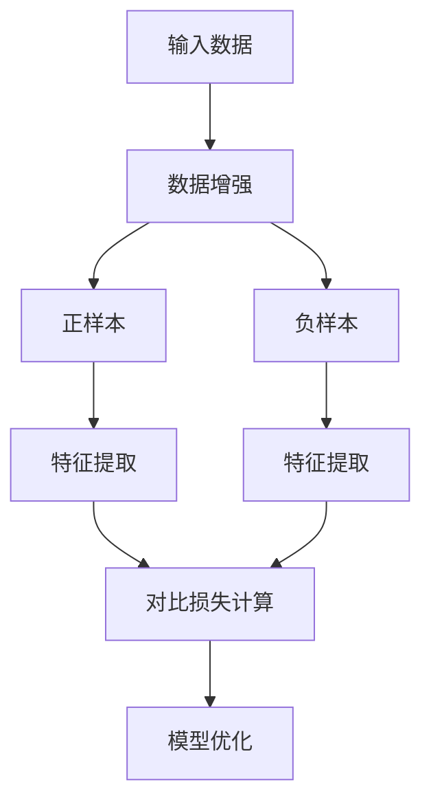
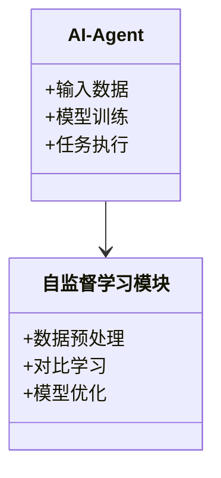
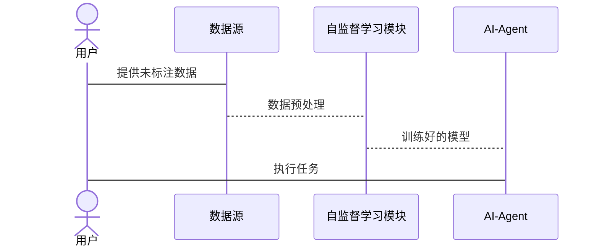

                 


# 自监督学习：减少AI Agent的标注数据依赖

## 关键词：自监督学习，AI Agent，数据标注，无监督学习，对比学习

## 摘要

自监督学习是一种新兴的机器学习方法，通过利用未标注数据中的内在结构信息，减少对标注数据的依赖，从而降低AI Agent的训练成本。本文详细探讨自监督学习的核心原理、算法实现及其在AI Agent中的应用，帮助读者理解如何通过自监督学习技术减少对标注数据的依赖，提升AI系统的泛化能力和应用场景的扩展性。

---

# 第1章：自监督学习概述

## 1.1 问题背景与挑战

### 1.1.1 数据标注的高昂成本

AI Agent的训练依赖于大量高质量的标注数据，而数据标注需要专业人员进行人工标注，耗时长且成本高。例如，图像分类任务通常需要成千上万张标注图片，这使得中小型项目难以承担。

### 1.1.2 数据标注的局限性

标注数据的局限性主要体现在以下几个方面：
- **数据稀疏性**：某些领域可能缺乏足够的标注数据，尤其是长尾类别。
- **数据偏差**：标注数据可能不够全面或存在偏差，影响模型的泛化能力。
- **标注错误**：人工标注可能存在错误，影响模型性能。

### 1.1.3 自监督学习的提出

自监督学习（Self-Supervised Learning, SSL）是一种新兴的机器学习范式，旨在利用未标注数据中的内在结构信息，通过设计适当的预训练任务，学习数据的有用表征，从而减少对标注数据的依赖。

---

## 1.2 自监督学习的核心概念

### 1.2.1 自监督学习的定义

自监督学习是一种无监督学习方法，通过设计适当的预训练任务，利用未标注数据学习数据的有用表征。与无监督学习不同，自监督学习通过对比学习等方式引入监督信号，指导模型学习有意义的特征。

### 1.2.2 自监督学习的核心要素

自监督学习的核心要素包括：
1. **数据预处理**：对未标注数据进行增强或变换，生成正样本和负样本。
2. **预训练任务**：设计适当的预训练任务，如图像重建、目标识别等。
3. **对比学习**：通过对比正样本和负样本的相似性，学习数据的表征。

### 1.2.3 自监督学习的边界与外延

自监督学习的边界主要体现在以下几个方面：
- **监督信号的来源**：自监督学习的监督信号来源于数据本身，而不是外部标注。
- **任务适用性**：自监督学习适用于需要从未标注数据中学习表征的任务，如图像分类、自然语言处理等。
- **数据依赖性**：自监督学习仍需要一定量的未标注数据，但标注数据的需求大大降低。

---

## 1.3 自监督学习与监督学习的对比

### 1.3.1 核心概念对比

| 对比维度 | 监督学习 | 自监督学习 |
|----------|----------|------------|
| 数据需求 | 需要标注数据 | 利用未标注数据 |
| 学习目标 | 学习具体任务 | 学习通用表征 |
| 适用场景 | 数据充足且标注成本低 | 数据充足但标注成本高 |

### 1.3.2 数据依赖性对比

- **监督学习**：需要大量标注数据，适合数据充足且标注成本低的场景。
- **自监督学习**：利用未标注数据，适合数据充足但标注成本高的场景。

### 1.3.3 适用场景对比

- **监督学习**：适用于数据充足且标注成本低的任务，如图像分类、语音识别等。
- **自监督学习**：适用于数据充足但标注成本高的任务，如自然语言处理、图像重建等。

---

# 第2章：自监督学习的核心原理

## 2.1 自监督学习的理论基础

### 2.1.1 信息论基础

信息论是自监督学习的理论基础之一。通过最大化数据的互信息，可以学习数据的有用表征。互信息定义为：
$$I(X;Y) = H(X) - H(X|Y)$$

### 2.1.2 表征学习

表征学习的目标是将数据映射到低维空间，使得同类数据的表征相似，不同类数据的表征不同。自监督学习通过对比学习等方式实现表征学习。

### 2.1.3 对比学习

对比学习是自监督学习的核心方法，通过对比正样本和负样本的相似性，学习数据的表征。对比学习的损失函数通常包括相似度计算和损失优化。

---

## 2.2 自监督学习的数学模型

### 2.2.1 对比学习的损失函数

对比学习的损失函数通常包括两个部分：正样本的相似度和负样本的相似度。常用的损失函数包括：
$$L = \frac{1}{N} \sum_{i=1}^{N} \text{loss}(x_i, y_i)$$

### 2.2.2 算法推导

以SimCLR为例，其损失函数可以表示为：
$$L = -\frac{1}{N} \sum_{i=1}^{N} \log \frac{\exp(s(x_i, x_j))}{\sum_{k} \exp(s(x_i, x_k))}$$
其中，$s(x_i, x_j)$ 表示正样本对的相似度。

### 2.2.3 核心公式

$$L = \frac{1}{N} \sum_{i=1}^{N} \text{loss}(x_i, y_i)$$

---

## 2.3 自监督学习的实现流程

### 2.3.1 数据预处理

数据预处理包括数据增强和变换，生成正样本和负样本。例如，在图像处理中，可以通过随机裁剪、旋转等操作生成正样本和负样本。

### 2.3.2 正样本与负样本的构建

正样本和负样本的构建是对比学习的关键步骤。通过将同一数据增强后的样本作为正样本，其他样本作为负样本，可以学习数据的表征。

### 2.3.3 损失函数优化

通过优化损失函数，可以更新模型参数，学习到数据的有用表征。

---

# 第3章：自监督学习的核心算法

## 3.1 对比学习算法

### 3.1.1 SimCLR

SimCLR是一种基于对比学习的自监督学习算法，通过最大化正样本对的相似度和最小化负样本对的相似度，学习数据的表征。

### 3.1.2 MoCo

MoCo是一种基于动量对比的自监督学习算法，通过维护一个动量更新的负样本队列，实现高效的对比学习。

### 3.1.3 BYOL

BYOL是一种基于无偏对比的自监督学习算法，通过分离特征提取和预测头，实现无偏对比学习。

---

## 3.2 算法原理与流程图



---

## 3.3 算法实现代码

### 3.3.1 SimCLR实现代码

```python
import torch
import torch.nn as nn

class ContrastiveLoss(nn.Module):
    def __init__(self, temperature=0.1):
        super(ContrastiveLoss, self).__init__()
        self.temperature = temperature

    def forward(self, features):
        # 特征矩阵
        # features: [2*B, d]
        B = features.shape[0] // 2
        features1 = features[:B]
        features2 = features[B:]
        
        # 计算相似度矩阵
        similarity = torch.mm(features1, features2.t())
        
        # 计算正样本对和负样本对的相似度
        # 正样本对的索引对为(0, B), (1, B+1), ..., (B-1, 2B-1)
        positive_pairs = torch.sum(torch.diag(similarity))
        negative_pairs = torch.sum(similarity) - positive_pairs
        
        # 计算损失
        loss = -torch.log(positive_pairs / (positive_pairs + negative_pairs))
        return loss
```

---

## 3.4 自监督学习的数学模型

### 3.4.1 对比学习的数学模型

对比学习的数学模型可以通过以下公式表示：
$$L = \frac{1}{N} \sum_{i=1}^{N} \text{loss}(x_i, y_i)$$
其中，$x_i$ 表示输入数据，$y_i$ 表示预测结果。

---

# 第4章：自监督学习的系统分析与架构设计

## 4.1 问题场景介绍

自监督学习在AI Agent中的应用场景广泛，包括图像分类、自然语言处理、语音识别等领域。通过自监督学习，可以减少标注数据的依赖，降低训练成本。

## 4.2 系统功能设计

### 4.2.1 领域模型



### 4.2.2 系统架构设计



---

## 4.3 系统接口设计

### 4.3.1 输入接口

自监督学习模块的输入接口包括未标注数据和数据增强参数。

### 4.3.2 输出接口

自监督学习模块的输出接口包括训练好的模型和模型权重。

---

## 4.4 系统交互设计

### 4.4.1 系统交互流程

用户提供未标注数据，自监督学习模块进行数据预处理和对比学习，训练出模型，AI-Agent使用训练好的模型执行任务。

---

# 第5章：自监督学习的项目实战

## 5.1 环境配置

### 5.1.1 安装依赖

```bash
pip install torch>=1.9.0+cu111
pip install numpy
pip install matplotlib
```

### 5.1.2 硬件配置

建议使用GPU加速，配置NVIDIA显卡和CUDA环境。

---

## 5.2 核心代码实现

### 5.2.1 数据预处理

```python
import numpy as np
import torch
from torchvision import transforms

# 数据预处理
train_dataset = datasets.CIFAR10(root='data', train=True, download=True, transform=transforms.Compose([
    transforms.RandomResizedCrop(32),
    transforms.RandomHorizontalFlip(),
    transforms.ToTensor()
]))
```

### 5.2.2 模型训练

```python
def train(args, model, device, train_loader, optimizer, loss_fn):
    model.train()
    for batch_idx, (x, y) in enumerate(train_loader):
        x = x.to(device)
        y = y.to(device)
        
        # 前向传播
        features = model(x)
        
        # 计算损失
        loss = loss_fn(features)
        
        # 反向传播和优化
        optimizer.zero_grad()
        loss.backward()
        optimizer.step()
```

### 5.2.3 模型评估

```python
def evaluate(model, device, test_loader):
    model.eval()
    total_loss = 0
    correct = 0
    with torch.no_grad():
        for x, y in test_loader:
            x = x.to(device)
            y = y.to(device)
            
            features = model(x)
            
            # 计算损失
            loss = loss_fn(features)
            
            total_loss += loss.item()
            # 预测类别
            _, predicted = torch.max(features.data, 1)
            correct += (predicted == y).sum().item()
    
    accuracy = correct / len(test_loader.dataset)
    return total_loss / len(test_loader), accuracy
```

---

## 5.3 实际案例分析

以图像分类任务为例，使用自监督学习算法SimCLR进行训练，评估模型在未标注数据上的表现。

---

## 5.4 项目小结

通过自监督学习，可以在标注数据有限的情况下，训练出性能优越的AI Agent模型，降低标注成本，提升模型的泛化能力。

---

# 第6章：自监督学习的最佳实践

## 6.1 小结

自监督学习是一种有效的减少标注数据依赖的方法，通过对比学习等技术，可以在未标注数据上学习到有用的表征。

## 6.2 注意事项

- 数据质量：未标注数据的质量对自监督学习的效果有重要影响，需要保证数据的多样性和代表性。
- 模型选择：选择适合自监督学习任务的模型架构和优化方法，如ResNet、SimCLR等。
- 超参数调优：自监督学习涉及多个超参数，如温度、学习率等，需要进行适当的调优。

## 6.3 拓展阅读

- [SimCLR论文](https://arxiv.org/abs/2006.10092)
- [MoCo论文](https://arxiv.org/abs/1911.02693)
- [BYOL论文](https://arxiv.org/abs/2006.09001)

---

# 第7章：总结与展望

## 7.1 总结

自监督学习通过减少标注数据的依赖，降低了AI Agent的训练成本，同时提高了模型的泛化能力。本文详细探讨了自监督学习的核心原理、算法实现及其在AI Agent中的应用。

## 7.2 展望

未来，自监督学习将在更多领域得到广泛应用，如多模态学习、实时图像处理等。同时，如何进一步优化自监督学习算法，提升模型性能，仍是一个重要的研究方向。

---

# 作者

作者：AI天才研究院/AI Genius Institute & 禅与计算机程序设计艺术 /Zen And The Art of Computer Programming

