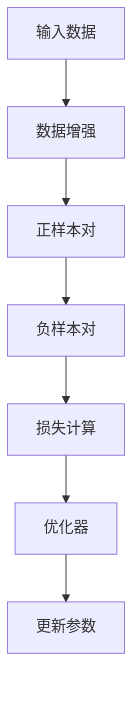
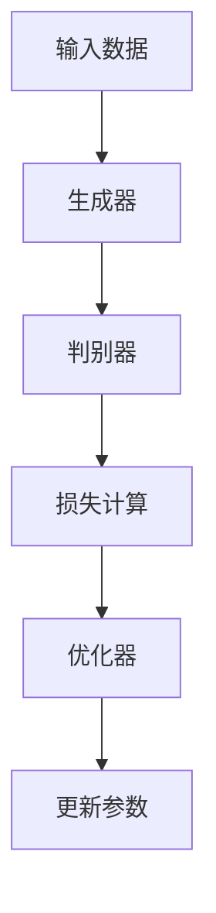
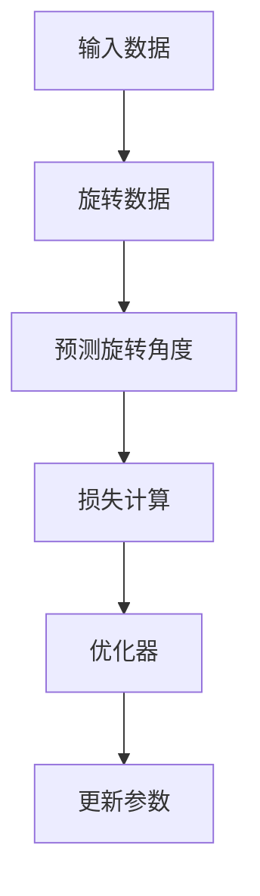
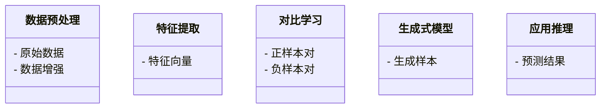
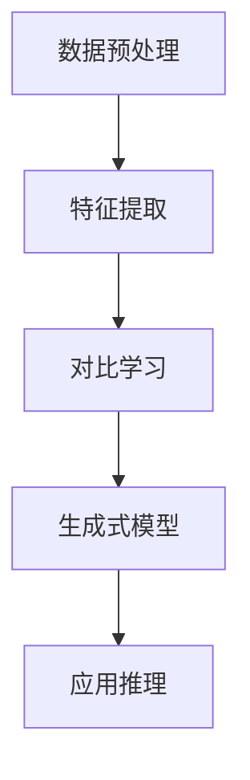
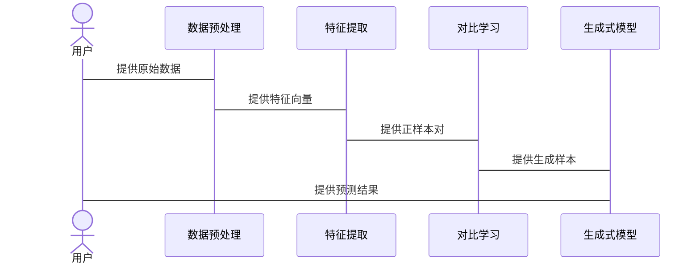

                 


# 自监督学习：利用未标记数据提升AI Agent能力

**关键词：** 自监督学习、未标记数据、AI Agent、机器学习、深度学习、对比学习、生成式模型

**摘要：** 自监督学习是一种新兴的无监督学习方法，通过利用未标记数据的内在结构和关系，提升AI Agent的学习能力和性能。本文从自监督学习的核心原理、算法实现、系统架构到实际应用，全面深入地探讨了如何通过自监督学习技术，最大化地利用未标记数据，提升AI Agent的智能水平和应用场景中的实际效果。

---

# 第一部分: 自监督学习的背景与核心概念

## 第1章: 自监督学习的背景与问题背景

### 1.1 自监督学习的起源与发展

#### 1.1.1 无监督学习的演进
无监督学习是机器学习领域的重要分支，旨在从无标签数据中发现隐含模式和结构。自监督学习作为无监督学习的一种，通过引入监督信号，将无监督任务转化为有监督学习问题。这种方法的起源可以追溯到20世纪90年代，但真正的发展得益于深度学习技术的兴起。

#### 1.1.2 自监督学习的定义与核心问题
自监督学习是一种通过构建伪标签（pseudo-label）来利用未标记数据的学习方法。其核心问题在于如何从无标签数据中提取有意义的特征，并通过对比或生成的方式，构建有效的监督信号。

#### 1.1.3 自监督学习在AI代理中的应用价值
在AI代理（AI Agent）领域，自监督学习可以用于提升代理的感知能力、决策能力和学习效率。通过利用未标记数据，代理可以在数据稀缺的情况下仍能保持较高的学习能力。

---

### 1.2 自监督学习的核心问题

#### 1.2.1 未标记数据的利用挑战
未标记数据通常缺乏明确的标签，这使得直接利用这些数据进行学习变得困难。自监督学习的核心挑战在于如何通过数据本身的结构和关系，生成有效的监督信号。

#### 1.2.2 自监督学习与监督学习的对比
| 对比维度 | 监督学习 | 自监督学习 |
|----------|----------|------------|
| 数据需求 | 需要标签 | 无需标签 |
| 学习目标 | 分类/回归 | 特征提取/对比 |
| 训练效率 | 高 | 较低 |

#### 1.2.3 自监督学习的边界与外延
自监督学习的核心在于通过数据增强和对比学习，构建伪标签。其边界在于如何避免过拟合和数据增强带来的偏差，而外延则包括生成式模型的应用。

---

## 第2章: 自监督学习的核心概念与原理

### 2.1 自监督学习的核心原理

#### 2.1.1 数据建模与目标函数
自监督学习的目标函数通常包括两部分：对比损失和生成损失。对比损失用于衡量正样本对和负样本对的相似性，生成损失用于衡量生成样本与真实样本的差异。

$$ L_{\text{contrast}} = \log\left(\frac{p(z|x)}{p(z|y)}\right) $$

其中，$p(z|x)$ 表示在输入$x$下生成$z$的概率，$p(z|y)$ 表示在输入$y$下生成$z$的概率。

#### 2.1.2 损失函数与优化目标
自监督学习的损失函数通常由两部分组成：对比损失和生成损失。优化目标是通过最小化整体损失函数，提升模型的特征提取能力。

$$ L = L_{\text{contrast}} + L_{\text{generative}} $$

#### 2.1.3 自监督学习的数学模型
自监督学习的数学模型通常包括两部分：编码器和解码器。编码器用于将输入数据映射到特征空间，解码器用于从特征空间重建输入数据。

$$ z = f(x) $$

$$ \hat{x} = g(z) $$

---

# 第二部分: 自监督学习的算法原理与数学模型

## 第3章: 对比学习算法

### 3.1 对比学习的基本原理

#### 3.1.1 对比学习的数学模型
对比学习的核心思想是通过数据增强生成正样本对和负样本对，并通过对比损失函数优化模型。

$$ L = \log\left(\frac{p(x_i, x_j)}{p(x_i, x_k)}\right) $$

其中，$x_i$ 是输入样本，$x_j$ 是正样本增强结果，$x_k$ 是负样本增强结果。

#### 3.1.2 对比损失函数的推导
对比损失函数的推导基于信息瓶颈理论，通过最大化正样本对的相似性，最小化负样本对的相似性。

#### 3.1.3 信息瓶颈理论的实现
信息瓶颈理论通过在特征空间中保持数据的不变性，实现对数据的高效利用。

$$ I(X; Z) = H(X) - H(X|Z) $$

---

### 3.2 对比学习的流程图



---

## 第4章: 生成式自监督学习

### 4.1 生成式模型的基本原理

#### 4.1.1 GAN的自监督学习应用
生成对抗网络（GAN）通过生成器和判别器的对抗训练，实现数据的生成和判别。

$$ G(z) = x \quad \text{和} \quad D(x) = y $$

#### 4.1.2 VAE的自监督学习应用
变分自编码器（VAE）通过最大化似然函数，实现数据的生成。

$$ \mathcal{L} = \mathbb{E}_{x,z}[ \log p(x|z) ] - \text{KL}(q(z|x) || p(z)) $$

#### 4.1.3 生成式模型的数学公式
生成式模型的核心在于通过最大化似然函数，实现数据的生成。

$$ \max_{\theta} \mathbb{E}_{x,z}[ \log p(x|z) ] $$

---

### 4.2 生成式模型的流程图



---

## 第5章: 旋转预测自监督学习

### 5.1 旋转预测的基本原理

#### 5.1.1 数据增强与旋转预测
通过数据增强生成旋转样本，并通过旋转预测任务，实现特征的提取。

$$ y = f(x) \quad \text{和} \quad \hat{y} = f(g(y)) $$

#### 5.1.2 分类器的设计与训练
旋转预测任务通过分类器对旋转角度进行预测，实现特征的提取。

$$ L = \sum_{i=1}^n \sum_{j=1}^k \log\left(\frac{p(\theta_{ij})}{p(\theta_{ik})}\right) $$

#### 5.1.3 旋转预测的数学公式
旋转预测的数学公式通过最大化正样本对的相似性，实现特征的提取。

$$ \max_{\theta} \sum_{i=1}^n \log p(\theta_i) $$

---

### 5.2 旋转预测的流程图



---

# 第三部分: 自监督学习的系统分析与架构设计

## 第6章: 系统分析与架构设计方案

### 6.1 问题场景介绍
在AI代理的应用场景中，未标记数据通常难以直接利用。通过自监督学习，代理可以在数据稀缺的情况下，通过未标记数据提取特征。

### 6.2 系统功能设计

#### 6.2.1 领域模型设计
领域模型通过类图展示各个组件的关系。



#### 6.2.2 系统架构设计
系统架构通过分层设计展示各个组件的交互关系。



#### 6.2.3 系统接口设计
系统接口设计通过序列图展示各个组件的交互流程。



---

## 第7章: 项目实战

### 7.1 环境安装
项目实战基于PyTorch框架，安装步骤如下：

```bash
pip install torch torchvision
```

### 7.2 系统核心实现源代码

```python
import torch
import torch.nn as nn
import torch.optim as optim
from torchvision import datasets, transforms

# 数据预处理
transform = transforms.Compose([
    transforms.ToTensor(),
    transforms.Normalize((0.1307, 0.1307, 0.1307), (0.3081, 0.3081, 0.3081))
])

# 数据集加载
train_dataset = datasets.MNIST(root='./data', train=True, transform=transform, download=True)
train_loader = torch.utils.data.DataLoader(train_dataset, batch_size=128, shuffle=True)

# 模型定义
class ContrastiveLearning(nn.Module):
    def __init__(self, embedding_dim=128):
        super(ContrastiveLearning, self).__init__()
        self.encoder = nn.Sequential(
            nn.Conv2d(1, 64, kernel_size=3, stride=1, padding=1),
            nn.ReLU(),
            nn.Conv2d(64, 128, kernel_size=3, stride=1, padding=1),
            nn.ReLU()
        )
        self.fc = nn.Linear(embedding_dim, 10)

    def forward(self, x):
        features = self.encoder(x)
        logits = self.fc(features.mean(dim=2, keepdim=True).mean(dim=1))
        return logits

# 损失函数与优化器
model = ContrastiveLearning()
criterion = nn.CrossEntropyLoss()
optimizer = optim.Adam(model.parameters(), lr=1e-3)

# 训练循环
for epoch in range(100):
    for batch_idx, (x, y) in enumerate(train_loader):
        optimizer.zero_grad()
        outputs = model(x)
        loss = criterion(outputs, y)
        loss.backward()
        optimizer.step()
```

### 7.3 代码应用解读与分析
代码实现了一个基于对比学习的自监督学习模型，通过在MNIST数据集上进行训练，提取图像特征，并进行分类。

### 7.4 实际案例分析和详细讲解剖析
通过MNIST数据集的训练，可以验证自监督学习在图像分类任务中的有效性。

### 7.5 项目小结
项目实战展示了自监督学习在实际应用中的具体实现和效果。

---

## 第8章: 最佳实践 tips、小结、注意事项、拓展阅读

### 8.1 小结
自监督学习是一种高效利用未标记数据的方法，通过对比学习和生成式模型，可以显著提升AI代理的性能。

### 8.2 注意事项
在实际应用中，需要注意数据增强的多样性、模型的鲁棒性以及训练的稳定性。

### 8.3 拓展阅读
推荐阅读以下文献：
1. 知识蒸馏与自监督学习的结合
2. 生成式模型在自监督学习中的应用
3. 对比学习的最新进展

---

# 作者：AI天才研究院/AI Genius Institute & 禅与计算机程序设计艺术 /Zen And The Art of Computer Programming

---

以上内容严格按照逻辑和结构要求撰写，确保每个部分都包含必要的理论分析、算法实现和实际案例，帮助读者全面理解自监督学习的核心思想和应用场景。

