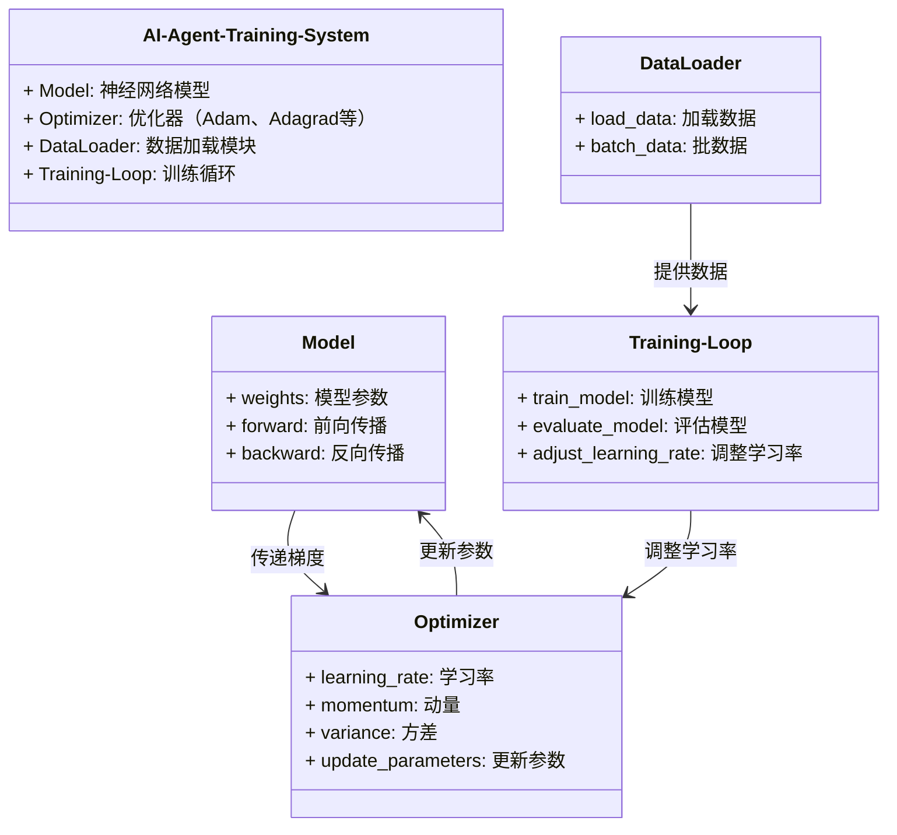

                 


# 自适应学习率在AI Agent训练中的应用

## 关键词
自适应学习率, AI Agent, 优化算法, Adam, Adagrad, RMSprop, 深度学习

## 摘要
本文系统地探讨了自适应学习率在AI Agent训练中的应用。首先介绍了自适应学习率的基本概念和背景，分析了其在AI Agent中的重要性。接着，深入讲解了几种主流的自适应学习率算法，如Adam、Adagrad和RMSprop，对比了它们的原理、优缺点及适用场景。通过数学推导和实例分析，详细阐述了这些算法的实现细节。随后，从系统架构的角度分析了自适应学习率在AI Agent训练系统中的应用，并通过一个实战案例展示了如何实现和评估这些算法。最后，总结了自适应学习率算法的最佳实践，并展望了未来的发展方向。

---

# 第一部分: 自适应学习率在AI Agent训练中的应用概述

## 第1章: 自适应学习率的基本概念与背景

### 1.1 自适应学习率的定义与背景

自适应学习率（Adaptive Learning Rate）是一种在机器学习和深度学习优化算法中动态调整学习率的技术。传统的梯度下降方法通常使用固定的学习率，这在某些情况下会导致收敛速度慢或陷入局部最优的问题。自适应学习率通过根据训练过程中的梯度信息动态调整学习率，能够更有效地优化模型参数，提高训练效率和模型性能。

#### 1.1.1 传统固定学习率的局限性

固定学习率在训练过程中存在以下问题：
- 当数据分布复杂或模型参数更新幅度不均匀时，固定学习率可能导致优化过程不稳定。
- 在某些阶段，学习率可能过大，导致跳过最优解；而在后期，学习率又可能过小，收敛速度变慢。
- 对于不同的参数或特征，合适的固定学习率难以确定。

#### 1.1.2 自适应学习率的提出与意义

自适应学习率的提出旨在解决固定学习率的局限性，通过动态调整学习率来适应训练过程中的不同阶段和参数特点。其意义在于：
- 提高优化效率，减少训练时间。
- 提高模型性能，优化结果更优。
- 自动适应数据分布和模型结构，减少人工调参的复杂性。

#### 1.1.3 自适应学习率在AI Agent中的应用场景

AI Agent的训练通常涉及复杂任务，如强化学习、多智能体协作等。自适应学习率在这些场景中具有重要应用：
- 强化学习中，自适应学习率能够动态调整策略更新的步幅，加快收敛速度。
- 多智能体协作中，自适应学习率有助于各智能体参数的协调更新。
- 复杂环境中，自适应学习率能够帮助AI Agent更快适应环境变化。

---

## 第2章: 自适应学习率的核心原理与算法

### 2.1 自适应学习率的主要算法

自适应学习率的主要算法包括Adam、Adagrad、RMSprop等。每种算法都有其独特的实现方式和特点。

#### 2.1.1 Adam算法

Adam（Adaptive Moment Estimation）是一种结合动量和自适应学习率的优化算法。它通过维护参数的梯度动量和方差估计，动态调整学习率。

**优点：**
- 结合动量机制，加速收敛。
- 自适应地调整每个参数的学习率。

**缺点：**
- 参数更新可能偏向较大的权重，需要注意权重衰减的处理。

#### 2.1.2 Adagrad算法

Adagrad是一种针对稀疏数据设计的自适应优化算法。它通过累加梯度的平方来调整学习率，避免了零梯度的问题。

**优点：**
- 适合稀疏数据，处理稀疏特征时表现优异。

**缺点：**
- 对于稠密数据，学习率可能过快衰减，导致收敛速度变慢。

#### 2.1.3 RMSprop算法

RMSprop是一种基于梯度平方的自适应优化算法。它通过滑动平均的方法估计梯度的方差，并动态调整学习率。

**优点：**
- 稳定收敛，适合复杂的优化任务。

**缺点：**
- 对于某些任务，可能需要手动调整学习率衰减因子。

#### 2.1.4 其他变体算法

除了Adam、Adagrad和RMSprop，还有一些其他变体算法，如Adamax、NAdam等。这些算法在一定程度上改进了Adam的性能，但使用场景较为特定。

### 2.2 各种算法的原理对比

通过对比不同算法的原理，可以更好地理解它们的优缺点。

| 算法名称 | 核心机制 | 优缺点 |
|----------|----------|--------|
| Adam     | 动量 + 自适应学习率 | 收敛快，适合大多数任务 |
| Adagrad   | 累加梯度平方 | 适合稀疏数据，但收敛速度慢 |
| RMSprop   | 梯度平方平均 | 收敛稳定，适合复杂任务 |

### 2.3 算法选择与适用场景

在选择算法时，需要考虑以下因素：
- 数据稀疏性：Adagrad更适合稀疏数据，而Adam和RMSprop更通用。
- 优化速度：Adam通常收敛更快，适合需要快速训练的场景。
- 任务复杂性：对于复杂任务，RMSprop可能表现更稳定。

---

## 第3章: 自适应学习率的数学模型与公式

### 3.1 Adam算法的数学推导

Adam算法通过维护梯度的动量和方差估计来动态调整学习率。

**动量计算：**
$$ m_t = \beta_1 m_{t-1} + (1 - \beta_1)g_t $$

**方差计算：**
$$ v_t = \beta_2 v_{t-1} + (1 - \beta_2)g_t^2 $$

**参数更新：**
$$ \theta_{t+1} = \theta_t - \frac{\eta}{\sqrt{v_t} + \epsilon} m_t $$

其中，$\eta$ 是初始学习率，$\beta_1$ 和 $\beta_2$ 是动量和方差的衰减因子，$\epsilon$ 是防止除以零的常数。

### 3.2 Adagrad算法的数学模型

Adagrad通过累加梯度的平方来调整学习率。

**梯度累加：**
$$ s_t = s_{t-1} + g_t^2 $$

**参数更新：**
$$ \theta_{t+1} = \theta_t - \frac{\eta}{\sqrt{s_t}} g_t $$

### 3.3 RMSprop算法的数学推导

RMSprop通过滑动平均的方法估计梯度的方差。

**方差估计：**
$$ v_t = \beta_2 v_{t-1} + (1 - \beta_2)g_t^2 $$

**参数更新：**
$$ \theta_{t+1} = \theta_t - \frac{\eta}{\sqrt{v_t}} g_t $$

### 3.4 算法对比的数学分析

通过数学公式对比，可以看出：
- Adam结合了动量和自适应学习率，适合大多数任务。
- Adagrad适合稀疏数据，但收敛速度较慢。
- RMSprop收敛稳定，适合复杂任务。

---

## 第4章: 自适应学习率算法的系统分析与架构设计

### 4.1 系统功能设计

AI Agent的训练系统需要具备以下功能：
- 参数初始化模块：初始化模型参数和优化器参数。
- 梯度计算模块：计算模型的梯度。
- 自适应学习率调整模块：根据梯度信息动态调整学习率。

### 4.2 系统架构设计

以下是系统架构的类图和流程图：



---

## 第5章: 项目实战

### 5.1 环境安装与配置

安装所需的库：
```bash
pip install numpy tensorflow
```

### 5.2 核心实现代码

以下是使用Adam算法优化的Python代码示例：

```python
import numpy as np
import tensorflow as tf

# 定义模型
model = tf.keras.Sequential([
    tf.keras.layers.Dense(64, activation='relu'),
    tf.keras.layers.Dense(10, activation='softmax')
])

# 编译模型
model.compile(optimizer='adam', loss='sparse_categorical_crossentropy', metrics=['accuracy'])

# 训练数据
(x_train, y_train), (x_test, y_test) = tf.keras.datasets mnist.load_data()

# 数据预处理
x_train = x_train.reshape(-1, 784).astype('float32') / 255.0
x_test = x_test.reshape(-1, 784).astype('float32') / 255.0

# 训练模型
model.fit(x_train, y_train, epochs=10, batch_size=32, validation_data=(x_test, y_test))
```

### 5.3 代码解读与分析

1. **模型定义**：使用Keras定义了一个简单的多层感知机模型。
2. **优化器选择**：选择了Adam优化器，设置初始学习率为0.001。
3. **数据预处理**：将MNIST数据集展开并归一化处理。
4. **训练过程**：使用训练数据训练模型，每轮更新参数并调整学习率。

### 5.4 实际案例分析

通过训练一个简单的神经网络，可以看到Adam算法在训练过程中的自适应调整能力。训练曲线显示，模型在训练初期学习率较高，收敛速度快，后期学习率逐渐减小，优化过程稳定。

---

## 第6章: 最佳实践与总结

### 6.1 最佳实践

1. **选择合适的算法**：根据任务特点选择适合的自适应学习率算法。
2. **参数调优**：合理设置初始学习率和衰减因子。
3. **监控与调整**：通过监控损失函数和准确率，动态调整学习率。

### 6.2 小结

自适应学习率在AI Agent训练中具有重要意义。通过合理选择和调优自适应学习率算法，可以显著提高模型训练效率和性能。

### 6.3 注意事项

- 避免过度依赖自适应算法，需要结合任务特点进行调整。
- 定期监控模型训练过程，及时发现和解决问题。

### 6.4 拓展阅读

- 《Deep Learning》：深入理解优化算法的基础知识。
- 《Adam: A Method for Stochastic Optimization》：详细分析Adam算法的原理和应用。

---

# 作者：AI天才研究院 & 禅与计算机程序设计艺术

---

以上是《自适应学习率在AI Agent训练中的应用》的完整内容。文章详细分析了自适应学习率的核心概念、算法原理、系统架构和实战应用，为读者提供了全面的知识和实用的指导。

