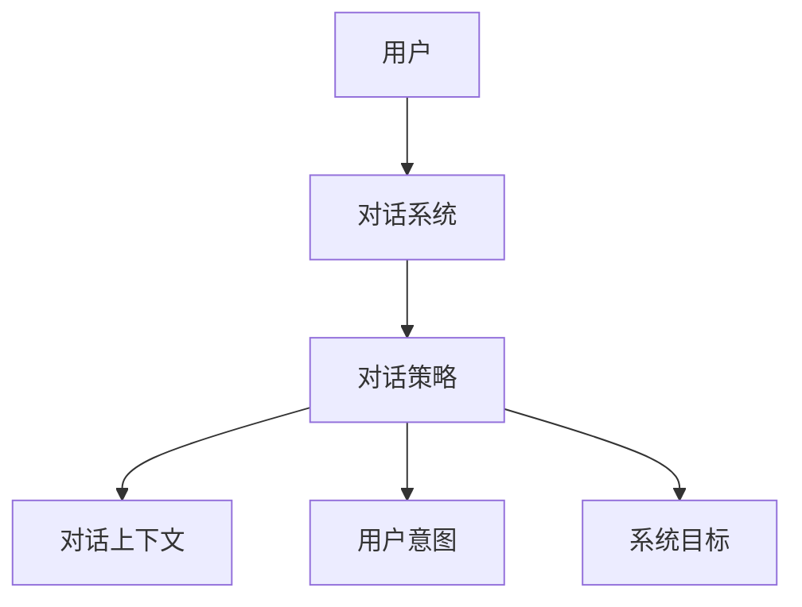
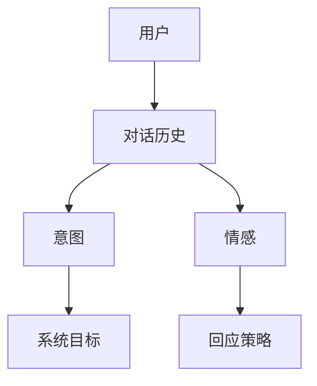
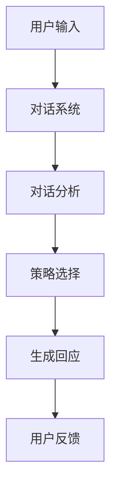
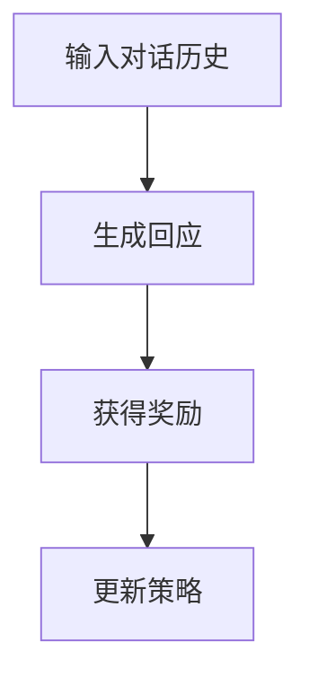
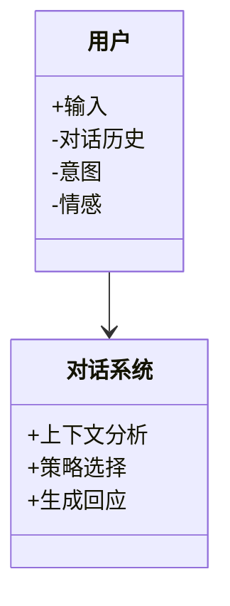
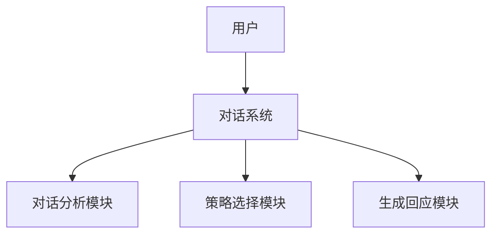
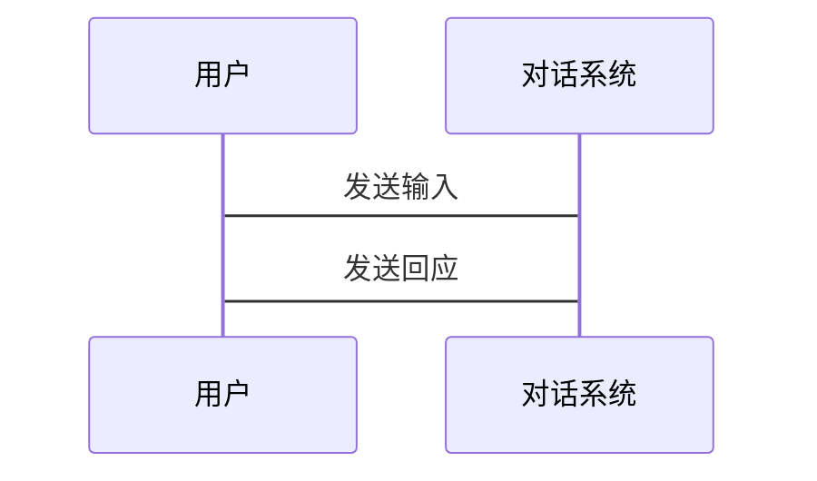

                 

<think>
嗯，用户希望我撰写一篇关于自适应对话策略提升AI代理交互质量的技术博客。首先，我需要明确文章的结构，包括背景与概述、核心概念、算法原理、系统设计、实战和优化等内容。每个部分都需要详细展开，使用清晰的技术术语和结构化的分析。

我应该从背景开始，介绍对话系统的基本概念和自适应策略的重要性。接着，分析核心概念，包括问题背景、解决方法以及与其他策略的对比。然后，深入算法部分，讲解强化学习和深度学习在对话中的应用，提供代码示例和数学模型。

在系统设计章节，我需要绘制类图和架构图，展示系统的各个部分及其交互。实战部分则需要具体实现，包括环境配置和代码编写，确保读者能跟着操作。最后，总结与展望部分，提出优化建议和未来方向。

整体来看，我需要确保每个章节内容丰富，结构清晰，同时满足用户对深度和详细性的要求。现在，我应该开始逐一撰写每个部分，确保每个小节都有足够的细节和支持材料。
</think>

# 自适应对话策略：提升AI Agent的交互质量

> 关键词：自适应对话策略，AI Agent，对话系统，自然语言处理，强化学习，对话优化

> 摘要：  
本文深入探讨了自适应对话策略在提升AI Agent交互质量中的核心作用。通过分析对话系统的背景与核心概念，结合算法原理和系统架构设计，本文详细阐述了如何通过自适应对话策略实现更高效、更自然的对话交互。从强化学习到深度学习，从系统设计到项目实战，本文为读者提供了一个全面的技术视角，帮助他们在实际应用中优化AI Agent的对话能力。

---

## 第一部分: 自适应对话策略背景与概述

### 第1章: 自适应对话策略概述

#### 1.1 自适应对话策略的基本概念

##### 1.1.1 对话系统的基本概念
对话系统是一种通过自然语言处理技术实现人与计算机之间交互的系统。它能够理解用户的输入（如文本或语音）并生成相应的回应，从而完成信息交换或任务执行。对话系统广泛应用于智能客服、智能助手、智能音箱等领域。

##### 1.1.2 自适应对话策略的定义
自适应对话策略是一种动态调整对话行为的策略，旨在根据对话上下文、用户意图和系统目标，实时优化对话流程。它能够根据对话的发展情况，灵活选择最佳的回应方式，以提高对话的效率和用户体验。

##### 1.1.3 自适应对话策略的核心要素
自适应对话策略的核心要素包括：
1. **对话上下文理解**：准确理解当前对话的背景、用户意图和情感。
2. **目标设定**：明确对话的目标，如解决问题、引导用户完成任务等。
3. **策略选择**：根据当前对话状态，选择最优的回应策略。
4. **动态调整**：在对话过程中，实时调整策略以应对用户反馈和对话变化。

#### 1.2 自适应对话策略的应用场景

##### 1.2.1 智能客服中的应用
在智能客服系统中，自适应对话策略可以帮助AI Agent更好地理解用户的问题，快速定位解决方案，并提供个性化的服务。例如，在处理复杂问题时，系统可以根据用户的反馈动态调整回应策略，确保对话顺利进行。

##### 1.2.2 智能助手中的应用
智能助手（如Siri、Alexa）需要通过对话与用户互动。自适应对话策略可以帮助系统更好地理解用户的意图，并根据上下文提供更精准的回应。例如，在用户连续提问时，系统可以根据之前的对话历史调整回应方式。

##### 1.2.3 游戏AI中的应用
在游戏AI中，自适应对话策略可以增强NPC（非玩家角色）的互动性。通过动态调整对话策略，NPC可以根据玩家的行为和情感变化，提供更自然、更丰富的对话内容，提升游戏体验。

#### 1.3 自适应对话策略的背景与意义

##### 1.3.1 对话系统的发展历程
对话系统经历了从规则驱动到数据驱动的演变。早期的对话系统基于固定的规则和预设的回应，缺乏灵活性。随着自然语言处理和机器学习技术的发展，现代对话系统逐渐具备了自适应能力。

##### 1.3.2 自适应对话策略的必要性
传统的对话系统在处理复杂场景时往往显得僵硬，难以应对用户的多样化需求。自适应对话策略通过动态调整对话行为，能够更好地满足用户的个性化需求，提升交互质量。

##### 1.3.3 自适应对话策略的未来趋势
随着AI技术的不断进步，自适应对话策略将更加智能化和个性化。未来的对话系统将能够实时分析用户的意图和情感，动态调整对话策略，从而实现更自然、更高效的交互。

### 第2章: 自适应对话策略的核心概念与联系

#### 2.1 问题背景与问题描述

##### 2.1.1 对话系统中的问题背景
在实际应用中，对话系统面临诸多挑战，如用户意图模糊、对话上下文复杂、对话目标多样等。这些问题要求对话系统具备更强的适应性和灵活性。

##### 2.1.2 自适应对话策略的核心问题
自适应对话策略的核心问题是如何根据对话的动态变化，实时调整对话行为，以实现最佳的交互效果。这需要系统具备对对话上下文的深度理解能力，以及对用户意图的准确预测能力。

#### 2.2 核心概念与原理

##### 2.2.1 对话策略的基本原理
对话策略是系统在对话过程中选择回应方式的规则或模型。自适应对话策略通过动态调整这些规则，以应对对话中的不确定性。

##### 2.2.2 自适应对话策略的实现机制
自适应对话策略的实现机制包括以下几个方面：
1. **对话上下文分析**：分析对话历史、用户意图和情感倾向。
2. **目标设定**：根据对话目标，确定当前对话的主要任务。
3. **策略选择**：基于当前对话状态，选择最优的回应策略。
4. **动态调整**：根据用户反馈和对话进展，实时优化策略。

##### 2.2.3 对话上下文的处理方法
对话上下文的处理方法包括：
1. **上下文记忆**：记录对话历史，以便后续对话参考。
2. **意图识别**：通过自然语言处理技术，识别用户的意图。
3. **情感分析**：分析用户的情感倾向，调整对话策略。

#### 2.3 核心概念对比分析

##### 2.3.1 自适应对话策略与传统对话策略的对比
| 对比维度 | 自适应对话策略 | 传统对话策略 |
|----------|----------------|---------------|
| 策略灵活性 | 高，动态调整 | 低，基于固定规则 |
| 对话上下文 | 考虑上下文 | 不考虑或部分考虑 |
| 应用场景 | 复杂场景，个性化需求 | 简单场景，固定需求 |

##### 2.3.2 不同对话策略的优缺点分析
| 策略类型 | 优点 | 缺点 |
|----------|------|------|
| 基于规则 | 实现简单，易于控制 | 缺乏灵活性，难以应对复杂场景 |
| 基于统计 | 数据驱动，效果较好 | 需要大量数据，难以解释 |
| 基于强化学习 | 策略优化能力强 | 训练时间长，计算资源消耗大 |

##### 2.3.3 核心概念对比表格
通过对比分析，可以发现自适应对话策略在灵活性和适应性方面具有显著优势，但在实现复杂性和计算资源需求方面也面临挑战。

#### 2.4 实体关系图与架构设计

##### 2.4.1 对话系统中的实体关系图


##### 2.4.2 自适应对话策略的ER实体关系图


##### 2.4.3 系统架构的Mermaid流程图


---

## 第二部分: 自适应对话策略的算法原理

### 第3章: 自适应对话策略的算法原理

#### 3.1 算法原理概述

##### 3.1.1 对话策略的基本算法
对话策略的基本算法包括基于规则的策略、基于统计的策略和基于深度学习的策略。

##### 3.1.2 自适应策略的核心算法
自适应对话策略的核心算法包括基于强化学习的策略优化和基于深度学习的对话模型。

##### 3.1.3 算法的数学模型与公式
自适应对话策略的数学模型可以通过强化学习的Q-learning框架来表示：
$$ Q(s, a) = Q(s, a) + \alpha \cdot (r + \max_{a'} Q(s', a') - Q(s, a)) $$
其中，\( s \) 是当前状态，\( a \) 是动作，\( r \) 是奖励，\( \alpha \) 是学习率。

#### 3.2 基于强化学习的策略优化

##### 3.2.1 强化学习的基本原理
强化学习是一种通过试错机制来优化策略的方法。系统通过与环境的交互，不断尝试不同的动作，以获得最大的累计奖励。

##### 3.2.2 对话策略的强化学习框架
在对话策略中，强化学习的框架通常包括以下几个步骤：
1. **状态表示**：将对话上下文表示为状态。
2. **动作选择**：根据当前状态选择一个动作（如生成一句话）。
3. **奖励计算**：根据用户的反馈计算奖励。
4. **策略更新**：根据奖励更新策略。

##### 3.2.3 策略优化的数学模型
强化学习的策略优化可以通过以下公式表示：
$$ \theta_{t+1} = \theta_t + \alpha \cdot \nabla J(\theta_t) $$
其中，\( \theta \) 是参数，\( \alpha \) 是学习率，\( J \) 是目标函数。

#### 3.3 基于深度学习的对话策略

##### 3.3.1 基于Transformer的对话策略
Transformer模型通过自注意力机制，能够有效捕捉对话中的长距离依赖关系，从而生成更自然的回应。

##### 3.3.2 基于Seq2Seq的对话策略
Seq2Seq模型通过编码器-解码器结构，能够将输入的对话历史转化为输出的回应。

##### 3.3.3 深度学习模型的对话策略实现
深度学习模型的对话策略实现通常包括以下几个步骤：
1. **输入处理**：将对话历史转换为模型的输入格式。
2. **模型训练**：使用大量的对话数据训练模型。
3. **生成回应**：根据当前对话历史生成回应。

#### 3.4 算法实现的代码示例

##### 3.4.1 简单对话策略的Python代码实现
```python
def simple_strategy(context, goal):
    # 根据上下文和目标生成回应
    pass
```

##### 3.4.2 基于强化学习的策略优化代码
```python
import numpy as np

class Agent:
    def __init__(self, state_space, action_space):
        self.state_space = state_space
        self.action_space = action_space
        self.theta = np.random.randn(state_space, action_space)

    def act(self, state):
        # 选择动作
        pass

    def update(self, state, action, reward):
        # 更新参数
        pass
```

##### 3.4.3 算法流程的Mermaid流程图


---

## 第三部分: 系统分析与架构设计

### 第4章: 系统分析与架构设计

#### 4.1 问题场景介绍

##### 4.1.1 对话系统的应用场景
对话系统可以应用于智能客服、智能助手、智能音箱等领域。

##### 4.1.2 自适应对话策略的实现需求
为了实现自适应对话策略，系统需要具备对话上下文分析、用户意图识别、动态策略调整等功能。

#### 4.2 系统功能设计

##### 4.2.1 对话系统的功能模块
对话系统的主要功能模块包括：
1. **输入处理**：接收用户的输入。
2. **对话分析**：分析对话上下文和用户意图。
3. **策略选择**：选择最优的回应策略。
4. **生成回应**：生成对话回应。

##### 4.2.2 系统功能的Mermaid类图


#### 4.3 系统架构设计

##### 4.3.1 系统架构的Mermaid架构图


##### 4.3.2 系统接口设计
系统接口设计包括：
1. **输入接口**：接收用户的输入。
2. **输出接口**：生成对话回应。
3. **上下文接口**：管理对话历史和用户意图。

##### 4.3.3 系统交互的Mermaid序列图


---

## 第四部分: 项目实战

### 第5章: 项目实战

#### 5.1 环境安装与配置

##### 5.1.1 安装Python环境
安装Python 3.8及以上版本。

##### 5.1.2 安装依赖库
安装所需的依赖库，如numpy、tensorflow、transformers等。

#### 5.2 核心代码实现

##### 5.2.1 对话系统的实现
```python
import numpy as np
from transformers import AutoTokenizer, AutoModelForSeq2Seq

class DialogueSystem:
    def __init__(self):
        self.tokenizer = AutoTokenizer.from_pretrained('t5-base')
        self.model = AutoModelForSeq2Seq.from_pretrained('t5-base')

    def generate_response(self, input_text):
        inputs = self.tokenizer.encode(input_text, return_tensors='np')
        outputs = self.model.generate(inputs, max_length=50)
        response = self.tokenizer.decode(outputs[0], skip_special_tokens=True)
        return response
```

##### 5.2.2 自适应策略的实现
```python
class AdaptiveStrategy:
    def __init__(self):
        self.context = []
        self.goal = '提供帮助'

    def choose_action(self, state):
        # 根据状态选择动作
        pass

    def update_strategy(self, feedback):
        # 更新策略
        pass
```

#### 5.3 案例分析与代码解读

##### 5.3.1 案例分析
以智能客服为例，分析自适应对话策略在实际应用中的表现。

##### 5.3.2 代码实现解读
解读上述代码实现，说明每个模块的功能和实现细节。

#### 5.4 项目小结

##### 5.4.1 项目总结
总结项目实现的关键点和成功经验。

##### 5.4.2 项目不足
分析项目中存在的不足之处，并提出改进建议。

---

## 第五部分: 优化与未来方向

### 第6章: 优化与未来方向

#### 6.1 系统优化方案

##### 6.1.1 性能优化
通过优化算法和减少计算复杂度，提升系统的运行效率。

##### 6.1.2 可扩展性优化
设计模块化的系统结构，提升系统的可扩展性。

##### 6.1.3 可解释性优化
增强系统的可解释性，使用户能够理解AI Agent的决策过程。

#### 6.2 未来研究方向

##### 6.2.1 新算法研究
研究更先进的算法，如基于大语言模型的对话策略。

##### 6.2.2 多模态对话研究
探索多模态对话策略，结合视觉、听觉等信息，提升对话体验。

##### 6.2.3 个性化对话研究
研究个性化的对话策略，根据用户的偏好和行为，提供定制化的服务。

#### 6.3 最佳实践 tips

##### 6.3.1 系统设计 tips
在设计对话系统时，应注重系统的灵活性和可扩展性。

##### 6.3.2 算法实现 tips
在实现算法时，应注重算法的效率和可解释性。

##### 6.3.3 项目部署 tips
在部署项目时，应注重系统的稳定性和安全性。

---

## 第六部分: 总结与展望

### 第7章: 总结与展望

#### 7.1 章节回顾
回顾本文的主要内容，总结自适应对话策略的核心思想和实现方法。

#### 7.2 未来展望
展望自适应对话策略的发展前景，分析其在AI Agent中的应用潜力。

---

## 作者：AI天才研究院/AI Genius Institute & 禅与计算机程序设计艺术 /Zen And The Art of Computer Programming

