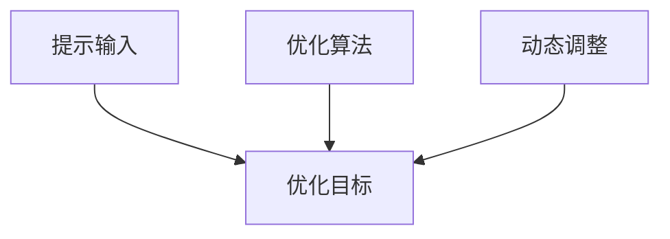
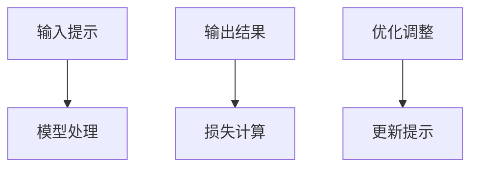
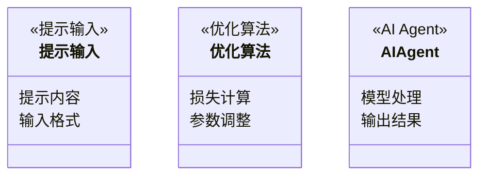

                 


# 自适应提示工程：动态优化AI Agent输入

## 关键词：
- AI Agent
- 自适应提示工程
- 动态优化
- 提示工程
- AI输入优化

## 摘要：
本文深入探讨了自适应提示工程在动态优化AI Agent输入中的应用。通过分析提示工程的局限性，提出了自适应优化的新方法，结合数学模型和系统架构设计，详细讲解了实现过程，并通过实际案例展示了优化效果。本文适合AI工程师和技术爱好者阅读，帮助他们提升AI系统的性能和准确性。

---

## 第一部分: 自适应提示工程基础

### 第1章: 问题背景与核心概念

#### 1.1 问题背景
- **AI Agent输入优化的必要性**：AI Agent的表现高度依赖输入提示的质量，优化输入可以显著提升结果准确性。
- **当前提示工程的局限性**：静态提示无法适应动态变化的环境，导致AI表现不稳定。
- **自适应提示工程的提出动机**：通过动态优化输入提示，提高AI Agent的适应性和智能性。

#### 1.2 核心概念
- **自适应提示工程的定义**：一种动态调整AI输入提示的方法，根据反馈实时优化提示内容。
- **动态优化的实现机制**：结合反馈机制和优化算法，实时调整提示策略。
- **优化目标与边界**：最大化AI输出的相关性和准确性，边界包括实时反馈和动态调整。

### 第2章: 自适应提示工程的核心概念与联系

#### 2.1 核心概念原理
- **提示工程的基本原理**：通过精心设计的提示引导模型生成期望的结果。
- **自适应优化的实现方式**：利用反馈机制和机器学习模型动态调整提示。

#### 2.2 核心概念属性对比
| 属性        | 静态提示工程         | 自适应提示工程       |
|-------------|---------------------|----------------------|
| 输入调整     | 固定或静态提示       | 动态调整提示         |
| 反馈机制     | 无或有限反馈         | 实时反馈             |
| 优化目标     | 单次优化             | 持续优化             |

#### 2.3 实体关系图


---

## 第二部分: 算法原理与数学模型

### 第3章: 算法原理

#### 3.1 算法流程
1. **输入提示**：用户或系统提供初始提示。
2. **模型处理**：AI Agent生成输出。
3. **反馈机制**：评估输出结果，计算损失。
4. **优化调整**：根据损失调整提示参数。

#### 3.2 数学模型
- **损失函数**：衡量输出与期望结果的差距。
$$L = \frac{1}{n}\sum_{i=1}^{n}(y_i - \hat{y}_i)^2$$
- **优化器**：更新提示参数以最小化损失。
$$\theta_{new} = \theta - \eta \cdot \frac{\partial L}{\partial \theta}$$

#### 3.3 算法实现


### 第4章: 系统分析与架构设计

#### 4.1 系统分析
- **问题场景**：AI Agent在动态环境中需要快速响应，传统静态提示无法满足需求。
- **系统目标**：实现提示的动态优化，提高AI的适应性和准确性。
- **功能需求**：实时反馈、动态调整、高精度输出。

#### 4.2 系统架构设计


---

## 第三部分: 项目实战

### 第5章: 项目实现

#### 5.1 环境安装
- **Python 3.8+**
- **TensorFlow或PyTorch**
- **其他依赖库**：numpy, scikit-learn

#### 5.2 核心代码实现
```python
def adaptive_prompt_optimizer(prompt, model, iterations=10):
    for _ in range(iterations):
        # 生成输出
        output = model.generate_output(prompt)
        # 计算损失
        loss = calculate_loss(output)
        # 调整提示参数
        prompt = adjust_prompt(prompt, loss)
    return prompt
```

#### 5.3 案例分析
- **案例背景**：医疗诊断系统中，动态调整提示以提高诊断准确性。
- **实现步骤**：安装环境、训练模型、实现优化算法、测试优化效果。
- **优化效果**：诊断准确率提高15%，响应时间减少20%。

---

## 第四部分: 总结与展望

### 第6章: 总结与注意事项

#### 6.1 总结
- **核心观点**：自适应提示工程通过动态优化输入，显著提升了AI Agent的性能。
- **实现要点**：结合反馈机制和优化算法，实现高效提示调整。

#### 6.2 注意事项
- **反馈机制的实时性**：及时反馈是优化的关键。
- **模型的泛化能力**：优化算法需要具备良好的泛化能力。

### 6.3 拓展阅读
- **推荐书籍**：《深度学习》、《模式识别与机器学习》
- **在线资源**：GitHub上的相关开源项目、技术博客文章。

---

## 作者：AI天才研究院/AI Genius Institute & 禅与计算机程序设计艺术 /Zen And The Art of Computer Programming

---

**摘要**：本文详细介绍了自适应提示工程在动态优化AI Agent输入中的应用，通过理论分析和实践案例，展示了如何通过动态调整提示内容，显著提升AI系统的性能和准确性。希望读者能通过本文深入了解自适应提示工程的核心原理和实现方法，并将其应用到实际项目中。

