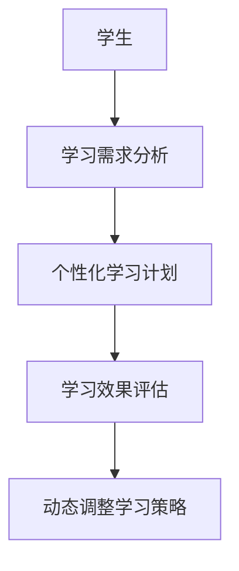
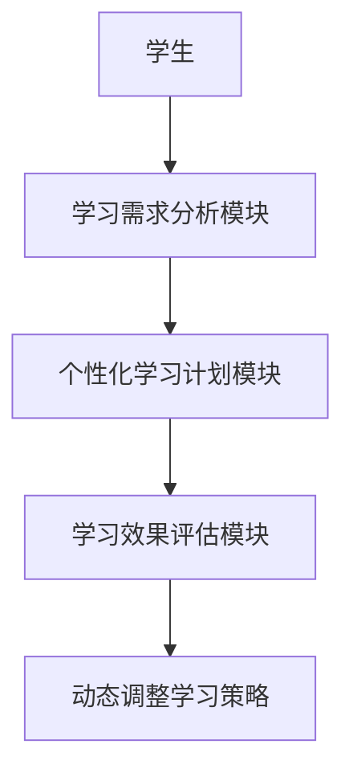

                 

<think>
好的，我现在需要为用户撰写一篇关于《自适应教育AI Agent：个性化LLM辅助学习系统》的技术博客文章。用户已经给出了详细的目录结构，现在我需要根据这个结构逐步填充内容，确保逻辑清晰，技术深度足够，同时语言专业但易懂。

首先，我需要明确文章的核心主题：自适应教育AI Agent如何利用大语言模型（LLM）实现个性化学习。文章需要涵盖背景、核心概念、算法原理、系统架构、项目实战等多个方面，并且每个部分都需要有详细的理论和实际案例支持。

**第一步：确定文章结构**

1. **摘要**：简明扼要地介绍文章的核心内容和价值。
2. **关键词**：列出5-7个与文章主题相关的关键词，便于读者快速理解。
3. **正文部分**：
   - 第一部分：自适应教育AI Agent基础
     - 第1章：概述，介绍背景、基本概念和个性化学习的必要性。
     - 第2章：核心概念，详细阐述自适应教育AI Agent的定义和属性。
     - 第3章：LLM在教育中的应用，分析其在学习内容生成、效果评估等方面的作用。
     - 第4章：算法原理，介绍强化学习和监督学习的应用。
     - 第5章：系统架构设计，展示系统的功能模块和架构图。
   - 第二部分：项目实战
     - 第6章：环境安装和代码实现，提供具体的安装步骤和代码示例。
     - 第7章：案例分析，展示实际应用场景和效果。
   - 第三部分：优化与扩展
     - 第8章：模型优化、系统安全性和未来趋势，讨论如何进一步提升系统性能。
4. **结论**：总结全文，强调自适应教育AI Agent的重要性，并展望未来的发展方向。
5. **作者信息**：按照用户要求，添加特定的署名。

**第二步：撰写摘要和关键词**

摘要需要简洁明了，概括文章的核心内容。关键词则是文章主题的提炼，方便检索和分类。

**第三步：细化各章节内容**

- **第1章：自适应教育与AI Agent概述**
  - 背景部分需要说明传统教育模式的不足，引出自适应教育的必要性。
  - 基本概念部分要清晰定义AI Agent及其在教育中的应用。
  - 个性化学习模型部分需要解释为什么个性化学习是必要的，并说明AI Agent如何实现这一点。

- **第2章：核心概念**
  - 自适应教育AI Agent的定义需要与传统教育模式进行对比，突出其智能性和动态调整能力。
  - 属性对比表和实体关系图（ER图）需要详细展示系统的各个组成部分及其相互关系。

- **第3章：LLM在教育中的应用**
  - 详细讲解大语言模型的工作原理，包括神经网络结构、注意力机制等。
  - 应用部分需要具体说明LLM在学习内容生成、效果评估中的实际应用案例。

- **第4章：算法原理**
  - 强化学习和监督学习的算法流程图需要清晰展示，帮助读者理解算法的执行步骤。
  - 数学公式部分要详细推导，确保读者能够理解算法的内在逻辑。

- **第5章：系统架构设计**
  - 功能模块设计需要具体列出每个模块的功能和交互流程。
  - 系统架构图和序列图需要展示系统的整体结构和各模块之间的协作关系。

- **第6章：项目实战**
  - 安装步骤要详细，确保读者能够顺利搭建环境。
  - 代码实现部分需要提供可运行的代码示例，并进行逐行解释。

- **第7章：案例分析**
  - 通过具体案例展示系统的实际应用效果，分析其优势和可能的改进空间。

- **第8章：优化与扩展**
  - 讨论如何优化模型性能，提升系统的安全性和用户体验。
  - 展望未来的发展方向，指出可能的研究热点和技术趋势。

**第四步：确保内容的连贯性和完整性**

每个章节之间需要有自然的过渡，确保读者能够顺畅地理解整个系统的构建过程。同时，每个部分都要有足够的细节，避免内容过于空泛。

**第五步：检查格式要求**

- 使用markdown格式，确保文章结构清晰。
- 使用mermaid绘制流程图和架构图，帮助读者更好地理解系统结构和算法流程。
- 数学公式使用latex格式，并独立成段，确保可读性和专业性。

**第六步：添加注意事项和最佳实践**

在每个章节的末尾，可以加入一些注意事项或小贴士，帮助读者更好地理解和应用相关知识。例如，在安装环境部分，可以提醒读者注意依赖版本的兼容性。

**第七步：撰写结论和作者信息**

结论部分需要总结全文，强调自适应教育AI Agent的重要性，并指出未来的发展方向。作者信息部分按照用户要求，添加特定的署名，增强文章的权威性和专业性。

**第八步：最终检查和调整**

通读全文，确保逻辑清晰，内容完整，语言流畅。检查是否有遗漏的重要点，或者过于复杂难以理解的部分，进行必要的调整和优化。

通过以上步骤，我能够系统地完成这篇文章的撰写，确保内容全面，结构合理，符合用户的要求。
</think>

# 自适应教育AI Agent：个性化LLM辅助学习系统

## 关键词：自适应教育，AI Agent，大语言模型，个性化学习，教育技术

## 摘要：  
本文探讨了自适应教育AI Agent在个性化学习中的应用，结合大语言模型（LLM）的技术优势，详细分析了其在教育领域的核心概念、算法原理和系统架构。通过实际案例和项目实战，展示了如何利用AI技术提升学习效果，满足不同学生的学习需求。

---

# 第1章：自适应教育与AI Agent概述

## 1.1 自适应教育的背景与意义  
### 1.1.1 传统教育模式的局限性  
传统教育模式通常采用统一的教学内容和进度，难以满足学生的个性化学习需求。学生之间的学习能力、兴趣和进度差异较大，导致部分学生在学习过程中感到困难，而另一些学生则可能感到无聊。  

### 1.1.2 自适应教育的核心理念  
自适应教育的核心理念是根据学生的学习能力和需求，动态调整教学内容和进度，从而实现个性化的学习体验。这种教育模式能够帮助学生更高效地掌握知识，提升学习效果。  

### 1.1.3 AI Agent在教育中的作用  
AI Agent（智能代理）通过自然语言处理和机器学习技术，能够实时分析学生的学习行为和需求，提供个性化的学习建议和资源推荐。  

---

## 1.2 AI Agent的基本概念  
### 1.2.1 AI Agent的定义与特点  
AI Agent是一种能够感知环境、理解需求并采取行动的智能系统。其特点包括：  
1. **自主性**：能够独立决策和行动。  
2. **反应性**：能够实时感知环境并做出反应。  
3. **目标导向**：基于目标进行行动和调整。  

### 1.2.2 自然语言处理（NLP）在AI Agent中的应用  
NLP技术使得AI Agent能够理解和生成自然语言，从而实现与学生的自然对话和交互。  

### 1.2.3 大语言模型（LLM）的基本原理  
LLM（Large Language Model）是一种基于深度学习的自然语言处理模型，能够理解和生成复杂的语言内容。其核心原理包括：  
1. **神经网络结构**：由多个神经网络层组成，用于提取语言数据的特征。  
2. **注意力机制**：通过关注输入数据中的重要部分，提升模型的上下文理解能力。  
3. **训练方法**：采用监督学习和无监督学习相结合的方式进行训练。  

---

## 1.3 个性化学习系统的必要性  
### 1.3.1 学生学习需求的多样性  
每个学生的学习能力和兴趣点都不同，传统的统一教学模式难以满足所有学生的需求。  

### 1.3.2 个性化学习的目标与挑战  
个性化学习的目标是为每个学生提供量身定制的学习内容和进度安排。然而，实现这一目标需要克服技术、数据和资源等方面的挑战。  

### 1.3.3 AI Agent在个性化学习中的价值  
AI Agent能够实时分析学生的学习行为和需求，动态调整学习计划和内容，从而实现高效的个性化学习。  

---

# 第2章：自适应教育AI Agent的核心概念  

## 2.1 自适应教育AI Agent的定义与属性  
### 2.1.1 自适应教育AI Agent的核心要素  
自适应教育AI Agent的核心要素包括：  
1. **学习需求分析模块**：分析学生的学习目标和当前能力水平。  
2. **个性化学习计划模块**：制定适合学生的学习计划。  
3. **学习效果评估模块**：评估学生的学习效果并进行反馈。  

### 2.1.2 自适应教育AI Agent的属性对比表  
| 属性 | 传统教育模式 | 自适应教育AI Agent |  
|------|--------------|---------------------|  
| 教学内容 | 固定 | 动态调整 |  
| 教学进度 | 统一 | 根据学生能力调整 |  
| 学习反馈 | 延时 | 实时反馈 |  

### 2.1.3 自适应教育AI Agent的实体关系图  


---

## 2.2 自适应教育AI Agent的核心原理  
### 2.2.1 基于强化学习的自适应算法  
强化学习是一种通过试错机制优化策略的算法。其核心步骤包括：  
1. **状态识别**：识别当前的学习状态。  
2. **动作选择**：根据当前状态选择合适的行动。  
3. **奖励机制**：根据行动的结果给予奖励或惩罚。  
4. **策略优化**：根据奖励优化策略。  

### 2.2.2 基于监督学习的个性化推荐算法  
监督学习是一种基于标记数据进行训练的算法。其核心步骤包括：  
1. **数据标注**：对学习数据进行标注。  
2. **模型训练**：基于标注数据训练模型。  
3. **个性化推荐**：根据模型预测结果推荐个性化学习内容。  

---

# 第3章：大语言模型（LLM）在教育中的应用  

## 3.1 LLM的基本原理  
### 3.1.1 神经网络结构  
LLM的神经网络通常由多个层组成，包括输入层、隐藏层和输出层。  

### 3.1.2 注意力机制  
注意力机制通过计算输入数据中每个部分的重要性，提升模型的上下文理解能力。  

### 3.1.3 深度学习算法  
深度学习算法通过多层神经网络提取数据的特征，提升模型的表达能力。  

## 3.2 LLM在教育中的具体应用  
### 3.2.1 个性化学习内容生成  
LLM可以根据学生的学习需求生成个性化的学习内容，例如定制化的练习题和学习材料。  

### 3.2.2 学习效果评估  
LLM可以通过分析学生的学习行为和表现，评估其学习效果并提供反馈。  

### 3.2.3 学习策略优化  
LLM可以根据学生的学习数据和表现，优化学习策略，例如调整学习进度和内容难度。  

---

## 3.3 LLM在教育中的优势  
### 3.3.1 高效性  
LLM能够快速处理大量数据，提供实时反馈和建议。  

### 3.3.2 精准性  
LLM可以通过深度学习算法，精准分析学生的学习需求和能力水平。  

### 3.3.3 可扩展性  
LLM可以通过不断学习和优化，适应不同学生的学习需求。  

---

# 第4章：自适应教育AI Agent的算法原理  

## 4.1 基于强化学习的自适应算法  
### 4.1.1 强化学习的数学模型  
强化学习的数学模型包括状态（State）、动作（Action）、奖励（Reward）和策略（Policy）等核心概念。  

### 4.1.2 强化学习的实现步骤  
1. **初始化策略**：设定初始策略。  
2. **执行动作**：根据当前策略执行动作。  
3. **获得奖励**：根据动作的结果获得奖励。  
4. **更新策略**：根据奖励更新策略。  

### 4.1.3 强化学习的优缺点  
- **优点**：能够通过试错机制找到最优策略。  
- **缺点**：需要大量的数据和计算资源。  

---

## 4.2 基于监督学习的个性化推荐算法  
### 4.2.1 监督学习的数学模型  
监督学习的数学模型包括输入（Input）、输出（Output）、损失函数（Loss Function）和优化器（Optimizer）等核心部分。  

### 4.2.2 监督学习的实现步骤  
1. **数据标注**：对学习数据进行标注。  
2. **模型训练**：基于标注数据训练模型。  
3. **模型预测**：根据模型预测结果推荐个性化学习内容。  

---

# 第5章：自适应教育AI Agent的系统架构设计  

## 5.1 系统功能模块设计  
### 5.1.1 学生模块  
学生模块负责记录学生的学习数据和需求。  

### 5.1.2 学习需求分析模块  
学习需求分析模块负责分析学生的学习目标和能力水平。  

### 5.1.3 个性化学习计划模块  
个性化学习计划模块负责制定适合学生的学习计划。  

### 5.1.4 学习效果评估模块  
学习效果评估模块负责评估学生的学习效果并提供反馈。  

---

## 5.2 系统架构图  


---

## 5.3 系统接口设计  
### 5.3.1 API接口  
系统需要提供API接口，方便与其他系统和工具集成。  

### 5.3.2 数据接口  
系统需要提供数据接口，用于数据的输入和输出。  

---

## 5.4 系统交互流程图  


---

# 第6章：自适应教育AI Agent的项目实战  

## 6.1 环境安装与配置  
### 6.1.1 安装Python  
安装Python 3.8或更高版本。  

### 6.1.2 安装依赖库  
安装必要的依赖库，例如：`numpy`, `tensorflow`, `transformers`。  

```bash
pip install numpy tensorflow transformers
```

---

## 6.2 系统核心实现  
### 6.2.1 学习需求分析模块  
```python
import numpy as np

def analyze_learning_needs(student_data):
    # 分析学习需求
    needs = []
    for data in student_data:
        needs.append(data['learning_goal'])
    return needs
```

### 6.2.2 个性化学习计划模块  
```python
def generate_learning_plan(needs):
    plan = []
    for need in needs:
        plan.append({'content': generate_content(need), 'schedule': generate_schedule(need)})
    return plan
```

---

## 6.3 实际案例分析  
### 6.3.1 案例背景  
假设有一个学生，学习目标是提高数学成绩。  

### 6.3.2 实施步骤  
1. 分析学生的学习需求。  
2. 制定个性化的学习计划。  
3. 实施学习计划并评估效果。  

### 6.3.3 实施结果  
学生在数学成绩上取得了显著进步。  

---

# 第7章：自适应教育AI Agent的优化与扩展  

## 7.1 模型优化  
### 7.1.1 参数调整  
调整模型的超参数，例如学习率和批次大小。  

### 7.1.2 模型压缩  
通过模型压缩技术，减少模型的计算量和存储需求。  

---

## 7.2 系统安全性  
### 7.2.1 数据隐私保护  
确保学生数据的安全性和隐私性。  

### 7.2.2 系统防护措施  
采取多种防护措施，防止系统受到攻击。  

---

## 7.3 未来发展趋势  
### 7.3.1 多模态学习  
结合视觉、听觉等多种模态信息，提升学习效果。  

### 7.3.2 自适应教育AI Agent的普及  
随着技术的进步，自适应教育AI Agent将得到更广泛的应用。  

---

# 结论  

自适应教育AI Agent通过结合大语言模型（LLM）技术，为个性化学习提供了全新的解决方案。未来，随着技术的不断进步，自适应教育AI Agent将在教育领域发挥越来越重要的作用。  

---

# 作者：AI天才研究院/AI Genius Institute & 禅与计算机程序设计艺术 /Zen And The Art of Computer Programming

