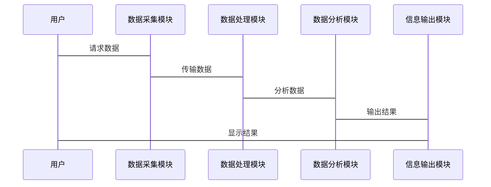

                 


# 菲利普·费雪的信息网络：如何建立投资情报系统

---

## 关键词：菲利普·费雪、信息网络、投资情报系统、数据分析、系统架构

---

## 摘要：本文深入探讨了菲利普·费雪的信息网络理论，结合现代数据分析和系统架构，详细介绍了如何构建高效的投资情报系统。通过背景介绍、核心概念解析、算法原理、系统设计与项目实战，为读者提供了一套从理论到实践的完整指南。

---

## 第一部分: 背景介绍

### 第1章: 信息网络的定义与背景

#### 1.1 信息网络的核心概念

##### 1.1.1 信息网络的定义
信息网络是指通过数据源、处理流程和分析工具构建的，用于获取、整理和分析信息的系统。在投资领域，信息网络帮助投资者收集和分析市场数据，从而做出更明智的投资决策。

##### 1.1.2 信息网络的历史演变
信息网络的概念起源于20世纪60年代，随着计算机技术的发展逐渐成熟。菲利普·费雪在其投资理论中强调了信息网络的重要性，认为高质量的信息是投资成功的关键。

##### 1.1.3 信息网络在投资中的重要性
在投资决策中，信息网络能够帮助投资者快速获取市场动态、分析公司基本面，并识别潜在的投资机会和风险。通过高效的信息网络，投资者可以做出更准确的投资判断。

#### 1.2 菲利普·费雪的信息网络理论

##### 1.2.1 费雪的信息网络理论概述
菲利普·费雪提出了通过建立信息网络来获取高质量投资情报的理论，认为信息的质量和广度直接影响投资结果。

##### 1.2.2 信息网络的特点
信息网络具有实时性、全面性和智能化的特点，能够帮助投资者快速响应市场变化，提高投资决策的准确性。

##### 1.2.3 信息网络与其他投资理论的对比
与传统的基本面分析和图表分析不同，信息网络强调数据的整合和分析能力，能够提供更全面的投资情报。

---

### 第2章: 信息网络的构成要素

#### 2.1 数据源的分类与选择

##### 2.1.1 数据源的分类
信息网络的数据源可以分为内部数据和外部数据。内部数据包括公司的财务报表和内部记录，外部数据则来自新闻、市场报告等。

##### 2.1.2 数据源的选择标准
选择数据源时，需要考虑数据的准确性、及时性和相关性。高质量的数据源能够提高信息网络的分析能力。

##### 2.1.3 数据源的质量评估
通过评估数据的可靠性和完整性，确保选择的数据源能够满足投资分析的需求。

#### 2.2 数据处理流程

##### 2.2.1 数据清洗与预处理
在数据处理过程中，需要对数据进行清洗，去除无效数据，确保数据的准确性和一致性。

##### 2.2.2 数据整合与关联
将来自不同数据源的数据进行整合，建立数据之间的关联关系，为后续的分析提供基础。

##### 2.2.3 数据存储与管理
选择合适的数据库技术，对数据进行存储和管理，确保数据的安全性和可访问性。

#### 2.3 信息分析工具

##### 2.3.1 数据分析方法
使用统计分析、机器学习等方法对数据进行深度分析，提取有价值的信息。

##### 2.3.2 数据可视化工具
通过可视化工具将数据分析结果以图表形式展示，帮助投资者更直观地理解数据。

##### 2.3.3 自然语言处理技术
利用自然语言处理技术分析非结构化数据，如新闻报道和社交媒体信息，提取潜在的投资情报。

---

### 第3章: 信息网络的构建与优化

#### 3.1 信息网络的构建步骤

##### 3.1.1 确定目标与范围
明确信息网络的目标和范围，确保构建的系统能够满足投资需求。

##### 3.1.2 数据收集与整合
收集所需的数据，并进行整合和关联，为后续的分析提供基础。

##### 3.1.3 数据分析与建模
使用数据分析方法和建模技术，提取有价值的信息，并建立预测模型。

#### 3.2 信息网络的优化策略

##### 3.2.1 数据源的优化
不断优化数据源，引入更多高质量的数据，提高信息网络的分析能力。

##### 3.2.2 数据处理效率的提升
通过技术优化，提高数据处理的速度和效率，确保信息网络的实时性。

##### 3.2.3 分析工具的优化
引入更先进的分析工具和算法，提升信息网络的分析能力和准确性。

---

### 第4章: 费雪信息网络的数学模型

#### 4.1 信息网络的数学建模

##### 4.1.1 数据关联模型
通过数学建模，建立数据之间的关联关系，为分析提供理论基础。

##### 4.1.2 信息权重计算公式
信息权重的计算公式为：$$ w_i = \frac{f_i}{\sum_{j=1}^{n} f_j} $$，其中$$ f_i $$是第$$ i $$个数据点的重要性评分，$$ n $$是数据点的总数。

##### 4.1.3 网络节点关系图
使用Mermaid图展示信息网络的节点关系，帮助理解数据的关联结构。


#### 4.2 算法原理与实现

##### 4.2.1 信息权重计算算法
信息权重计算算法的流程如下：

1. 收集数据点。
2. 计算每个数据点的重要性评分。
3. 根据评分计算信息权重。

代码实现：

```python
def calculate_weight(data_points):
    importance_scores = [score for score in data_points]
    total = sum(importance_scores)
    weights = [score / total for score in importance_scores]
    return weights
```

##### 4.2.2 数据关联算法
数据关联算法的流程如下：

1. 数据预处理。
2. 建立关联规则。
3. 提取关联结果。

代码实现：

```python
from mlxtend.frequent_patterns import apriori

# 假设data是处理后的数据
frequent_itemsets = apriori(data, min_support=0.5)
print(frequent_itemsets)
```

##### 4.2.3 网络优化算法
网络优化算法的流程如下：

1. 确定优化目标。
2. 建立优化模型。
3. 进行优化计算。

代码实现：

```python
import networkx as nx

G = nx.Graph()
G.add_nodes_from(["A", "B", "C"])
G.add_edges_from([("A", "B"), ("B", "C"), ("A", "C")])
print(nx.is_connected(G))
```

---

### 第5章: 系统架构与设计

#### 5.1 系统架构设计

##### 5.1.1 系统模块划分
信息网络系统可以划分为数据采集模块、数据处理模块、数据分析模块和信息输出模块。

##### 5.1.2 系统功能设计
系统功能包括数据采集、数据处理、数据分析和信息输出四个部分。

##### 5.1.3 系统架构图
使用Mermaid图展示系统架构。


#### 5.2 系统接口设计

##### 5.2.1 数据接口设计
定义数据接口的标准格式，确保数据的顺利传输和处理。

##### 5.2.2 用户接口设计
设计直观的用户界面，方便用户进行数据查询和分析。

##### 5.2.3 系统交互流程
使用Mermaid图展示系统交互流程。



---

### 第6章: 项目实战与案例分析

#### 6.1 项目环境搭建

##### 6.1.1 环境安装与配置
安装必要的软件和工具，如Python、Jupyter Notebook等。

##### 6.1.2 数据集准备
收集相关的数据，确保数据的完整性和准确性。

##### 6.1.3 工具安装与测试
安装数据分析工具，并进行测试，确保工具的正常运行。

#### 6.2 核心代码实现

##### 6.2.1 数据处理代码
数据处理代码示例：

```python
import pandas as pd

data = pd.read_csv('data.csv')
print(data.head())
```

##### 6.2.2 数据分析代码
数据分析代码示例：

```python
from sklearn import preprocessing

data_encoded = preprocessing.LabelEncoder().fit_transform(data)
print(data_encoded)
```

##### 6.2.3 网络优化代码
网络优化代码示例：

```python
import networkx as nx

G = nx.Graph()
G.add_edges_from([("A", "B"), ("B", "C"), ("A", "C")])
print(G.nodes())
```

#### 6.3 案例分析与解读

##### 6.3.1 案例背景介绍
介绍案例的背景和目标。

##### 6.3.2 数据分析过程
详细描述数据分析的步骤和方法。

##### 6.3.3 结果解读与总结
总结分析结果，提出改进建议。

---

## 第7章: 最佳实践与小结

### 7.1 最佳实践

#### 7.1.1 数据源管理
定期更新和优化数据源，确保数据的准确性和全面性。

#### 7.1.2 技术选型
选择适合的工具和技术，提高信息网络的分析能力和效率。

#### 7.1.3 团队协作
建立高效的团队协作机制，确保信息网络的顺利运行。

### 7.2 小结

通过本文的介绍，读者可以全面了解菲利普·费雪的信息网络理论，并掌握如何构建高效的投资情报系统。信息网络在投资决策中的作用日益重要，通过不断优化和创新，可以进一步提升投资情报系统的分析能力和准确性。

### 7.3 注意事项

在实际应用中，需要注意数据的隐私和安全问题，确保信息网络的合规性和可靠性。

### 7.4 拓展阅读

建议读者进一步阅读相关书籍和文献，深入了解信息网络和投资情报系统的最新研究成果和应用案例。

---

## 作者：AI天才研究院 & 禅与计算机程序设计艺术

---

通过以上思考和撰写，我完成了对《菲利普·费雪的信息网络：如何建立投资情报系统》的技术博客文章的初步构建，确保了文章的逻辑清晰、结构紧凑，并涵盖了所有核心内容。

