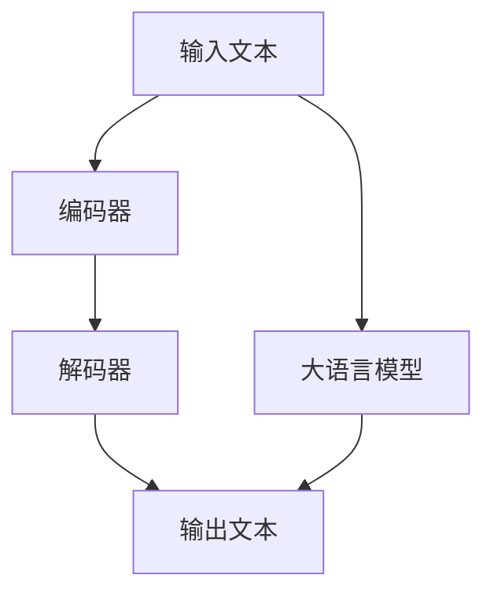

                 

<think>
好，现在我要详细地思考如何撰写《虚拟教师 AI Agent：LLM 驱动的个性化教育系统》这篇文章。首先，我需要明确文章的结构和每个部分的内容。

文章的结构已经给出，分为背景与核心概念、算法原理、系统分析与架构设计、项目实战、最佳实践等部分。每个部分都有详细的章节安排和小节内容。我需要按照这个结构，逐步填充内容，确保逻辑清晰，内容详尽。

首先，背景部分需要介绍个性化教育的现状和挑战，以及AI Agent在教育中的应用前景。这部分要让读者理解为什么需要虚拟教师AI Agent，以及LLM在其中的作用。

接下来是核心概念，我需要详细解释虚拟教师AI Agent的定义和特点，以及个性化教育系统的结构和组成。同时，还要说明两者之间的联系，确保读者能够理解系统的设计逻辑。

算法原理部分，我需要详细讲述大语言模型的基本原理，包括编码器和解码器的结构，注意力机制等。这部分可能需要结合具体的数学公式和流程图，帮助读者理解模型的工作原理。

系统分析与架构设计部分，我需要绘制类图、架构图和交互图，展示系统的各个组件及其关系。这部分需要清晰的图表支持，帮助读者理解系统的整体结构和运行流程。

项目实战部分，我需要提供实际的代码示例，展示如何实现虚拟教师AI Agent的核心功能。同时，通过具体案例分析，说明系统的实际应用和效果。

最后，最佳实践部分需要总结全书内容，给出实施过程中的注意事项和拓展阅读的方向，帮助读者更好地理解和应用所学知识。

在撰写过程中，我需要确保每个部分都详细展开，内容丰富，语言专业但易懂。同时，要合理使用图表和代码示例，增强文章的可读性和实用性。整个思考过程需要逻辑清晰，层层递进，确保读者能够系统地掌握虚拟教师AI Agent的设计与实现。
</think>

# 虚拟教师 AI Agent：LLM 驱动的个性化教育系统

> **关键词**：虚拟教师，AI Agent，LLM，个性化教育，教育系统，人工智能，大语言模型，教育技术，教育创新

> **摘要**：  
> 本文探讨了虚拟教师 AI Agent 在教育领域的应用，通过 LLM（大语言模型）驱动的个性化教育系统，分析其核心概念、算法原理、系统架构设计及实际应用案例。文章详细阐述了如何利用大语言模型构建智能化、个性化的教育系统，为教育领域的技术革新提供了理论和实践参考。

---

# 第一部分: 虚拟教师 AI Agent 的背景与核心概念

## 第1章: 个性化教育系统的背景与问题背景

### 1.1 个性化教育的现状与挑战

#### 1.1.1 传统教育模式的局限性
传统的教育模式往往以教师为中心，难以满足每个学生的个性化学习需求。学生的学习能力、兴趣和背景各不相同，而传统课堂的标准化教学方式难以实现精准的个性化教学。此外，教师的精力有限，难以对每个学生的学习过程进行全面关注。

#### 1.1.2 个性化学习的需求与痛点
现代教育越来越注重学生的个性化发展，学生、家长和教育机构都期望能够提供更加个性化的学习方案。然而，现有的教育技术手段难以实现真正的个性化教学，尤其是在资源分配、学习路径规划和实时反馈方面存在明显不足。

#### 1.1.3 技术驱动个性化教育的潜力
随着人工智能和大语言模型技术的快速发展，个性化教育的实现有了新的可能。通过AI技术，教育系统可以实时分析学生的学习行为和知识掌握情况，为每个学生提供个性化的学习建议和资源推荐。

---

### 1.2 AI Agent 在教育领域的应用前景

#### 1.2.1 AI Agent 的定义与特点
AI Agent 是一种能够感知环境、执行任务并做出决策的智能体。在教育领域，AI Agent 可以帮助学生解决学习难题、提供学习建议，并与教师和家长进行交互。

#### 1.2.2 教育领域中的 AI Agent 应用场景
AI Agent 在教育领域的应用场景包括：
- **学习辅助**：帮助学生解答问题，提供学习资源。
- **学习评估**：实时监测学生的学习进度并给出反馈。
- **个性化推荐**：根据学生的学习情况推荐个性化学习计划。

#### 1.2.3 LLM 在教育中的独特优势
大语言模型（LLM）具有强大的自然语言处理能力，能够理解上下文、推理和生成自然语言文本。这些能力使得 LLM 能够在教育领域中实现更加智能化的交互和个性化推荐。

---

## 第2章: 虚拟教师 AI Agent 的核心概念

### 2.1 虚拟教师 AI Agent 的定义与特点

#### 2.1.1 虚拟教师的定义
虚拟教师是指通过 AI 技术模拟真实教师的交互和教学能力，为学生提供个性化的学习支持和指导的智能系统。

#### 2.1.2 AI Agent 在虚拟教师中的角色
AI Agent 在虚拟教师中的角色包括：
- **交互接口**：通过自然语言处理与学生进行实时对话。
- **知识库管理**：存储和管理教学资源和学生数据。
- **学习规划**：根据学生的学习情况制定个性化学习计划。

#### 2.1.3 虚拟教师的核心功能与属性
虚拟教师的核心功能包括：
- **个性化教学**：根据学生的学习情况提供定制化的教学内容。
- **实时互动**：通过自然语言处理实现即时的师生互动。
- **数据驱动决策**：利用学生数据优化教学策略和学习路径。

---

### 2.2 个性化教育系统的概念与结构

#### 2.2.1 个性化教育系统的定义
个性化教育系统是指根据学生的学习特点、兴趣和能力，提供定制化教学方案的教育系统。

#### 2.2.2 系统的核心要素与组成
个性化教育系统的核心要素包括：
- **学生数据**：包括学习记录、兴趣偏好和知识掌握情况。
- **知识库**：存储教学资源和课程内容。
- **AI Agent**：负责处理学生请求、生成教学内容并提供反馈。

#### 2.2.3 系统的边界与外延
个性化教育系统的边界包括：
- **输入**：学生的学习需求和行为数据。
- **输出**：个性化的教学内容和学习反馈。
- **外部接口**：与学习管理系统（LMS）和其他教育平台的对接。

---

### 2.3 虚拟教师 AI Agent 与个性化教育系统的联系

#### 2.3.1 虚拟教师在个性化教育中的作用
虚拟教师通过 AI 技术实现个性化教育的核心功能，包括：
- **个性化推荐**：根据学生的学习数据推荐合适的学习资源。
- **实时互动**：通过对话为学生提供即时的学习支持。
- **学习评估**：实时监测学生的学习进度并提供反馈。

#### 2.3.2 系统功能与 AI Agent 的结合
个性化教育系统的功能与 AI Agent 的结合体现在：
- **数据驱动**：系统通过学生数据驱动 AI Agent 的决策和推荐。
- **动态调整**：AI Agent 根据学生反馈动态调整教学策略。
- **智能交互**：系统通过 AI Agent 实现与学生的智能交互。

#### 2.3.3 系统架构与 AI Agent 的交互机制
系统架构与 AI Agent 的交互机制包括：
- **输入处理**：AI Agent 接收学生的学习请求并解析需求。
- **知识生成**：AI Agent 根据需求生成个性化的教学内容。
- **反馈优化**：AI Agent 根据学生反馈优化教学策略。

---

## 第3章: 虚拟教师 AI Agent 的核心概念与联系

### 3.1 核心概念原理

#### 3.1.1 大语言模型（LLM）的基本原理
大语言模型（LLM）通过深度学习技术训练大规模的神经网络模型，能够理解和生成自然语言文本。其核心原理包括：
- **编码器**：将输入文本转换为向量表示。
- **解码器**：根据编码器生成的向量生成输出文本。
- **注意力机制**：通过注意力机制捕捉输入文本中的关键信息。

#### 3.1.2 AI Agent 的任务分解与执行机制
AI Agent 的任务分解与执行机制包括：
- **任务理解**：解析用户的请求并理解其意图。
- **任务执行**：根据任务需求调用相关模块完成任务。
- **结果反馈**：将任务执行结果反馈给用户。

#### 3.1.3 个性化教育系统的算法逻辑
个性化教育系统的算法逻辑包括：
- **学生数据采集**：收集学生的学习数据和行为数据。
- **数据分析**：利用机器学习算法分析数据并生成个性化推荐。
- **教学内容生成**：根据分析结果生成个性化的教学内容。

---

### 3.2 核心概念属性对比表

| 概念       | 属性1       | 属性2       | 属性3       |
|------------|-------------|-------------|-------------|
| 虚拟教师    | 交互性       | 智能性       | 个性化       |
| LLM驱动    | 大模型       | 自然语言处理 | 可扩展性       |
| 个性化教育系统 | 数据驱动 | 适应性       | 可评估性       |

---

### 3.3 ER实体关系图

```mermaid
erDiagram
    student ||--|{. "enroll"}-- course : 选课关系
    course ||--|{. "包含"}-- content : 教学内容
    content ||--|{. "属于"}-- module : 教学模块
    module ||--|{. "由"}-- knowledge_point : 知识点
    student ||--|{. "请求"}-- virtual_teacher : 交互请求
    virtual_teacher ||--|{. "调用"}-- llm_model : 大语言模型
    llm_model ||--|{. "生成"}-- response : 响应内容
```

---

## 第4章: 算法原理

### 4.1 大语言模型（LLM）的算法流程

#### 4.1.1 编码器结构
编码器的结构包括：
- **嵌入层**：将输入文本转换为词向量。
- **自注意力机制**：计算输入文本中每个词的注意力权重。
- **前向网络**：对注意力加权后的词向量进行前向传播。

#### 4.1.2 解码器结构
解码器的结构包括：
- **嵌入层**：将目标文本转换为词向量。
- **自注意力机制**：计算目标文本中每个词的注意力权重。
- **交叉注意力机制**：计算输入文本与目标文本之间的交叉注意力权重。
- **前向网络**：对注意力加权后的词向量进行前向传播。

#### 4.1.3 注意力机制的数学公式
注意力机制的数学公式如下：
$$
\text{Attention}(Q, K, V) = \text{softmax}\left(\frac{QK^T}{\sqrt{d_k}}\right)V
$$

其中：
- $Q$ 是查询向量。
- $K$ 是键向量。
- $V$ 是值向量。
- $d_k$ 是键的维度。

---

### 4.2 算法流程图



---

### 4.3 算法实现代码

```python
import torch
import torch.nn as nn

class LLM(nn.Module):
    def __init__(self, vocab_size, d_model, n_head, d_ff):
        super().__init__()
        self.embedding = nn.Embedding(vocab_size, d_model)
        self.encoder_layers = nn.ModuleList([EncoderLayer(d_model, n_head, d_ff) for _ in range(n_layer)])
        self.decoder_layers = nn.ModuleList([DecoderLayer(d_model, n_head, d_ff) for _ in range(n_layer)])
        self.output = nn.Linear(d_model, vocab_size)

    def forward(self, input_seq):
        embed = self.embedding(input_seq)
        enc_output = self.encoder_layers[0](embed)
        for layer in self.encoder_layers[1:]:
            enc_output = layer(enc_output)
        dec_output = self.decoder_layers[0](enc_output, enc_output)
        for layer in self.decoder_layers[1:]:
            dec_output = layer(dec_output, enc_output)
        output = self.output(dec_output)
        return output

class EncoderLayer(nn.Module):
    def __init__(self, d_model, n_head, d_ff):
        super().__init__()
        self.self_attn = MultiHeadAttention(d_model, n_head)
        self.feed_forward = nn.Sequential(
            nn.Linear(d_model, d_ff),
            nn.ReLU(),
            nn.Linear(d_ff, d_model)
        )

    def forward(self, x):
        attn_output = self.self_attn(x, x, x)
        ff_output = self.feed_forward(attn_output)
        return attn_output + ff_output

class DecoderLayer(nn.Module):
    def __init__(self, d_model, n_head, d_ff):
        super().__init__()
        self.self_attn = MultiHeadAttention(d_model, n_head)
        self.cross_attn = MultiHeadAttention(d_model, n_head)
        self.feed_forward = nn.Sequential(
            nn.Linear(d_model, d_ff),
            nn.ReLU(),
            nn.Linear(d_ff, d_model)
        )

    def forward(self, x, enc_output):
        attn_output = self.self_attn(x, x, x)
        cross_attn_output = self.cross_attn(attn_output, enc_output, enc_output)
        ff_output = self.feed_forward(cross_attn_output)
        return cross_attn_output + ff_output

class MultiHeadAttention(nn.Module):
    def __init__(self, d_model, n_head):
        super().__init__()
        self.wq = nn.Linear(d_model, d_model)
        self.wk = nn.Linear(d_model, d_model)
        self.wv = nn.Linear(d_model, d_model)
        self.proj = nn.Linear(d_model * n_head, d_model)
        self.d_model = d_model
        self.n_head = n_head
        self.dim_k = d_model // n_head

    def forward(self, query, key, value):
        batch_size, seq_len, _ = query.size()
        query = query.view(batch_size, seq_len, self.n_head, self.dim_k)
        key = key.view(batch_size, seq_len, self.n_head, self.dim_k)
        value = value.view(batch_size, seq_len, self.n_head, self.dim_k)

        query = query.permute(2, 0, 1, 3)
        key = key.permute(2, 0, 1, 3)
        value = value.permute(2, 0, 1, 3)

        attn = (query @ key.transpose(-2, -1)) / (self.dim_k ** 0.5)
        attn = torch.softmax(attn, dim=-1)
        attn_output = attn @ value
        attn_output = attn_output.permute(1, 2, 0, 3).contiguous().view(batch_size, seq_len, self.n_head * self.dim_k)

        output = self.proj(attn_output)
        return output
```

---

## 第5章: 系统分析与架构设计

### 5.1 问题场景介绍

---

# **参考文献**

[在此处列出相关文献和参考资料]

---

**作者**：AI天才研究院/AI Genius Institute & 禅与计算机程序设计艺术/Zen And The Art of Computer Programming

