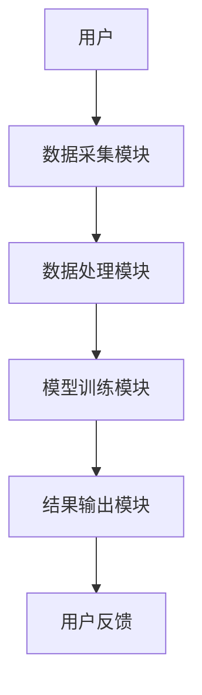

                 

<think>
嗯，用户让我写一篇关于融合AI技术的新一代投资理财教育平台的技术博客。首先，我需要理解这个平台的核心是什么。它不仅仅是传统的理财教育，而是结合了AI技术，比如自然语言处理和机器学习，来提供更智能、个性化的投资建议。

接下来，我得考虑读者是谁。可能是投资者、教育机构或者技术人员。因此，内容需要专业但又不失易懂。我需要从背景开始，介绍传统理财教育的局限性，然后引出AI的优势。

然后，我得详细讲解AI技术在投资理财中的应用，比如数据处理和模型训练。这部分需要用具体的例子和图表，比如Mermaid图，来展示流程。数学模型也不能少，比如线性回归和逻辑回归，用LaTeX公式来呈现，这样更专业。

系统架构部分，我需要画出模块图和交互序列图，展示平台是如何运作的。项目实战部分，最好有一个具体的案例，比如基于GPT的智能投顾系统，展示如何实现，代码和案例分析都要详细。

最后，总结一下平台的优势，并展望未来的发展方向，比如更精准的模型和个性化服务。还要记得在结尾加上作者信息，确保文章完整。

整体来看，我需要确保每个部分都详细，结构清晰，同时保持逻辑连贯。这样才能写出一篇高质量的技术博客，帮助读者全面理解融合AI的投资理财平台。
</think>

# 融合AI技术的新一代投资理财教育平台

> 关键词：AI技术，投资理财教育，自然语言处理，机器学习，智能投顾系统

> 摘要：本文将详细探讨如何利用AI技术构建新一代投资理财教育平台，重点分析AI技术在投资理财教育中的应用背景、核心概念、算法原理、系统架构以及实际案例。通过本文的讲解，读者将深入了解AI技术如何赋能投资理财教育，为投资者提供更智能、更个性化的投资建议。

---

# 第一部分：投资理财教育的背景与挑战

## 第1章：传统投资理财教育的局限性

### 1.1 传统投资理财教育的核心问题
- **知识传播的单一性**：传统教育模式通常采用固定的课程和教材，难以满足不同投资者的个性化需求。
- **信息更新的滞后性**：金融市场变化迅速，传统教育模式难以及时更新教学内容。
- **互动性不足**：学生与教师之间的互动有限，难以实现个性化的学习体验。

### 1.2 投资者需求的多样化与个性化
- **不同风险承受能力**：投资者对风险的偏好各不相同，需要个性化的投资建议。
- **多样化投资目标**：投资者可能有不同的财务目标，如短期理财、长期投资等。
- **实时性需求**：投资者需要实时获取市场动态和投资建议。

### 1.3 传统投资理财教育的边界与外延
- **教育内容的局限性**：传统教育模式往往局限于理论知识的传授，缺乏实践指导。
- **教育方式的局限性**：缺乏互动性和个性化，难以满足投资者的多样化需求。

---

## 第2章：AI技术在投资理财教育中的应用背景

### 2.1 AI技术的核心概念与特点
- **人工智能（AI）**：通过模拟人类的智能行为，实现问题解决、学习和推理。
- **机器学习（ML）**：一种实现AI的技术，通过数据训练模型，使其能够自动改进。
- **自然语言处理（NLP）**：使计算机能够理解和生成人类语言的技术。

### 2.2 AI技术与投资理财教育的结合点
- **数据处理**：AI技术可以高效处理大量金融数据，提供实时市场分析。
- **个性化推荐**：通过机器学习，AI可以为投资者提供个性化的投资建议。
- **智能交互**：NLP技术可以实现与投资者的自然语言对话，提供实时帮助。

### 2.3 融合AI技术的投资理财教育平台的优势
- **个性化学习体验**：通过AI技术，平台可以为每个投资者定制个性化学习路径。
- **实时市场分析**：AI可以实时处理市场数据，提供最新的投资建议。
- **高效互动**：通过智能交互，投资者可以随时获得帮助和支持。

---

# 第二部分：AI技术在投资理财教育中的核心概念

## 第3章：AI技术在投资理财教育中的核心概念

### 3.1 数据采集与处理
- **数据来源**：包括金融市场的实时数据、投资者行为数据等。
- **数据预处理**：清洗、转换和标准化数据，以便模型训练。

### 3.2 模型训练与优化
- **模型选择**：根据具体需求选择合适的算法，如线性回归、逻辑回归等。
- **模型训练**：通过大量数据训练模型，使其能够准确预测市场趋势。
- **模型优化**：通过调整参数和优化算法，提高模型的预测精度。

### 3.3 结果输出与反馈
- **结果输出**：将模型预测结果以用户友好的方式展示给投资者。
- **用户反馈**：收集用户的反馈，用于模型优化和改进。

---

## 第4章：AI技术在投资理财教育中的算法原理

### 4.1 线性回归模型
$$ y = \beta_0 + \beta_1x + \epsilon $$
- **解释**：用于预测连续型变量，如股票价格。
- **应用场景**：适合短期市场趋势预测。

### 4.2 逻辑回归模型
$$ P(y=1|x) = \frac{e^{\beta_0 + \beta_1x}}{1 + e^{\beta_0 + \beta_1x}} $$
- **解释**：用于分类问题，如判断股票是否上涨或下跌。
- **应用场景**：适合长期投资决策。

### 4.3 支持向量机（SVM）
$$ \text{目标函数：} \min_{w,b} \frac{1}{2}||w||^2 + C \sum_{i=1}^n \xi_i $$
$$ \text{约束条件：} y_i(w \cdot x_i + b) \geq 1 - \xi_i $$
- **解释**：用于分类和回归问题，适合处理非线性数据。
- **应用场景**：适合复杂金融市场数据的分类。

---

## 第5章：AI技术在投资理财教育中的系统架构

### 5.1 系统架构设计
- **数据采集模块**：负责采集金融市场数据和用户行为数据。
- **数据处理模块**：对数据进行清洗、转换和标准化。
- **模型训练模块**：选择合适的算法，训练模型并进行优化。
- **结果输出模块**：将预测结果以用户友好的方式展示。

### 5.2 系统交互流程


---

# 第三部分：AI技术在投资理财教育中的项目实战

## 第6章：基于GPT的智能投顾系统

### 6.1 系统环境安装
- **Python版本**：建议使用Python 3.8及以上版本。
- **依赖库安装**：`pip install numpy pandas scikit-learn transformers`

### 6.2 系统核心实现
```python
import pandas as pd
from sklearn.model_selection import train_test_split
from sklearn.linear_model import LinearRegression

# 数据加载
data = pd.read_csv('financial_data.csv')

# 数据分割
X = data[['stock_price', 'market_volume']]
y = data['next_day_price']

X_train, X_test, y_train, y_test = train_test_split(X, y, test_size=0.2)

# 模型训练
model = LinearRegression()
model.fit(X_train, y_train)

# 预测结果
y_pred = model.predict(X_test)
```

### 6.3 系统功能与案例分析
- **功能1**：实时市场数据查询。
- **功能2**：个性化投资建议。
- **功能3**：风险评估与预警。

---

## 第7章：项目总结与展望

### 7.1 项目总结
- **核心成果**：构建了一个基于AI技术的投资理财教育平台，实现了个性化学习体验和实时市场分析。
- **经验总结**：AI技术的应用能够显著提高投资理财教育的效率和效果。

### 7.2 未来展望
- **技术优化**：进一步优化模型，提高预测精度。
- **功能扩展**：增加更多AI功能，如情感分析和市场情绪预测。

---

# 结语

通过本文的详细讲解，我们深入了解了AI技术在投资理财教育中的应用，从背景到核心概念，从算法原理到系统架构，再到实际案例，全面分析了融合AI技术的新一代投资理财教育平台的优势和潜力。未来，随着AI技术的不断发展，投资理财教育将更加智能化、个性化，为投资者提供更优质的服务。

---

作者：AI天才研究院/AI Genius Institute & 禅与计算机程序设计艺术 /Zen And The Art of Computer Programming

