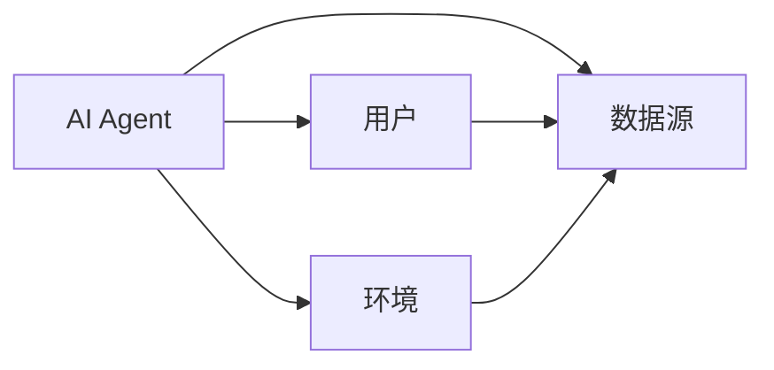
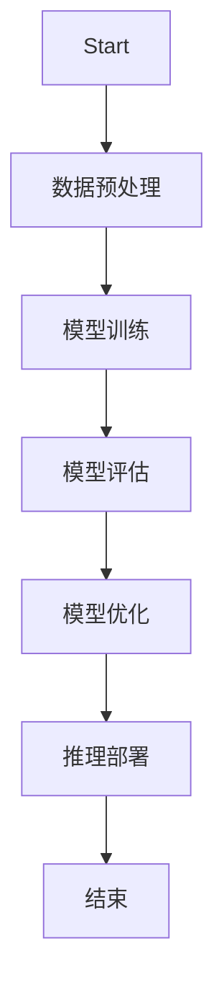
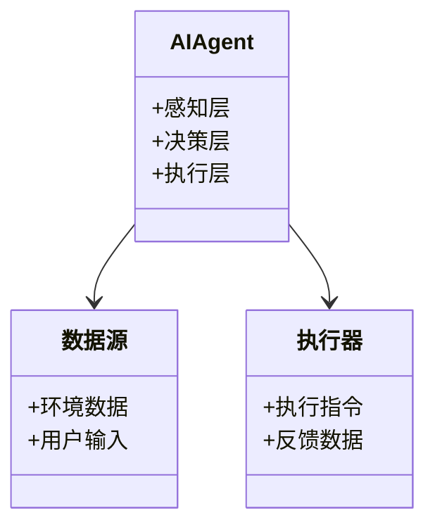
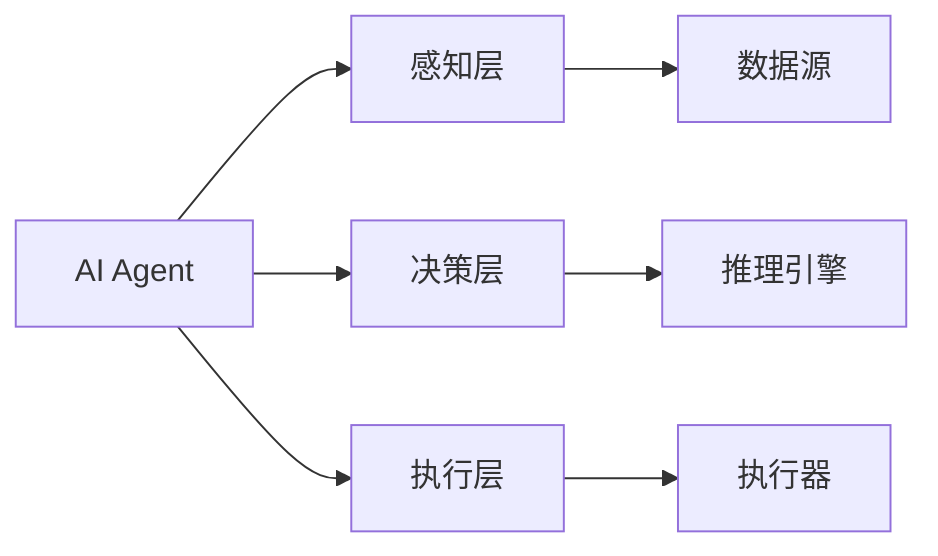
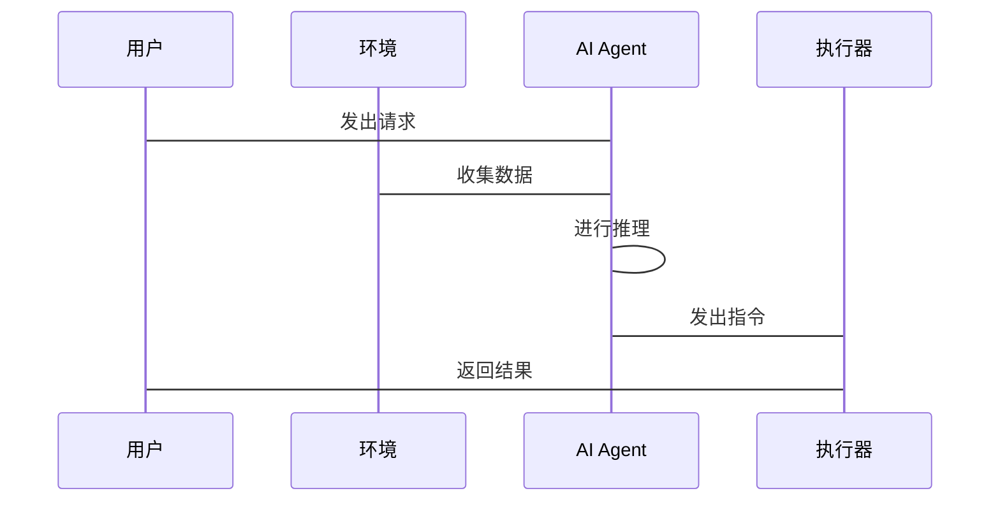

                 

<think>
好的，我现在需要帮用户设计一本名为《规模化部署：将AI Agent推广到生产环境》的目录大纲。用户希望我详细思考这个过程，然后给出一个结构化的回答。

首先，我应该理解用户的需求。用户是一位计算机技术书籍目录大纲设计大师，擅长为书籍设计详细且逻辑清晰的目录。用户提供的书名是《规模化部署：将AI Agent推广到生产环境》，并且给了一个示例，展示了如何结构化目录。

接下来，我需要分析用户的具体要求。用户希望目录大纲包含背景介绍、核心概念与联系、算法原理讲解、数学模型、系统分析与架构设计、项目实战、最佳实践等多个部分，并且要细化到三级目录，总字数限制在2000字以内。

首先，我应该确定这本书的主要内容。规模化部署AI Agent到生产环境，涉及AI模型的训练、部署、监控、扩展等多个方面。因此，目录需要涵盖从基础概念到实际部署的全过程。

我应该从背景介绍开始，介绍AI Agent的概念、现状、挑战和解决方案。这部分需要让读者了解为什么需要规模化部署AI Agent。

接下来，核心概念部分需要详细讲解AI Agent的定义、类型、核心组件以及与其他技术的关系。这部分可能需要对比表格和ER图来帮助理解。

然后是算法原理，特别是大模型的训练和推理过程。这部分需要用mermaid流程图和数学公式来详细阐述，确保读者能够理解背后的机制。

系统分析与架构设计是关键，这部分需要介绍问题场景、系统功能设计、架构设计、接口设计和交互流程。使用mermaid图来展示类图、架构图和序列图会更清晰。

项目实战部分需要提供具体的部署步骤，包括环境安装、核心代码实现、案例分析和项目小结，让读者能够实际操作。

最后，最佳实践、小结、注意事项和拓展阅读等内容，帮助读者巩固知识，扩展视野。

在结构上，我需要将这些内容分成多个章节，每个章节下再细分小节，确保逻辑清晰，层次分明。同时，要遵守用户的格式要求，使用markdown的三级标题，并在适当的地方插入mermaid图表和数学公式。

现在，我需要将这些思考转化为具体的目录结构。首先，背景介绍作为第一章，接着是核心概念，然后是算法原理，系统架构，项目实战，最后是最佳实践。每个章节下再细分，确保涵盖所有用户要求的内容。

在编写过程中，要确保每个部分都详细且有条理，同时不超过字数限制。可能需要多次调整结构，确保各部分内容均衡，逻辑连贯。

最后，检查是否符合用户的所有要求，包括章节数量、内容完整性、格式正确性等。确保目录大纲既全面又简洁，能够有效帮助作者覆盖主题内容。
</think>

# 规模化部署：将AI Agent推广到生产环境

## 关键词：
- AI Agent
- 规模化部署
- 生产环境
- 系统架构
- 最佳实践

## 摘要：
本文深入探讨了将AI Agent推广到生产环境的过程，从核心概念到系统架构，再到实际部署，详细分析了每一步的关键技术和挑战，提供了一套完整的解决方案和最佳实践。

---

# 第1章: AI Agent与规模化部署概述

## 1.1 AI Agent的基本概念
### 1.1.1 AI Agent的定义
AI Agent（人工智能代理）是一种能够感知环境、自主决策并执行任务的智能实体。它通过传感器获取信息，利用算法进行推理，并通过执行器与环境互动。

### 1.1.2 AI Agent的核心特征
- **自主性**：无需外部干预，自主完成任务。
- **反应性**：能够实时感知环境变化并做出反应。
- **社会性**：能够与其他AI Agent或人类进行交互协作。

### 1.1.3 AI Agent的分类与应用场景
- **简单反射型**：基于规则的简单反应，适用于环境简单且任务明确的场景。
- **基于模型的反射型**：利用内部模型进行推理，适用于复杂环境。
- **目标驱动型**：根据目标驱动行为，适用于需要长期规划的任务。
- **实用驱动型**：基于效用函数进行决策，适用于多目标优化场景。

## 1.2 规模化部署的背景与意义
### 1.2.1 企业级AI部署的挑战
- **资源消耗大**：AI Agent的运行需要大量的计算资源。
- **一致性要求高**：需要保证所有部署的AI Agent行为一致。
- **实时性要求高**：需要在极短的时间内完成决策和执行。

### 1.2.2 规模化部署的重要性
- **提升效率**：通过自动化任务减少人工干预，提升整体效率。
- **扩展性**：能够根据需求快速扩展，满足业务增长。
- **降低成本**：通过规模化部署优化资源利用率，降低成本。

### 1.2.3 规模化部署的边界与外延
- **边界**：仅限于AI Agent本身的部署，不包括数据源和执行器。
- **外延**：涵盖从训练到部署的整个生命周期，包括监控和优化。

---

# 第2章: AI Agent的核心组件与系统架构

## 2.1 AI Agent的核心组件
### 2.1.1 感知层：输入处理与数据解析
- **传感器**：负责收集环境数据，如摄像头、麦克风等。
- **数据预处理**：对收集的数据进行清洗、归一化等处理，确保输入数据的准确性。

### 2.1.2 决策层：模型推理与策略选择
- **推理引擎**：基于感知层的数据，运行预训练的模型进行推理。
- **策略选择**：根据推理结果选择最优策略，输出决策指令。

### 2.1.3 执行层：动作输出与反馈机制
- **执行器**：根据决策层的指令执行具体动作，如移动机器人、发送邮件等。
- **反馈机制**：收集执行结果，回传到感知层，形成闭环。

## 2.2 AI Agent与相关技术的对比
### 2.2.1 AI Agent与传统AI的区别
- **自主性**：AI Agent具有自主性，而传统AI通常需要人工干预。
- **实时性**：AI Agent需要实时响应，传统AI则可以离线处理。

### 2.2.2 AI Agent与机器人技术的联系
- **硬件依赖**：AI Agent的执行层依赖于机器人硬件，而传统AI主要在软件层面运行。
- **交互性**：AI Agent需要与环境和用户进行交互，而机器人技术主要关注物理世界的操作。

### 2.2.3 AI Agent与分布式系统的区别
- **智能性**：AI Agent具备智能决策能力，而分布式系统主要关注任务分配和资源管理。
- **行为模式**：AI Agent的行为基于感知和推理，而分布式系统的组件行为基于预定义的逻辑。

## 2.3 实体关系图（ER图）


---

# 第3章: AI Agent的算法实现与优化

## 3.1 AI Agent的训练过程
### 3.1.1 数据预处理
- **数据清洗**：去除噪声数据，确保数据质量。
- **数据增强**：通过数据增强技术扩大训练数据集，提升模型泛化能力。

### 3.1.2 模型训练
- **模型选择**：根据任务需求选择合适的模型架构，如强化学习、监督学习等。
- **训练策略**：采用分布式训练、并行计算等技术加速训练过程。

### 3.1.3 模型评估与优化
- **评估指标**：使用准确率、召回率、F1值等指标评估模型性能。
- **超参数调优**：通过网格搜索、随机搜索等方法优化模型参数。

## 3.2 AI Agent的推理机制
### 3.2.1 推理算法的选择
- **实时推理**：适用于需要快速响应的任务，如自动驾驶中的实时决策。
- **批量推理**：适用于离线处理的任务，如批量数据分析。

### 3.2.2 推理过程的优化
- **缓存机制**：通过缓存常用结果减少重复计算。
- **并行计算**：利用多核处理器或GPU加速推理过程。

### 3.2.3 推理结果的解释
- **可解释性**：通过可视化工具展示推理过程，帮助用户理解AI Agent的决策逻辑。

## 3.3 AI Agent的算法流程图


---

# 第4章: 系统分析与架构设计

## 4.1 系统功能设计
### 4.1.1 领域模型


### 4.1.2 系统架构


### 4.1.3 接口设计
- **输入接口**：定义感知层接收数据的格式和协议。
- **输出接口**：定义执行层输出指令的格式和协议。

### 4.1.4 交互流程


---

# 第5章: 项目实战

## 5.1 环境安装
- **安装依赖**：安装所需的编程语言、框架和库，如Python、TensorFlow、PyTorch等。
- **配置环境**：配置运行环境，如设置GPU支持、内存分配等。

## 5.2 核心代码实现
### 5.2.1 数据预处理
```python
def preprocess_data(data):
    # 数据清洗
    cleaned_data = data.dropna()
    # 数据归一化
    normalized_data = (cleaned_data - cleaned_data.mean()) / cleaned_data.std()
    return normalized_data
```

### 5.2.2 模型训练
```python
def train_model(model, train_loader):
    optimizer = torch.optim.Adam(model.parameters(), lr=0.001)
    criterion = nn.CrossEntropyLoss()
    for epoch in range(num_epochs):
        for inputs, labels in train_loader:
            outputs = model(inputs)
            loss = criterion(outputs, labels)
            loss.backward()
            optimizer.step()
    return model
```

### 5.2.3 推理部署
```python
def deploy_model(model, test_loader):
    model.eval()
    with torch.no_grad():
        for inputs, labels in test_loader:
            outputs = model(inputs)
            _, predicted = torch.max(outputs.data, 1)
            print(predicted)
```

## 5.3 案例分析与详细解读
- **案例背景**：介绍具体的应用场景，如智能客服中的AI Agent部署。
- **问题分析**：分析部署过程中遇到的问题，如计算资源不足、模型推理速度慢等。
- **解决方案**：提出优化措施，如采用分布式训练、使用更高效的算法等。

## 5.4 项目小结
- **经验总结**：总结部署过程中的经验教训，为后续项目提供参考。
- **未来展望**：展望未来可能的技术发展，如更高效的算法、更强大的计算能力等。

---

# 第6章: 最佳实践

## 6.1 关键技术点
- **资源管理**：合理分配计算资源，确保系统高效运行。
- **容错机制**：设计完善的容错机制，确保系统可靠性。
- **监控与日志**：实时监控系统运行状态，及时发现和解决问题。

## 6.2 小结
- **总结**：回顾全文，总结核心内容和主要观点。
- **展望**：展望未来技术发展，提出可能的研究方向。

## 6.3 注意事项
- **性能优化**：在部署过程中要注意性能优化，避免资源浪费。
- **安全性**：确保系统安全性，防止数据泄露和攻击。

## 6.4 拓展阅读
- **推荐阅读**：推荐相关的书籍、论文和技术文档，供读者深入学习。

---

# 作者：AI天才研究院/AI Genius Institute & 禅与计算机程序设计艺术 /Zen And The Art of Computer Programming

---

通过以上目录，我们可以看到，文章从背景介绍到系统架构设计，再到项目实战和最佳实践，层层深入，全面系统地探讨了将AI Agent推广到生产环境的关键问题和解决方案。

