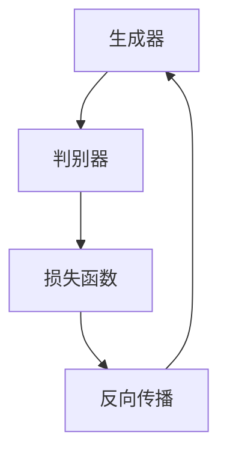
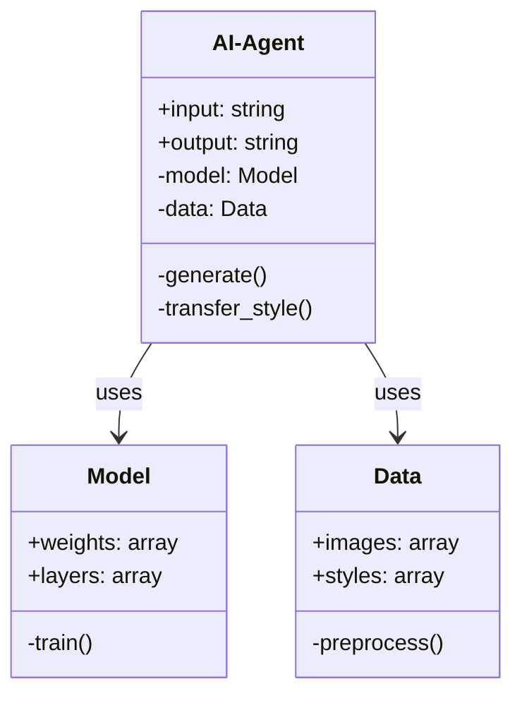
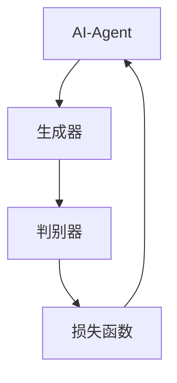
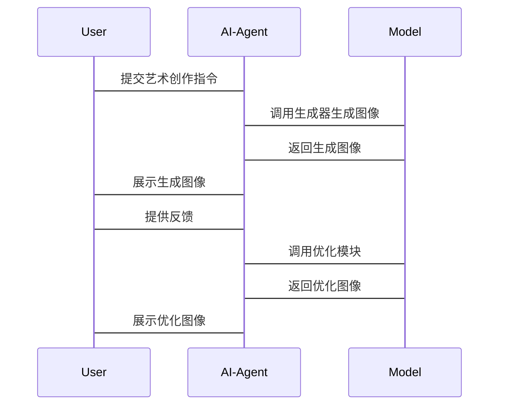

                 


# 视觉艺术领域的AI Agent创作工具

> 关键词：视觉艺术、AI Agent、图像生成、风格迁移、创作工具

> 摘要：本文深入探讨了视觉艺术领域的AI Agent创作工具，从概念、算法、系统设计到实战应用，全面分析了AI在视觉艺术创作中的潜力与实现方式。通过具体案例和数学公式，详细讲解了生成对抗网络（GAN）、变分自编码器（VAE）等核心算法的原理与应用，并展示了AI Agent在视觉艺术创作中的实际流程与系统架构设计。

---

# 第一部分: 视觉艺术领域的AI Agent创作工具概述

## 第1章: 视觉艺术与AI Agent的结合

### 1.1 视觉艺术领域的数字化转型
#### 1.1.1 艺术创作的数字化趋势
随着计算机技术的飞速发展，艺术创作也在逐步从传统手工化向数字化转型。AI技术的引入，为艺术家提供了全新的创作工具和灵感来源。

#### 1.1.2 AI技术在视觉艺术中的应用前景
AI技术在视觉艺术中的应用前景广阔，包括图像生成、风格迁移、图像修复、艺术推荐等多个方面。

#### 1.1.3 视觉艺术领域中的AI Agent角色
AI Agent在视觉艺术领域中扮演着多重角色，既是创作工具，也是艺术风格的分析助手，更是艺术创作的灵感来源。

### 1.2 AI Agent的基本概念与特征
#### 1.2.1 AI Agent的定义与分类
AI Agent（智能体）是指能够感知环境并采取行动以实现目标的实体。在视觉艺术领域，AI Agent可以分为创作型、辅助型和分析型三大类。

#### 1.2.2 AI Agent的核心特征
- **智能性**：能够理解输入的数据并生成有意义的输出。
- **自主性**：能够在没有人工干预的情况下独立运行。
- **反应性**：能够根据环境的变化实时调整输出。

#### 1.2.3 AI Agent与传统工具的区别
AI Agent相比传统工具，具有更强的智能化和自动化能力，能够处理复杂的数据和生成高质量的艺术作品。

### 1.3 视觉艺术创作中的AI Agent工具
#### 1.3.1 AI在图像生成中的应用
通过生成对抗网络（GAN）等技术，AI Agent能够生成高质量的艺术图像。

#### 1.3.2 AI在艺术风格分析中的应用
AI Agent可以通过深度学习模型分析艺术作品的风格特征，并进行风格迁移。

#### 1.3.3 AI在视觉艺术创作中的优势与局限性
- **优势**：提高创作效率，拓展创作可能性，提供新的艺术风格。
- **局限性**：目前仍难以完全模拟人类的创意和情感表达。

---

## 第2章: 视觉艺术创作中的AI Agent核心概念

### 2.1 视觉艺术创作的背景与问题
#### 2.1.1 艺术创作的复杂性与多样性
艺术创作需要综合考虑构图、色彩、光影等多个因素，具有高度的复杂性。

#### 2.1.2 传统艺术创作工具的局限性
传统工具在创作过程中效率低下，难以快速生成多样化的作品。

#### 2.1.3 AI技术如何解决艺术创作中的问题
AI技术通过自动化处理和数据分析，显著提高了艺术创作的效率和可能性。

### 2.2 AI Agent在视觉艺术中的核心功能
#### 2.2.1 内容生成
AI Agent可以通过生成对抗网络（GAN）生成高质量的艺术图像。

#### 2.2.2 风格迁移
通过风格迁移算法，AI Agent能够将一种艺术风格应用到另一种图像上。

#### 2.2.3 创意辅助
AI Agent可以为艺术家提供灵感和创意建议，辅助艺术创作。

### 2.3 AI Agent的创作流程与工作原理
#### 2.3.1 数据输入与处理
AI Agent需要输入大量的艺术数据进行训练，包括图像、风格特征等。

#### 2.3.2 模型训练与优化
通过深度学习模型的训练，AI Agent能够学习艺术创作的规律和风格。

#### 2.3.3 创作输出与反馈
AI Agent根据输入的指令生成艺术作品，并根据反馈不断优化输出结果。

---

## 第3章: AI Agent的算法原理与数学模型

### 3.1 常见的AI算法与模型
#### 3.1.1 生成对抗网络（GAN）
生成对抗网络由生成器和判别器两部分组成，通过对抗训练生成高质量的艺术图像。

#### 3.1.2 变量自编码器（VAE）
变变量自编码器通过编码和解码过程，生成多样化的艺术图像。

#### 3.1.3 图像分割与风格迁移算法
图像分割算法用于分析图像内容，风格迁移算法将一种风格应用到另一种图像上。

### 3.2 GAN模型的原理与流程图


### 3.3 GAN模型的数学公式
#### 生成器的损失函数：
$$ \mathcal{L}_G = \log(1 - D(G(x))) $$

#### 判别器的损失函数：
$$ \mathcal{L}_D = -\log(D(x)) - \log(1 - D(G(x))) $$

---

## 第4章: 系统架构与设计

### 4.1 项目背景与目标
#### 4.1.1 项目背景
本项目旨在开发一款基于AI的视觉艺术创作工具，帮助艺术家高效生成和修改艺术作品。

#### 4.1.2 项目目标
- 提供多种艺术风格的生成选项。
- 实现艺术作品的风格迁移功能。
- 提供实时的创作反馈和优化建议。

### 4.2 系统功能设计
#### 4.2.1 用户需求分析
用户需求包括艺术作品生成、风格迁移、创作工具定制等功能。

#### 4.2.2 功能模块划分
- **输入模块**：接收用户指令和输入图像。
- **处理模块**：包括数据预处理和模型训练。
- **输出模块**：生成艺术作品并展示结果。

#### 4.2.3 领域模型（类图）


### 4.3 系统架构设计
#### 4.3.1 系统架构图


#### 4.3.2 系统接口设计
- **输入接口**：接收用户的艺术创作指令。
- **输出接口**：展示生成的艺术作品。

#### 4.3.3 系统交互流程


---

## 第5章: 项目实战

### 5.1 环境安装
- **Python**：安装Python 3.8或更高版本。
- **深度学习框架**：安装TensorFlow或PyTorch。
- **依赖库**：安装numpy、pandas、matplotlib等。

### 5.2 系统核心实现源代码
```python
import tensorflow as tf
from tensorflow.keras import layers

# 定义生成器
def generator():
    model = tf.keras.Sequential()
    model.add(layers.Dense(256, activation='relu', input_shape=(100,)))
    model.add(layers.Dense(128, activation='relu'))
    model.add(layers.Dense(64, activation='relu'))
    model.add(layers.Dense(32, activation='relu'))
    model.add(layers.Dense(16, activation='relu'))
    model.add(layers.Dense(3, activation='sigmoid'))
    return model

# 定义判别器
def discriminator():
    model = tf.keras.Sequential()
    model.add(layers.Dense(64, activation='relu', input_shape=(3,)))
    model.add(layers.Dense(32, activation='relu'))
    model.add(layers.Dense(1, activation='sigmoid'))
    return model
```

### 5.3 代码应用解读与分析
- **生成器**：通过多层感知机生成艺术图像的特征向量。
- **判别器**：通过多层感知机判断输入图像是否为真实图像。

### 5.4 实际案例分析
- **案例1**：使用GAN生成艺术风格的图像。
- **案例2**：通过风格迁移算法将梵高风格应用到风景画上。

### 5.5 项目小结
通过实际案例的分析，展示了AI Agent在视觉艺术创作中的强大能力。

---

## 第6章: 高级内容与最佳实践

### 6.1 当前研究热点
- **多模态模型**：结合文本和图像的多模态输入，生成更丰富的艺术作品。
- **实时创作工具**：优化算法性能，实现实时的艺术创作。

### 6.2 最佳实践 tips
- **数据质量**：确保训练数据的多样性和高质量。
- **模型优化**：通过调整超参数和优化算法，提升生成效果。
- **用户反馈**：根据用户的反馈不断优化生成结果。

### 6.3 小结
AI Agent在视觉艺术创作中的应用前景广阔，未来将会有更多的创新和突破。

---

作者：AI天才研究院/AI Genius Institute & 禅与计算机程序设计艺术/Zen And The Art of Computer Programming

