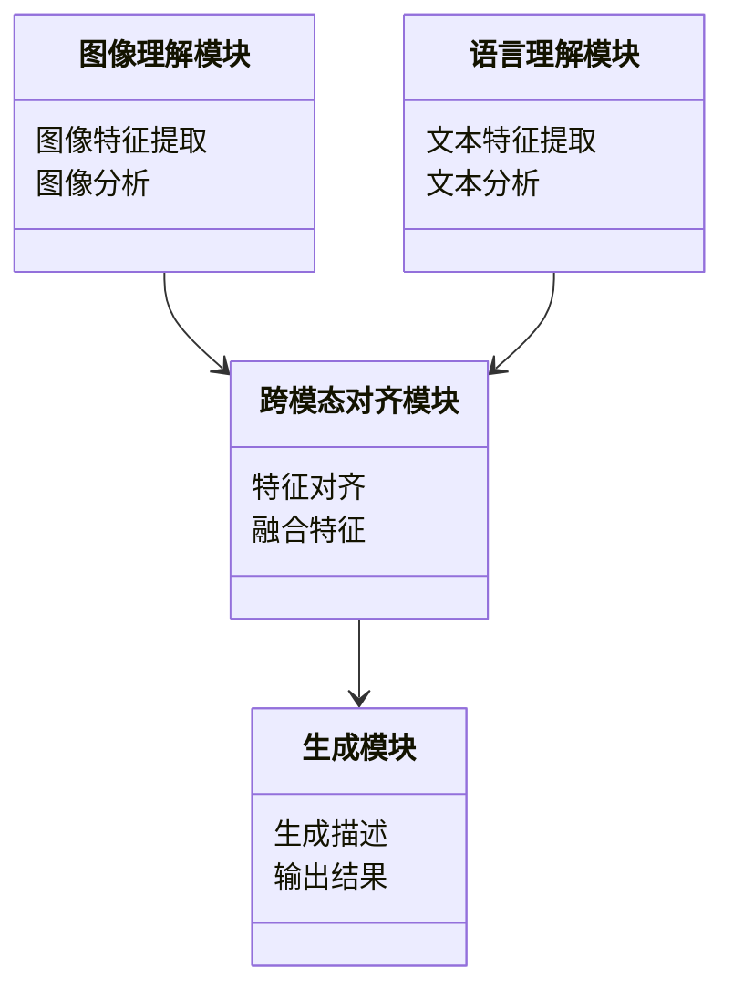

                 

<think>
好的，我现在需要根据用户的要求，设计一篇关于《视觉-语言AI Agent：整合LLM与图像理解》的技术博客文章。用户已经给出了详细的目录结构和要求，我需要按照这些要求逐步完成每个部分的内容。

首先，我会先处理标题、关键词和摘要部分，确保符合用户的要求。接下来，按照目录结构，依次完成每个章节的内容，包括背景介绍、核心概念、算法原理、系统分析与架构设计、项目实战和最佳实践。每个部分都需要详细展开，包含必要的图表、代码示例和数学公式。

在写作过程中，我会确保使用清晰、简洁的技术语言，逻辑严谨，结构紧凑。同时，我需要合理安排各部分的字数，以满足总字数在10000到12000字的要求。最后，检查每个部分是否覆盖了用户指定的核心内容，包括背景、核心概念、算法、系统设计、项目实战和最佳实践，并确保每个小节都详细具体，符合专业深度要求。

现在，我将开始逐步撰写这篇文章，确保每一部分都符合用户的要求，并在完成后进行复查，确保内容准确无误，格式正确。
</think>

# 视觉-语言AI Agent：整合LLM与图像理解

> 关键词：视觉-语言模型，LLM，图像理解，多模态AI，跨模态对齐，计算机视觉，自然语言处理

> 摘要：本文探讨了视觉-语言AI Agent的构建与应用，结合大语言模型（LLM）与图像理解技术，分析了其核心概念、算法原理、系统架构及实际应用场景，提供了一套从理论到实践的完整解决方案。

---

# 第一部分: 视觉-语言AI Agent的背景与概念

## 第1章: 视觉-语言AI Agent的背景介绍

### 1.1 问题背景与问题描述

#### 1.1.1 多模态AI的发展现状
近年来，人工智能技术快速发展，多模态AI逐渐成为研究热点。传统的单一模态模型难以应对复杂场景的需求，而多模态模型能够整合图像、文本、语音等多种信息，提升系统的理解和决策能力。

#### 1.1.2 图像与语言理解的结合需求
图像理解与语言处理的结合能够实现更自然的交互方式。例如，在图像描述生成、图像问答、视觉导航等任务中，结合语言模型能够显著提升系统性能。

#### 1.1.3 当前技术的局限性与挑战
当前技术在跨模态对齐、模型训练效率、实时性等方面仍存在挑战。例如，图像特征与文本特征的对齐需要复杂的计算，且大规模数据的训练对计算资源要求较高。

### 1.2 视觉-语言AI Agent的核心概念

#### 1.2.1 视觉-语言模型的定义
视觉-语言AI Agent是一种能够理解和生成视觉与语言信息的智能系统，具备跨模态理解和生成能力。

#### 1.2.2 视觉-语言模型的核心要素
- **多模态输入处理**：能够同时处理图像和文本信息。
- **跨模态对齐**：实现图像与文本特征之间的对齐与交互。
- **联合优化**：通过多任务学习优化模型性能。

#### 1.2.3 模型的边界与外延
视觉-语言模型专注于图像与语言的结合，未来可能扩展到更多模态，如语音、视频等。

### 1.3 问题解决与应用前景

#### 1.3.1 视觉-语言模型的应用场景
- 图像描述生成
- 图像问答系统
- 视觉导航与交互

#### 1.3.2 技术整合的优势与潜力
通过整合LLM与图像理解技术，能够实现更智能、更自然的人机交互。

#### 1.3.3 应用中的挑战与解决方案
- **数据多样性**：通过数据增强和多任务学习提升模型的泛化能力。
- **计算效率**：优化模型结构，减少计算成本。

### 1.4 本章小结
本章介绍了视觉-语言AI Agent的背景与核心概念，为后续章节奠定了基础。

---

## 第2章: 视觉-语言模型的核心原理

### 2.1 多模态数据的处理与整合

#### 2.1.1 图像与文本数据的特征分析
- 图像特征：如颜色、纹理、形状等。
- 文本特征：如词向量、句向量等。

#### 2.1.2 多模态数据的对齐方法
- **基于注意力机制的对齐**：通过注意力机制实现图像特征与文本特征的对齐。
- **对比学习**：通过对比损失函数优化跨模态对齐。

#### 2.1.3 数据融合的挑战与解决方案
- 数据异质性问题：通过跨模态映射实现特征对齐。
- 数据不平衡问题：采用加权损失函数。

### 2.2 模型架构与训练策略

#### 2.2.1 视觉-语言模型的架构设计
- **编码器-解码器架构**：编码器处理多模态输入，解码器生成目标输出。
- **多模态融合层**：在编码器中加入专门的融合层，整合图像和文本特征。

#### 2.2.2 多任务学习与联合优化
- **多任务学习**：同时优化图像理解与语言生成任务。
- **联合优化**：通过共享特征提取部分，提升模型性能。

#### 2.2.3 预训练与微调策略
- **预训练**：在大规模多模态数据上进行预训练。
- **微调**：针对具体任务进行微调优化。

### 2.3 跨模态对齐与交互机制

#### 2.3.1 跨模态对齐的定义与实现
- **定义**：将不同模态的特征映射到同一空间。
- **实现**：通过对比学习或注意力机制实现特征对齐。

#### 2.3.2 注意力机制在跨模态交互中的应用
- **自注意力机制**：用于处理序列数据。
- **交叉注意力机制**：用于跨模态交互。

#### 2.3.3 对齐策略的优化方法
- **对比学习**：通过最大化相似模态的对齐概率。
- **对抗训练**：通过对抗网络优化对齐效果。

### 2.4 本章小结
本章详细探讨了视觉-语言模型的核心原理，包括多模态数据处理、模型架构设计和跨模态对齐机制。

---

## 第3章: 视觉-语言AI Agent的算法原理

### 3.1 多模态数据的预处理

#### 3.1.1 图像特征提取与编码
- **图像特征提取**：使用CNN提取图像特征。
- **特征编码**：将图像特征编码为固定长度向量。

#### 3.1.2 文本特征提取与编码
- **文本特征提取**：使用BERT等模型提取文本特征。
- **特征编码**：将文本特征编码为固定长度向量。

#### 3.1.3 数据对齐与融合方法
- **数据对齐**：通过对比学习或注意力机制实现特征对齐。
- **数据融合**：将对齐后的图像和文本特征进行融合。

### 3.2 模型训练与优化

#### 3.2.1 损失函数的设计与实现
- **对比损失函数**：用于跨模态对齐。
- **生成损失函数**：用于图像描述生成。

#### 3.2.2 优化策略与训练技巧
- **Adam优化器**：常用优化器。
- **学习率调整**：采用学习率衰减策略。

#### 3.2.3 模型调参与评估指标
- **模型调参**：通过网格搜索或随机搜索优化模型参数。
- **评估指标**：如BLEU、ROUGE等。

### 3.3 跨模态对齐的算法流程

#### 3.3.1 对齐算法的步骤分解
1. **数据预处理**：提取图像和文本特征。
2. **特征对齐**：通过对比学习优化特征对齐。
3. **融合特征**：将对齐后的特征进行融合。
4. **模型训练**：优化模型参数。

#### 3.3.2 基于注意力的对齐流程
1. **计算注意力权重**：通过计算图像和文本特征之间的相似度。
2. **加权特征融合**：根据注意力权重对特征进行加权融合。

#### 3.3.3 对齐策略的优化方法
1. **对比学习**：最大化相似模态的对齐概率。
2. **对抗训练**：通过对抗网络优化对齐效果。

### 3.4 本章小结
本章详细介绍了视觉-语言模型的算法实现，包括数据预处理、模型训练和对齐策略优化。

---

## 第4章: 视觉-语言AI Agent的系统分析与架构设计

### 4.1 系统背景与项目介绍

#### 4.1.1 项目背景
- **项目目标**：构建一个能够理解与生成视觉和语言信息的AI Agent。
- **应用场景**：图像描述生成、图像问答系统等。

#### 4.1.2 项目目标
- **核心目标**：实现视觉-语言模型的构建与应用。
- **扩展目标**：支持多模态交互。

### 4.2 系统功能设计

#### 4.2.1 功能模块划分
- **图像理解模块**：负责图像特征提取与分析。
- **语言理解模块**：负责文本特征提取与分析。
- **跨模态对齐模块**：实现图像与文本特征对齐。
- **生成模块**：生成目标输出，如图像描述。

#### 4.2.2 功能流程设计
1. **输入处理**：接收图像与文本输入。
2. **特征提取**：提取图像和文本特征。
3. **特征对齐**：对齐图像和文本特征。
4. **生成输出**：生成目标输出。

#### 4.2.3 功能交互设计
- **用户输入**：图像与文本输入。
- **系统处理**：内部处理流程。
- **用户输出**：生成描述或回答。

### 4.3 系统架构设计

#### 4.3.1 领域模型类图


#### 4.3.2 系统架构图


### 4.4 系统接口与交互设计

#### 4.4.1 系统接口设计
- **输入接口**：接收图像与文本输入。
- **输出接口**：输出生成的描述或回答。

#### 4.4.2 系统交互流程
1. **用户输入**：用户提交图像与文本。
2. **系统处理**：系统内部处理流程。
3. **用户输出**：系统生成描述或回答。

### 4.5 本章小结
本章详细分析了视觉-语言AI Agent的系统架构与功能设计，为后续实现奠定了基础。

---

## 第5章: 视觉-语言AI Agent的项目实战

### 5.1 环境安装与配置

#### 5.1.1 安装Python与相关库
- **Python版本**：建议使用Python 3.8及以上。
- **安装库**：如TensorFlow、Keras、BERT等。

#### 5.1.2 安装深度学习框架
- **TensorFlow**：用于模型训练与部署。
- **Keras**：用于模型构建。

#### 5.1.3 安装NLP处理库
- **NLTK**：用于文本预处理。
- **spaCy**：用于文本分词与解析。

### 5.2 系统核心实现

#### 5.2.1 图像特征提取代码
```python
import tensorflow as tf
from tensorflow.keras.applications import VGG16
from tensorflow.keras.applications.vgg16 import preprocess_input, decode_predictions

model = VGG16(weights='imagenet', include_top=False)
def extract_image_features(image):
    features = model.predict(preprocess_input(image))
    return features
```

#### 5.2.2 文本特征提取代码
```python
from transformers import BertTokenizer, TFBertModel
tokenizer = BertTokenizer.from_pretrained('bert-base-uncased')
model = TFBertModel.from_pretrained('bert-base-uncased')

def extract_text_features(text):
    inputs = tokenizer(text, return_tensors='tf')
    outputs = model(**inputs)
    return outputs.last_hidden_state[:, 0, :]
```

#### 5.2.3 对齐与融合代码
```python
import tensorflow as tf
def contrastive_learning(image_features, text_features, temperature=1.0):
    similarity = tf.losses.cosine_similarity(image_features, text_features)
    loss = tf.math.reduce_mean(-tf.math.log(tf.nn.softmax(similarity / temperature)))
    return loss
```

### 5.3 代码应用解读与分析

#### 5.3.1 图像特征提取
- **模型选择**：使用VGG16提取图像特征。
- **预处理**：使用VGG16的预处理方法。

#### 5.3.2 文本特征提取
- **模型选择**：使用BERT提取文本特征。
- **预处理**：文本分词与向量化。

#### 5.3.3 对齐与融合
- **对比学习**：通过对比损失函数优化图像与文本特征对齐。

### 5.4 实际案例分析

#### 5.4.1 案例1：图像描述生成
输入：一张猫的图片。
输出：描述为“一只橙色的猫正在沙发上睡觉。”

#### 5.4.2 案例2：图像问答
输入：一张交通灯的照片，问题“这是什么？”
输出：回答为“这是交通灯。”

### 5.5 本章小结
本章通过实际项目展示了视觉-语言AI Agent的实现过程，包括环境配置、代码实现和案例分析。

---

## 第6章: 视觉-语言AI Agent的最佳实践

### 6.1 小结与总结

#### 6.1.1 核心内容回顾
- 多模态数据处理
- 跨模态对齐技术
- 模型训练与优化

### 6.2 注意事项与建议

#### 6.2.1 开发中的注意事项
- 数据质量：确保数据的多样性和代表性。
- 模型调优：合理选择模型参数，避免过拟合。
- 计算资源：优化模型结构，减少计算成本。

#### 6.2.2 模型优化建议
- 使用高效的特征提取模型。
- 采用对比学习优化跨模态对齐。
- 结合多任务学习提升模型性能。

### 6.3 拓展阅读与学习资源

#### 6.3.1 推荐书籍
- 《Deep Learning》
- 《自然语言处理实战》

#### 6.3.2 推荐论文
- "Contrastive Learning of Visual and Linguistic Features"
- "Vision-and-Language Pre-Training: A Survey"

### 6.4 本章小结
本章总结了视觉-语言AI Agent的核心内容，并提供了开发建议和学习资源。

---

# 作者信息

作者：AI天才研究院/AI Genius Institute & 禅与计算机程序设计艺术 /Zen And The Art of Computer Programming

---

# 结语

视觉-语言AI Agent的构建与应用是一个充满挑战与机遇的领域。通过整合LLM与图像理解技术，我们能够实现更智能、更自然的交互方式。未来，随着技术的不断发展，视觉-语言AI Agent将在更多领域展现出其潜力与价值。

