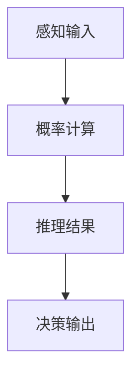
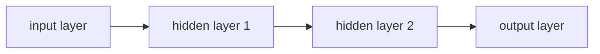
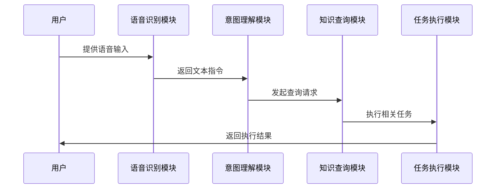

                 


# 认知架构：模拟人类思维的AI Agent设计

---

## 关键词：
认知架构、AI Agent、人类思维、模拟、智能系统设计

---

## 摘要：
认知架构是模拟人类思维的核心技术，通过整合感知、推理、学习和决策模块，实现智能系统的自主性和适应性。本文系统地分析认知架构的核心概念、算法原理、系统架构，并通过项目实战和最佳实践，深入探讨如何设计和实现具备人类思维的AI Agent。

---

## 第1章：认知架构的基本概念

### 1.1 认知架构的定义与背景

#### 1.1.1 什么是认知架构
认知架构是一种模拟人类认知过程的系统设计方法，旨在通过整合感知、推理、学习和决策模块，实现类似人类的思维能力。认知架构的目标是让AI Agent能够理解环境、解决问题并做出合理决策。

#### 1.1.2 认知架构的起源与演变
认知架构的起源可以追溯到人工智能领域的早期研究，如专家系统和知识表示。随着机器学习和深度学习的兴起，认知架构逐渐融合了感知和学习的能力，形成了更加全面的系统设计方法。

#### 1.1.3 认知架构的应用场景
认知架构广泛应用于自动驾驶、智能助手、机器人控制、游戏AI等领域。它能够帮助AI Agent在复杂环境中实现自主决策和问题解决。

### 1.2 问题背景与挑战

#### 1.2.1 当前AI Agent设计的痛点
传统的AI Agent设计往往依赖于规则引擎或简单的决策树，难以应对复杂和动态变化的环境。这种设计方式缺乏灵活性和适应性，难以实现真正的智能行为。

#### 1.2.2 认知架构在AI Agent中的作用
认知架构通过整合感知、推理、学习和决策模块，为AI Agent提供了更强大的问题解决能力。它能够帮助AI Agent更好地理解环境、处理不确定性，并做出更合理的决策。

#### 1.2.3 认知架构与传统AI的区别
认知架构强调系统的自主性和适应性，而传统AI则更注重任务执行的效率和准确性。认知架构通过知识表示和动态推理，能够实现更接近人类的思维模式。

### 1.3 认知架构的核心要素

#### 1.3.1 感知模块
感知模块负责接收和处理环境中的输入数据，如视觉、听觉和触觉信号。它通过传感器或数据接口获取信息，并将其转换为系统可以理解的形式。

#### 1.3.2 推理模块
推理模块负责根据感知到的信息进行逻辑推理和知识推理。它利用知识库中的信息和推理规则，推导出新的结论或状态。

#### 1.3.3 学习模块
学习模块负责通过经验或数据进行模型优化和知识更新。它能够从环境中获取反馈，并通过强化学习或监督学习等方式改进系统的性能。

#### 1.3.4 决策模块
决策模块负责根据推理结果和当前状态，制定最优的行动策略。它结合系统的目标和约束条件，输出具体的执行指令。

---

## 第2章：认知架构的核心概念与联系

### 2.1 认知架构的核心原理

#### 2.1.1 感知与知识表示
感知模块通过传感器获取环境信息，并将其表示为系统可以处理的数据形式。知识表示是认知架构的核心，它通过符号逻辑或概率模型描述系统的知识库。

#### 2.1.2 推理与逻辑运算
推理模块通过逻辑运算和知识推理，从已知的事实中推导出新的结论。逻辑运算包括命题逻辑、谓词逻辑和模态逻辑等。

#### 2.1.3 学习与自适应机制
学习模块通过机器学习算法，不断优化系统的性能。自适应机制能够根据环境的变化，动态调整系统的参数和策略。

#### 2.1.4 决策与行为规划
决策模块基于推理结果和环境反馈，制定具体的行动方案。行为规划通过路径规划和任务分解，确保系统的行动高效且合理。

### 2.2 概念属性特征对比表

#### 表2-1: 认知架构核心模块属性对比

| 模块名称   | 输入形式   | 输出形式   | 核心功能               |
|------------|------------|------------|------------------------|
| 感知模块   | 环境信号   | 结构化数据 | 数据处理与特征提取     |
| 推理模块   | 结构化数据 | 推理结果   | 知识推理与逻辑运算     |
| 学习模块   | 标签数据   | 模型优化   | 知识更新与模型训练     |
| 决策模块   | 推理结果   | 行动指令   | 行为规划与决策制定     |

### 2.3 ER实体关系图

#### 图2-1: 认知架构核心模块关系图

```mermaid
er
  actor 认知架构
  actor 感知模块
  actor 推理模块
  actor 学习模块
  actor 决策模块
  relation -> 关联关系
```

---

## 第3章：认知架构的算法原理

### 3.1 概率推理算法

#### 3.1.1 贝叶斯网络原理

贝叶斯网络是一种基于概率论的推理模型，通过构建概率分布图来描述变量之间的关系。贝叶斯网络的核心是条件概率公式：

$$ P(A|B) = \frac{P(B|A)P(A)}{P(B)} $$

其中，$A$ 和 $B$ 是两个事件，$P(A|B)$ 表示在事件 $B$ 发生的情况下，事件 $A$ 发生的概率。

#### 3.1.2 马尔可夫决策过程

马尔可夫决策过程（MDP）是一种用于建模决策过程的数学框架，常用于强化学习。MDP 包括状态、动作、转移概率和奖励函数四个核心概念。

状态转移公式：

$$ P(s' | s, a) $$

其中，$s$ 是当前状态，$a$ 是动作，$s'$ 是下一个状态。

#### 3.1.3 算法流程图



### 3.2 神经网络与深度学习

#### 3.2.1 卷积神经网络

卷积神经网络（CNN）是一种常用于图像识别的深度学习模型。其核心是卷积层，用于提取图像的局部特征。

卷积操作公式：

$$ (f * x)(i, j) = \sum_{k=0}^{K} f(k) x(i + k, j + l) $$

其中，$f$ 是滤波器，$x$ 是输入图像，$K$ 是滤波器的大小。

#### 3.2.2 循环神经网络

循环神经网络（RNN）是一种用于处理序列数据的深度学习模型。其核心是循环层，用于处理序列的时序关系。

循环层公式：

$$ h_t = \text{tanh}(W h_{t-1} + U x_t) $$

其中，$h_t$ 是当前状态，$W$ 是权重矩阵，$U$ 是输入矩阵，$x_t$ 是当前输入。

#### 3.2.3 网络结构图



---

## 第4章：系统分析与架构设计

### 4.1 问题场景介绍

假设我们正在设计一个智能助手AI Agent，它需要能够理解用户的语音指令、识别用户的需求，并根据上下文提供相应的服务。

### 4.2 系统功能设计

系统功能包括语音识别、意图理解、知识查询和任务执行四个主要模块。

### 4.3 系统架构设计

#### 图4-1: 系统架构图


### 4.4 系统接口设计

系统接口包括语音识别API、自然语言处理API和任务执行API。

### 4.5 系统交互图

#### 图4-2: 系统交互图



---

## 第5章：项目实战

### 5.1 环境安装

安装Python和相关库（如TensorFlow、Keras、scikit-learn等）。

### 5.2 系统核心实现源代码

#### 代码示例：感知模块

```python
import numpy as np

def感知输入(input_signal):
    # 输入信号处理
    features = extract_features(input_signal)
    return features
```

#### 代码示例：推理模块

```python
import tensorflow as tf

class推理模型:
    def __init__(self):
        self.model = self.构建模型()
    
    def构建模型(self):
        model = tf.keras.Sequential()
        model.add(tf.keras.layers.Dense(64, activation='relu'))
        model.add(tf.keras.layers.Dense(10, activation='softmax'))
        model.compile(optimizer='adam', loss='sparse_categorical_crossentropy', metrics=['accuracy'])
        return model
```

### 5.3 代码应用解读与分析

通过具体的代码实现，展示感知、推理、学习和决策模块的实现细节。

### 5.4 案例分析和详细讲解

通过一个具体案例，展示认知架构在实际项目中的应用和效果。

### 5.5 项目小结

总结项目实现的关键点和经验教训。

---

## 第6章：最佳实践

### 6.1 小结

认知架构是模拟人类思维的核心技术，通过整合感知、推理、学习和决策模块，实现智能系统的自主性和适应性。

### 6.2 注意事项

在设计认知架构时，需要注意模块间的耦合性、系统的可扩展性和算法的高效性。

### 6.3 拓展阅读

推荐阅读《深度学习》、《人工智能：一种现代方法》等书籍，深入理解认知架构的设计原理和应用。

---

## 作者

作者：AI天才研究院/AI Genius Institute & 禅与计算机程序设计艺术 /Zen And The Art of Computer Programming

---

# 结语

认知架构是实现人类级别智能的核心技术，通过不断的研究和实践，我们可以设计出更加智能和自主的AI Agent，为人类社会带来更大的价值和便利。

