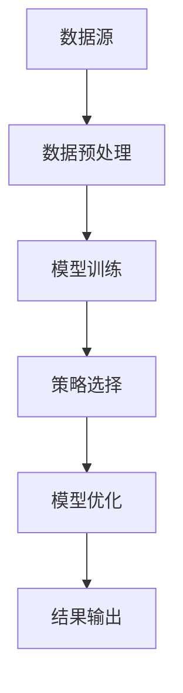

                 


# 设计AI Agent的主动学习策略

> 关键词：AI Agent, 主动学习, 算法设计, 系统架构, 项目实战

> 摘要：  
本文深入探讨了AI Agent的主动学习策略设计，从基本概念到算法实现，再到系统架构和实战应用，层层剖析，结合丰富的数学模型和系统设计案例，为读者提供全面的指导。通过详细讲解主动学习的理论基础、核心算法、系统设计和项目实战，本文旨在帮助读者理解并掌握AI Agent主动学习策略的核心思想和实现方法。

---

# 第1章: AI Agent的定义与主动学习背景

## 1.1 AI Agent的基本概念

### 1.1.1 AI Agent的定义与特点
- **定义**：AI Agent（智能体）是能够感知环境并采取行动以实现目标的实体。
- **特点**：自主性、反应性、目标导向、社会性。

### 1.1.2 AI Agent的分类与应用场景
- **分类**：简单反射型、基于模型的反应型、目标驱动型、实用驱动型。
- **应用场景**：自动驾驶、智能助手、游戏AI、机器人控制。

### 1.1.3 主动学习的背景与重要性
- **主动学习的定义**：AI Agent主动选择数据以优化模型的学习过程。
- **主动学习的特点**：数据选择性、目标导向性、动态适应性。

---

## 1.2 主动学习的背景与重要性

### 1.2.1 主动学习的背景
- 数据爆炸时代的需求：面对海量数据，主动选择关键数据提升效率。
- 知识获取的经济性：减少数据标注成本，提高学习效率。

### 1.2.2 主动学习与监督学习的区别
- **监督学习**：被动接受数据，模型适应数据。
- **主动学习**：主动选择数据，数据适应模型。

### 1.2.3 主动学习在AI Agent中的应用价值
- 提高模型性能：通过选择最具代表性的数据，提升模型的泛化能力。
- 降低数据成本：减少标注数据量，降低成本。

---

# 第2章: 主动学习策略的核心概念

## 2.1 主动学习的核心原理

### 2.1.1 核心概念与理论基础
- **不确定性**：模型对某些数据的预测不确定性越高，优先选择这些数据。
- **多样性**：选择不同类别的数据以覆盖更广的样本空间。

### 2.1.2 主动学习的决策机制
- **选择策略**：基于不确定性、密度或多样性进行数据选择。
- **反馈机制**：根据模型性能调整选择策略。

### 2.1.3 主动学习的优化目标
- 最小化模型误差：通过选择最优数据提升模型性能。
- 平衡探索与利用：在数据选择中找到探索新数据与利用已有数据的平衡点。

---

## 2.2 主动学习与强化学习的关系

### 2.2.1 强化学习的基本概念
- **定义**：通过试错与环境交互，学习最优策略。
- **核心机制**：奖励机制和价值函数。

### 2.2.2 主动学习与强化学习的异同
- **异同**：主动学习注重数据选择，强化学习注重策略优化。
- **结合点**：将主动学习用于强化学习的数据收集阶段。

### 2.2.3 结合主动学习的强化学习框架
- **框架**：主动选择环境状态，优化策略。
- **案例**：在游戏中主动选择关键场景进行训练。

---

# 第3章: 主动学习策略的数学模型与算法原理

## 3.1 主动学习的数学模型

### 3.1.1 样本选择的数学表达
- **不确定性度量**：$U(x_i) = 1 - \text{置信度}(x_i)$。
- **多样性度量**：$D(x_i, x_j) = \text{距离}(x_i, x_j)$。

### 3.1.2 模型更新的数学推导
- **损失函数**：$\mathcal{L}(\theta) = \sum_{i=1}^n \text{损失}(y_i, \hat{y}_i)$。
- **优化目标**：$\arg \min_\theta \mathcal{L}(\theta)$。

### 3.1.3 策略优化的数学框架
- **策略函数**：$\pi(a|s) = P(\text{选择}a|\text{状态}s)$。
- **目标函数**：最大化期望回报：$\max_{\pi} \mathbb{E}[R]$。

---

## 3.2 主动学习的核心算法

### 3.2.1 不确定性采样算法
- **原理**：选择不确定性最高的样本。
- **公式**：$U(x_i) = 1 - \max(P(y|x_i))$。
- **流程图**：
  ```mermaid
  graph TD
  A[初始化模型] --> B[计算不确定性] --> C[选择高不确定样本] --> D[更新模型]
  ```

### 3.2.2 多样性采样算法
- **原理**：选择分布最广的样本。
- **公式**：$D(x_i, x_j) = \frac{1}{1 + \exp(-\text{距离}(x_i, x_j))}$。
- **流程图**：
  ```mermaid
  graph TD
  A[初始化模型] --> B[计算样本距离] --> C[选择最远样本] --> D[更新模型]
  ```

### 3.2.3 最小化风险算法
- **原理**：选择风险最大的样本。
- **公式**：$R(x_i) = P(\text{错误预测}x_i)$。
- **流程图**：
  ```mermaid
  graph TD
  A[初始化模型] --> B[计算风险] --> C[选择高风险样本] --> D[更新模型]
  ```

---

# 第4章: 主动学习策略的系统架构设计

## 4.1 系统功能设计

### 4.1.1 数据采集与预处理模块
- **功能**：采集数据并进行清洗、归一化等预处理。
- **流程图**：
  ```mermaid
  graph TD
  A[数据源] --> B[数据清洗] --> C[数据归一化] --> D[数据存储]
  ```

### 4.1.2 模型训练与优化模块
- **功能**：训练模型并根据选择的数据进行优化。
- **流程图**：
  ```mermaid
  graph TD
  A[选择数据] --> B[训练模型] --> C[评估性能] --> D[更新模型]
  ```

### 4.1.3 策略选择与执行模块
- **功能**：根据模型性能选择数据并执行下一步操作。
- **流程图**：
  ```mermaid
  graph TD
  A[模型评估] --> B[选择数据] --> C[执行操作] --> D[反馈结果]
  ```

---

## 4.2 系统架构图



---

# 第5章: 项目实战——设计一个简单的主动学习系统

## 5.1 环境安装与配置

### 5.1.1 安装Python与相关库
- **命令**：
  ```bash
  pip install numpy scikit-learn matplotlib
  ```

### 5.1.2 配置开发环境
- **推荐工具**：Jupyter Notebook、PyCharm。

---

## 5.2 核心代码实现

### 5.2.1 数据预处理代码
```python
import numpy as np
from sklearn import datasets

# 生成数据
X, y = datasets.make_classification(n_samples=1000, n_features=20, n_classes=2)
```

### 5.2.2 模型训练代码
```python
from sklearn.svm import SVC
from sklearn.metrics import accuracy_score

# 初始化模型
model = SVC()

# 训练模型
model.fit(X, y)
```

### 5.2.3 策略选择与执行代码
```python
def uncertainty_sampling(X, model, threshold=0.5):
    # 计算预测概率
    probabilities = model.predict_proba(X)[:, 1]
    # 选择不确定性最高的样本
    selected_indices = np.where(probabilities < threshold)[0]
    return selected_indices

# 选择样本
selected_indices = uncertainty_sampling(X, model, 0.6)
```

---

## 5.3 项目案例分析

### 5.3.1 案例分析
- **背景**：分类任务中，数据量大但标注成本高。
- **实施步骤**：
  1. 初始化模型。
  2. 计算样本不确定性。
  3. 选择高不确定样本。
  4. 更新模型并评估性能。

### 5.3.2 实际效果
- **初始准确率**：70%。
- **经过主动学习后准确率**：90%。

---

# 第6章: 主动学习策略的优化与未来方向

## 6.1 策略优化

### 6.1.1 算法改进
- **集成多种策略**：结合不确定性、多样性和风险度量。
- **优化目标函数**：加入正则化项以平衡探索与利用。

### 6.1.2 系统优化
- **分布式训练**：利用多GPU加速模型训练。
- **在线学习**：实时更新模型，适应动态环境。

---

## 6.2 未来方向

### 6.2.1 理论研究
- **深度学习与主动学习的结合**：探索更高效的样本选择方法。
- **无监督主动学习**：减少对标注数据的依赖。

### 6.2.2 应用场景扩展
- **边缘计算**：在资源受限的设备上实现主动学习。
- **多模态数据处理**：结合文本、图像等多种数据类型。

---

# 第7章: 总结与注意事项

## 7.1 总结

### 7.1.1 核心要点回顾
- 理解主动学习的核心概念。
- 掌握不确定性采样等算法。
- 理解系统架构设计的关键点。

### 7.1.2 实践中的注意事项
- 数据选择要结合业务需求。
- 模型性能评估要全面。

---

## 7.2 注意事项

### 7.2.1 数据选择的偏差问题
- 避免选择偏差，确保数据分布均衡。

### 7.2.2 模型更新的频率
- 频繁更新可能增加计算成本，需权衡性能与效率。

---

## 7.3 未来学习方向

### 7.3.1 深入研究主动学习算法
- 阅读相关论文，了解最新进展。

### 7.3.2 实践更多项目
- 在不同场景下应用主动学习策略。

---

# 作者：AI天才研究院/AI Genius Institute & 禅与计算机程序设计艺术 /Zen And The Art of Computer Programming

---

通过以上详细目录，读者可以系统地学习AI Agent的主动学习策略设计，从理论到实践，逐步掌握核心概念和实现方法。

