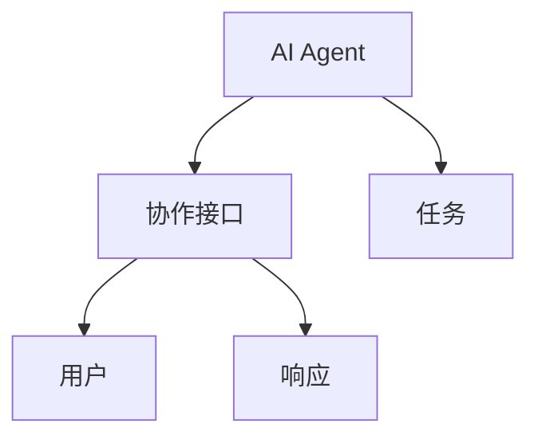
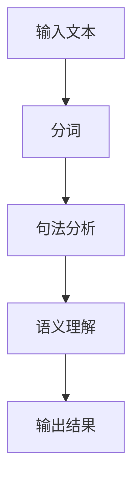
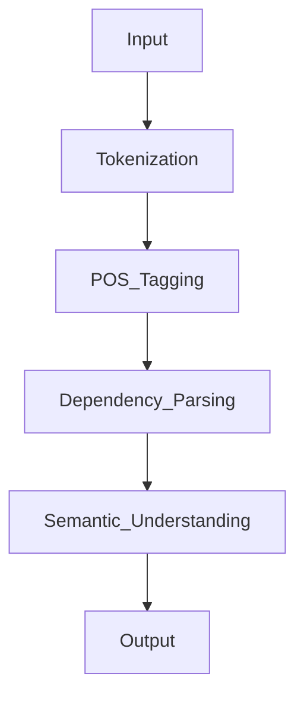
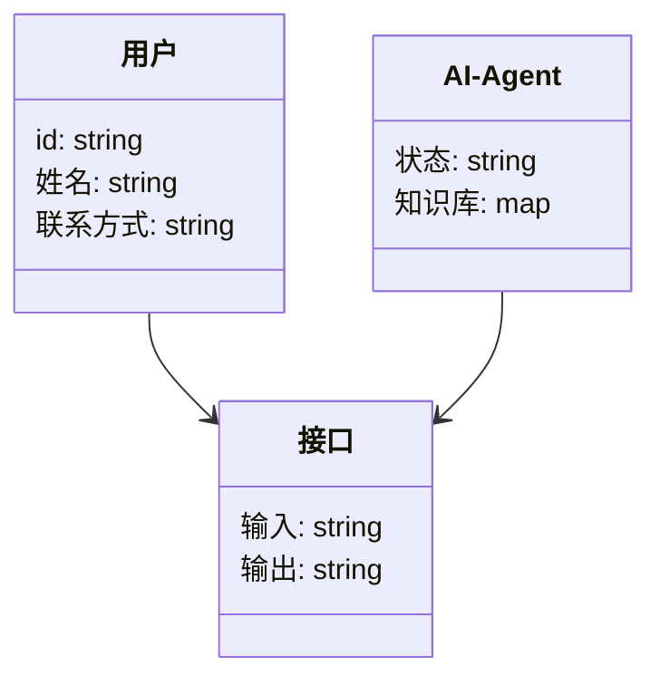
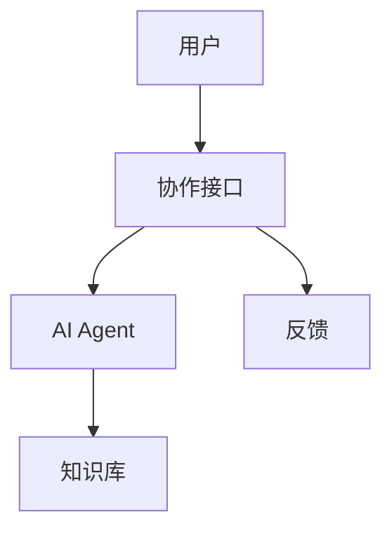
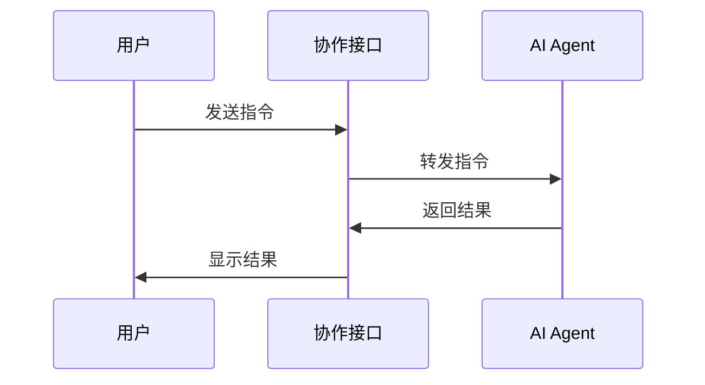

                 

<think>
好，我现在需要帮助用户撰写一篇关于《设计AI Agent的人机协作接口》的技术博客文章。首先，我得仔细阅读用户提供的详细要求，确保完全理解他们的需求。用户希望文章结构清晰，逻辑严密，涵盖从理论到实践的各个方面，并且要包含丰富的细节，比如算法流程图、数学模型和系统架构图。

首先，我会确定文章的结构。根据用户提供的大纲，文章分为六个部分：概述、核心概念、算法原理、系统架构、项目实战和总结。每个部分都需要详细展开，确保内容全面。

接下来，我需要考虑每个部分的具体内容。例如，在概述部分，我需要解释什么是AI Agent，它们的类型，以及协作接口的重要性。这部分需要简单明了，帮助读者建立基础概念。

在核心概念部分，我需要详细讨论协作接口的设计原则和交互模式，可能使用表格和对比图来帮助读者理解不同模式的优缺点。这部分要确保逻辑清晰，便于读者比较和理解。

算法原理部分是关键，我需要深入讲解自然语言处理和强化学习等算法，包括它们的流程图和数学模型。这部分可能需要结合代码示例，让读者能够实际应用这些算法。

系统架构设计部分需要介绍如何构建支持协作的系统，包括功能设计、架构图和接口设计。使用Mermaid图表来展示系统架构和交互流程，会让内容更加直观。

项目实战部分，我需要提供一个实际案例，从环境安装到代码实现，再到案例分析，帮助读者将理论应用到实践中。这部分要详细，确保读者能够跟上步骤。

最后，总结部分要回顾全书内容，给出最佳实践建议和注意事项，帮助读者在实际项目中避免常见错误，提升设计质量。

在写作过程中，我要注意使用专业的技术语言，同时保持条理清晰，逻辑严密。确保每一章都有明确的主题，并且各章节之间连贯。此外，要满足用户的格式要求，使用markdown格式，包含数学公式和图表。

我还需要检查内容的完整性，确保涵盖了所有必要的部分，如数学公式、算法流程图、系统架构图等。同时，保持文章字数在10000到12000字之间，避免过多或过少。

最后，我会通读整个文章，确保没有语法错误或逻辑漏洞，确保内容准确且易于理解。这样，用户就能得到一篇高质量的技术博客文章，帮助他们在设计AI Agent的人机协作接口时有所启发。
</think>

# 设计AI Agent的人机协作接口

> 关键词：AI Agent，人机协作，接口设计，自然语言处理，强化学习，系统架构

> 摘要：本文详细探讨了AI Agent与人机协作接口设计的核心概念、算法原理、系统架构及项目实战。从AI Agent的基本概念出发，分析了协作接口的设计原则与实现方法，结合实际案例，总结了最佳实践与未来发展方向。

---

# 第一部分：AI Agent与人机协作接口概述

## 第1章：AI Agent的基本概念与背景

### 1.1 AI Agent的定义与分类
AI Agent，即人工智能代理，是指能够感知环境、自主决策并执行任务的智能实体。它可以分为以下几类：

- **简单反射型Agent**：基于当前输入直接执行预定义操作，适用于简单的规则场景。
- **基于模型的反应式Agent**：维护对环境的内部表示，并基于此进行决策。
- **目标驱动型Agent**：具有明确的目标，通过规划和推理来实现目标。
- **效用驱动型Agent**：基于效用函数进行优化决策，常用于资源分配和博弈场景。

### 1.2 人机协作的背景与意义
随着人工智能技术的快速发展，AI Agent在各行业的应用日益广泛。人机协作接口作为人与AI Agent交互的桥梁，其设计直接影响用户体验和系统效率。以下是人机协作的重要意义：

- **提升效率**：通过智能化的协作，减少人工操作，提高任务处理速度。
- **增强决策能力**：结合人类的直觉和AI的计算能力，实现更优决策。
- **降低门槛**：通过友好的接口设计，使非专业人员也能高效使用AI系统。

### 1.3 问题背景与目标
在设计AI Agent的人机协作接口时，我们需要解决以下核心问题：

- **信息传递效率**：如何高效地将人类意图转化为AI可理解的指令。
- **任务分解与分配**：如何将复杂任务分解并分配给人机协作团队。
- **反馈机制**：如何建立有效的反馈循环，确保协作过程的顺利进行。

目标是设计一个高效的协作接口，使人类与AI Agent能够无缝协作，同时具备良好的可扩展性和灵活性。

---

## 第2章：协作接口的核心概念与联系

### 2.1 协作接口的定义与属性
协作接口是指人与AI Agent之间进行信息交互的界面或机制。其核心属性包括：

- **实时性**：支持快速响应和实时反馈。
- **可定制性**：允许用户根据需求调整接口功能。
- **容错性**：具备错误检测和恢复机制，确保协作过程的稳定性。

### 2.2 AI Agent与协作接口的关系
AI Agent与协作接口之间的关系可以用以下实体关系图表示：



从图中可以看出，协作接口是连接AI Agent与用户的桥梁，负责接收用户指令并将其转化为AI可执行的操作，同时将AI的反馈传递给用户。

### 2.3 协作模式的对比
以下是几种常见的协作模式及其对比：

| 模式 | 描述 | 优点 | 缺点 |
|------|------|------|------|
| 单向模式 | 用户向AI单向输入指令 | 简单易实现 | 缺乏双向反馈 |
| 双向模式 | 用户与AI双向交互 | 提高协作效率 | 实时性要求高 |
| 分布式模式 | 多个AI Agent协作完成任务 | 可扩展性强 | 复杂性较高 |

---

## 第3章：协作接口的算法原理

### 3.1 自然语言处理算法
自然语言处理（NLP）是实现人机协作的关键技术之一。以下是NLP的核心算法及其流程图：

#### 3.1.1 NLP算法概述
自然语言处理的目标是使计算机能够理解人类语言。常用算法包括分词、句法分析和语义理解等。

#### 3.1.2 常见NLP算法实现
以下是一个简单的NLP处理流程：



#### 3.1.3 NLP流程图
以下是NLP的详细流程图：



### 3.2 强化学习算法
强化学习是一种通过试错优化策略的算法，常用于复杂任务的决策。以下是强化学习的实现步骤：

#### 3.2.1 强化学习原理
强化学习通过智能体与环境的交互，逐步优化策略以获得最大化的累计奖励。数学模型如下：

$$ R = r_1 + r_2 + \dots + r_n $$

其中，$R$ 是总奖励，$r_i$ 是第$i$步的奖励。

#### 3.2.2 算法实现步骤
1. 初始化策略参数$\theta$。
2. 在环境中执行动作，获得奖励$r$。
3. 更新策略参数以最大化期望奖励。

### 3.3 协作接口的数学模型
协作接口的数学模型可以表示为：

$$ I = f(u, a) $$

其中，$I$ 是接口输出，$u$ 是用户输入，$a$ 是AI Agent的状态。

---

## 第4章：系统架构设计

### 4.1 问题场景介绍
假设我们正在设计一个智能客服系统，AI Agent需要与客户进行实时对话，解决客户问题。

### 4.2 系统功能设计
以下是系统的领域模型：



### 4.3 系统架构设计
以下是系统的架构图：



### 4.4 系统接口设计
系统接口设计需要考虑以下几点：

1. **输入格式**：支持文本和语音输入。
2. **输出格式**：返回结构化数据或自然语言描述。
3. **错误处理**：具备容错机制，确保协作过程的稳定性。

### 4.5 系统交互流程
以下是系统的交互流程图：



---

## 第5章：项目实战

### 5.1 环境安装
以下是项目所需的环境配置：

```bash
pip install numpy
pip install scikit-learn
pip install spacy
```

### 5.2 核心代码实现
以下是协作接口的核心代码实现：

```python
class CollaborationInterface:
    def __init__(self):
        self.agent = AIAgent()

    def process_input(self, input_str):
        # 分词
        tokens = self.agent.tokenize(input_str)
        # 语义理解
        intent = self.agent.intent_classification(tokens)
        # 返回结果
        return self.agent.generate_response(intent)
```

### 5.3 代码应用解读与分析
上述代码实现了协作接口的基本功能，包括输入处理、语义理解和结果生成。通过调用AI Agent的方法，协作接口能够完成与用户的交互。

### 5.4 实际案例分析
以智能客服系统为例，用户输入“我的订单在哪里？”，协作接口将调用分词、语义理解等方法，最终返回订单查询结果。

### 5.5 项目小结
通过实际案例分析，我们可以看到协作接口在实际应用中的重要性。代码实现部分验证了理论的可行性。

---

## 第6章：总结与展望

### 6.1 最佳实践 tips
- **简洁性**：保持接口设计的简洁性，避免功能过于复杂。
- **可扩展性**：确保接口具备良好的扩展性，以适应未来的需求变化。
- **安全性**：重视数据安全，防止信息泄露。

### 6.2 小结
本文详细探讨了AI Agent的人机协作接口设计，从理论到实践，结合实际案例，总结了设计的关键点和注意事项。

### 6.3 注意事项
- 在设计协作接口时，需充分考虑用户体验。
- 确保接口具备良好的容错性和实时性。

### 6.4 拓展阅读
建议读者进一步阅读《自然语言处理实战》和《强化学习算法解析》等书籍，以深入理解相关技术。

---

# 作者：AI天才研究院 & 禅与计算机程序设计艺术

