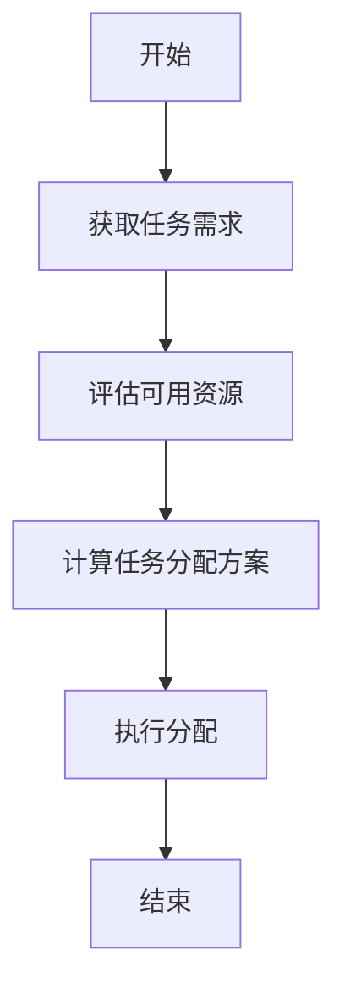
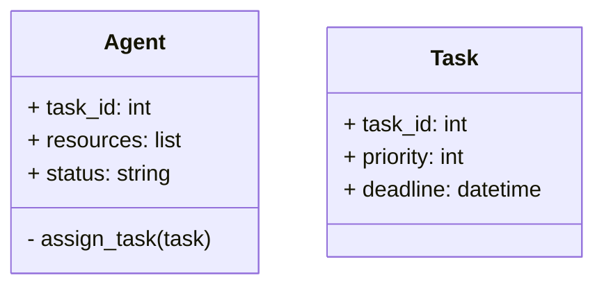
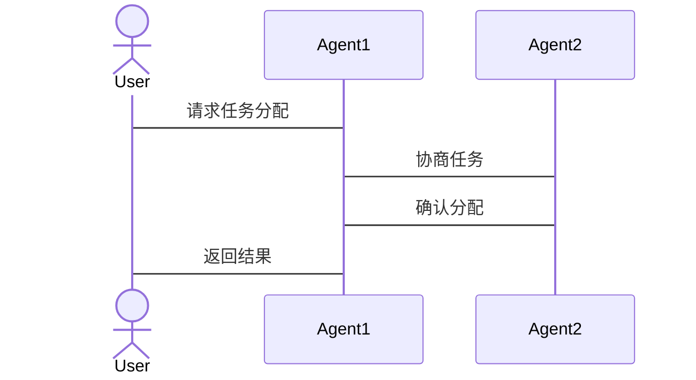

                 


# 设计AI Agent的动态任务分配策略

---

## 关键词：
- AI Agent
- 动态任务分配
- 多智能体系统
- 任务调度算法
- 分布式计算

---

## 摘要：
本文探讨了设计AI Agent动态任务分配策略的核心原理、算法实现及系统架构。通过分析动态环境中的任务分配挑战，提出了基于多智能体协作的动态分配模型，并结合实际案例，展示了如何通过算法优化和系统设计实现高效的任务分配。文章内容涵盖背景介绍、核心概念、算法原理、系统架构、项目实战及最佳实践，为AI Agent的设计与应用提供了理论与实践指导。

---

# 第一部分：AI Agent动态任务分配策略的背景与概念

---

## 第1章：动态任务分配策略的背景介绍

### 1.1 问题背景
#### 1.1.1 多任务分配的挑战
- 在动态环境中，任务需求和资源条件不断变化，传统静态分配策略难以适应。
- 多智能体协作中，任务分配需考虑实时状态和环境变化。

#### 1.1.2 动态环境下的任务分配需求
- 动态任务分配需快速响应环境变化，确保任务高效执行。
- 多目标优化：任务优先级、资源利用率、响应时间等需综合考虑。

#### 1.1.3 当前任务分配策略的局限性
- 静态策略无法应对动态变化，可能导致资源浪费或任务延误。
- 简单轮询或随机分配策略效率低下，难以满足复杂场景需求。

### 1.2 问题描述
#### 1.2.1 动态任务分配的核心问题
- 如何在动态环境中实时调整任务分配，确保资源利用最大化。
- 如何处理任务优先级变化和资源约束动态调整。

#### 1.2.2 任务分配的动态特性
- 任务需求动态变化：优先级、时间限制、资源需求等。
- 环境状态动态变化：可用资源、环境约束等。

#### 1.2.3 任务分配的目标与约束
- 目标：提高任务执行效率，减少资源浪费，降低延迟。
- 约束：资源限制、任务优先级、实时性要求。

### 1.3 问题解决
#### 1.3.1 动态任务分配的解决方案
- 基于反馈的动态调整机制。
- 多智能体协作优化。

#### 1.3.2 现有解决方案的优缺点
- 优点：快速响应变化，提高效率。
- 缺点：复杂性高，实现难度大。

### 1.4 边界与外延
#### 1.4.1 动态任务分配的边界条件
- 系统资源限制。
- 任务优先级和时间约束。

#### 1.4.2 与静态任务分配的区别
- 静态分配不考虑动态变化，动态分配实时调整。

#### 1.4.3 动态任务分配的外延应用
- 多智能体协作、分布式系统优化、实时任务调度。

### 1.5 概念结构与核心要素
#### 1.5.1 动态任务分配的核心要素
- 任务描述：类型、优先级、资源需求。
- 系统状态：可用资源、环境约束。
- 分配机制：算法、策略、反馈机制。

#### 1.5.2 任务分配的逻辑结构
- 输入：任务需求、系统状态。
- 输出：任务分配方案。

#### 1.5.3 动态任务分配的系统架构
- 控制层：决策制定。
- 执行层：任务分配与执行。

### 1.6 本章小结
- 动态任务分配是多智能体协作中的关键问题。
- 需要实时调整以应对环境变化。

---

## 第2章：动态任务分配策略的核心概念

### 2.1 动态任务分配的基本原理
#### 2.1.1 动态任务分配的定义
- 在动态环境中，实时调整任务分配以优化资源利用。

#### 2.1.2 动态任务分配的核心要素
- 任务动态性：需求变化。
- 环境动态性：资源变化。

#### 2.1.3 动态任务分配的实现机制
- 基于反馈的动态调整。
- 多智能体协作优化。

### 2.2 动态任务分配的特征对比
| 特征       | 静态任务分配     | 动态任务分配     |
|------------|----------------|----------------|
| 灵活性       | 低             | 高             |
| 响应时间     | 长             | 短             |
| 资源利用率     | 低             | 高             |

### 2.3 动态任务分配的ER实体关系图
```mermaid
er
actor(Agent, Task, Environment)
```

### 2.4 本章小结
- 动态任务分配的核心是实时调整和协作优化。

---

## 第3章：动态任务分配策略的算法原理

### 3.1 动态任务分配算法的概述
#### 3.1.1 算法的目标
- 最大化资源利用率。
- 最小化任务延迟。

#### 3.1.2 算法的输入与输出
- 输入：任务需求、系统状态。
- 输出：任务分配方案。

#### 3.1.3 算法的适用场景
- 动态环境下的多任务调度。

### 3.2 动态任务分配算法的实现流程


### 3.3 动态任务分配算法的数学模型
$$
\text{目标函数：} \min \sum_{i=1}^{n} t_i
$$

$$
\text{约束条件：} \sum_{j=1}^{m} x_{ij} \leq r_j, \forall j
$$

### 3.4 本章小结
- 算法实现需要考虑动态环境下的实时调整。

---

## 第4章：动态任务分配策略的系统架构设计

### 4.1 系统架构概述
#### 4.1.1 系统架构设计
- 分层架构：控制层、执行层。

### 4.2 系统功能设计
#### 4.2.1 领域模型


### 4.3 系统接口设计
- Agent接口：任务分配、状态反馈。

### 4.4 系统交互序列图


### 4.5 本章小结
- 系统架构设计是实现动态任务分配的基础。

---

## 第5章：动态任务分配策略的项目实战

### 5.1 环境安装
- 安装Python、相关库。

### 5.2 核心代码实现
```python
def dynamic_task_allocation(tasks, resources):
    # 算法实现
    pass
```

### 5.3 代码解读与分析
- 解释代码实现细节。

### 5.4 案例分析
- 实际案例分析。

### 5.5 本章小结
- 实践是理论应用的重要部分。

---

## 第6章：动态任务分配策略的最佳实践

### 6.1 小结
- 总结全文内容。

### 6.2 注意事项
- 系统设计中的注意事项。

### 6.3 拓展阅读
- 推荐相关文献和资源。

---

## 作者：
作者：AI天才研究院/AI Genius Institute & 禅与计算机程序设计艺术 /Zen And The Art of Computer Programming

