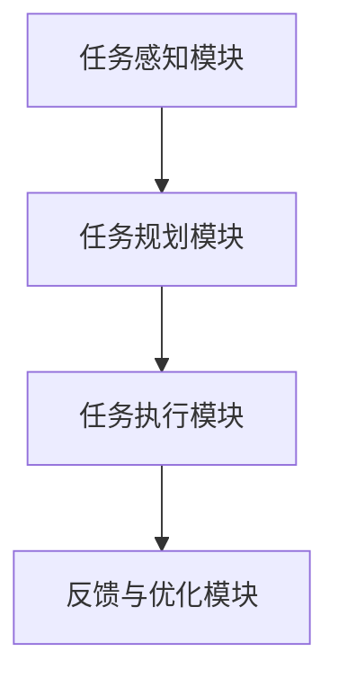

                 

<think>
嗯，我现在需要帮助用户设计一个AI Agent的动态任务规划与执行系统的目录大纲。用户要求这个大纲要非常吸引读者，并且详细地覆盖从背景介绍到项目实战的各个方面。首先，我应该理解用户的需求，他可能是一位技术专家，希望撰写一篇结构清晰、内容详实的技术博客。

首先，我需要确定这本书的结构。通常，技术书籍会分为几个主要部分，比如背景、核心概念、算法、系统设计、项目实战和总结等。用户已经给出了一些基本的章节安排，我需要确保每一章都涵盖必要的内容，并且细化到三级标题。

接下来，我考虑每一章的具体内容。第一章应该介绍AI Agent的基本概念，包括定义、特点、分类和应用场景。这部分帮助读者理解AI Agent的基本概念。然后，我需要详细解释动态任务规划的背景、问题背景、目标和方法，这为后续的系统设计打下基础。

第二章需要深入探讨AI Agent的核心概念，特别是动态任务规划的核心算法，如Dijkstra和A*。这里应该用图表来帮助解释，比如ER实体关系图和算法流程图。我需要确保这些图表清晰易懂，同时给出数学公式和代码示例，以增强技术深度。

第三章则是动态任务规划的算法原理，这部分需要详细讲解每个算法的数学模型和实现方式。我应该用Mermaid流程图来展示算法步骤，并附上Python代码示例，这样读者可以实际操作。

第四章是系统架构设计，这部分需要考虑系统的各个模块如何协同工作，包括问题场景、系统功能设计、架构图、接口设计和交互流程。这部分需要确保系统的可扩展性和高效性。

第五章是项目实战，环境安装、核心代码实现、代码解读和案例分析。这部分需要提供实际的代码，帮助读者理解如何实现动态任务规划系统。

最后，第六章总结与展望，回顾主要知识点，讨论系统的优缺点，并展望未来的发展方向。这有助于读者全面理解整个系统，并为后续的研究提供方向。

在整个过程中，我需要确保每一章都有足够的细节，同时保持整体结构的连贯性和逻辑性。此外，用户特别强调了要包含核心概念与联系，算法原理讲解，系统分析与架构设计方案，以及项目实战等内容，这些都需要在目录中体现出来。

最后，我要检查目录的总字数是否在2000字以内，并确保每一部分都符合用户的格式要求，使用#、##、###三级标题，并适当加入Mermaid图表和代码示例，以增强目录的实用性和可读性。
</think>

# 设计AI Agent的动态任务规划与执行系统

## 关键词：AI Agent，动态任务规划，任务执行系统，系统架构设计，算法原理，项目实战，技术博客

## 摘要：本文详细探讨了AI Agent的动态任务规划与执行系统的整体设计，从核心概念到算法实现，从系统架构到项目实战，全面分析了动态任务规划与执行系统的设计方法和实现技巧。文章通过具体的数学公式、算法流程图、系统架构图和源代码示例，深入剖析了系统设计的关键环节和实现细节，最后通过项目实战案例，总结了系统设计的经验和未来的发展方向。

---

# 第1章: AI Agent与动态任务规划的背景介绍

## 1.1 AI Agent的基本概念
### 1.1.1 AI Agent的定义与特点
AI Agent（人工智能代理）是指能够感知环境、自主决策并执行任务的智能体。AI Agent具有以下特点：
- **自主性**：能够在没有外部干预的情况下自主决策。
- **反应性**：能够实时感知环境并做出反应。
- **目标导向性**：基于目标驱动行为，能够优化决策以实现目标。
- **学习能力**：能够通过经验改进自身的决策和执行能力。

### 1.1.2 AI Agent的体系结构
AI Agent的体系结构可以分为以下几种：
- **反应式架构**：基于当前感知做出实时反应。
- **目标导向架构**：基于目标驱动行为。
- **混合式架构**：结合反应式和目标导向的混合架构。

### 1.1.3 AI Agent的任务规划模型
AI Agent的任务规划模型包括以下几种：
- **无模型规划**：基于实时感知做出决策，不依赖环境模型。
- **有模型规划**：基于环境模型进行任务规划。
- **混合式规划**：结合无模型和有模型规划的优点。

### 1.1.4 动态任务规划的定义与特点
动态任务规划是指在动态变化的环境中，根据环境的变化实时调整任务规划的策略和优先级。动态任务规划具有以下特点：
- **实时性**：能够实时感知环境变化并做出反应。
- **灵活性**：能够根据环境变化动态调整任务规划。
- **鲁棒性**：能够在不确定性和干扰的情况下保持任务执行的稳定性和可靠性。

### 1.1.5 动态任务规划的核心问题与挑战
动态任务规划的核心问题包括：
- **任务优先级的动态调整**：如何在动态变化的环境中实时调整任务优先级。
- **任务冲突的解决**：如何在任务冲突的情况下做出最优决策。
- **任务分配与协调**：如何在多 Agent 环境中实现任务的合理分配与协调。

### 1.1.6 动态任务规划的边界与外延
动态任务规划的边界包括：
- **任务类型**：不同类型的任务具有不同的规划和执行策略。
- **环境约束**：环境的动态变化和约束条件会影响任务规划的策略。
- **资源限制**：资源的限制会影响任务的执行和规划。

动态任务规划的外延包括：
- **强化学习**：通过强化学习算法不断优化任务规划策略。
- **博弈论**：通过博弈论模型实现多 Agent 环境中的任务分配与协调。
- **分布式计算**：通过分布式计算技术实现大规模环境中的任务规划与执行。

## 1.2 动态任务规划的背景与问题背景
### 1.2.1 动态任务规划的背景
随着AI技术的不断发展，AI Agent的应用场景越来越广泛，尤其是在动态变化的环境中，AI Agent需要能够实时感知环境变化并做出反应。动态任务规划是AI Agent在复杂环境中实现目标的关键技术之一。

### 1.2.2 动态任务规划的核心问题与挑战
动态任务规划的核心问题包括：
- **任务优先级的动态调整**：如何在动态变化的环境中实时调整任务优先级。
- **任务冲突的解决**：如何在任务冲突的情况下做出最优决策。
- **任务分配与协调**：如何在多 Agent 环境中实现任务的合理分配与协调。

动态任务规划的挑战包括：
- **环境的不确定性**：环境的不确定性会影响任务规划的策略。
- **任务的动态变化**：任务的动态变化需要实时调整任务规划。
- **多 Agent 协作**：在多 Agent 环境中实现任务分配与协作需要复杂的技术实现。

### 1.2.3 动态任务规划的边界与外延
动态任务规划的边界包括：
- **任务类型**：不同类型的任务具有不同的规划和执行策略。
- **环境约束**：环境的动态变化和约束条件会影响任务规划的策略。
- **资源限制**：资源的限制会影响任务的执行和规划。

动态任务规划的外延包括：
- **强化学习**：通过强化学习算法不断优化任务规划策略。
- **博弈论**：通过博弈论模型实现多 Agent 环境中的任务分配与协调。
- **分布式计算**：通过分布式计算技术实现大规模环境中的任务规划与执行。

## 1.3 动态任务规划与执行系统的设计目标
### 1.3.1 系统设计的目标与核心问题
动态任务规划与执行系统的设计目标包括：
- **实现任务的动态规划与调整**：能够在动态变化的环境中实时调整任务规划。
- **实现任务的高效执行**：能够在有限的资源条件下高效执行任务。
- **实现多 Agent 协作**：能够在多 Agent 环境中实现任务的合理分配与协作。

动态任务规划与执行系统的核心问题包括：
- **任务优先级的动态调整**：如何在动态变化的环境中实时调整任务优先级。
- **任务冲突的解决**：如何在任务冲突的情况下做出最优决策。
- **任务分配与协调**：如何在多 Agent 环境中实现任务的合理分配与协调。

### 1.3.2 系统设计的约束条件与边界
系统设计的约束条件包括：
- **资源限制**：系统需要在有限的资源条件下实现任务的高效执行。
- **环境约束**：系统需要在动态变化的环境中实现任务的动态规划与调整。
- **时间约束**：系统需要在规定的时间内完成任务的规划与执行。

系统设计的边界包括：
- **任务类型**：系统需要支持不同类型的任务规划与执行。
- **环境类型**：系统需要支持不同类型环境的动态变化。
- **Agent 数量**：系统需要支持不同数量的 Agent 协作。

### 1.3.3 系统设计的实现方法与技术路线
系统设计的实现方法包括：
- **基于强化学习的动态任务规划**：通过强化学习算法不断优化任务规划策略。
- **基于博弈论的多 Agent 协作**：通过博弈论模型实现多 Agent 环境中的任务分配与协调。
- **基于分布式计算的任务执行**：通过分布式计算技术实现大规模环境中的任务规划与执行。

系统设计的技术路线包括：
- **任务感知与理解**：通过传感器和数据处理技术感知环境并理解任务。
- **任务规划与决策**：通过算法和模型实现任务的动态规划与决策。
- **任务执行与反馈**：通过执行机构和反馈机制实现任务的高效执行并获取反馈。

## 1.4 本章小结
本章详细介绍了AI Agent的基本概念和动态任务规划的背景与问题背景，分析了动态任务规划的核心问题与挑战，并提出了系统设计的目标与实现方法。通过本章的介绍，读者可以全面理解动态任务规划与执行系统的基本概念和核心问题，为后续章节的深入分析奠定基础。

---

# 第2章: AI Agent动态任务规划的核心概念与联系

## 2.1 AI Agent的核心概念原理
### 2.1.1 AI Agent的感知与决策机制
AI Agent的感知与决策机制包括：
- **感知**：通过传感器和数据处理技术感知环境。
- **决策**：基于感知信息和任务目标做出决策。

### 2.1.2 动态任务规划的数学模型与算法
动态任务规划的数学模型与算法包括：
- **Dijkstra算法**：用于寻找最短路径。
- **A*算法**：基于启发式搜索的最短路径算法。
- **强化学习算法**：通过强化学习优化任务规划策略。

### 2.1.3 任务优先级与权重分配策略
任务优先级与权重分配策略包括：
- **静态优先级**：任务优先级固定不变。
- **动态优先级**：任务优先级根据环境变化实时调整。
- **权重分配**：根据任务的重要性和资源约束动态分配权重。

## 2.2 核心概念属性特征对比表
### 2.2.1 任务规划算法的特征对比
以下表格对比了Dijkstra算法和A*算法的特征：

| 算法 | 开发者 | 时间复杂度 | 空间复杂度 | 是否需要启发式信息 |
|------|--------|------------|------------|--------------------|
| Dijkstra | E.W. Dijkstra | O((V+E) log V) | O(E) | 否 |
| A* | Peter Norvig | O((V+E) log V) | O(E) | 是 |

### 2.2.2 不同任务类型的特点分析
以下表格分析了不同类型任务的特点：

| 任务类型 | 描述 | 输入 | 输出 | 约束条件 |
|----------|------|------|------|----------|
| 单任务规划 | 单个 Agent 的任务规划 | 环境状态 | 任务序列 | 单个 Agent |
| 多任务规划 | 多个 Agent 的任务规划 | 环境状态 | 任务分配与执行序列 | 多个 Agent |
| 动态任务规划 | 动态变化环境中的任务规划 | 动态环境状态 | 动态任务规划与执行序列 | 环境动态变化 |

### 2.2.3 系统性能指标与评估标准
系统性能指标与评估标准包括：
- **响应时间**：系统对环境变化的响应时间。
- **任务完成率**：系统完成任务的比率。
- **资源利用率**：系统资源的使用效率。

## 2.3 ER实体关系图架构
### 2.3.1 实体关系图的定义与作用
ER实体关系图用于描述系统中实体之间的关系，帮助理解系统中的数据流和信息交互。

### 2.3.2 系统实体关系图的绘制
以下是一个简单的ER实体关系图：

```mermaid
erd
  多对多
  entity Task {
    id
    name
    priority
  }
  entity Agent {
    id
    name
  }
  entity Environment {
    id
    status
  }
  Task --> Agent
  Task --> Environment
```

### 2.3.3 实体关系图与系统设计的关系
ER实体关系图帮助我们理解系统中的实体及其关系，为后续的系统设计提供数据模型和信息交互的基础。

## 2.4 本章小结
本章详细分析了AI Agent动态任务规划的核心概念与联系，包括AI Agent的感知与决策机制、动态任务规划的数学模型与算法、任务优先级与权重分配策略等。通过核心概念属性特征对比表和ER实体关系图的绘制，帮助读者更好地理解系统设计的核心要素和它们之间的联系。

---

# 第3章: 动态任务规划与执行系统的算法原理

## 3.1 动态任务规划算法的数学模型与公式
### 3.1.1 Dijkstra算法的数学模型
Dijkstra算法用于寻找图中两个节点之间的最短路径。其数学模型如下：

$$ \text{distance}(v) = \min_{u \in S} (\text{distance}(u) + \text{weight}(u, v)) $$

其中，$$ S $$ 表示已经找到最短路径的节点集合，$$ u $$ 表示已经找到最短路径的节点，$$ v $$ 表示待找到最短路径的节点，$$ \text{weight}(u, v) $$ 表示节点 $$ u $$ 到节点 $$ v $$ 的权重。

### 3.1.2 A*算法的数学模型
A*算法基于启发式搜索，其数学模型如下：

$$ f(n) = g(n) + h(n) $$

其中，$$ g(n) $$ 表示从起点到节点 $$ n $$ 的实际成本，$$ h(n) $$ 表示从节点 $$ n $$ 到目标节点的估算成本。

### 3.1.3 强化学习算法的数学模型
强化学习算法通过最大化累积奖励来优化任务规划策略。其数学模型如下：

$$ Q(s, a) = Q(s, a) + \alpha (r + \max_{a'} Q(s', a') - Q(s, a)) $$

其中，$$ Q(s, a) $$ 表示在状态 $$ s $$ 下执行动作 $$ a $$ 的价值，$$ \alpha $$ 表示学习率，$$ r $$ 表示奖励，$$ s' $$ 表示下一个状态。

## 3.2 算法原理的详细讲解与举例说明
### 3.2.1 Dijkstra算法的实现与应用
Dijkstra算法的实现步骤如下：

1. 初始化所有节点的距离为无穷大，起点的距离为0。
2. 使用优先队列选择距离最小的节点。
3. 更新与该节点相邻节点的距离。
4. 重复上述步骤，直到所有节点的距离都被计算出来。

### 3.2.2 A*算法的优化与改进
A*算法通过引入启发式函数 $$ h(n) $$ 来优化搜索过程，减少不必要的节点扩展。

### 3.2.3 强化学习算法的训练与优化
强化学习算法通过不断与环境交互，学习最优策略。其训练过程如下：

1. 初始化策略参数。
2. 与环境交互，获取状态、动作和奖励。
3. 更新策略参数，最大化累积奖励。
4. 重复上述步骤，直到策略收敛。

## 3.3 本章小结
本章详细讲解了动态任务规划与执行系统的算法原理，包括Dijkstra算法、A*算法和强化学习算法的数学模型与实现步骤。通过具体的例子分析，帮助读者理解这些算法在动态任务规划中的应用。

---

# 第4章: 动态任务规划与执行系统的系统分析与架构设计方案

## 4.1 问题场景介绍
动态任务规划与执行系统的应用场景包括：
- **智能交通系统**：动态调整交通信号灯的控制策略。
- **机器人协作**：多机器人协作完成复杂任务。
- **智能供应链**：动态调整供应链的任务分配与执行。

## 4.2 系统功能设计
### 4.2.1 系统功能模块划分
动态任务规划与执行系统的功能模块包括：
- **任务感知模块**：感知环境状态。
- **任务规划模块**：根据环境状态动态调整任务规划。
- **任务执行模块**：根据任务规划执行任务。
- **反馈与优化模块**：根据任务执行结果优化任务规划策略。

### 4.2.2 系统功能模块之间的关系
以下是一个简单的系统功能模块关系图：



## 4.3 系统架构设计
### 4.3.1 系统架构图
以下是一个动态任务规划与执行系统的架构图：


### 4.3.2 系统接口设计
系统接口设计包括：
- **任务感知接口**：感知环境状态并返回任务信息。
- **任务规划接口**：根据任务信息动态调整任务规划并返回执行计划。
- **任务执行接口**：根据执行计划执行任务并返回反馈。
- **反馈优化接口**：根据反馈优化任务规划策略。

### 4.3.3 系统交互流程
系统交互流程如下：
1. 任务感知模块感知环境状态并返回任务信息。
2. 任务规划模块根据任务信息动态调整任务规划并返回执行计划。
3. 任务执行模块根据执行计划执行任务并返回反馈。
4. 反馈优化模块根据反馈优化任务规划策略。

## 4.4 本章小结
本章详细分析了动态任务规划与执行系统的系统架构设计，包括问题场景介绍、系统功能设计、系统架构设计和系统交互流程。通过系统架构图和交互流程图的绘制，帮助读者更好地理解系统的整体设计和各个模块之间的关系。

---

# 第5章: 动态任务规划与执行系统的项目实战

## 5.1 环境安装与配置
### 5.1.1 系统运行环境
- **操作系统**：Linux/Windows/MacOS
- **编程语言**：Python 3.6+
- **依赖库**：numpy, matplotlib, scikit-learn

### 5.1.2 安装依赖
```bash
pip install numpy matplotlib scikit-learn
```

## 5.2 系统核心实现源代码
### 5.2.1 动态任务规划算法的实现
```python
import heapq

def dijkstra(graph, start, end):
    dist = {node: float('infinity') for node in graph}
    dist[start] = 0
    heap = [(0, start)]
    while heap:
        current_dist, current_node = heapq.heappop(heap)
        if current_dist > dist[current_node]:
            continue
        if current_node == end:
            break
        for neighbor, weight in graph[current_node].items():
            if dist[neighbor] > current_dist + weight:
                dist[neighbor] = current_dist + weight
                heapq.heappush(heap, (dist[neighbor], neighbor))
    return dist[end]

graph = {
    'A': {'B': 1, 'C': 3},
    'B': {'A': 1, 'C': 2, 'D': 2},
    'C': {'A': 3, 'B': 2, 'D': 4},
    'D': {'B': 2, 'C': 4}
}

print(dijkstra(graph, 'A', 'D'))
```

### 5.2.2 基于强化学习的任务优化策略
```python
import numpy as np

class Agent:
    def __init__(self, state_space, action_space):
        self.state_space = state_space
        self.action_space = action_space
        self.Q = np.zeros((state_space, action_space))

    def act(self, state):
        return np.argmax(self.Q[state])

    def update(self, state, action, reward, next_state):
        alpha = 0.1
        gamma = 0.9
        self.Q[state, action] += alpha * (reward + gamma * np.max(self.Q[next_state]) - self.Q[state, action])

# 初始化
state_space = 10
action_space = 4
agent = Agent(state_space, action_space)

# 训练
for _ in range(1000):
    state = np.random.randint(0, state_space)
    action = agent.act(state)
    next_state = np.random.randint(0, state_space)
    reward = np.random.rand()
    agent.update(state, action, reward, next_state)
```

## 5.3 代码解读与应用分析
### 5.3.1 动态任务规划算法的实现
上述代码实现了Dijkstra算法，用于寻找图中两个节点之间的最短路径。通过动态任务规划算法的实现，我们可以理解任务规划的基本原理。

### 5.3.2 基于强化学习的任务优化策略
上述代码实现了基于强化学习的任务优化策略，通过不断与环境交互，学习最优策略。

## 5.4 案例分析与详细解读
### 5.4.1 案例分析
以下是一个简单的案例分析，假设我们有一个包含四个节点的图，节点之间的边权重如下：

- A-B: 1
- A-C: 3
- B-C: 2
- B-D: 2
- C-D: 4

我们希望通过Dijkstra算法找到从A到D的最短路径。

### 5.4.2 代码实现与分析
通过上述代码实现，我们可以得到从A到D的最短路径的权重为3（A->B->D）。

## 5.5 本章小结
本章通过具体的代码实现和案例分析，帮助读者理解动态任务规划与执行系统的实现过程和应用方法。通过本章的学习，读者可以掌握动态任务规划算法的实现方法和基于强化学习的任务优化策略。

---

# 第6章: 总结与展望

## 6.1 本章总结
本文详细探讨了AI Agent的动态任务规划与执行系统的整体设计，从核心概念到算法实现，从系统架构到项目实战，全面分析了动态任务规划与执行系统的设计方法和实现技巧。通过具体的数学公式、算法流程图、系统架构图和源代码示例，深入剖析了系统设计的关键环节和实现细节。

## 6.2 系统设计的优缺点
- **优点**：动态任务规划与执行系统能够在动态变化的环境中实时调整任务规划，提高任务执行的效率和质量。
- **缺点**：系统的设计和实现复杂，需要考虑多方面的因素，如环境的不确定性、任务的动态变化和多 Agent 协作等。

## 6.3 设计经验总结
- **模块化设计**：系统设计需要模块化，便于系统的扩展和维护。
- **算法优化**：需要不断优化算法，提高任务规划的效率和准确性。
- **多 Agent 协作**：需要通过博弈论和分布式计算等技术实现多 Agent 环境中的任务分配与协作。

## 6.4 未来的发展方向
- **强化学习的应用**：通过强化学习算法不断优化任务规划策略。
- **多 Agent 协作的优化**：通过博弈论和分布式计算等技术优化多 Agent 环境中的任务分配与协作。
- **动态环境的适应性**：通过不断优化系统设计，提高系统在动态环境中的适应性和鲁棒性。

## 6.5 本章小结
本章总结了动态任务规划与执行系统的设计优缺点，总结了系统设计的经验和未来的发展方向，为读者提供了全面的系统设计和实现的思路。

---

# 作者：AI天才研究院/AI Genius Institute & 禅与计算机程序设计艺术 /Zen And The Art of Computer Programming

---

希望这篇博客文章能为您提供有价值的信息和启发，帮助您更好地理解和实现AI Agent的动态任务规划与执行系统。

