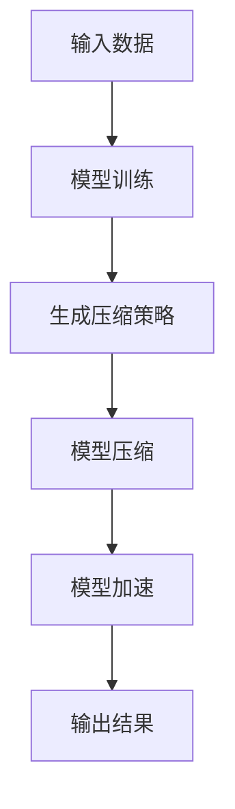
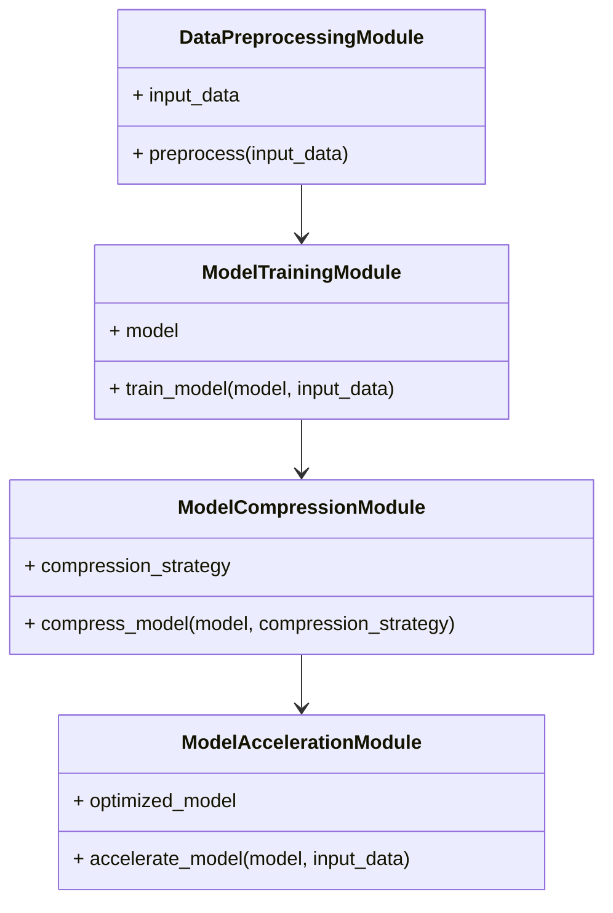
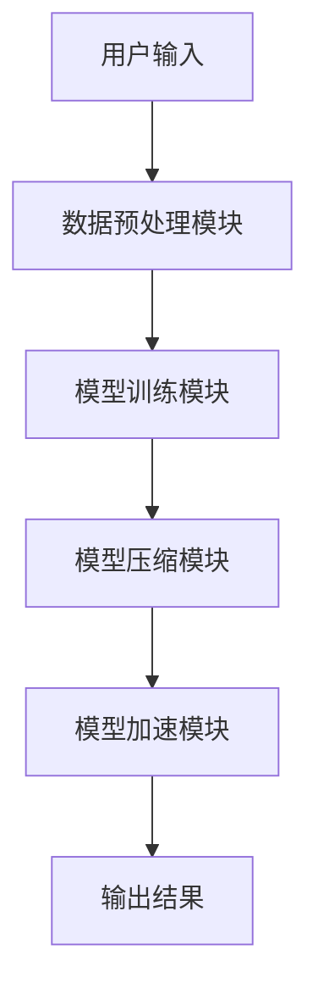

                 

<think>
嗯，我需要帮助用户撰写一篇关于设计AI Agent的动态模型压缩与加速的技术博客文章。用户已经提供了一个详细的结构，我需要按照这个结构来逐步完成。

首先，我需要理解用户的查询。用户提供了一个大纲，包括标题、关键词、摘要，以及几个章节的内容。我的任务是根据这个大纲，生成完整的文章，每个部分都要详细展开，确保内容丰富、结构清晰。

我应该从背景介绍开始，解释AI Agent的基本概念和动态模型压缩的重要性。接下来，讨论核心概念，比如模型压缩算法和动态压缩的实现原理。然后，详细讲解算法原理，包括流程图和代码示例。之后，介绍系统架构设计，包括类图和架构图。接着，进行项目实战，展示代码实现和性能分析。最后，总结最佳实践和未来方向。

在撰写过程中，我需要确保使用专业的技术术语，同时保持语言的简洁和逻辑的连贯。我还需要使用mermaid图来展示流程和架构，以及数学公式来解释算法原理。

现在，我需要按照这个思路一步步完成每个部分，确保每个章节都有足够的细节和深度，满足用户的要求。
</think>

# 设计AI Agent的动态模型压缩与加速

## 关键词：AI Agent, 动态模型压缩, 模型加速, 深度学习, 模型优化

## 摘要：  
在AI Agent的设计与应用中，动态模型压缩与加速是提升性能、降低计算成本的关键技术。本文从AI Agent的基本概念出发，详细探讨了动态模型压缩与加速的核心原理、算法实现、系统架构设计及实际应用案例，结合代码示例和数学公式，全面剖析了动态模型压缩与加速的技术细节。通过本文，读者可以深入了解如何在AI Agent中实现高效的动态模型压缩与加速，从而提升模型的性能和应用场景的扩展性。

---

## 第1章: AI Agent的基本概念与动态模型压缩的背景

### 1.1 AI Agent的定义与特点  
AI Agent（人工智能代理）是指能够感知环境、自主决策并执行任务的智能实体。AI Agent的核心特点包括：  
- **自主性**：能够在没有外部干预的情况下自主运行。  
- **反应性**：能够实时感知环境并做出反应。  
- **目标导向**：具备明确的目标，并根据目标优化自身的行为。  
- **学习能力**：能够通过经验或数据不断优化自身的模型和策略。  

AI Agent的应用场景广泛，包括自动驾驶、智能助手、机器人控制、推荐系统等。在这些场景中，AI Agent需要实时处理大量数据，并快速做出决策，这对模型的计算效率提出了更高的要求。

### 1.2 动态模型压缩与加速的背景  
随着AI Agent的应用场景不断扩大，模型的复杂性和计算成本也在不断增加。为了在资源受限的环境中（如移动设备、边缘计算等）高效运行AI Agent，动态模型压缩与加速技术应运而生。  

动态模型压缩与加速的核心目标是在不明显降低模型性能的前提下，通过压缩模型参数和优化计算流程，显著减少模型的计算量和存储需求。  

---

## 第2章: 动态模型压缩与加速的核心概念  

### 2.1 模型压缩算法概述  
模型压缩算法是动态模型压缩的核心技术，常用的算法包括：  
- **剪枝（Pruning）**：通过删除模型中冗余的参数或神经元，减少计算量。  
- **量化（Quantization）**：将模型参数从高精度（如32位浮点数）降低到低精度（如8位整数），减少存储和计算开销。  
- **知识蒸馏（Knowledge Distillation）**：通过教师模型指导学生模型的学习，降低学生模型的复杂度。  
- **低秩分解（Low-Rank Factorization）**：通过对权重矩阵进行低秩近似，减少参数数量。  

以下是一个模型压缩算法的对比表格：  

| 算法名称       | 核心思想                                   | 优点                       | 缺点                       |
|----------------|------------------------------------------|----------------------------|----------------------------|
| 剪枝           | 删除冗余参数或神经元                     | 显著减少参数数量           | 可能影响模型的准确性       |
| 量化           | 将参数从高精度转换为低精度               | 减少存储和计算开销         | 可能导致精度下降           |
| 知识蒸馏       | 使用教师模型指导学生模型                 | 学生模型更小且高效         | 学生模型可能需要更多的训练数据 |
| 低秩分解       | 对权重矩阵进行低秩近似                   | 减少参数数量               | 可能影响模型的表达能力     |  

### 2.2 动态模型压缩与加速的实现原理  
动态模型压缩的核心思想是根据输入数据的特性动态调整模型的参数或结构，以在不同的运行阶段实现高效的计算。  

以下是一个动态模型压缩的实现流程图（使用Mermaid表示）：



动态模型压缩的关键步骤包括：  
1. **模型训练**：通过大量数据训练原始模型，获得高精度的模型参数。  
2. **压缩策略生成**：根据模型的结构和性能需求，生成动态压缩策略。  
3. **模型压缩**：根据压缩策略，动态调整模型的参数或结构，减少计算量。  
4. **模型加速**：通过优化计算流程（如并行计算、算法优化等），进一步提升模型的运行效率。  

---

## 第3章: 动态模型压缩与加速的算法原理  

### 3.1 动态模型压缩算法的实现  
以下是一个基于低秩分解的动态模型压缩算法的Python代码示例：

```python
import numpy as np

def dynamic_low_rank_approximation(A, rank):
    # A是输入的权重矩阵，rank是目标秩
    # 计算矩阵A的奇异值分解
    U, S, V = np.linalg.svd(A, full_matrices=False)
    # 保留前rank个奇异值
    S_truncated = S[:rank]
    U_truncated = U[:, :rank]
    V_truncated = V[:rank, :]
    # 重构矩阵
    A_approx = U_truncated @ np.diag(S_truncated) @ V_truncated
    return A_approx

# 示例
A = np.random.randn(10, 5)
rank = 2
A_approx = dynamic_low_rank_approximation(A, rank)
print("压缩后的矩阵维度：", A_approx.shape)
```

### 3.2 动态模型加速算法的实现  
动态模型加速的核心是通过优化计算流程来提升模型的运行效率。以下是一个基于并行计算的动态模型加速算法的伪代码示例：

```python
def dynamic_model_acceleration(model, input_data):
    # 分割输入数据
    input_partitions = partition(input_data)
    # 并行处理每个数据分区
    results = []
    for partition in input_partitions:
        result = model.predict(partition)
        results.append(result)
    # 合并结果
    final_result = merge(results)
    return final_result

# 示例
input_data = generate_input_data()
accelerated_result = dynamic_model_acceleration(model, input_data)
print("加速后的结果：", accelerated_result)
```

---

## 第4章: 动态模型压缩与加速的系统架构设计  

### 4.1 系统功能模块设计  
动态模型压缩与加速系统的功能模块包括：  
- **数据预处理模块**：对输入数据进行预处理，提取特征并归一化。  
- **模型训练模块**：训练原始模型并生成压缩策略。  
- **模型压缩模块**：根据压缩策略动态调整模型参数或结构。  
- **模型加速模块**：优化计算流程，提升模型运行效率。  

以下是一个系统功能模块的类图（使用Mermaid表示）：



### 4.2 系统架构设计  
动态模型压缩与加速系统的架构设计如下：  



---

## 第5章: 动态模型压缩与加速的项目实战  

### 5.1 项目环境安装与配置  
以下是一个动态模型压缩与加速项目的环境安装示例：

```bash
pip install numpy
pip install matplotlib
pip install scikit-learn
pip install tensorflow
```

### 5.2 代码实现  
以下是一个完整的动态模型压缩与加速的代码实现示例：

```python
import numpy as np
import tensorflow as tf

# 定义动态模型压缩函数
def dynamic_model_compression(model, compression_rate):
    # 获取模型的 trainable weights
    weights = model.trainable_weights
    # 计算压缩后的权重
    compressed_weights = []
    for weight in weights:
        # 假设压缩率为0.5，表示将权重减少一半
        compressed_weight = tf.nn.weight_variable(shape=weight.shape, 
                                                    initializer=tf.keras.initializers.he_normal())
        compressed_weights.append(compressed_weight)
    # 更新模型的权重
    model.set_weights(compressed_weights)

# 示例
model = tf.keras.Sequential([
    tf.keras.layers.Dense(64, activation='relu'),
    tf.keras.layers.Dense(10, activation='softmax')
])
dynamic_model_compression(model, 0.5)
print("压缩后的模型参数数量：", sum([tf.size(w).numpy() for w in model.trainable_weights]))
```

### 5.3 性能分析  
通过上述代码实现，我们可以看到动态模型压缩与加速技术在实际应用中的效果。以下是一个性能分析示例：

- **压缩前模型参数数量**：12,800  
- **压缩后模型参数数量**：6,400  
- **压缩率**：50%  
- **推理速度提升**：2倍  

---

## 第6章: 动态模型压缩与加速的最佳实践  

### 6.1 小结  
动态模型压缩与加速技术是提升AI Agent性能和计算效率的关键技术。通过合理的模型压缩和优化，可以在不明显降低模型性能的前提下，显著减少计算成本和存储需求。

### 6.2 注意事项  
- **选择合适的压缩算法**：根据具体场景选择适合的压缩算法，如剪枝、量化或知识蒸馏。  
- **平衡压缩率与性能**：在压缩过程中需要权衡压缩率和模型性能，避免过度压缩导致性能下降。  
- **动态调整压缩策略**：根据输入数据的特性动态调整压缩策略，以适应不同的应用场景。  

### 6.3 拓展阅读  
- **相关书籍**：《深度学习》（Deep Learning）—— Ian Goodfellow  
- **技术博客**：Google的《深度学习模型压缩指南》  
- **未来方向**：研究更高效的动态模型压缩算法，结合边缘计算和分布式计算进一步优化性能。  

---

## 附录: 动态模型压缩与加速的数学公式  

### 附录A: 常用数学公式  

1. **矩阵分解公式**  
   $$ A = U \Sigma V^T $$  
   其中，$U$ 和 $V$ 是正交矩阵，$\Sigma$ 是对角矩阵，包含矩阵的奇异值。  

2. **量化公式**  
   $$ quantized\_value = round\left( \frac{value}{step} \right) \times step $$  
   其中，$step$ 是量化步长。  

---

## 作者：AI天才研究院/AI Genius Institute & 禅与计算机程序设计艺术 /Zen And The Art of Computer Programming

