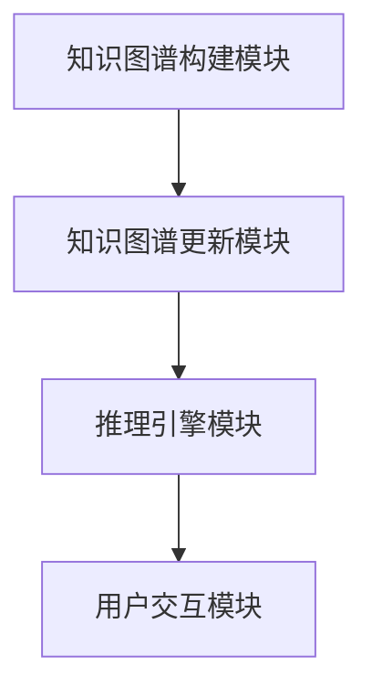

                 


# 设计AI Agent的动态知识图谱推理引擎

> 关键词：AI Agent，动态知识图谱，推理引擎，知识图谱构建，动态推理算法，系统架构

> 摘要：本文将详细介绍AI Agent的动态知识图谱推理引擎的设计与实现。首先，我们将介绍AI Agent的基本概念和动态知识图谱的背景，接着深入分析动态知识图谱推理引擎的核心概念与算法原理。然后，我们将探讨系统架构设计与实现方案，并通过实际项目案例展示如何构建动态知识图谱推理引擎。最后，我们将总结设计经验，并提出未来的研究方向。

---

## 第一部分: AI Agent与动态知识图谱推理引擎概述

### 第1章: AI Agent与动态知识图谱概述

#### 1.1 AI Agent的基本概念

##### 1.1.1 AI Agent的定义与特点

AI Agent（人工智能代理）是指能够感知环境、自主决策并执行任务的智能实体。AI Agent的核心特点包括：

- **自主性**：能够在没有外部干预的情况下独立运作。
- **反应性**：能够实时感知环境变化并做出响应。
- **主动性**：主动采取行动以实现目标。
- **社会性**：能够与其他Agent或人类进行交互和协作。

##### 1.1.2 动态知识图谱的定义与特点

动态知识图谱是一种能够实时更新和演变的知识表示结构。其特点包括：

- **动态性**：能够实时更新和反映最新知识。
- **可扩展性**：支持大规模数据的存储与处理。
- **语义丰富性**：通过图结构表示实体之间的复杂关系。

##### 1.1.3 动态知识图谱推理引擎的定义与作用

动态知识图谱推理引擎是一种用于在动态知识图谱上进行推理和决策的计算引擎。其作用包括：

- **知识推理**：基于动态知识图谱进行逻辑推理，得出新的知识。
- **实时更新**：支持动态知识图谱的实时更新与维护。
- **决策支持**：为AI Agent提供实时的决策支持。

#### 1.2 动态知识图谱推理引擎的背景与意义

##### 1.2.1 知识图谱的动态更新需求

在现实应用中，知识图谱需要不断更新以反映真实世界的变化。例如，企业信息、产品数据、用户行为等都在动态变化。

##### 1.2.2 推理引擎在AI Agent中的重要性

推理引擎是AI Agent的核心组件，负责处理知识图谱中的信息，生成新的知识，支持决策过程。

##### 1.2.3 动态知识图谱推理引擎的应用场景

- **智能问答系统**：基于动态知识图谱提供实时准确的回答。
- **推荐系统**：根据动态更新的知识图谱为用户推荐相关内容。
- **智能监控系统**：实时监控数据变化，进行实时推理和决策。

#### 1.3 本章小结

本章介绍了AI Agent和动态知识图谱的基本概念，并分析了动态知识图谱推理引擎的重要性和应用场景。

---

## 第二部分: 动态知识图谱推理引擎的核心概念

### 第2章: 动态知识图谱的构建与管理

#### 2.1 知识图谱的构建过程

##### 2.1.1 数据采集与预处理

数据采集是知识图谱构建的第一步，主要包括从多种数据源（如数据库、网页、文本等）获取数据，并进行清洗和预处理。

##### 2.1.2 知识抽取与表示

通过自然语言处理技术从文本中提取实体、关系和属性，并将其表示为图结构中的节点和边。

##### 2.1.3 知识图谱的存储与管理

将提取的知识以图结构的形式存储在数据库中，并设计高效的查询和更新机制。

#### 2.2 动态知识图谱的更新机制

##### 2.2.1 动态知识更新的触发条件

根据事件驱动、时间驱动或规则驱动的方式触发知识图谱的更新。

##### 2.2.2 知识更新的传播与影响

当知识图谱中的某个节点或边发生变化时，需要将变化传播到相关节点，并评估其对整个图谱的影响。

##### 2.2.3 知识图谱版本控制

为每个版本的知识图谱打上标签，并记录变更历史，以便回滚和追溯。

#### 2.3 本章小结

本章详细介绍了知识图谱的构建过程和动态更新机制，为后续的推理引擎设计奠定了基础。

---

## 第三部分: 动态知识图谱推理引擎的算法原理

### 第3章: 动态知识图谱推理算法

#### 3.1 知识图谱推理的基本原理

##### 3.1.1 基于符号逻辑的推理

通过逻辑规则（如谓词逻辑）进行推理，适用于确定性知识的推理。

##### 3.1.2 基于概率的推理

通过概率模型（如贝叶斯网络）进行推理，适用于不确定性知识的推理。

##### 3.1.3 基于图结构的推理

通过图遍历算法（如DFS、BFS）在知识图谱中进行推理，适用于复杂关系的推理。

#### 3.2 动态知识图谱推理的挑战与解决方案

##### 3.2.1 动态知识图谱的不确定性

知识图谱中的信息可能不完整或存在冲突，需要设计容错和纠错机制。

##### 3.2.2 动态知识图谱推理的实时性要求

为了满足实时推理的需求，需要优化算法的时间复杂度和空间复杂度。

##### 3.2.3 动态知识图谱推理的可扩展性

为了支持大规模知识图谱的推理，需要设计高效的分布式计算框架。

#### 3.3 本章小结

本章分析了动态知识图谱推理的挑战，并提出了相应的解决方案。

---

## 第四部分: 动态知识图谱推理引擎的系统架构与项目实战

### 第4章: 系统架构设计

#### 4.1 系统功能模块划分

##### 4.1.1 知识图谱构建模块

负责知识图谱的构建与初始化。

##### 4.1.2 知识图谱更新模块

负责知识图谱的动态更新与维护。

##### 4.1.3 推理引擎模块

负责基于知识图谱进行推理和决策。

##### 4.1.4 用户交互模块

负责与用户或其他系统的交互。

#### 4.2 系统架构的实现方案

##### 4.2.1 知识图谱构建模块的实现

使用图数据库（如Neo4j）存储知识图谱，并通过RDF或JSON-LD格式进行数据表示。

##### 4.2.2 推理引擎的实现

基于图遍历算法（如SPARQL）进行推理，并结合规则引擎（如Rete算法）优化推理效率。

##### 4.2.3 系统架构图



#### 4.3 本章小结

本章详细介绍了系统的架构设计，并通过实际案例展示了如何实现动态知识图谱推理引擎。

---

## 第五部分: 项目实战

### 第5章: 项目实战

#### 5.1 环境安装与配置

##### 5.1.1 安装必要的依赖

```bash
pip install neo4j
pip install spacy
pip install py2neo
```

#### 5.2 系统核心实现

##### 5.2.1 知识图谱构建代码

```python
from py2neo import Graph, Node, Relationship

graph = Graph("http://localhost:7474", auth=("neo4j", "password"))

# 创建节点
node1 = Node("Person", name="Alice")
node2 = Node("Person", name="Bob")
graph.create(node1)
graph.create(node2)

# 创建关系
relationship = Relationship(node1, "knows", node2)
graph.create(relationship)
```

##### 5.2.2 推理引擎实现代码

```python
from neo4j import GraphDatabase
from neo4j.exceptions import ServiceUnavailable

class InferenceEngine:
    def __init__(self, uri, user, password):
        self.graph = GraphDatabase.driver(uri, auth=(user, password))

    def infer(self, query):
        try:
            with self.graph.session() as session:
                result = session.run(query)
                return result.records
        except ServiceUnavailable:
            return []
```

#### 5.3 案例分析与详细讲解

##### 5.3.1 实际案例分析

假设我们有一个动态知识图谱，表示企业员工之间的关系。当某位员工离职时，系统会自动更新知识图谱，并推理出相关的影响。

##### 5.3.2 代码实现与分析

上述代码展示了如何使用Neo4j构建和查询知识图谱，以及如何实现推理引擎的基本功能。

#### 5.4 本章小结

本章通过实际案例展示了如何设计和实现动态知识图谱推理引擎，并提供了详细的代码实现。

---

## 第六部分: 总结与展望

### 第6章: 总结与展望

#### 6.1 本章总结

本文详细介绍了AI Agent的动态知识图谱推理引擎的设计与实现，涵盖了从概念到算法，再到系统实现的全过程。

#### 6.2 未来展望

未来的研究方向包括：

- 更高效的推理算法
- 更智能的知识图谱动态更新机制
- 更广泛的应用场景

---

## 作者信息

作者：AI天才研究院/AI Genius Institute & 禅与计算机程序设计艺术 /Zen And The Art of Computer Programming

