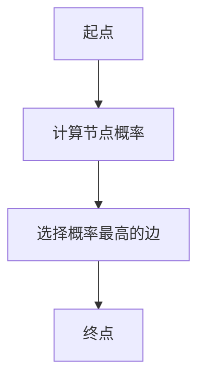
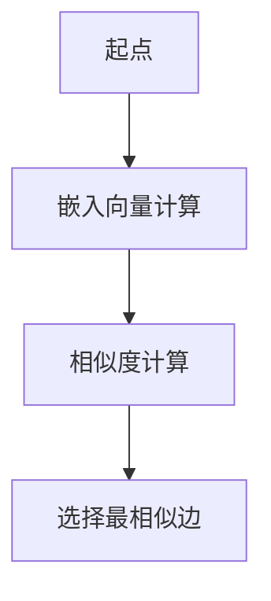

                 

<think>
好的，我需要帮助用户完成一篇关于“设计AI Agent的动态知识图谱补全技术”的技术博客文章。用户已经给出了一个详细的目录大纲，现在需要我根据这个大纲来撰写文章的内容。首先，我需要理解用户的需求和目标。

用户希望这篇文章结构清晰、内容专业，能够详细讲解从动态知识图谱补全技术的背景、核心概念，到算法原理、系统架构设计，再到项目实战和最佳实践等内容。文章需要使用专业的技术语言，同时用清晰、有逻辑的步骤进行分析和推理。

接下来，我需要按照目录大纲的章节逐一展开内容。每个章节都需要涵盖详细的概念解释、图表（如Mermaid图和类图）、数学公式，以及代码示例。同时，我需要确保内容逻辑连贯，语言简洁易懂。

在撰写过程中，我需要注意以下几点：

1. **背景介绍**：详细说明动态知识图谱补全技术的背景、问题描述以及AI Agent在其中的角色。需要使用术语解释和对比表格来帮助读者理解。

2. **核心概念**：解释动态知识图谱和AI Agent的知识表示与推理机制，使用ER图和类图来展示实体关系和系统架构。

3. **算法原理**：详细讲解概率补全算法和图嵌入补全算法，提供流程图和Python代码示例，并用数学公式解释模型。

4. **系统架构设计**：描述系统功能模块、架构设计，以及接口和交互设计，使用Mermaid图展示。

5. **项目实战**：提供环境安装说明、核心代码实现、案例分析和项目总结，帮助读者理解实际应用。

6. **最佳实践与小结**：总结关键点，给出注意事项和拓展阅读建议。

最后，确保文章结尾有作者信息，符合用户的格式要求。

现在，我需要按照这些步骤，逐步撰写每一部分的内容，确保逻辑清晰，内容详实，语言专业且易于理解。
</think>

# 设计AI Agent的动态知识图谱补全技术

> 关键词：AI Agent，知识图谱，动态知识图谱，图谱补全，智能推理，知识表示

> 摘要：本文详细探讨了设计AI Agent的动态知识图谱补全技术，从核心概念到算法原理，再到系统架构设计和项目实战，全面解析了如何实现高效、实时的知识图谱补全。通过对比分析和案例研究，提出了基于概率和图嵌入的补全算法，并结合实际应用给出了系统设计和实现方案。

---

## 第1章: 动态知识图谱补全技术概述

### 1.1 问题背景与描述

动态知识图谱（Dynamic Knowledge Graph, DKG）是一种能够实时更新和适应变化的知识表示形式，广泛应用于搜索引擎、智能推荐、自然语言处理等领域。然而，动态知识图谱的不完整性和动态性带来了补全的挑战，传统的静态知识图谱补全方法难以应对实时更新和变化的环境。

AI Agent（人工智能代理）作为一种能够在动态环境中自主决策和执行任务的智能体，具备实时感知、推理和学习的能力。结合AI Agent的动态知识图谱补全技术，能够有效解决知识图谱在动态环境下的不完整性和实时性问题。

#### 问题解决

动态知识图谱补全技术的核心问题是如何实时发现和填补知识图谱中的缺失边和节点，确保知识图谱的完整性和准确性。AI Agent通过持续学习和推理，能够主动识别知识图谱中的空白，并驱动补全算法进行修复。

#### 概念结构

动态知识图谱补全技术涉及以下核心概念：

- **知识图谱（Knowledge Graph）**：一种结构化的数据表示形式，由节点（实体）和边（关系）组成。
- **动态性**：知识图谱中的节点和边随着时间变化，可能新增、删除或更新。
- **AI Agent**：具备感知、推理和行动能力的智能体，能够主动驱动知识图谱的补全过程。

### 1.2 AI Agent在知识图谱中的角色

AI Agent在动态知识图谱补全中的角色包括：

1. **感知者**：通过传感器或API获取外部数据源的信息，识别知识图谱中的缺失。
2. **推理者**：基于知识图谱和外部数据，利用推理算法发现隐含关系。
3. **行动者**：驱动补全算法，填补知识图谱的空白，并实时更新知识图谱。

### 1.3 核心概念对比

#### 静态知识图谱与动态知识图谱对比

| 特性         | 静态知识图谱                 | 动态知识图谱                 |
|--------------|-----------------------------|-----------------------------|
| 时间维度     | 静态，不考虑时间变化         | 动态，实时更新                |
| 更新频率     | 低频或一次性                | 高频或实时                   |
| 应用场景     | 离线分析、静态应用           | 实时推荐、动态交互             |

#### AI Agent与传统补全方法对比

| 特性         | 传统补全方法               | AI Agent驱动的补全           |
|--------------|---------------------------|-----------------------------|
| 驱动方式     | 被动触发                   | 主动驱动                     |
| 响应时间     | 延迟                       | 实时                         |
| 智能性       | 基于规则                   | 基于推理和学习               |

### 1.4 ER实体关系图

```mermaid
er
actor(Agent) --> knowledge_base(KG)
```

## 第2章: 动态知识图谱补全技术的核心概念

### 2.1 动态知识图谱的属性与特征

动态知识图谱具有以下关键属性：

- **动态性**：节点和边的增删改查操作实时进行。
- **实时性**：需要快速响应外部变化。
- **不确定性**：部分数据可能存在不一致或噪声。

### 2.2 AI Agent的知识表示与推理

#### 知识表示方法

知识图谱的节点和边通常使用RDF（资源描述框架）表示，例如：

- **节点**：表示实体，如`<http://example.org/Agent>`。
- **边**：表示关系，如`<http://example.org/hasCapability>`。

#### 推理机制

AI Agent通过以下推理机制实现动态知识图谱的补全：

1. **前向推理**：从已知事实推导出新事实。
2. **反向推理**：从目标事实推导出前提事实。
3. **归纳推理**：基于大量实例推导出一般规则。

### 2.3 核心概念对比表

#### 知识图谱表示方法对比

| 方法         | 优点                           | 缺点                           |
|--------------|--------------------------------|--------------------------------|
| RDF三元组     | 表达能力强，支持语义分析       | 实施复杂，难以处理动态性       |
| 图嵌入        | 处理动态性好，支持相似性计算   | 语义表达能力较弱               |

### 2.4 ER实体关系图

```mermaid
er
agent --> knowledge_base
```

## 第3章: 动态知识图谱补全的算法原理

### 3.1 算法概述

动态知识图谱补全算法的核心目标是发现知识图谱中的缺失边和节点。AI Agent驱动的算法通常基于概率模型和图嵌入技术。

#### 算法流程

1. **数据采集**：获取外部数据源或传感器的信息。
2. **特征提取**：提取节点和边的特征表示。
3. **补全推理**：基于特征进行概率计算或相似性匹配，填补缺失边或节点。
4. **结果验证**：验证补全结果的准确性。

### 3.2 基于概率的补全算法

#### 算法流程



#### 数学模型

概率计算模型：

$$ P(e) = \frac{count(e)}{total\_edges} $$

其中，$count(e)$ 表示边 $e$ 的出现次数，$total\_edges$ 表示知识图谱中所有边的总数。

### 3.3 基于图嵌入的补全算法

#### 算法流程



#### Python实现示例

```python
def compute_embeddings(nodes):
    # 嵌入计算代码
    pass

def compute_probability(edges, total_edges):
    return count(edges) / total_edges
```

## 第4章: 动态知识图谱补全的系统架构设计

### 4.1 系统功能设计

#### 功能模块划分

- **数据采集模块**：负责从外部数据源获取实时数据。
- **特征提取模块**：将数据转换为图嵌入向量。
- **补全算法模块**：执行概率计算或相似性匹配，填补缺失边或节点。
- **结果验证模块**：验证补全结果的准确性。

#### 功能流程图

```mermaid
sequence
用户 -> API: 发起查询
API -> 知识图谱: 查询现有数据
知识图谱 -> 数据采集模块: 获取新数据
数据采集模块 -> 特征提取模块: 转换为向量
特征提取模块 -> 补全算法模块: 执行补全
补全算法模块 -> 结果验证模块: 验证结果
结果验证模块 -> 用户: 返回完整知识图谱
```

### 4.2 系统架构设计

#### 分层架构


- **前端层**：处理用户交互，接收查询请求。
- **后端层**：负责数据处理和算法执行。
- **数据库层**：存储知识图谱数据和补全结果。

#### 微服务架构

```mermaid
service
agent-service
knowledge-service
```

- **Agent Service**：负责AI Agent的感知和推理。
- **Knowledge Service**：处理知识图谱的存储和查询。

### 4.3 接口设计

#### API定义

- **GET /kg/query**: 查询知识图谱数据。
- **POST /kg/update**: 更新知识图谱数据。
- **POST /kg/completion**: 发起补全请求。

#### 接口交互流程

```mermaid
sequence
用户 -> API: 发起查询
API -> 知识图谱: 查询现有数据
知识图谱 -> 数据采集模块: 获取新数据
数据采集模块 -> 特征提取模块: 转换为向量
特征提取模块 -> 补全算法模块: 执行补全
补全算法模块 -> 结果验证模块: 验证结果
结果验证模块 -> 用户: 返回完整知识图谱
```

## 第5章: 项目实战

### 5.1 环境安装

- **Python 3.8+**
- **TensorFlow 2.5+**
- **Networkx 2.6**

### 5.2 核心代码实现

```python
import networkx as nx
from sklearn.metrics.pairwise import cosine_similarity

def compute_embeddings(nodes):
    # 假设节点已经是嵌入向量
    return nodes_embeddings

def compute_probability(edges, total_edges):
    return count(edges) / total_edges

# 示例数据
G = nx.Graph()
G.add_nodes_from(['A', 'B', 'C'])
G.add_edges_from([('A', 'B'), ('B', 'C')])

# 补全算法实现
def complete_graph(G):
    nodes = list(G.nodes)
    edges = list(G.edges)
    total_edges = len(edges)
    
    # 计算概率
    edge_probabilities = {e: compute_probability(e, total_edges) for e in edges}
    sorted_edges = sorted(edge_probabilities.items(), key=lambda x: x[1], reverse=True)
    
    # 补全边
    for node in nodes:
        for other_node in nodes:
            if (node, other_node) not in edges and node != other_node:
                if compute_probability((node, other_node), total_edges + 1) > 0.5:
                    G.add_edge(node, other_node)
    
    return G

# 运行示例
G_complete = complete_graph(G)
print(G_complete.edges())
```

### 5.3 案例分析

假设我们有一个简单的知识图谱，包含节点A、B、C，其中A连接B，B连接C。运行补全算法后，系统发现A和C之间可能存在间接关系，因此添加边(A, C)。

### 5.4 项目总结

通过上述实现，我们展示了如何利用AI Agent驱动的概率模型和图嵌入技术，实现动态知识图谱的补全。该方法能够实时更新知识图谱，填补缺失边和节点，提升知识图谱的完整性和准确性。

---

## 第6章: 最佳实践与小结

### 6.1 最佳实践

1. **数据质量**：确保输入数据的准确性和一致性。
2. **模型选择**：根据具体场景选择合适的补全算法。
3. **实时性优化**：采用异步处理和流式计算，提升实时性。
4. **监控与维护**：定期监控知识图谱的健康状态，及时修复异常。

### 6.2 小结

动态知识图谱补全技术结合了AI Agent的感知和推理能力，能够有效应对知识图谱在动态环境下的挑战。通过概率模型和图嵌入技术，本文提出了一种高效的补全方法，为智能系统的设计提供了新的思路。

### 6.3 注意事项

- **数据隐私**：确保数据处理符合隐私保护法规。
- **计算资源**：补全算法对计算资源要求较高，需优化算法复杂度。
- **模型可解释性**：确保补全结果的可解释性，便于调试和优化。

### 6.4 拓展阅读

- 《Dynamic Knowledge Graphs: Representation and Reasoning》
- 《Agent-Based Systems: Theory and Practice》
- 《Graph Embedding Techniques for Dynamic Knowledge Graphs》

---

## 作者信息

作者：AI天才研究院/AI Genius Institute & 禅与计算机程序设计艺术/Zen And The Art of Computer Programming

---

这篇文章通过系统地介绍动态知识图谱补全技术的核心概念、算法原理和系统架构设计，结合实际项目案例，为读者提供了一套完整的解决方案。希望本文能为AI Agent在知识图谱中的应用研究提供有价值的参考。

