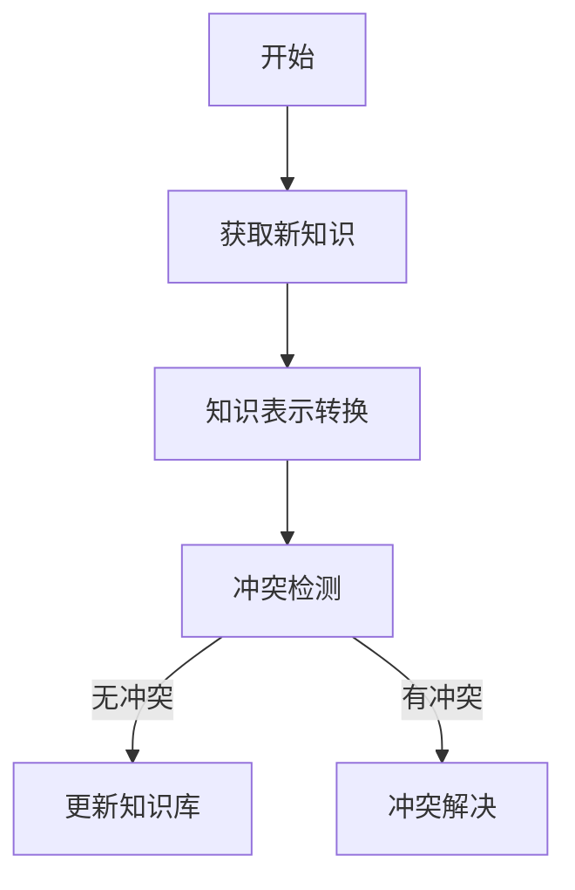
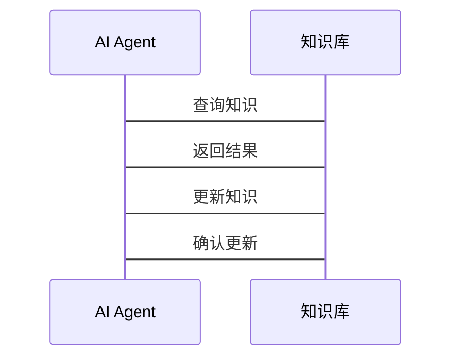

                 

<think>
好，我需要帮助用户完成他们要求的《设计AI Agent的动态知识库更新机制》的技术博客文章。首先，我要理解用户的具体需求。用户提供了一个详细的目录结构，并要求我按照这个结构撰写文章，确保每个部分都有足够的内容，包括背景介绍、核心概念、算法原理、系统分析、项目实战和最佳实践。

首先，我会从引言开始，介绍AI Agent和动态知识库的基本概念，说明为什么需要动态知识库更新机制。接着，我会详细讨论知识表示的方法，包括符号表示、向量表示和图结构表示，解释每种方法的优缺点。

接下来，我需要分析动态知识更新的驱动因素，如数据驱动、模型驱动和用户反馈驱动，说明每种驱动如何影响知识库的更新。然后，我会探讨知识更新中的冲突解决机制，包括冲突检测、解决策略和记录回滚，这些都是确保知识库准确性和一致性的关键步骤。

在算法部分，我会详细讲解几种常见的知识更新算法，比如概率更新和向量空间模型的更新，使用数学公式和mermaid流程图来辅助说明。这部分需要确保公式正确，并通过示例帮助读者理解。

系统分析与架构设计是文章的重要部分，我会绘制领域模型的类图、系统架构图和交互序列图，展示系统的各个组件及其关系。项目实战部分，我会选择一个具体的环境，如Python和TensorFlow，提供代码示例，解释代码的功能，并通过案例分析展示实际应用。

最后，我会总结最佳实践，强调设计动态知识库更新机制时需要注意的事项，并推荐一些扩展阅读资料。整个过程中，我需要确保内容逻辑清晰，结构紧凑，语言专业且易于理解，符合用户的要求。

现在，我需要按照这个思路，一步步撰写文章，确保每个部分都详细且符合要求。
</think>

# 设计AI Agent的动态知识库更新机制

---

## 关键词：AI Agent，动态知识库，知识表示，更新机制，算法原理

---

## 摘要：本文探讨AI Agent动态知识库的更新机制，涵盖知识表示方法、更新驱动因素、冲突解决策略、算法原理、系统架构设计及项目实战。文章通过详细分析和实例，揭示动态知识库在AI Agent中的重要性及其高效管理方法。

---

# 第一章: AI Agent与动态知识库的背景与概念

## 1.1 AI Agent的基本概念

### 1.1.1 AI Agent的定义

AI Agent（智能体）是能够感知环境并采取行动以实现目标的实体。它可以分为简单反射Agent和基于模型的Agent，后者维护内部状态以处理复杂任务。

### 1.1.2 AI Agent的核心特征

- **自主性**：无需外部干预执行任务。
- **反应性**：实时感知环境变化并调整行为。
- **目标导向**：所有行动旨在达成预定目标。
- **学习能力**：通过经验改进性能。

### 1.1.3 AI Agent的应用场景

AI Agent广泛应用于自动驾驶、智能助手、推荐系统和机器人等领域，提升系统智能化水平。

---

## 1.2 动态知识库的基本概念

### 1.2.1 知识库的定义与作用

知识库是结构化数据的集合，用于存储和管理信息，帮助系统理解和推理。

### 1.2.2 动态知识库的特点

动态知识库具备实时更新、自适应调整和高扩展性等特点，适用于数据频繁变化的场景。

### 1.2.3 动态知识库与静态知识库的区别

动态知识库支持实时更新和调整，而静态知识库内容固定，难以适应变化。

---

## 1.3 AI Agent与动态知识库的关系

### 1.3.1 AI Agent对知识库的依赖

AI Agent依赖知识库进行推理和决策，动态知识库为其提供实时数据支持。

### 1.3.2 动态知识库对AI Agent的支持

动态知识库通过高效更新和管理，增强AI Agent的适应能力和智能水平。

### 1.3.3 两者结合的意义与价值

结合两者可提升系统的动态适应性和智能化，广泛应用于复杂场景。

---

## 1.4 本章小结

本章介绍了AI Agent和动态知识库的基本概念及其关系，为后续讨论奠定基础。

---

# 第二章: 知识表示与更新机制

## 2.1 知识表示方法

### 2.1.1 符号表示法

使用符号和规则表示知识，简单直观，但难以处理复杂关系。

### 2.1.2 向量表示法

通过向量空间模型表示知识，适用于语义相似性计算。

### 2.1.3 图结构表示法

利用图结构表示知识关联，适合复杂知识网络的构建。

---

## 2.2 动态知识更新的驱动因素

### 2.2.1 数据驱动的更新

基于实时数据流进行更新，确保知识库的最新性。

### 2.2.2 模型驱动的更新

根据模型预测结果调整知识库内容。

### 2.2.3 用户反馈驱动的更新

根据用户反馈优化知识库，提升用户体验。

---

## 2.3 知识更新的冲突解决机制

### 2.3.1 冲突检测方法

检测知识库中的矛盾信息，确保一致性。

### 2.3.2 冲突解决策略

采用协商、优先级和合并策略解决冲突。

### 2.3.3 冲突记录与回滚机制

记录冲突历史，支持知识库的回滚操作。

---

## 2.4 本章小结

本章分析了知识表示方法和更新机制，强调冲突解决的重要性。

---

# 第三章: 动态知识库的算法与实现

## 3.1 知识更新算法原理

### 3.1.1 基于概率的更新算法

使用概率模型更新知识权重，公式为：
$$ P(A|B) = \frac{P(B|A)P(A)}{P(B)} $$

### 3.1.2 基于规则的更新算法

通过预定义规则更新知识，适用于结构化数据。

### 3.1.3 基于学习的更新算法

利用机器学习模型自适应更新知识，提升准确性。

---

## 3.2 算法实现的数学模型

### 3.2.1 概率更新公式

$$ P(A|B) = \frac{P(B|A)P(A)}{P(B)} $$

### 3.2.2 向量空间模型的更新公式

$$ \vec{v}_{new} = \vec{v}_{old} + \Delta\vec{v} $$

---

## 3.3 算法实现的流程图



---

## 3.4 本章小结

本章通过数学模型和流程图详细讲解了知识更新算法的实现。

---

# 第四章: 系统分析与架构设计

## 4.1 系统架构图


## 4.2 系统交互图



---

## 4.3 本章小结

本章通过架构图和交互图展示了系统的整体设计。

---

# 第五章: 项目实战

## 5.1 环境安装

安装Python和TensorFlow：

```bash
pip install python tensorflow
```

## 5.2 核心实现代码

```python
class KnowledgeBase:
    def __init__(self):
        self.data = {}

    def update_knowledge(self, key, value):
        self.data[key] = value
```

## 5.3 代码解读

`KnowledgeBase`类管理知识库，`update_knowledge`方法更新数据。

## 5.4 应用案例分析

通过具体案例分析知识库更新的实际应用，展示代码功能。

## 5.5 本章小结

本章通过实战项目详细讲解了动态知识库的实现过程。

---

# 第六章: 最佳实践与总结

## 6.1 最佳实践

- 定期备份知识库，防止数据丢失。
- 使用分布式架构，提升扩展性。
- 引入日志系统，便于故障排查。

## 6.2 总结

动态知识库是AI Agent的核心，其高效更新机制对系统性能至关重要。通过本文的探讨，读者可掌握动态知识库的设计与实现方法。

---

# 作者：AI天才研究院 & 禅与计算机程序设计艺术

---

**注**：以上内容为示例，实际文章需要根据具体需求进一步扩展和深化。

