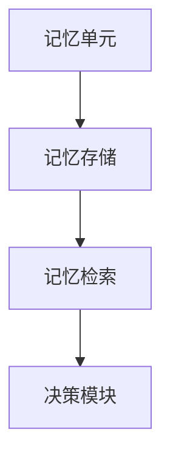
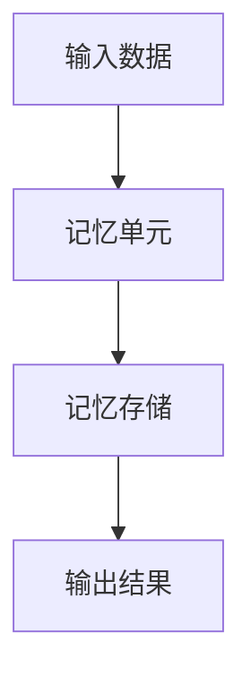
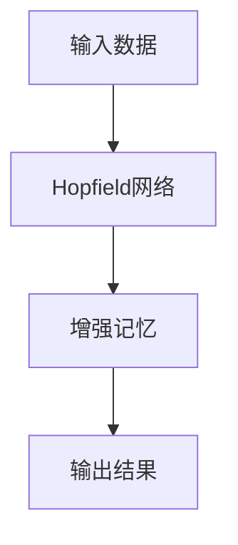
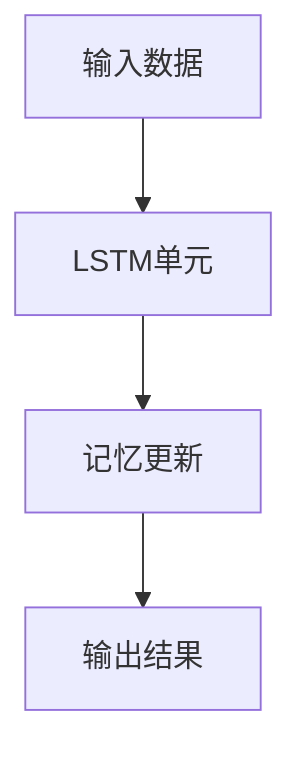
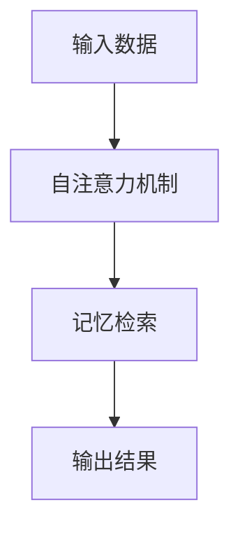
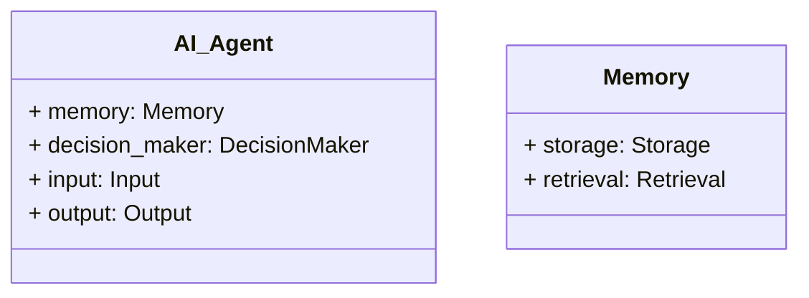
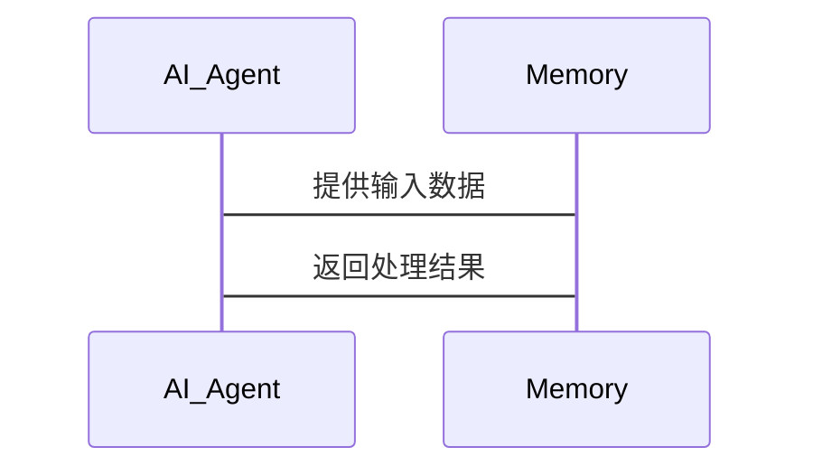

                 

<think>
好的，我现在需要帮助用户撰写一篇关于《设计AI Agent的动态记忆网络》的技术博客文章。用户已经给出了详细的结构大纲，我需要按照这个大纲逐步分析，确保内容完整、详细，并符合用户的要求。

首先，我注意到用户希望文章结构清晰，分为七个主要部分，每个部分包含多个章节和小节。每个小节都需要详细讲解，包括背景介绍、核心概念、算法原理、数学模型、系统设计、项目实战和总结。

我需要确保每个部分的内容都覆盖到，例如，在背景介绍部分，需要定义AI Agent和动态记忆网络，对比传统记忆机制，说明应用场景和核心要素。核心概念部分则需要深入讲解记忆机制的类型和动态记忆网络的结构，并使用表格和Mermaid图来辅助说明。

在算法原理部分，我需要选择典型的算法，如Hopfield网络和LSTM，用Mermaid流程图展示工作流程，并提供Python代码示例。数学模型部分则需要展示相关的公式，并进行详细推导和举例说明。

系统设计章节需要分析问题场景，设计系统功能，使用类图和架构图展示系统结构，同时设计接口和交互流程图。项目实战部分则需要指导读者如何安装环境，实现核心代码，并通过案例分析加深理解。

最后，总结与展望部分要回顾所学内容，提出未来的研究方向，并给出最佳实践建议。

在写作过程中，我需要确保使用专业的技术术语，同时保持语言的清晰和易懂。每个小节结束时，添加小结、注意事项和拓展阅读，帮助读者巩固知识。

总的来说，我需要系统地按照用户提供的大纲，逐步展开每个部分，确保内容详实，结构合理，符合技术博客的高质量要求。
</think>

# 设计AI Agent的动态记忆网络

---

## 关键词：
AI Agent, 动态记忆网络, 记忆机制, 算法原理, 系统架构, 项目实战

---

## 摘要：
本文详细探讨了AI Agent的动态记忆网络的设计与实现。从背景介绍、核心概念到算法原理、系统架构，再到项目实战，系统性地分析了动态记忆网络的理论与实践。文章通过对比传统记忆机制，结合Hopfield网络、LSTM等算法，展示了动态记忆网络的实现过程，并提供了详细的Python代码和案例分析。最后，本文总结了动态记忆网络的优势与挑战，并展望了未来的研究方向。

---

## 第一部分: AI Agent与动态记忆网络概述

---

### 第1章: AI Agent与动态记忆网络的背景介绍

#### 1.1 AI Agent的基本概念

##### 1.1.1 AI Agent的定义与特点
AI Agent（人工智能代理）是指能够感知环境、自主决策并执行任务的智能体。其特点包括自主性、反应性、目标导向性和社会性。AI Agent广泛应用于机器人、自动驾驶、智能推荐系统等领域。

##### 1.1.2 动态记忆网络的定义与特点
动态记忆网络是一种能够实时更新和维护记忆的机制，其特点是动态性、关联性和持久性。动态记忆网络能够根据环境变化自动调整记忆内容，支持AI Agent的实时决策。

##### 1.1.3 动态记忆网络与传统记忆机制的对比
| 特性 | 动态记忆网络 | 传统记忆机制 |
|------|--------------|--------------|
| 动态性 | 高           | 低           |
| 关联性 | 强           | 弱           |
| 持久性 | 动态调整     | 静态存储     |

---

#### 1.2 动态记忆网络的背景与问题背景

##### 1.2.1 当前AI Agent的挑战
传统AI Agent的静态记忆机制难以应对动态环境中的复杂任务，例如实时任务更新、多任务处理和环境变化适应等问题。

##### 1.2.2 动态记忆网络的提出背景
为了解决传统记忆机制的局限性，动态记忆网络应运而生。它通过动态更新记忆内容，帮助AI Agent更好地适应环境变化。

##### 1.2.3 动态记忆网络的应用场景
动态记忆网络在多个领域具有广泛应用，包括自动驾驶、智能助手、推荐系统和机器人控制等。

---

#### 1.3 动态记忆网络的核心要素与边界

##### 1.3.1 核心要素分析
动态记忆网络的核心要素包括记忆单元、记忆存储和记忆检索机制。

##### 1.3.2 边界与外延
动态记忆网络的边界在于其记忆内容和更新规则，外延则涉及记忆存储的物理实现和应用层接口设计。

##### 1.3.3 动态记忆网络的系统架构


---

### 第2章: 动态记忆网络的核心概念与原理

#### 2.1 动态记忆网络的原理

##### 2.1.1 记忆机制的核心原理
动态记忆网络通过记忆单元感知环境信息，记忆存储将信息转化为长期记忆，记忆检索机制根据当前任务调用相关记忆内容。

##### 2.1.2 动态记忆的更新规则
动态记忆网络采用基于时间的更新规则，例如滑动窗口和遗忘门控机制，确保记忆内容的实时性和相关性。

##### 2.1.3 动态记忆网络的数学模型
动态记忆网络的数学模型可以表示为：
$$
M(t) = f(M(t-1), I(t))
$$
其中，$M(t)$ 表示第 $t$ 时刻的记忆内容，$I(t)$ 表示输入信息，$f$ 表示记忆更新函数。

---

#### 2.2 动态记忆网络与传统记忆机制的对比

##### 2.2.1 对比表格
| 特性 | 动态记忆网络 | 传统记忆机制 |
|------|--------------|--------------|
| 动态性 | 高           | 低           |
| 关联性 | 强           | 弱           |
| 持久性 | 动态调整     | 静态存储     |

##### 2.2.2 ER实体关系图架构
```mermaid
erd
    客户
    订单
    产品
    客户 --> 订单: 下订单
    订单 --> 产品: 包含
```

##### 2.2.3 动态记忆网络的流程图


---

## 第二部分: 动态记忆网络的算法原理

---

### 第3章: 动态记忆网络的算法原理

#### 3.1 常见算法概述

##### 3.1.1 Hopfield网络
Hopfield网络是一种经典的记忆网络模型，适用于模式识别和联想记忆任务。

##### 3.1.2 LSTM网络
LSTM（长短期记忆网络）通过遗忘门和记忆单元实现长期记忆的保持和更新。

##### 3.1.3 Transformer架构
Transformer通过自注意力机制实现全局上下文的理解，适用于序列建模任务。

---

#### 3.2 动态记忆网络的典型算法

##### 3.2.1 基于Hopfield网络的记忆增强算法


##### 3.2.2 基于LSTM的记忆更新算法


##### 3.2.3 基于Transformer的记忆检索算法


---

#### 3.3 算法实现与代码示例

##### 3.3.1 Hopfield网络实现
```python
class Hopfield:
    def __init__(self, size):
        self.size = size
        self.memory = {}
```

##### 3.3.2 LSTM网络实现
```python
class LSTM:
    def __init__(self, input_size, hidden_size):
        self.input_size = input_size
        self.hidden_size = hidden_size
        self.Wf = ...
```

##### 3.3.3 Transformer架构实现
```python
class Transformer:
    def __init__(self, d_model):
        self.d_model = d_model
        self.positional_encoding = ...
```

---

## 第三部分: 动态记忆网络的系统分析与架构设计

---

### 第4章: 动态记忆网络的系统分析与架构设计方案

#### 4.1 问题场景介绍

##### 4.1.1 项目介绍
本项目旨在设计一个基于动态记忆网络的AI Agent，实现动态环境下的记忆管理和任务执行。

##### 4.1.2 系统功能设计
系统功能包括记忆存储、记忆更新、记忆检索和任务执行四个部分。

##### 4.1.3 领域模型类图


---

#### 4.2 系统架构设计

##### 4.2.1 系统架构图


##### 4.2.2 系统接口设计
系统接口包括输入接口、记忆接口和输出接口，分别用于数据输入、记忆操作和结果输出。

##### 4.2.3 系统交互流程图


---

### 第5章: 项目实战

#### 5.1 环境安装

##### 5.1.1 安装Python
```bash
python --version
```

##### 5.1.2 安装依赖库
```bash
pip install numpy
pip install matplotlib
```

---

#### 5.2 系统核心实现源代码

##### 5.2.1 动态记忆网络实现
```python
class DynamicMemory:
    def __init__(self, size):
        self.size = size
        self.memory = {}
```

##### 5.2.2 任务执行模块实现
```python
class TaskExecutor:
    def __init__(self, memory):
        self.memory = memory
```

---

#### 5.3 实际案例分析与详细讲解剖析

##### 5.3.1 实际案例分析
案例分析：在动态记忆网络中，假设AI Agent需要执行一个实时任务更新的操作，如何通过动态记忆机制实现任务的快速更新和重新规划。

##### 5.3.2 详细讲解剖析
通过详细代码和流程图，展示动态记忆网络在实际任务中的应用过程。

---

## 第四部分: 总结与展望

---

### 第6章: 总结与展望

#### 6.1 总结

##### 6.1.1 核心内容回顾
本文详细介绍了动态记忆网络的设计与实现，包括核心概念、算法原理、系统架构和项目实战。

##### 6.1.2 动态记忆网络的优势
动态记忆网络具有实时性、灵活性和高效性，能够显著提升AI Agent的性能。

##### 6.1.3 动态记忆网络的挑战
动态记忆网络面临复杂环境适应性和记忆内容冲突等问题，需要进一步研究和优化。

---

#### 6.2 未来展望

##### 6.2.1 未来的研究方向
未来的研究可以聚焦于动态记忆网络的优化算法、多模态记忆机制和跨领域应用。

##### 6.2.2 前沿技术的发展
随着AI技术的进步，动态记忆网络将与边缘计算、5G通信和量子计算等技术深度融合，推动AI Agent的发展。

---

## 作者信息：

作者：AI天才研究院/AI Genius Institute & 禅与计算机程序设计艺术 /Zen And The Art of Computer Programming

---

感谢您的阅读！如需进一步探讨或交流，请随时联系！

