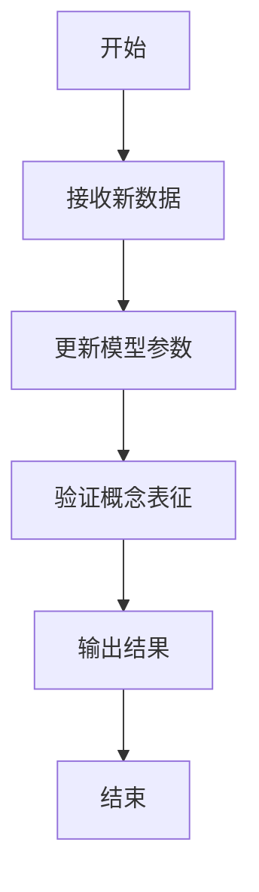
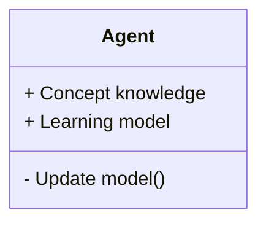
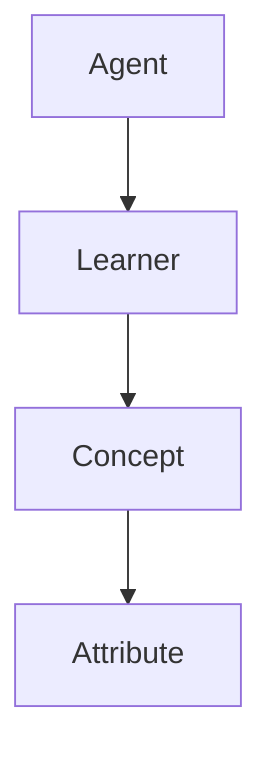
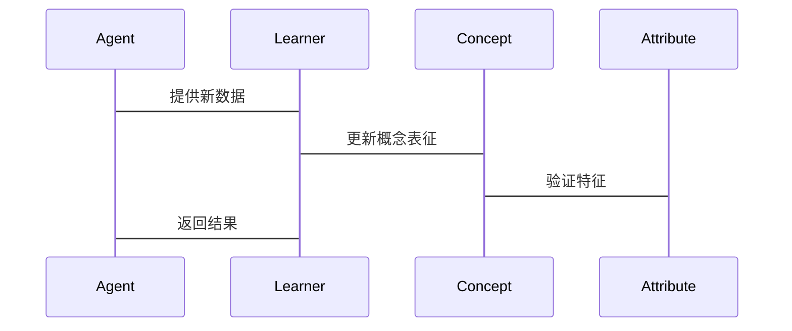

                 


# 设计AI Agent的增量式概念学习策略

## 关键词：AI Agent，增量式学习，概念学习策略，自适应机制，深度学习，强化学习

## 摘要：增量式概念学习是一种重要的AI Agent学习方式，允许AI在逐步接收数据的过程中，动态更新其知识库和概念表征。本文详细探讨了增量式概念学习的背景、核心原理、算法实现、系统设计及实际应用，为设计高效的AI Agent提供了全面的理论与实践指导。

---

## 目录

### 第一部分: AI Agent与增量式概念学习的背景与基础

#### 第1章: AI Agent与增量式概念学习的背景

##### 1.1 问题背景与问题描述
###### 1.1.1 传统AI学习的局限性
传统AI学习方法通常依赖于一次性接收完整数据集，难以应对动态变化的环境，限制了其在实际应用中的灵活性和适应性。

###### 1.1.2 增量式学习的必要性
在实际场景中，数据往往是逐步获取的，增量式学习能够有效利用实时数据，提升模型的更新效率和适应性。

###### 1.1.3 AI Agent的定义与特点
AI Agent是一种具备自主决策和学习能力的智能体，能够在动态环境中通过与环境交互来实现目标。

##### 1.2 问题解决与边界外延
###### 1.2.1 增量式概念学习的核心目标
通过逐步接收数据，动态更新概念表征，提升模型的泛化能力和适应性。

###### 1.2.2 AI Agent学习的边界与限制
AI Agent的学习能力受限于计算资源、数据质量和模型复杂度等因素。

###### 1.2.3 概念结构与核心要素组成
分析增量式概念学习中的关键要素，包括数据输入、模型更新、概念表征等。

##### 1.3 本章小结
总结增量式概念学习的重要性和必要性，为后续章节奠定基础。

---

### 第二部分: 增量式概念学习的核心概念与联系

#### 第2章: 增量式概念学习的原理

##### 2.1 核心概念原理
###### 2.1.1 增量式学习的基本原理
逐步接收数据，动态更新模型参数，实现概念的逐步构建和优化。

###### 2.1.2 概念学习的数学模型
构建增量式概念学习的数学框架，分析数据流驱动的概念更新机制。

###### 2.1.3 AI Agent的自适应机制
AI Agent通过自适应机制，实现对新概念的快速捕捉和学习。

##### 2.2 概念属性特征对比
通过对比表格，分析增量式学习和概念学习的关键属性。

| 概念 | 属性 | 特征 |
|------|------|------|
| 增量式学习 | 数据输入 | 逐步输入 |
| 概念学习 | 表征方式 | 符号化或分布化 |

##### 2.3 ER实体关系图
使用Mermaid流程图展示概念间的关系。

```mermaid
er
  actor(Agent)
  actor has role ( Learner )
  Learner owns Concept
  Concept has Attribute
```

##### 2.4 本章小结
总结增量式概念学习的核心原理和关键要素。

---

### 第三部分: 增量式概念学习的算法原理

#### 第3章: 增量式概念学习算法

##### 3.1 算法原理与流程
使用Mermaid流程图展示算法步骤。



##### 3.2 算法实现代码
展示Python代码实现。

```python
def incremental_learning(new_data):
    # 更新模型参数
    model.update_par
```

##### 3.3 数学模型与公式
使用LaTeX公式详细讲解模型。

$$ y = f(x; \theta) $$

##### 3.4 本章小结
总结算法实现的关键步骤和注意事项。

---

### 第四部分: 系统分析与架构设计方案

#### 第4章: 系统分析与架构设计

##### 4.1 问题场景介绍
分析增量式概念学习的应用场景。

##### 4.2 系统功能设计
展示领域模型类图。



##### 4.3 系统架构设计
展示系统架构图。



##### 4.4 系统交互设计
展示序列图。



##### 4.5 本章小结
总结系统设计的关键点。

---

### 第五部分: 项目实战

#### 第5章: 项目实战

##### 5.1 环境安装与配置
详细说明开发环境的安装步骤。

##### 5.2 系统核心代码实现
展示关键代码实现。

```python
class Agent:
    def __init__(self):
        self.concepts = {}

    def update_concepts(self, new_data):
        # 更新概念
        pass
```

##### 5.3 代码解读与分析
详细解读代码实现。

##### 5.4 案例分析与结果展示
通过实际案例展示学习效果。

##### 5.5 项目小结
总结项目实现的经验与教训。

---

### 第六部分: 最佳实践与总结

#### 第6章: 最佳实践

##### 6.1 小结与总结
总结全文的主要内容。

##### 6.2 注意事项
提醒读者在实际应用中需要注意的问题。

##### 6.3 拓展阅读
推荐相关领域的深入阅读材料。

---

## 作者：AI天才研究院 & 禅与计算机程序设计艺术

